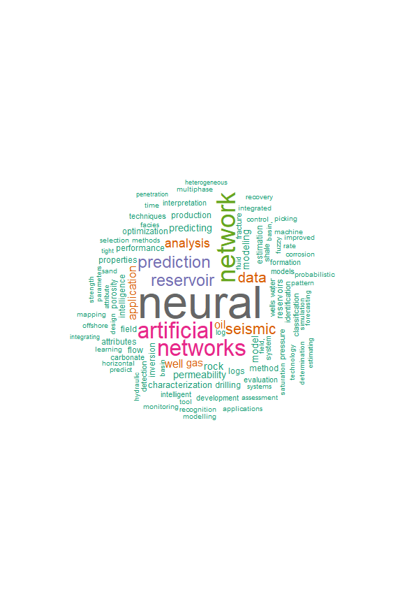
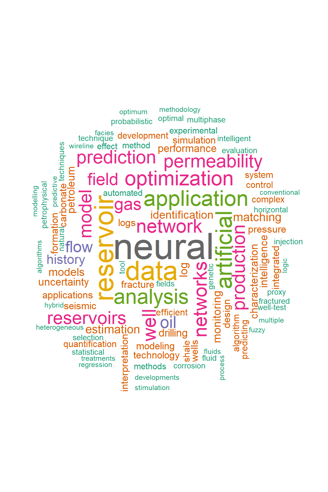
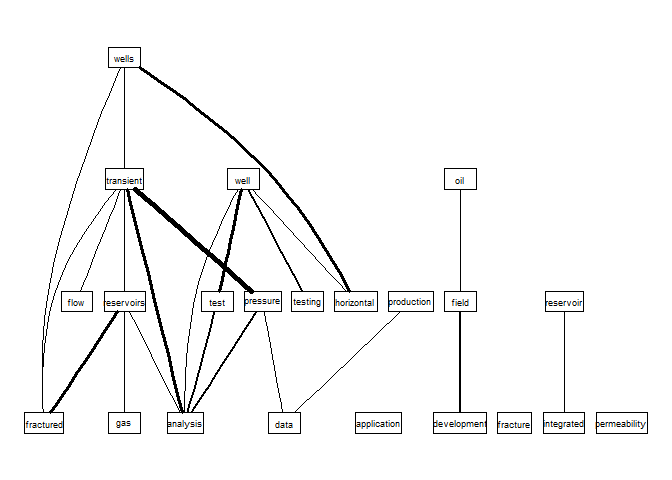
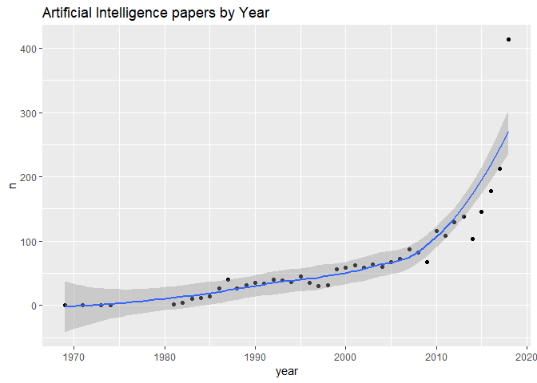
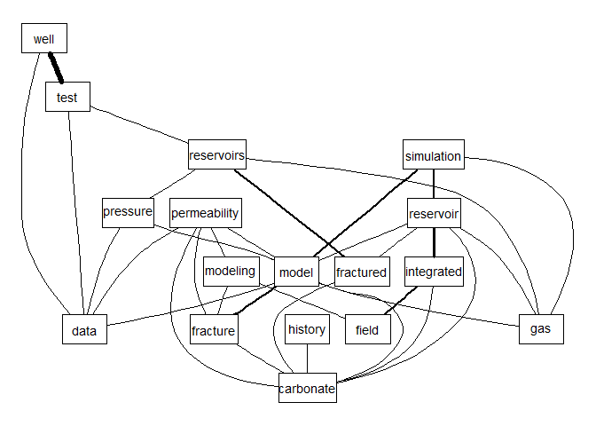

<!-- README.md is generated from README.Rmd. Please edit that file -->
petro.One
=========

[](https://travis-ci.org/f0nzie/petro.One) [](https://cran.r-project.org/package=petro.One) [](https://codecov.io/gh/f0nzie/petro.One)

The goal of **petro.One** is providing a reproducible platform for acquiring and analyzing metadata while searching papers on oil and gas in the OnePetro website.

Motivation
----------

The standard way of searching for papers in [OnePetro](https://www.onepetro.org/) is using a web browser to enter the search terms for a particular paper we are looking for. The result will come in web pages with which could be dozens, hundreds or thousand of paper titles. We will need to browse all the resulting pages to find papers that have a better match with the subject we are researching.

By using some statistical tools available through `R`, the search could turn in highly profitable in terms of time, matching quality and selection of the papers.

The search keywords are entered thorugh the R console and the papers will return in a shape of a dataframe, which is identical to a spreadsheet: rows of paper titles and columns with details from the metadata extracted from the web page.

With the dataframe already in our computers we could perform a thorough search and narrow down to the most ideal papers.

Installation
------------

You can install petro.One from github with:

``` r
# install.packages("devtools")       # install *devtools* first

# install from the *master* release branch
devtools::install_github("f0nzie/petro.One")
```

``` r
# install from the *develop* branch
devtools::install_github("f0nzie/petro.One", ref = "develop")
```

or from [CRAN](https://cran.r-project.org/) with:

``` r
install.packages("petro.One")
```

What is behind the paper search
-------------------------------

A typical OnePetro search URL would look like this:

        https://www.onepetro.org/search?q=neural+network&peer_reviewed=&published_between=&from_year=&to_year=
        

which could be explained like this:

`domain`: <https://www.onepetro.org/>
`command`: search?
`q=`: *parameter* that holds the query words. In the example above, it would be `q=neural+network`. As it is shown, it means search `any` word.
`peer_reviewed=`: *parameter* switch to get papers than have been only peer reviewed. When it has the value `on` means that is activated.
`published_between=`: *parameter* switch that activates when `from_year` and `to_year` have numeric entries.
`from_year=`: *parameter* to enter the starting year of the search
`to_year=`: *parameter* to enter the end year of the search.

There are additional parameters such as:

`start=`: *parameter* to indicate the starting page if the resulting search has several pages. `rows=`: *parameter* to indicate the number of rows (papers) to display per page. In the web browser, the options are 10, 50 and 100. Off-browser it could be a number up to 1000.
`sort=`: *parameter* related to the selector `Sort By` with options `Relevance`, `Most recent` and `Highest rated`.
`dc_type`: *parameter* that indicates what type of document the paper is. These are the type of documents:

    chapter
    conference-paper
    general
    journal-paper
    presentation
    media
    other
    standard

There are few additional parameters but they will not be used as often as the ones already described.

They key is build a search URL that is recognizable by OnePetro. To do that I wrote a function `make_search_url` that does just that. Instead of entering the search keywords, how will they be searched, year and type of paper, we enter them from the R console.

Below some examples:

Get the number of papers for the keyword *neural network*.
----------------------------------------------------------

The option `how = "any"` means to search for papers that contain the word `neural` or the word `network`.

Let's take a look at the difference in returning results with `any` and `all` for the same keywords `neural network`.

Here we make of of two functions of petro.One: `make_search_url` and `get_papers_count`.

``` r
library(petro.One)
# search any word like "neural" or "network"
url_any <- make_search_url(query = "neural network", how = "any")
url_any
#> [1] "https://www.onepetro.org/search?q=neural+network&peer_reviewed=&published_between=&from_year=&to_year="
get_papers_count(url_any)
#> [1] 3400

# search for papers that have "neural" and "network" at the same time
url_all <- make_search_url(query = "neural network", how = "all")
url_all
#> [1] "https://www.onepetro.org/search?q=\"neural+network\"&peer_reviewed=&published_between=&from_year=&to_year="
get_papers_count(url_all)
#> [1] 3111
```

Read papers from *from\_year* to *to\_year*
-------------------------------------------

We can send a query where we specify the starting year and the end year. Use the parameters as in the example below.

In this example the option `how = "all"` means to search papers that contain **exactly** the words `neural network` as a difference to `any` which means search for `any` occurrence of the words. Of course, using `any` rather than `all` will yield many more results.

We use two petro.One functions: `make_search_url` to build the OnePetro search URL and `onepetro_page_to_dataframe` to put the papers in a table.

``` r
library(petro.One)

# neural network papers from 1990 to 2000. Exact phrase
my_url <- make_search_url(query = "neural network", 
                          from_year = 1990, 
                          to_year   = 1999, 
                          how = "all")

df <- onepetro_page_to_dataframe(my_url)
df
#> # A tibble: 10 x 6
#>                                                      title_data
#>                                                           <chr>
#>  1                          Deconvolution Using Neural Networks
#>  2                     Neural Network Stacking Velocity Picking
#>  3             Neural Networks And Paper Seismic Interpretation
#>  4                     Drill-Bit Diagnosis With Neural Networks
#>  5  Seismic Principal Components Analysis Using Neural Networks
#>  6                    First Break Picking Using Neural Networks
#>  7 Reservoir Characterization Using Feedforward Neural Networks
#>  8          Seismic Attribute Calibration Using Neural Networks
#>  9        Neural Networks For Primary Reflection Identification
#> 10     Conductive fracture identification using neural networks
#> # ... with 5 more variables: paper_id <chr>, source <chr>, type <chr>,
#> #   year <int>, author1_data <chr>
```

And these are the terms that repeat more freqently:

``` r
term_frequency(df)
#> # A tibble: 26 x 2
#>                word  freq
#>               <chr> <int>
#>  1           neural    10
#>  2         networks     9
#>  3          seismic     3
#>  4   identification     2
#>  5          picking     2
#>  6         analysis     1
#>  7        attribute     1
#>  8            break     1
#>  9      calibration     1
#> 10 characterization     1
#> # ... with 16 more rows
```

Get papers by document type (*dc\_type*)
----------------------------------------

We can also get paper by the type of document. In OnePetro it is called `dc_type`.

#### Conference papers (`conference-paper`)

In this example we are requesting only `conference-paper` type.

Here we add to `make_search_url` the parameter `dc_type`.

Note also that we are adding another parameter `rows` to get 1000 rows instead of 10, 50 or 100 as the browser allows.

``` r
# specify document type = "conference-paper", rows = 1000

my_url <- make_search_url(query = "neural network", 
                          how = "all",
                          dc_type = "conference-paper",
                          rows = 1000)

get_papers_count(my_url)
#> [1] 2770
df <- onepetro_page_to_dataframe(my_url)
df
#> # A tibble: 1,000 x 6
#>                                                         title_data
#>                                                              <chr>
#>  1                             Deconvolution Using Neural Networks
#>  2                                         Neural Networks And AVO
#>  3                        Neural Network Stacking Velocity Picking
#>  4                Neural Networks And Paper Seismic Interpretation
#>  5     Seismic Principal Components Analysis Using Neural Networks
#>  6                Neural networks approach to spectral enhancement
#>  7        Predicting Wax Formation Using Artificial Neural Network
#>  8           Estimation of Welding Distortion Using Neural Network
#>  9                       First Break Picking Using Neural Networks
#> 10 Minimum-variance Deconvolution Using Artificial Neural Networks
#> # ... with 990 more rows, and 5 more variables: paper_id <chr>,
#> #   source <chr>, type <chr>, year <int>, author1_data <chr>
```

#### Word cloud for journal papers

``` r
plot_wordcloud(df, max.words = 100, min.freq = 10)
```



#### Journal papers (`journal-paper`)

In this other example we are requesting for `journal-paper` type of papers. We are also specifying to get the maximum number of rows that OnePetro permits: 1000.

``` r
# specify document type = "journal-paper", rows = 1000

my_url <- make_search_url(query = "neural network", 
                          how = "all",
                          dc_type = "journal-paper",
                          rows = 1000)

get_papers_count(my_url)
#> [1] 307
df <- onepetro_page_to_dataframe(my_url)
df
#> # A tibble: 307 x 6
#>                                                                     title_data
#>                                                                          <chr>
#>  1                                    Drill-Bit Diagnosis With Neural Networks
#>  2                Artificial Neural Networks Identify Restimulation Candidates
#>  3                   Implicit Approximation of Neural Network and Applications
#>  4             Application of Artificial Neural Network to Pump Card Diagnosis
#>  5        Application of Artificial Neural Networks to Downhole Fluid Analysis
#>  6           Pseudodensity Log Generation by Use of Artificial Neural Networks
#>  7                 Neural Networks for Predictive Control of Drilling Dynamics
#>  8                Neural Network Approach Predicts U.S. Natural Gas Production
#>  9          An Artificial Neural Network Based Relative Permeability Predictor
#> 10 Characterize Submarine Channel Reservoirs: A Neural- Network-Based Approach
#> # ... with 297 more rows, and 5 more variables: paper_id <chr>,
#> #   source <chr>, type <chr>, year <int>, author1_data <chr>
```

#### Word cloud for journal papers

``` r
plot_wordcloud(df, max.words = 100, min.freq = 50)
```



Finding the most freqent terms in *well test*
---------------------------------------------

For this example we want to know about conference papers where the words *well* and *test* are found together in the papers.

``` r
library(petro.One)

my_url <- make_search_url(query = "well test", 
                          dc_type = "conference-paper",
                          how = "all")

get_papers_count(my_url)
#> [1] 9440
df <- read_multidoc(my_url)

term_frequency(df)
#> # A tibble: 9,871 x 2
#>          word  freq
#>         <chr> <int>
#>  1  reservoir  1817
#>  2       well  1667
#>  3        gas  1447
#>  4      field  1289
#>  5 production  1101
#>  6   analysis  1042
#>  7   pressure   947
#>  8 reservoirs   894
#>  9      wells   881
#> 10       data   825
#> # ... with 9,861 more rows
```

#### Most frequent terms in *well test*

``` r
# plot the 500 most freqent terms
plot_bars(df, min.freq = 400)
```


How do the most frequent terms relate each other
------------------------------------------------

Now, it is not enough for us to know what terms are the more repeating but how those freqent terms relate to each other.

In the following plot you will see that the strength of the relationship between terms is reflected by the thickness of the connection lines.

``` r
plot_relationships(df, min.freq = 400, threshold = 0.075)
```



We can see that *wells* and *well* are connected stringly to *horizontal*, *transient*, *pressure*, *flow*, *testing*, *reservoirs*, *fracture*, and *analysis*. The rest of the words are frequent but not very much connected.

For instance, if you are looking for papers that have stronger relationship between of *well test* and *permeability*, it would wise to add that term to the search.

``` r
library(petro.One)

my_url <- make_search_url(query = "well test permeability", 
                          dc_type = "conference-paper",
                          how = "all")

get_papers_count(my_url)
#> [1] 190
df <- read_multidoc(my_url)

term_frequency(df)
#> # A tibble: 697 x 2
#>            word  freq
#>           <chr> <int>
#>  1    reservoir    86
#>  2 permeability    42
#>  3         well    38
#>  4        field    32
#>  5    carbonate    31
#>  6    fractured    27
#>  7   integrated    21
#>  8     modeling    21
#>  9   simulation    21
#> 10   reservoirs    20
#> # ... with 687 more rows
plot_bars(df, min.freq = 10)
```



In this example, we can see the effect of refining our search by including the term *permeability*.

``` r
plot_relationships(df, min.freq = 15, threshold = 0.05)
```



This has the advantage of improving the search and narrow down the papers we are more interested in.

Summaries
---------

The summary functions allow us to group the papers by a preferred group:

-   by type of document
-   by publisher
-   by publication
-   by year

This will give you a summary of the count not the papers themselves.

Here is an example of summaries. In this case, we want papers that contain the exact words "well test".

``` r
library(petro.One)

my_url <- make_search_url(query = "well test", 
                          how = "all")
```

``` r
papers_by_type(my_url)
```

### By document type

| name             |  value|
|:-----------------|------:|
| Chapter          |      8|
| Conference paper |   9440|
| General          |    193|
| Journal paper    |   2536|
| Media            |      5|
| Other            |      8|
| Presentation     |     25|

### By publisher

``` r
papers_by_publisher(my_url)
```

| name                                                          |  value|
|:--------------------------------------------------------------|------:|
| American Petroleum Institute                                  |     42|
| American Rock Mechanics Association                           |     64|
| BHR Group                                                     |     10|
| Carbon Management Technology Conference                       |      1|
| International Petroleum Technology Conference                 |    364|
| International Society for Rock Mechanics                      |     34|
| International Society for Rock Mechanics and Rock Engineering |      5|
| International Society of Offshore and Polar Engineers         |     15|
| NACE International                                            |     45|
| National Energy Technology Laboratory                         |      8|

### By publication source

``` r
papers_by_publication(my_url)
```

| name                                                              |  value|
|:------------------------------------------------------------------|------:|
| 10th North American Conference on Multiphase Technology           |      1|
| 10th World Petroleum Congress                                     |      1|
| 11th ISRM Congress                                                |      1|
| 11th World Petroleum Congress                                     |      4|
| 12th ISRM Congress                                                |      1|
| 12th International Conference on Multiphase Production Technology |      2|
| 12th World Petroleum Congress                                     |      3|
| 13th ISRM International Congress of Rock Mechanics                |      1|
| 13th International Conference on Multiphase Production Technology |      1|
| 13th World Petroleum Congress                                     |      3|

### By year of publication

``` r
papers_by_year(my_url)
```

| name       |  value|
|:-----------|------:|
| Since 2017 |    496|
| Since 2016 |   1062|
| Since 2015 |   1611|
| Since 2014 |   2168|
| Since 2013 |   2679|
| Since 2012 |   3193|
| Since 2011 |   3646|
| Since 2010 |   4172|
| Since 2009 |   4603|
| Since 2008 |   5014|

Search for **any** word
-----------------------

In this other example, we want papers that containg the word "well" or "test".

``` r
library(petro.One)

my_url <- make_search_url(query = "well test", 
                          how = "any")

by_doctype <- papers_by_type(my_url)
```

``` r
by_doctype
```

| name             |  value|
|:-----------------|------:|
| Chapter          |     60|
| Conference paper |  87790|
| General          |    932|
| Journal paper    |  15860|
| Media            |      9|
| Other            |     21|
| Presentation     |    265|
| Standard         |     95|

#### Total number of papers that contain **well** or **test**

In this example we get the total number of papers by document type.

``` r
sum(by_doctype$value)
#> [1] 105032
```

Or use the R base function `summary` to give us a quick statistics of the papers:

``` r
# r-base function summary
summary(by_doctype)
#>      name               value         
#>  Length:8           Min.   :    9.00  
#>  Class :character   1st Qu.:   50.25  
#>  Mode  :character   Median :  180.00  
#>                     Mean   :13129.00  
#>                     3rd Qu.: 4664.00  
#>                     Max.   :87790.00
```
