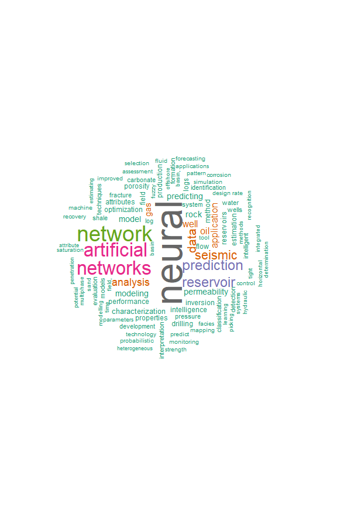
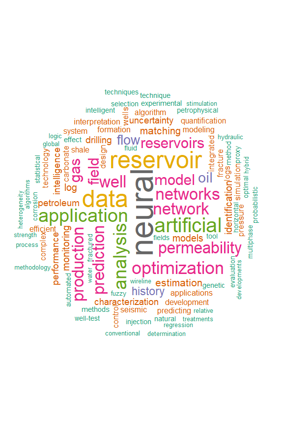
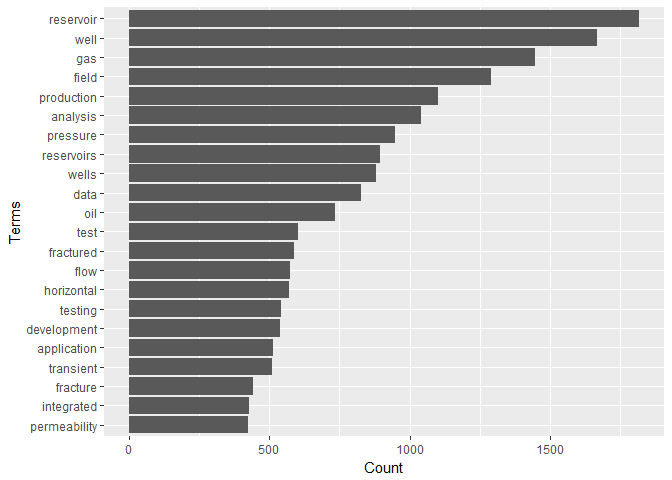
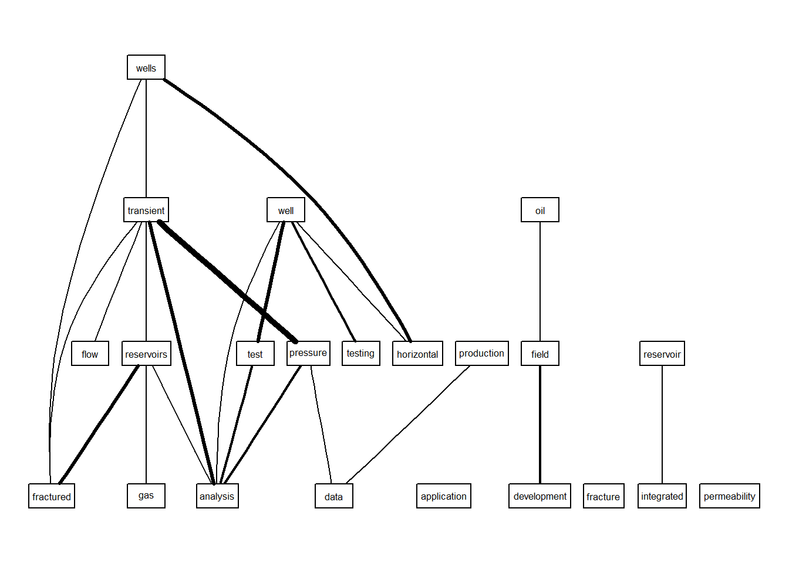

<!-- README.md is generated from README.Rmd. Please edit that file -->
petro.One
=========

[](https://travis-ci.org/f0nzie/petro.One) [](https://cran.r-project.org/package=petro.One) [](https://codecov.io/gh/f0nzie/petro.One)

The goal of **petro.One** is providing a reproducible platform for acquiring and analyzing metadata while searching papers on oil and gas in the OnePetro website.

Motivation
----------

The standard way of searching for papers in [OnePetro](https://www.onepetro.org/) is using a web browser to enter the search terms for a particular paper we are looking for. The result will come in web pages with which could be dozens, hundreds or thousand of paper titles. We will need to browse all the resulting pages to find papers that have a better match with the subject we are researching.

By using some statistical tools available through `R`, the search could turn in highly profitable in terms of time, matching quality and selection of the papers.

The search keywords are entered thorugh the R console and the papers will return in a shape of a dataframe, which is identical to a spreadsheet: rows of paper titles and columns with details from the metadata extracted from the web page.

With the dataframe already in our computers we could perform a thorough search and narrow down to the most ideal papers.

Installation
------------

You can install petro.One from github with:

``` r
# install.packages("devtools")       # install *devtools* first

# install from the *master* release branch
devtools::install_github("f0nzie/petro.One")
```

``` r
# install from the *develop* branch
devtools::install_github("f0nzie/petro.One", ref = "develop")
```

or from [CRAN](https://cran.r-project.org/) with:

``` r
install.packages("petro.One")
```

What is behind the paper search
-------------------------------

A typical OnePetro search URL would look like this:

        https://www.onepetro.org/search?q=neural+network&peer_reviewed=&published_between=&from_year=&to_year=
        

which could be explained like this:

`domain`: <https://www.onepetro.org/>
`command`: search?
`q=`: *parameter* that holds the query words. In the example above, it would be `q=neural+network`. As it is shown, it means search `any` word.
`peer_reviewed=`: *parameter* switch to get papers than have been only peer reviewed. When it has the value `on` means that is activated.
`published_between=`: *parameter* switch that activates when `from_year` and `to_year` have numeric entries.
`from_year=`: *parameter* to enter the starting year of the search
`to_year=`: *parameter* to enter the end year of the search.

There are additional parameters such as:

`start=`: *parameter* to indicate the starting page if the resulting search has several pages. `rows=`: *parameter* to indicate the number of rows (papers) to display per page. In the web browser, the options are 10, 50 and 100. Off-browser it could be a number up to 1000.
`sort=`: *parameter* related to the selector `Sort By` with options `Relevance`, `Most recent` and `Highest rated`.
`dc_type`: *parameter* that indicates what type of document the paper is. These are the type of documents:

    chapter
    conference-paper
    general
    journal-paper
    presentation
    media
    other
    standard

There are few additional parameters but they will not be used as often as the ones already described.

They key is build a search URL that is recognizable by OnePetro. To do that I wrote a function `make_search_url` that does just that. Instead of entering the search keywords, how will they be searched, year and type of paper, we enter them from the R console.

Below some examples:

Get the number of papers for the keyword *neural network*.
----------------------------------------------------------

The option `how = "any"` means to search for papers that contain the word `neural` or the word `network`.

Let's take a look at the difference in returning results with `any` and `all` for the same keywords `neural network`.

Here we make of of two functions of petro.One: `make_search_url` and `get_papers_count`.

``` r
library(petro.One)
# search any word like "neural" or "network"
url_any <- make_search_url(query = "neural network", how = "any")
url_any
#> [1] "https://www.onepetro.org/search?q=neural+network&peer_reviewed=&published_between=&from_year=&to_year="
get_papers_count(url_any)
#> [1] 3400

# search for papers that have "neural" and "network" at the same time
url_all <- make_search_url(query = "neural network", how = "all")
url_all
#> [1] "https://www.onepetro.org/search?q=\"neural+network\"&peer_reviewed=&published_between=&from_year=&to_year="
get_papers_count(url_all)
#> [1] 3111
```

Read papers from *from\_year* to *to\_year*
-------------------------------------------

We can send a query where we specify the starting year and the end year. Use the parameters as in the example below.

In this example the option `how = "all"` means to search papers that contain **exactly** the words `neural network` as a difference to `any` which means search for `any` occurrence of the words. Of course, using `any` rather than `all` will yield many more results.

We use two petro.One functions: `make_search_url` to build the OnePetro search URL and `onepetro_page_to_dataframe` to put the papers in a table.

``` r
library(petro.One)

# neural network papers from 1990 to 2000. Exact phrase
my_url <- make_search_url(query = "neural network", 
                          from_year = 1990, 
                          to_year   = 1999, 
                          how = "all")

df <- onepetro_page_to_dataframe(my_url)
df
#> # A tibble: 10 x 6
#>                                                      title_data
#>                                                           <chr>
#>  1                          Deconvolution Using Neural Networks
#>  2                     Neural Network Stacking Velocity Picking
#>  3                     Drill-Bit Diagnosis With Neural Networks
#>  4  Seismic Principal Components Analysis Using Neural Networks
#>  5             Neural Networks And Paper Seismic Interpretation
#>  6                    First Break Picking Using Neural Networks
#>  7      Artificial Intelligence I Neural Networks In Geophysics
#>  8     Conductive fracture identification using neural networks
#>  9 Reservoir Characterization Using Feedforward Neural Networks
#> 10          Seismic Attribute Calibration Using Neural Networks
#> # ... with 5 more variables: paper_id <chr>, source <chr>, type <chr>,
#> #   year <int>, author1_data <chr>
```

And these are the terms that repeat more freqently:

``` r
term_frequency(df)
#>                word freq
#> 1            neural   10
#> 2          networks    9
#> 3           seismic    3
#> 4           picking    2
#> 5          analysis    1
#> 6        artificial    1
#> 7         attribute    1
#> 8             break    1
#> 9       calibration    1
#> 10 characterization    1
#> 11       components    1
#> 12       conductive    1
#> 13    deconvolution    1
#> 14        diagnosis    1
#> 15        drill-bit    1
#> 16      feedforward    1
#> 17         fracture    1
#> 18       geophysics    1
#> 19   identification    1
#> 20     intelligence    1
#> 21   interpretation    1
#> 22          network    1
#> 23            paper    1
#> 24        principal    1
#> 25        reservoir    1
#> 26         stacking    1
#> 27         velocity    1
```

Get papers by document type (*dc\_type*)
----------------------------------------

We can also get paper by the type of document. In OnePetro it is called `dc_type`.

#### Conference papers (`conference-paper`)

In this example we are requesting only `conference-paper` type.

Here we add to `make_search_url` the parameter `dc_type`.

Note also that we are adding another parameter `rows` to get 1000 rows instead of 10, 50 or 100 as the browser allows.

``` r
# specify document type = "conference-paper", rows = 1000

my_url <- make_search_url(query = "neural network", 
                          how = "all",
                          dc_type = "conference-paper",
                          rows = 1000)

get_papers_count(my_url)
#> [1] 2770
df <- onepetro_page_to_dataframe(my_url)
df
#> # A tibble: 1,000 x 6
#>                                                         title_data
#>                                                              <chr>
#>  1                             Deconvolution Using Neural Networks
#>  2                                         Neural Networks And AVO
#>  3                        Neural Network Stacking Velocity Picking
#>  4                Neural networks approach to spectral enhancement
#>  5        Dynamic Neural Network Calibration of Quartz Transducers
#>  6     Seismic Principal Components Analysis Using Neural Networks
#>  7           Estimation of Welding Distortion Using Neural Network
#>  8 Minimum-variance Deconvolution Using Artificial Neural Networks
#>  9                Neural Networks And Paper Seismic Interpretation
#> 10                       First Break Picking Using Neural Networks
#> # ... with 990 more rows, and 5 more variables: paper_id <chr>,
#> #   source <chr>, type <chr>, year <int>, author1_data <chr>
```

#### Word cloud for journal papers

``` r
plot_wordcloud(df, max.words = 100, min.freq = 10)
```



#### Journal papers (`journal-paper`)

In this other example we are requesting for `journal-paper` type of papers. We are also specifying to get the maximum number of rows that OnePetro permits: 1000.

``` r
# specify document type = "journal-paper", rows = 1000

my_url <- make_search_url(query = "neural network", 
                          how = "all",
                          dc_type = "journal-paper",
                          rows = 1000)

get_papers_count(my_url)
#> [1] 307
df <- onepetro_page_to_dataframe(my_url)
df
#> # A tibble: 307 x 6
#>                                                                     title_data
#>                                                                          <chr>
#>  1                   Implicit Approximation of Neural Network and Applications
#>  2                                    Drill-Bit Diagnosis With Neural Networks
#>  3                Artificial Neural Networks Identify Restimulation Candidates
#>  4             Application of Artificial Neural Network to Pump Card Diagnosis
#>  5        Application of Artificial Neural Networks to Downhole Fluid Analysis
#>  6                Neural Network Approach Predicts U.S. Natural Gas Production
#>  7           Pseudodensity Log Generation by Use of Artificial Neural Networks
#>  8                 Neural Networks for Predictive Control of Drilling Dynamics
#>  9 Characterize Submarine Channel Reservoirs: A Neural- Network-Based Approach
#> 10                      Neural Network: What It Can Do for Petroleum Engineers
#> # ... with 297 more rows, and 5 more variables: paper_id <chr>,
#> #   source <chr>, type <chr>, year <int>, author1_data <chr>
```

#### Word cloud for journal papers

``` r
plot_wordcloud(df, max.words = 100, min.freq = 50)
```



Finding the most freqent terms in *well test*
---------------------------------------------

For this example we want to know about conference papers where the words *well* and *test* are found together in the papers.

``` r
library(petro.One)

my_url <- make_search_url(query = "well test", 
                          dc_type = "conference-paper",
                          how = "all")

get_papers_count(my_url)
#> [1] 9440
df <- read_multidoc(my_url)

term_frequency(df)
#>                                     word freq
#> 1                              reservoir 1817
#> 2                                   well 1667
#> 3                                    gas 1446
#> 4                                  field 1289
#> 5                             production 1101
#> 6                               analysis 1042
#> 7                               pressure  947
#> 8                             reservoirs  894
#> 9                                  wells  880
#> 10                                  data  825
#> 11                                   oil  733
#> 12                                  test  602
#> 13                             fractured  589
#> 14                                  flow  573
#> 15                            horizontal  569
#> 16                               testing  542
#> 17                           development  539
#> 18                           application  512
#> 19                             transient  511
#> 20                              fracture  441
#> 21                            integrated  426
#> 22                          permeability  423
#> 23                           performance  396
#> 24                                 model  380
#> 25                            evaluation  377
#> 26                             formation  377
#> 27                              offshore  367
#> 28                             carbonate  366
#> 29                              modeling  356
#> 30                            simulation  353
#> 31                                 water  332
#> 32                                field,  321
#> 33                               history  320
#> 34                          optimization  317
#> 35                                system  316
#> 36                      characterization  308
#> 37                            management  300
#> 38                              drilling  296
#> 39                                 tight  280
#> 40                             hydraulic  272
#> 41                                design  271
#> 42                                method  269
#> 43                             naturally  259
#> 44                             injection  251
#> 45                                 tests  248
#> 46                               control  231
#> 47                            fracturing  231
#> 48                            completion  220
#> 49                                 fluid  217
#> 50                        interpretation  217
#> 51                            technology  211
#> 52                            condensate  207
#> 53                             deepwater  198
#> 54                                 shale  196
#> 55                              downhole  194
#> 56                            monitoring  190
#> 57                               complex  189
#> 58                                  sand  187
#> 59                              recovery  186
#> 60                           stimulation  185
#> 61                              matching  182
#> 62                                fields  177
#> 63                            successful  172
#> 64                            operations  171
#> 65                               dynamic  166
#> 66                            multiphase  166
#> 67                            estimation  164
#> 68                                  rate  163
#> 69                               seismic  159
#> 70                                subsea  159
#> 71                                models  155
#> 72                          productivity  155
#> 73                              improved  154
#> 74                               systems  153
#> 75                                   sea  149
#> 76                            challenges  144
#> 77                                mature  142
#> 78                           integration  141
#> 79                        unconventional  138
#> 80                              behavior  137
#> 81                                  time  136
#> 82                                  deep  135
#> 83                             (russian)  134
#> 84                            techniques  134
#> 85                            prediction  133
#> 86                              wellbore  133
#> 87                                 heavy  131
#> 88                             modelling  131
#> 89                             real-time  131
#> 90                          applications  129
#> 91                               effects  128
#> 92                             numerical  128
#> 93                         determination  123
#> 94                             fractures  122
#> 95                                 basin  121
#> 96                             technique  120
#> 97                          surveillance  119
#> 98                           uncertainty  119
#> 99                            experience  118
#> 100                           properties  116
#> 101                          temperature  116
#> 102                          intelligent  112
#> 103                              methods  111
#> 104                             solution  111
#> 105                            effective  109
#> 106                               effect  107
#> 107                            potential  104
#> 108                              results  104
#> 109                            practical  103
#> 110                             vertical  103
#> 111                             multiple  102
#> 112                             wireline  102
#> 113                          engineering  101
#> 114                               damage  100
#> 115                       implementation   98
#> 116                                scale   98
#> 117                             advanced   97
#> 118                           innovative   97
#> 119                         measurements   95
#> 120                                 real   95
#> 121                        heterogeneous   94
#> 122                          completions   91
#> 123                                 gulf   90
#> 124                         interference   88
#> 125                              network   88
#> 126                           formations   87
#> 127                               impact   87
#> 128                                 lift   87
#> 129                              studies   87
#> 130                               tubing   87
#> 131                           assessment   85
#> 132                           geological   85
#> 133                             strategy   85
#> 134                           analytical   84
#> 135                                  co2   84
#> 136                                value   84
#> 137                              buildup   83
#> 138                          exploration   82
#> 139                                 rock   82
#> 140                            treatment   82
#> 141                             enhanced   81
#> 142                               kuwait   81
#> 143                             workflow   81
#> 144                               mexico   80
#> 145                            sandstone   80
#> 146                               basin,   79
#> 147                                saudi   79
#> 148                               field:   78
#> 149                          integrating   78
#> 150                          methodology   78
#> 151                                 skin   78
#> 152                              storage   78
#> 153                                 hpht   77
#> 154                              improve   77
#> 155                                pilot   75
#> 156                              process   75
#> 157                          reservoirs:   75
#> 158                                 tool   75
#> 159                                 acid   74
#> 160                              logging   74
#> 161                              decline   72
#> 162                             porosity   72
#> 163                            selection   72
#> 164                               stress   72
#> 165                           optimizing   71
#> 166                              surface   71
#> 167                               coiled   69
#> 168                           efficiency   69
#> 169                          environment   69
#> 170                       gas-condensate   69
#> 171                            solutions   69
#> 172                           waterflood   69
#> 173                        -permeability   68
#> 174                       deliverability   68
#> 175                              methane   68
#> 176                            operation   68
#> 177                              example   67
#> 178                             oilfield   67
#> 179                            permanent   67
#> 180                             planning   67
#> 181                           parameters   66
#> 182                                 sour   66
#> 183                                 type   66
#> 184                           artificial   65
#> 185                                china   65
#> 186                                giant   65
#> 187                            improving   65
#> 188                          measurement   65
#> 189                             response   65
#> 190                                asset   64
#> 191                        hydraulically   64
#> 192                               inflow   63
#> 193                        investigation   63
#> 194                                  abu   62
#> 195                             reserves   62
#> 196                             chemical   61
#> 197                                 dual   61
#> 198                       identification   61
#> 199                            petroleum   61
#> 200                           reservoir:   61
#> 201                                  eor   60
#> 202                                  log   60
#> 203                           reservoir,   60
#> 204                            appraisal   59
#> 205                        deconvolution   59
#> 206                              natural   59
#> 207                               single   58
#> 208                         technologies   58
#> 209                                -situ   57
#> 210                           conditions   57
#> 211                                early   57
#> 212                                 hole   57
#> 213                        underbalanced   57
#> 214                             relative   56
#> 215                           stochastic   56
#> 216                           treatments   56
#> 217                                  key   55
#> 218                                 logs   55
#> 219                                 oman   55
#> 220                                smart   55
#> 221                               -phase   54
#> 222                            automated   54
#> 223                              coalbed   54
#> 224                                curve   54
#> 225                               curves   54
#> 226                              digital   54
#> 227                                 cost   53
#> 228                            efficient   53
#> 229                        petrophysical   53
#> 230                               tester   53
#> 231                              applied   52
#> 232                           estimating   52
#> 233                          information   52
#> 234                             problems   52
#> 235                              program   52
#> 236                            automatic   51
#> 237                        comprehensive   51
#> 238                          description   51
#> 239                               fluids   51
#> 240                          hydrocarbon   51
#> 241                           laboratory   51
#> 242                             malaysia   51
#> 243                               neural   51
#> 244                          operational   51
#> 245                          perforating   51
#> 246                               review   51
#> 247                                steam   51
#> 248                             critical   50
#> 249                              lessons   50
#> 250                            producing   50
#> 251                           saturation   50
#> 252                                 zone   50
#> 253                               arabia   49
#> 254                           comparison   49
#> 255                                 core   49
#> 256                              success   49
#> 257                                 unit   49
#> 258                                 coal   48
#> 259                         distribution   48
#> 260                              quality   48
#> 261                               static   48
#> 262                              thermal   48
#> 263                             marginal   47
#> 264                            analyzing   46
#> 265                                 area   46
#> 266                           evaluating   46
#> 267                          forecasting   46
#> 268                               future   46
#> 269                            inversion   46
#> 270                              onshore   46
#> 271                                sands   46
#> 272                                tools   46
#> 273                                -term   45
#> 274                         conventional   45
#> 275                             improves   45
#> 276                           predicting   45
#> 277                         developments   44
#> 278                               matrix   44
#> 279                              optimal   44
#> 280                                 risk   44
#> 281                                 thin   44
#> 282                            utilizing   44
#> 283                               wells:   44
#> 284                               brazil   43
#> 285                     characterisation   43
#> 286                            indonesia   43
#> 287                                  mud   43
#> 288                         optimisation   43
#> 289                             optimize   43
#> 290                                phase   43
#> 291                              concept   42
#> 292                         conductivity   42
#> 293                              learned   42
#> 294                             material   42
#> 295                             metering   42
#> 296                             sampling   42
#> 297                        understanding   42
#> 298                               -darcy   41
#> 299                          acquisition   41
#> 300                         connectivity   41
#> 301                            detection   41
#> 302                             discrete   41
#> 303                                  esp   41
#> 304                       geostatistical   41
#> 305                              layered   41
#> 306                                 part   41
#> 307                           carbonates   40
#> 308                              coupled   40
#> 309                             estimate   40
#> 310                             networks   40
#> 311                              polymer   40
#> 312                            well-test   40
#> 313                           allocation   39
#> 314                              balance   39
#> 315                                  bay   39
#> 316                           continuous   39
#> 317                             devonian   39
#> 318                          enhancement   39
#> 319                          improvement   39
#> 320                                 near   39
#> 321                            placement   39
#> 322                   pressure-transient   39
#> 323                           subsurface   39
#> 324                        uncertainties   39
#> 325                                 best   38
#> 326                               burgan   38
#> 327                       considerations   38
#> 328                                dhabi   38
#> 329                             economic   38
#> 330                             extended   38
#> 331                                 pump   38
#> 332                            corrosion   37
#> 333                         installation   37
#> 334                               liquid   37
#> 335                                 open   37
#> 336                              design,   36
#> 337                           developing   36
#> 338                             examples   36
#> 339                            practices   36
#> 340                              pumping   36
#> 341                                 role   36
#> 342                            simulator   36
#> 343                                texas   36
#> 344                             variable   36
#> 345                      characteristics   35
#> 346                            composite   35
#> 347                        compositional   35
#> 348                           derivative   35
#> 349                         development:   35
#> 350                               factor   35
#> 351                          perforation   35
#> 352                              prudhoe   35
#> 353                           validation   35
#> 354                               alaska   34
#> 355                             decision   34
#> 356                             drainage   34
#> 357                             flooding   34
#> 358                         geomechanics   34
#> 359                            histories   34
#> 360                             managing   34
#> 361                           strategies   34
#> 362                               tracer   34
#> 363                               volume   34
#> 364                            analysis:   33
#> 365                           diagnostic   33
#> 366                             evaluate   33
#> 367                            evolution   33
#> 368                         experimental   33
#> 369                                flood   33
#> 370                                 frac   33
#> 371                              hydrate   33
#> 372                                meter   33
#> 373                             overview   33
#> 374                          challenging   32
#> 375                                delta   32
#> 376                             drawdown   32
#> 377                              enhance   32
#> 378                               gravel   32
#> 379                               linear   32
#> 380                         multilateral   32
#> 381                           multilayer   32
#> 382                       permeabilities   32
#> 383                                 pore   32
#> 384                               remote   32
#> 385                                state   32
#> 386                              without   32
#> 387                             assisted   31
#> 388                                drill   31
#> 389                           formation,   31
#> 390                           generation   31
#> 391                        geomechanical   31
#> 392                        heterogeneity   31
#> 393                            influence   31
#> 394                              optimum   31
#> 395                            technical   31
#> 396                             acoustic   30
#> 397                            algorithm   30
#> 398                            australia   30
#> 399                           automation   30
#> 400                                drive   30
#> 401                           facilities   30
#> 402                           geothermal   30
#> 403                               hybrid   30
#> 404                             increase   30
#> 405                         multilayered   30
#> 406                             openhole   30
#> 407                            operating   30
#> 408                            optimized   30
#> 409                                 plan   30
#> 410                              predict   30
#> 411                          reliability   30
#> 412                                shut-   30
#> 413                           systematic   30
#> 414                             advances   29
#> 415                          distributed   29
#> 416                         environments   29
#> 417                             equation   29
#> 418                               finite   29
#> 419                             miscible   29
#> 420                                years   29
#> 421                              aspects   28
#> 422                             boundary   28
#> 423                          calibration   28
#> 424                          determining   28
#> 425                            different   28
#> 426                            execution   28
#> 427                              factors   28
#> 428                                 full   28
#> 429                              induced   28
#> 430                           multistage   28
#> 431                            parameter   28
#> 432                             proppant   28
#> 433                               robust   28
#> 434                       unconsolidated   28
#> 435                            upscaling   28
#> 436                        waterflooding   28
#> 437                             accuracy   27
#> 438                              algeria   27
#> 439                           anisotropy   27
#> 440                             benefits   27
#> 441                         characterize   27
#> 442                        dual-porosity   27
#> 443                              eastern   27
#> 444                                lower   27
#> 445                                  nmr   27
#> 446                               porous   27
#> 447                                pulse   27
#> 448                              shallow   27
#> 449                          simulations   27
#> 450                            acidizing   26
#> 451                               africa   26
#> 452                             borehole   26
#> 453                             combined   26
#> 454                            combining   26
#> 455                             computer   26
#> 456                        environmental   26
#> 457                           expandable   26
#> 458                               gauges   26
#> 459                               global   26
#> 460                                index   26
#> 461                           maximizing   26
#> 462                           mechanisms   26
#> 463                             northern   26
#> 464                             platform   26
#> 465                            procedure   26
#> 466                            processes   26
#> 467                             southern   26
#> 468                          alternative   25
#> 469                             applying   25
#> 470                               better   25
#> 471                         calculations   25
#> 472                            capillary   25
#> 473                              changes   25
#> 474                               cyclic   25
#> 475                             geometry   25
#> 476                                hp/ht   25
#> 477                              mapping   25
#> 478                                match   25
#> 479                            partially   25
#> 480                            pressures   25
#> 481                        probabilistic   25
#> 482                              profile   25
#> 483                             projects   25
#> 484                             resource   25
#> 485                               theory   25
#> 486                            workflows   25
#> 487                          anisotropic   24
#> 488                           california   24
#> 489                                cases   24
#> 490                             constant   24
#> 491                                data:   24
#> 492                            drillstem   24
#> 493                            enhancing   24
#> 494                          experiences   24
#> 495                                fault   24
#> 496                               infill   24
#> 497                            isolation   24
#> 498                           mechanical   24
#> 499                                rates   24
#> 500                                ratio   24
#> 501                          reservoirs,   24
#> 502                               russia   24
#> 503                              siberia   24
#> 504                             software   24
#> 505                          submersible   24
#> 506                             testing:   24
#> 507                                zones   24
#> 508                             accurate   23
#> 509                             analyses   23
#> 510                               arctic   23
#> 511                                block   23
#> 512                               casing   23
#> 513                            completed   23
#> 514                          conformance   23
#> 515                                  dst   23
#> 516                             forecast   23
#> 517                           increasing   23
#> 518                            integrity   23
#> 519                               making   23
#> 520                           multi-well   23
#> 521                            nonlinear   23
#> 522                           procedures   23
#> 523                              reserve   23
#> 524                         simultaneous   23
#> 525                                  way   23
#> 526                              average   22
#> 527                            behaviour   22
#> 528                          calculation   22
#> 529                               closed   22
#> 530                           commingled   22
#> 531                             deviated   22
#> 532                            diagnosis   22
#> 533                             dynamics   22
#> 534                            flowmeter   22
#> 535                                gauge   22
#> 536                             geologic   22
#> 537                             industry   22
#> 538                         intelligence   22
#> 539                         intervention   22
#> 540                                media   22
#> 541                               modern   22
#> 542                                multi   22
#> 543                                niger   22
#> 544                        opportunities   22
#> 545                             practice   22
#> 546                              problem   22
#> 547                         quantitative   22
#> 548                             reducing   22
#> 549                               region   22
#> 550                            selective   22
#> 551                            -pressure   21
#> 552                           asphaltene   21
#> 553                           bottomhole   21
#> 554                               campos   21
#> 555                       characterizing   21
#> 556                              clastic   21
#> 557                              county,   21
#> 558                                crude   21
#> 559                             depleted   21
#> 560                            depletion   21
#> 561                          identifying   21
#> 562                                india   21
#> 563                                layer   21
#> 564                               meters   21
#> 565                                 play   21
#> 566                                  pvt   21
#> 567                          resistivity   21
#> 568                                 rich   21
#> 569                               safety   21
#> 570                                 step   21
#> 571                           transients   21
#> 572                             trinidad   21
#> 573                            venezuela   21
#> 574                                zonal   21
#> 575                                -rate   20
#> 576                         -temperature   20
#> 577                              aquifer   20
#> 578                           associated   20
#> 579                             basement   20
#> 580                                  cap   20
#> 581                             changing   20
#> 582                              channel   20
#> 583                           deployment   20
#> 584                              extreme   20
#> 585                              falloff   20
#> 586                              fluvial   20
#> 587                                  h2s   20
#> 588                            heavy-oil   20
#> 589                         implementing   20
#> 590                                 life   20
#> 591                            modeling:   20
#> 592                               packer   20
#> 593                          perspective   20
#> 594                           processing   20
#> 595                                pumps   20
#> 596                       quantification   20
#> 597                              removal   20
#> 598                            resources   20
#> 599                      semi-analytical   20
#> 600                              squeeze   20
#> 601                                story   20
#> 602                            telemetry   20
#> 603                                  uae   20
#> 604                         well-testing   20
#> 605                             wellhead   20
#> 606                               active   19
#> 607                           approaches   19
#> 608                            brazilian   19
#> 609                              central   19
#> 610                                chalk   19
#> 611                            challenge   19
#> 612                              contact   19
#> 613                              element   19
#> 614                          exploratory   19
#> 615                               faults   19
#> 616                                fiber   19
#> 617                             floating   19
#> 618                               growth   19
#> 619                            including   19
#> 620                             jurassic   19
#> 621                                major   19
#> 622                             maximize   19
#> 623                          multi-phase   19
#> 624                            oilfields   19
#> 625                                  pay   19
#> 626                             produced   19
#> 627                          quantifying   19
#> 628                         relationship   19
#> 629                             reliable   19
#> 630                                  rig   19
#> 631                           streamline   19
#> 632                                ultra   19
#> 633                               unique   19
#> 634                           vertically   19
#> 635                                well:   19
#> 636                                -salt   18
#> 637                            assurance   18
#> 638                        communication   18
#> 639                             concepts   18
#> 640                          correlation   18
#> 641                                creek   18
#> 642                              current   18
#> 643                                depth   18
#> 644                              drilled   18
#> 645                               driven   18
#> 646                           electrical   18
#> 647                               energy   18
#> 648                          feasibility   18
#> 649                              flowing   18
#> 650                             gas-lift   18
#> 651                              geology   18
#> 652                             gradient   18
#> 653                              imaging   18
#> 654                         interpreting   18
#> 655                                 pack   18
#> 656                              pattern   18
#> 657                          penetrating   18
#> 658                                power   18
#> 659                                 sagd   18
#> 660                                 size   18
#> 661                                 term   18
#> 662                                trial   18
#> 663                           type-curve   18
#> 664                                valve   18
#> 665                            achieving   17
#> 666                           algorithms   17
#> 667                             building   17
#> 668                             business   17
#> 669                               canada   17
#> 670                             capacity   17
#> 671                               cement   17
#> 672                             delivery   17
#> 673                              develop   17
#> 674                          diagnostics   17
#> 675                                egypt   17
#> 676                          experiments   17
#> 677                             flowback   17
#> 678                             function   17
#> 679                             identify   17
#> 680                         implications   17
#> 681                           importance   17
#> 682                            increases   17
#> 683                          injectivity   17
#> 684                                joint   17
#> 685                              lateral   17
#> 686                                level   17
#> 687                                 loss   17
#> 688                          management:   17
#> 689                          multi-stage   17
#> 690                         observations   17
#> 691                                point   17
#> 692                           predictive   17
#> 693                             presence   17
#> 694                            producers   17
#> 695                         requirements   17
#> 696                           resolution   17
#> 697                            responses   17
#> 698                             salinity   17
#> 699                          sensitivity   17
#> 700                              sensors   17
#> 701                               simple   17
#> 702                          single-well   17
#> 703                          streamline-   17
#> 704                     stress-sensitive   17
#> 705                           structural   17
#> 706                         successfully   17
#> 707                           surfactant   17
#> 708                          theoretical   17
#> 709                                total   17
#> 710                              towards   17
#> 711                           transition   17
#> 712                            turbidite   17
#> 713                                units   17
#> 714                             volcanic   17
#> 715                                  wag   17
#> 716                          -resolution   16
#> 717                            analysis,   16
#> 718                              arabian   16
#> 719                                area,   16
#> 720                               assets   16
#> 721                         breakthrough   16
#> 722                             campaign   16
#> 723                            candidate   16
#> 724                               change   16
#> 725                                class   16
#> 726                           containing   16
#> 727                         correlations   16
#> 728                            designing   16
#> 729                               dhabi,   16
#> 730                        dimensionless   16
#> 731                               direct   16
#> 732                            economics   16
#> 733                        effectiveness   16
#> 734                            equipment   16
#> 735                               facies   16
#> 736                              fields,   16
#> 737                                 foam   16
#> 738                              general   16
#> 739                             insights   16
#> 740                            interwell   16
#> 741                             learning   16
#> 742                            multiwell   16
#> 743                              permian   16
#> 744                                plays   16
#> 745                              propped   16
#> 746                                qatar   16
#> 747                               radial   16
#> 748                               reduce   16
#> 749                            reduction   16
#> 750                                rocks   16
#> 751                              sensing   16
#> 752                            sensitive   16
#> 753                              service   16
#> 754                               string   16
#> 755                              system:   16
#> 756                          technology:   16
#> 757                           time-lapse   16
#> 758                        visualization   16
#> 759                               angola   15
#> 760                            assessing   15
#> 761                               carbon   15
#> 762                              caspian   15
#> 763                             colombia   15
#> 764                           conceptual   15
#> 765                          considering   15
#> 766                             detailed   15
#> 767                             enhances   15
#> 768                            estimates   15
#> 769                             existing   15
#> 770                             facility   15
#> 771                                green   15
#> 772                             history:   15
#> 773                            inhibitor   15
#> 774                                  jet   15
#> 775                           kazakhstan   15
#> 776                               layers   15
#> 777                                light   15
#> 778                                 line   15
#> 779                         microseismic   15
#> 780                           mitigation   15
#> 781                             mobility   15
#> 782                              nigeria   15
#> 783                                optic   15
#> 784                             pakistan   15
#> 785                             pipeline   15
#> 786                                reach   15
#> 787                             research   15
#> 788                                  rod   15
#> 789                           sandstones   15
#> 790                              testers   15
#> 791                               unlock   15
#> 792                              virtual   15
#> 793                               wells,   15
#> 794                             wireless   15
#> 795                             -closure   14
#> 796                         architecture   14
#> 797                               basin:   14
#> 798                                brown   14
#> 799                       classification   14
#> 800                              closure   14
#> 801                         conditioning   14
#> 802                         construction   14
#> 803                           controlled   14
#> 804                                costs   14
#> 805                            crossflow   14
#> 806                                  cut   14
#> 807                              damaged   14
#> 808                             deposits   14
#> 809                              designs   14
#> 810                              devices   14
#> 811                            empirical   14
#> 812                               expert   14
#> 813                         exploitation   14
#> 814                             features   14
#> 815                              fields:   14
#> 816                               filter   14
#> 817                  finite-conductivity   14
#> 818                          formulation   14
#> 819                            framework   14
#> 820                                 free   14
#> 821                           guidelines   14
#> 822                                image   14
#> 823                            increased   14
#> 824                             interval   14
#> 825                                leads   14
#> 826                            limestone   14
#> 827                              managed   14
#> 828                               marine   14
#> 829                              massive   14
#> 830                                means   14
#> 831                      multi-fractured   14
#> 832                              packing   14
#> 833                              partial   14
#> 834                        permeability,   14
#> 835                            permeable   14
#> 836                             prospect   14
#> 837                                rapid   14
#> 838                             residual   14
#> 839                             sandface   14
#> 840                              scaling   14
#> 841                            screening   14
#> 842                           simplified   14
#> 843                           stimulated   14
#> 844                             ultimate   14
#> 845                            unlocking   14
#> 846                             welltest   14
#> 847                             workover   14
#> 848                               build-   13
#> 849                                  cbm   13
#> 850                    characterization:   13
#> 851                          comparative   13
#> 852                               coning   13
#> 853                          constrained   13
#> 854                          constraints   13
#> 855                             coupling   13
#> 856                          deformation   13
#> 857                           delivering   13
#> 858                              derived   13
#> 859                         displacement   13
#> 860                             disposal   13
#> 861                              ecuador   13
#> 862                             electric   13
#> 863                      environmentally   13
#> 864                              fractal   13
#> 865                             frontier   13
#> 866                            gradients   13
#> 867                                 grid   13
#> 868                                hassi   13
#> 869                      implementation,   13
#> 870                             invasion   13
#> 871                               length   13
#> 872                               limits   13
#> 873                               mining   13
#> 874                    multidisciplinary   13
#> 875                        near-wellbore   13
#> 876                         performance:   13
#> 877                              provide   13
#> 878                             provides   13
#> 879                               radius   13
#> 880                           retrograde   13
#> 881                             rigorous   13
#> 882                                risks   13
#> 883                                 safe   13
#> 884                              sanding   13
#> 885                        sequestration   13
#> 886                               shales   13
#> 887                                shell   13
#> 888                          simulation:   13
#> 889                                slope   13
#> 890                                 slug   13
#> 891                                solid   13
#> 892                               source   13
#> 893                           stratified   13
#> 894                        stratigraphic   13
#> 895                                 team   13
#> 896                               trends   13
#> 897                              various   13
#> 898                              vietnam   13
#> 899                              viscous   13
#> 900                                  vs.   13
#> 901                                vuggy   13
#> 902                                  wet   13
#> 903                          wettability   13
#> 904                                world   13
#> 905                              world's   13
#> 906                               -scale   12
#> 907                              -tubing   12
#> 908                             adaptive   12
#> 909                            analytics   12
#> 910                          appalachian   12
#> 911                                areas   12
#> 912                               bottom   12
#> 913                                brine   12
#> 914                               cavity   12
#> 915                              chamber   12
#> 916                          coefficient   12
#> 917                          combination   12
#> 918                          composition   12
#> 919                             controls   12
#> 920                            dependent   12
#> 921                            developed   12
#> 922                           discussion   12
#> 923                                eagle   12
#> 924                              enables   12
#> 925                           experiment   12
#> 926                              failure   12
#> 927                             flexible   12
#> 928                              genetic   12
#> 929                             handling   12
#> 930                     history-matching   12
#> 931                         improvements   12
#> 932                              iranian   12
#> 933                              largest   12
#> 934                              maximum   12
#> 935                              models:   12
#> 936                             modified   12
#> 937                          multi-layer   12
#> 938                           multi-zone   12
#> 939                              nuclear   12
#> 940                                 oil-   12
#> 941                           optimising   12
#> 942                        optimization:   12
#> 943                          orientation   12
#> 944                           perforated   12
#> 945                          production,   12
#> 946                             profiles   12
#> 947                             property   12
#> 948                        qualification   12
#> 949                          remediation   12
#> 950                                  rim   12
#> 951                                 salt   12
#> 952                               screen   12
#> 953                                 seam   12
#> 954                                shape   12
#> 955                                shelf   12
#> 956                                 site   12
#> 957                              spacing   12
#> 958                            stability   12
#> 959                          state---art   12
#> 960                            structure   12
#> 961                             tracking   12
#> 962                            transform   12
#> 963                              unified   12
#> 964                                upper   12
#> 965                          utilization   12
#> 966                                waste   12
#> 967                              wavelet   12
#> 968                                -hole   11
#> 969                           accounting   11
#> 970                              analyze   11
#> 971                            argentina   11
#> 972                              cleanup   11
#> 973                              cluster   11
#> 974                        collaboration   11
#> 975                      compressibility   11
#> 976                             control:   11
#> 977                       cost-effective   11
#> 978                                cycle   11
#> 979                                deep,   11
#> 980                              deliver   11
#> 981                         development,   11
#> 982                            discovery   11
#> 983                              ekofisk   11
#> 984                           elliptical   11
#> 985                             ensemble   11
#> 986                         environment:   11
#> 987                              erosion   11
#> 988                              faulted   11
#> 989                               field-   11
#> 990                                 ford   11
#> 991                            functions   11
#> 992                                helps   11
#> 993                           individual   11
#> 994                                  ipr   11
#> 995                              kuparuk   11
#> 996                            laminated   11
#> 997                                local   11
#> 998                                 loop   11
#> 999                               losses   11
#> 1000                            magnetic   11
#> 1001                           materials   11
#> 1002                        mathematical   11
#> 1003                              medium   11
#> 1004                        modification   11
#> 1005                       multi-layered   11
#> 1006                            nitrogen   11
#> 1007                               nodal   11
#> 1008                            parallel   11
#> 1009                         predictions   11
#> 1010                             reduced   11
#> 1011                           remaining   11
#> 1012                              santos   11
#> 1013                              sector   11
#> 1014                              slope,   11
#> 1015                             spatial   11
#> 1016                               stage   11
#> 1017                         statistical   11
#> 1018                        stimulations   11
#> 1019                           sultanate   11
#> 1020                            tertiary   11
#> 1021                            thailand   11
#> 1022                               thick   11
#> 1023                               tidal   11
#> 1024                               track   11
#> 1025                           transport   11
#> 1026                               troll   11
#> 1027                                ukcs   11
#> 1028                              ultra-   11
#> 1029                          understand   11
#> 1030                            velocity   11
#> 1031                            volatile   11
#> 1032                             wyoming   11
#> 1033                          activities   10
#> 1034                          additional   10
#> 1035                                 art   10
#> 1036                              bakken   10
#> 1037                             banking   10
#> 1038                                base   10
#> 1039                                 bed   10
#> 1040                              bedded   10
#> 1041                          boundaries   10
#> 1042                              canyon   10
#> 1043                               cased   10
#> 1044                              caused   10
#> 1045                           cementing   10
#> 1046                            complete   10
#> 1047                         completion,   10
#> 1048                        completions:   10
#> 1049                            contacts   10
#> 1050                            coriolis   10
#> 1051                          cretaceous   10
#> 1052                            criteria   10
#> 1053                         data-driven   10
#> 1054                          deposition   10
#> 1055                       distributions   10
#> 1056                                 dry   10
#> 1057                                 e&p   10
#> 1058                          early-time   10
#> 1059                          electronic   10
#> 1060                            emulsion   10
#> 1061                                esps   10
#> 1062                           extending   10
#> 1063                               fall-   10
#> 1064                           forecasts   10
#> 1065                            gas-well   10
#> 1066                                 gel   10
#> 1067                         generalized   10
#> 1068                         geophysical   10
#> 1069                             gravity   10
#> 1070                                help   10
#> 1071                            holistic   10
#> 1072                                 hot   10
#> 1073                          inflatable   10
#> 1074                           injectors   10
#> 1075                        intersecting   10
#> 1076                              kalman   10
#> 1077                                lean   10
#> 1078                             limited   10
#> 1079                             loading   10
#> 1080                            measured   10
#> 1081                           mechanism   10
#> 1082                            messaoud   10
#> 1083                              mobile   10
#> 1084                              model:   10
#> 1085                             monitor   10
#> 1086                             options   10
#> 1087                          overcoming   10
#> 1088                        perforations   10
#> 1089                        petrophysics   10
#> 1090                                plot   10
#> 1091                                post   10
#> 1092                           pressure,   10
#> 1093                            producer   10
#> 1094                            programs   10
#> 1095                         propagation   10
#> 1096                         recognition   10
#> 1097                               right   10
#> 1098                            samarang   10
#> 1099                        sand-control   10
#> 1100                           satellite   10
#> 1101                             screens   10
#> 1102                           secondary   10
#> 1103                      semianalytical   10
#> 1104                          separation   10
#> 1105                             sichuan   10
#> 1106                         significant   10
#> 1107                              solids   10
#> 1108                                stem   10
#> 1109                              survey   10
#> 1110                            testing,   10
#> 1111                              tight,   10
#> 1112                          transverse   10
#> 1113                               trend   10
#> 1114                        underbalance   10
#> 1115                        -dimensional    9
#> 1116                          -newtonian    9
#> 1117                               (pdg)    9
#> 1118                          advantages    9
#> 1119                             annular    9
#> 1120                              antrim    9
#> 1121                       applicability    9
#> 1122                               bohai    9
#> 1123                            boosting    9
#> 1124                             bounded    9
#> 1125                         calculating    9
#> 1126                           capturing    9
#> 1127                               carlo    9
#> 1128                          cased-hole    9
#> 1129                              clean-    9
#> 1130                             closing    9
#> 1131                       coiled-tubing    9
#> 1132                                cold    9
#> 1133                       collaborative    9
#> 1134                   compartmentalized    9
#> 1135                         computation    9
#> 1136                             content    9
#> 1137                         controlling    9
#> 1138                              cooper    9
#> 1139                               data,    9
#> 1140                           decisions    9
#> 1141                         diffusivity    9
#> 1142                             dioxide    9
#> 1143                          dispersion    9
#> 1144                           diversion    9
#> 1145                           drilling:    9
#> 1146                              enable    9
#> 1147                        establishing    9
#> 1148                               extra    9
#> 1149                            filtrate    9
#> 1150                                fpso    9
#> 1151                         fracturing:    9
#> 1152                      gas/condensate    9
#> 1153                         geochemical    9
#> 1154                                good    9
#> 1155                     heterogeneities    9
#> 1156                        hydrocarbons    9
#> 1157                            hydrogen    9
#> 1158                             impacts    9
#> 1159                            injector    9
#> 1160                                iran    9
#> 1161                                java    9
#> 1162                                 job    9
#> 1163                        karachaganak    9
#> 1164                             laplace    9
#> 1165                         limitations    9
#> 1166                                live    9
#> 1167                             located    9
#> 1168                           locations    9
#> 1169                         log-derived    9
#> 1170                               logs,    9
#> 1171                                lost    9
#> 1172                                 lwd    9
#> 1173                                mass    9
#> 1174                           measuring    9
#> 1175                           mechanics    9
#> 1176                       methodologies    9
#> 1177                               monte    9
#> 1178                              muerta    9
#> 1179                          multiscale    9
#> 1180                             neutron    9
#> 1181                           norwegian    9
#> 1182                           open-hole    9
#> 1183                         operations:    9
#> 1184                            operator    9
#> 1185                             organic    9
#> 1186                                path    9
#> 1187                         penetration    9
#> 1188                           phenomena    9
#> 1189                                plug    9
#> 1190                         production:    9
#> 1191                          productive    9
#> 1192                           profiling    9
#> 1193                             ranking    9
#> 1194                      rate-transient    9
#> 1195                              record    9
#> 1196                        rejuvenation    9
#> 1197                      representative    9
#> 1198                             rigless    9
#> 1199                              sample    9
#> 1200                               seams    9
#> 1201                         sedimentary    9
#> 1202                               solve    9
#> 1203                             solving    9
#> 1204                             souring    9
#> 1205                             special    9
#> 1206                                 ss:    9
#> 1207                           statfjord    9
#> 1208                       superposition    9
#> 1209                              supply    9
#> 1210                               tarim    9
#> 1211                                 top    9
#> 1212                            training    9
#> 1213                                 ubd    9
#> 1214                          ultra-deep    9
#> 1215                         underground    9
#> 1216                              update    9
#> 1217                                vaca    9
#> 1218                              valves    9
#> 1219                           variation    9
#> 1220                              vessel    9
#> 1221                                view    9
#> 1222                          volumetric    9
#> 1223                               -well    8
#> 1224                                 3-d    8
#> 1225                            abnormal    8
#> 1226                             achieve    8
#> 1227                           affecting    8
#> 1228                              allows    8
#> 1229                              aramco    8
#> 1230                                arun    8
#> 1231                          attributes    8
#> 1232                              basins    8
#> 1233                            bayesian    8
#> 1234                              beyond    8
#> 1235                                bore    8
#> 1236                          brownfield    8
#> 1237                           calculate    8
#> 1238                             captain    8
#> 1239                               clean    8
#> 1240                               coals    8
#> 1241                               coast    8
#> 1242                            colorado    8
#> 1243                          commercial    8
#> 1244                       communicating    8
#> 1245                             company    8
#> 1246                compartmentalization    8
#> 1247                           computing    8
#> 1248                           condition    8
#> 1249                          connection    8
#> 1250                          consistent    8
#> 1251                       consolidation    8
#> 1252                             density    8
#> 1253                          depression    8
#> 1254                          determined    8
#> 1255                         directional    8
#> 1256                            distance    8
#> 1257                              drill-    8
#> 1258                          drill-stem    8
#> 1259                             efforts    8
#> 1260                            equipped    8
#> 1261                         evaluation,    8
#> 1262                         fiber-optic    8
#> 1263                            flowrate    8
#> 1264                          formation:    8
#> 1265                           frequency    8
#> 1266                          full-field    8
#> 1267                           gathering    8
#> 1268                          geometries    8
#> 1269                             getting    8
#> 1270                              ghawar    8
#> 1271                                 gom    8
#> 1272                               grids    8
#> 1273                              guinea    8
#> 1274                            inclined    8
#> 1275                            infinite    8
#> 1276                              influx    8
#> 1277                      infrastructure    8
#> 1278                            integral    8
#> 1279                       interporosity    8
#> 1280                             inverse    8
#> 1281                             journey    8
#> 1282                              khafji    8
#> 1283                          leveraging    8
#> 1284                               liner    8
#> 1285                                main    8
#> 1286                              manage    8
#> 1287                          maximising    8
#> 1288                             measure    8
#> 1289                             mexico:    8
#> 1290                          minimizing    8
#> 1291                            movement    8
#> 1292                       multi-lateral    8
#> 1293                          multi-rate    8
#> 1294                               noise    8
#> 1295                              number    8
#> 1296                              packed    8
#> 1297                            paraffin    8
#> 1298                    parameterization    8
#> 1299                          philosophy    8
#> 1300                                pipe    8
#> 1301                               pipes    8
#> 1302                                pool    8
#> 1303                            possible    8
#> 1304                           proactive    8
#> 1305                            progress    8
#> 1306                              proper    8
#> 1307                                 pta    8
#> 1308                               quick    8
#> 1309                          regression    8
#> 1310                       relationships    8
#> 1311                               riser    8
#> 1312                              scales    8
#> 1313                              scheme    8
#> 1314                             section    8
#> 1315                           separator    8
#> 1316                            sequence    8
#> 1317                               shaly    8
#> 1318                                shut    8
#> 1319                             shutoff    8
#> 1320                            simulate    8
#> 1321                        single-phase    8
#> 1322                                situ    8
#> 1323                              slurry    8
#> 1324                            spectral    8
#> 1325                           spherical    8
#> 1326                              strong    8
#> 1327                              sucker    8
#> 1328                               super    8
#> 1329                                 tar    8
#> 1330                             targets    8
#> 1331                          transforms    8
#> 1332                                tree    8
#> 1333                              triple    8
#> 1334                          turbulence    8
#> 1335                               types    8
#> 1336                                u.s.    8
#> 1337                            unsteady    8
#> 1338                            upstream    8
#> 1339                          variations    8
#> 1340                              versus    8
#> 1341                           viscosity    8
#> 1342                           water-cut    8
#> 1343                                will    8
#> 1344                              yields    8
#> 1345                           -velocity    7
#> 1346                              "smart    7
#> 1347                            absolute    7
#> 1348                        accelerating    7
#> 1349                            acquired    7
#> 1350                              actual    7
#> 1351                            adjacent    7
#> 1352                             alberta    7
#> 1353                              analog    7
#> 1354                            aquifers    7
#> 1355                             bahrain    7
#> 1356                             barrier    7
#> 1357                               basis    7
#> 1358                                bay,    7
#> 1359                            bilinear    7
#> 1360                           breakdown    7
#> 1361                              bridge    7
#> 1362                              buried    7
#> 1363                          candidates    7
#> 1364                         carbonates:    7
#> 1365                         challenges,    7
#> 1366                   characterization,    7
#> 1367                           chemistry    7
#> 1368                          compaction    7
#> 1369                          completing    7
#> 1370                       concentration    7
#> 1371                        constraining    7
#> 1372                            conveyed    7
#> 1373                             cycling    7
#> 1374                            database    7
#> 1375                       decline-curve    7
#> 1376                          deep-water    7
#> 1377                       deterministic    7
#> 1378                          dielectric    7
#> 1379                           dominated    7
#> 1380                              double    7
#> 1381                           drilling,    7
#> 1382                                drop    7
#> 1383                                duri    7
#> 1384                        efficiencies    7
#> 1385                             elastic    7
#> 1386                            emerging    7
#> 1387                            enabling    7
#> 1388                              errors    7
#> 1389                               exact    7
#> 1390                           expansion    7
#> 1391                         field-scale    7
#> 1392                               fines    7
#> 1393                          flowmeters    7
#> 1394                          fractured,    7
#> 1395                          full-scale    7
#> 1396                           gas-drive    7
#> 1397                                gas,    7
#> 1398                               gases    7
#> 1399                              gelled    7
#> 1400                        geologically    7
#> 1401                                 gor    7
#> 1402                               group    7
#> 1403                            gullfaks    7
#> 1404                             heidrun    7
#> 1405                         homogeneous    7
#> 1406                               hp-ht    7
#> 1407                        hydrodynamic    7
#> 1408                          imbibition    7
#> 1409                          immiscible    7
#> 1410                       incorporation    7
#> 1411                            inertial    7
#> 1412                          influenced    7
#> 1413                         instability    7
#> 1414                           installed    7
#> 1415                         interactive    7
#> 1416                           interpret    7
#> 1417                           intervals    7
#> 1418                       interventions    7
#> 1419                       investigating    7
#> 1420                                 ior    7
#> 1421                           iterative    7
#> 1422                         kalimantan,    7
#> 1423                                kern    7
#> 1424                            kharyaga    7
#> 1425                               khuff    7
#> 1426                             leakoff    7
#> 1427                               lease    7
#> 1428                                 lng    7
#> 1429                            location    7
#> 1430                           louisiana    7
#> 1431                         maintenance    7
#> 1432                                make    7
#> 1433                            marching    7
#> 1434                             mauddud    7
#> 1435                            measures    7
#> 1436                             method:    7
#> 1437                            methods,    7
#> 1438                          mitigating    7
#> 1439                           modeling,    7
#> 1440                            mountain    7
#> 1441                              moving    7
#> 1442                           multizone    7
#> 1443                               newly    7
#> 1444                              norway    7
#> 1445                            obtained    7
#> 1446                           oil/water    7
#> 1447                            operated    7
#> 1448                         opportunity    7
#> 1449                             optical    7
#> 1450                       optimisation:    7
#> 1451                             outcrop    7
#> 1452                            overcome    7
#> 1453                            paradigm    7
#> 1454                        performance,    7
#> 1455                           performed    7
#> 1456                           porosity,    7
#> 1457                       precipitation    7
#> 1458                             present    7
#> 1459                       pressure-rate    7
#> 1460                          prevention    7
#> 1461                             primary    7
#> 1462                          principles    7
#> 1463                               probe    7
#> 1464                              pulsed    7
#> 1465                             purpose    7
#> 1466                             pushing    7
#> 1467                     recommendations    7
#> 1468                       redevelopment    7
#> 1469                            remedial    7
#> 1470                      representation    7
#> 1471                           resolving    7
#> 1472                           resonance    7
#> 1473                       restimulation    7
#> 1474                           revisited    7
#> 1475                             samples    7
#> 1476                           selecting    7
#> 1477                          selection,    7
#> 1478                          separators    7
#> 1479                            siberian    7
#> 1480                           simulated    7
#> 1481                         simulation,    7
#> 1482                                 six    7
#> 1483                                slim    7
#> 1484                              stages    7
#> 1485                            standard    7
#> 1486                             streaks    7
#> 1487                             strings    7
#> 1488                          structures    7
#> 1489                               suite    7
#> 1490                         supervisory    7
#> 1491                               surat    7
#> 1492                               sweep    7
#> 1493                           temporary    7
#> 1494                              tengiz    7
#> 1495                              tests:    7
#> 1496                              thinly    7
#> 1497                           tight-gas    7
#> 1498                            transfer    7
#> 1499                              typing    7
#> 1500                            updating    7
#> 1501                             volumes    7
#> 1502                               wafra    7
#> 1503                         water-drive    7
#> 1504                        waterflooded    7
#> 1505                                wave    7
#> 1506                               well,    7
#> 1507                           worldwide    7
#> 1508                                zero    7
#> 1509                            -uniform    6
#> 1510                                (io)    6
#> 1511                         abandonment    6
#> 1512                             account    6
#> 1513                             achimov    6
#> 1514                                adco    6
#> 1515                               added    6
#> 1516                             advance    6
#> 1517                            affected    6
#> 1518                           afterflow    6
#> 1519                                 air    6
#> 1520                          alteration    6
#> 1521                                 api    6
#> 1522                       applications:    6
#> 1523                            arabia's    6
#> 1524                              assist    6
#> 1525                             barnett    6
#> 1526                            barriers    6
#> 1527                                beam    6
#> 1528                             bearing    6
#> 1529                                belt    6
#> 1530                             blowout    6
#> 1531                                 bop    6
#> 1532                              bubble    6
#> 1533                               build    6
#> 1534                              burgos    6
#> 1535                            bypassed    6
#> 1536                            canadian    6
#> 1537                            changbei    6
#> 1538                            channels    6
#> 1539                               clair    6
#> 1540                              column    6
#> 1541                       computational    6
#> 1542                           computers    6
#> 1543                               congo    6
#> 1544                           connected    6
#> 1545                          continuity    6
#> 1546                        continuously    6
#> 1547                      conventionally    6
#> 1548                         convolution    6
#> 1549                              coring    6
#> 1550                           corridors    6
#> 1551                          definition    6
#> 1552                            delivers    6
#> 1553                            deployed    6
#> 1554                           detecting    6
#> 1555                              device    6
#> 1556                          dewatering    6
#> 1557                                 dfn    6
#> 1558                           difficult    6
#> 1559                          dimensions    6
#> 1560                            dolomite    6
#> 1561                                draw    6
#> 1562                              dukhan    6
#> 1563                          economical    6
#> 1564                             enabled    6
#> 1565                          engineered    6
#> 1566                           engineers    6
#> 1567                               entry    6
#> 1568                            envelope    6
#> 1569                           equations    6
#> 1570                          equatorial    6
#> 1571                                 era    6
#> 1572                            evidence    6
#> 1573                            evolving    6
#> 1574                          excellence    6
#> 1575                                five    6
#> 1576                               flow:    6
#> 1577                            flowline    6
#> 1578                        fluctuations    6
#> 1579                           following    6
#> 1580                             formate    6
#> 1581                         formations:    6
#> 1582                           frac-pack    6
#> 1583                               fresh    6
#> 1584                               gamma    6
#> 1585                                gels    6
#> 1586                            generate    6
#> 1587                        geopressured    6
#> 1588                          geoscience    6
#> 1589                            girassol    6
#> 1590                         gravel-pack    6
#> 1591                                hard    6
#> 1592                      hassi-messaoud    6
#> 1593                         haynesville    6
#> 1594                                head    6
#> 1595                          historical    6
#> 1596                              images    6
#> 1597                          impairment    6
#> 1598                          indicators    6
#> 1599                   injection/falloff    6
#> 1600                         innovations    6
#> 1601                               input    6
#> 1602                        interactions    6
#> 1603                            internal    6
#> 1604                        introduction    6
#> 1605                                iraq    6
#> 1606                           knowledge    6
#> 1607                              learnt    6
#> 1608                              lifted    6
#> 1609                               limit    6
#> 1610                         maintaining    6
#> 1611                         management,    6
#> 1612                             mangala    6
#> 1613                           marcellus    6
#> 1614                           matching:    6
#> 1615                       measurements:    6
#> 1616                            mini-dst    6
#> 1617                           mini-frac    6
#> 1618                            minifrac    6
#> 1619                            minimize    6
#> 1620                             minimum    6
#> 1621                         monitoring:    6
#> 1622                  multi-disciplinary    6
#> 1623                      multicomponent    6
#> 1624                      multifractured    6
#> 1625                           multirate    6
#> 1626                               needs    6
#> 1627                         observation    6
#> 1628                              obtain    6
#> 1629                           obtaining    6
#> 1630                              online    6
#> 1631                          operator's    6
#> 1632                              optics    6
#> 1633                            original    6
#> 1634                             orinoco    6
#> 1635                         partitioned    6
#> 1636                             passive    6
#> 1637                            patterns    6
#> 1638                        performances    6
#> 1639                           pipelines    6
#> 1640                            pitfalls    6
#> 1641                           planning,    6
#> 1642                               plugs    6
#> 1643                           portfolio    6
#> 1644                           post-frac    6
#> 1645                           preparing    6
#> 1646                             prevent    6
#> 1647                          priobskoye    6
#> 1648                       profitability    6
#> 1649                               proxy    6
#> 1650                            quantify    6
#> 1651                               raman    6
#> 1652                               range    6
#> 1653                            re-entry    6
#> 1654                      reconciliation    6
#> 1655                             records    6
#> 1656                           recovery:    6
#> 1657                           recycling    6
#> 1658                             reduces    6
#> 1659                              regime    6
#> 1660                             regimes    6
#> 1661                           reporting    6
#> 1662                         reservoirs.    6
#> 1663                          resistance    6
#> 1664                             russian    6
#> 1665                              sands:    6
#> 1666                           scenarios    6
#> 1667                       sensitivities    6
#> 1668                              sensor    6
#> 1669                           sequences    6
#> 1670                                sets    6
#> 1671                             shaheen    6
#> 1672                             sharing    6
#> 1673                         shushufindi    6
#> 1674                              signal    6
#> 1675                               skin,    6
#> 1676                             slanted    6
#> 1677                           slickline    6
#> 1678                                soft    6
#> 1679                             solvent    6
#> 1680                               sonic    6
#> 1681                            sorption    6
#> 1682                             sources    6
#> 1683                           spraberry    6
#> 1684                              start-    6
#> 1685                          statistics    6
#> 1686                            storage,    6
#> 1687                           strategic    6
#> 1688                            strength    6
#> 1689                             sub-sea    6
#> 1690                                suez    6
#> 1691                            sulphide    6
#> 1692                       surveillance,    6
#> 1693                             surveys    6
#> 1694                         sustainable    6
#> 1695                         synergistic    6
#> 1696                           synthesis    6
#> 1697                           synthetic    6
#> 1698                         techniques:    6
#> 1699                        temperature,    6
#> 1700                               test:    6
#> 1701                           thickness    6
#> 1702                               thin,    6
#> 1703                             tracers    6
#> 1704                          trajectory    6
#> 1705                  transient-pressure    6
#> 1706                    transmissibility    6
#> 1707                              trials    6
#> 1708                             tubing,    6
#> 1709                             tubular    6
#> 1710                               u..e.    6
#> 1711                     ultra-deepwater    6
#> 1712                             unequal    6
#> 1713                               unit,    6
#> 1714                                uses    6
#> 1715                              values    6
#> 1716                       variable-rate    6
#> 1717                             venturi    6
#> 1718                        verification    6
#> 1719                           vertical,    6
#> 1720                                wara    6
#> 1721                              water-    6
#> 1722                         waterfloods    6
#> 1723                                waxy    6
#> 1724                               -frac    5
#> 1725                            -layered    5
#> 1726                               -line    5
#> 1727                          -pressure,    5
#> 1728                         -production    5
#> 1729                               -site    5
#> 1730                              -stack    5
#> 1731                             -volume    5
#> 1732                               (part    5
#> 1733                                11-1    5
#> 1734                          abnormally    5
#> 1735                        accumulation    5
#> 1736                            activity    5
#> 1737                              adding    5
#> 1738                             address    5
#> 1739                             african    5
#> 1740                              agbami    5
#> 1741                            alkaline    5
#> 1742                               alwyn    5
#> 1743                               among    5
#> 1744                           annealing    5
#> 1745                                arab    5
#> 1746                              arab-d    5
#> 1747                             arabia:    5
#> 1748                        artificially    5
#> 1749                                asia    5
#> 1750                              assess    5
#> 1751                           athabasca    5
#> 1752                           averaging    5
#> 1753                           balancing    5
#> 1754                             barents    5
#> 1755                               basic    5
#> 1756                                beds    5
#> 1757                           behaviors    5
#> 1758                           boreholes    5
#> 1759                         bottom-hole    5
#> 1760                             calcium    5
#> 1761                         calibrating    5
#> 1762                           cantarell    5
#> 1763                        capabilities    5
#> 1764                          capability    5
#> 1765                         capacitance    5
#> 1766                       carboniferous    5
#> 1767                               ceiba    5
#> 1768                              chokes    5
#> 1769                            cleanout    5
#> 1770                              coarse    5
#> 1771                         completion:    5
#> 1772                          compliance    5
#> 1773                         complicated    5
#> 1774                          components    5
#> 1775                        computerized    5
#> 1776                   constant-pressure    5
#> 1777                       contamination    5
#> 1778                         continental    5
#> 1779                           continuum    5
#> 1780                            contrast    5
#> 1781                           corrosive    5
#> 1782                            creating    5
#> 1783                               cross    5
#> 1784                          desorption    5
#> 1785                                dfit    5
#> 1786                              dhabi:    5
#> 1787                           diatomite    5
#> 1788                        differential    5
#> 1789                           diffusion    5
#> 1790                           dissolver    5
#> 1791                     double-porosity    5
#> 1792                   dual-permeability    5
#> 1793                              dulang    5
#> 1794                            emission    5
#> 1795                              eocene    5
#> 1796                                eor:    5
#> 1797                          equivalent    5
#> 1798                                 eur    5
#> 1799                         evaluations    5
#> 1800                                ever    5
#> 1801                        evolutionary    5
#> 1802                            expected    5
#> 1803                           extension    5
#> 1804                                face    5
#> 1805                             feature    5
#> 1806                           filtering    5
#> 1807                          filtration    5
#> 1808                            fissured    5
#> 1809                             flooded    5
#> 1810                               flow"    5
#> 1811                    formation-tester    5
#> 1812                            fraction    5
#> 1813                     fractured-vuggy    5
#> 1814                            friendly    5
#> 1815                               gains    5
#> 1816                                game    5
#> 1817                                 gap    5
#> 1818                          gas--place    5
#> 1819                          gas-liquid    5
#> 1820                             gaslift    5
#> 1821                          generating    5
#> 1822                       geostatistics    5
#> 1823                                give    5
#> 1824                             gradual    5
#> 1825                       gravel-packed    5
#> 1826                               guide    5
#> 1827                               harsh    5
#> 1828                                heat    5
#> 1829                              height    5
#> 1830                                horn    5
#> 1831                                 icd    5
#> 1832                                 ii:    5
#> 1833                           impedance    5
#> 1834                              indian    5
#> 1835                         influencing    5
#> 1836                          inhibitors    5
#> 1837                          innovation    5
#> 1838                             insight    5
#> 1839                       installations    5
#> 1840                     inter-reservoir    5
#> 1841                           interface    5
#> 1842                     interpretation,    5
#> 1843                          investment    5
#> 1844                                jobs    5
#> 1845                               karst    5
#> 1846                          karstified    5
#> 1847                            kashagan    5
#> 1848                            kentucky    5
#> 1849                             kerogen    5
#> 1850                               kikeh    5
#> 1851                                 koc    5
#> 1852                             kuwait.    5
#> 1853                                 lab    5
#> 1854                                lake    5
#> 1855                               lapse    5
#> 1856                               leaky    5
#> 1857                          lenticular    5
#> 1858                             lifting    5
#> 1859                               lines    5
#> 1860                            lisburne    5
#> 1861                         lithofacies    5
#> 1862                              liuhua    5
#> 1863                            locating    5
#> 1864                             machine    5
#> 1865                               malay    5
#> 1866                                meet    5
#> 1867                           microbial    5
#> 1868                           migration    5
#> 1869                            minagish    5
#> 1870                               mixed    5
#> 1871                                mode    5
#> 1872                               motor    5
#> 1873                                 mpd    5
#> 1874                          multiprobe    5
#> 1875                        multivariate    5
#> 1876                 naturally-fractured    5
#> 1877                                need    5
#> 1878                         netherlands    5
#> 1879                             neutral    5
#> 1880                           northeast    5
#> 1881                              offset    5
#> 1882                                oil,    5
#> 1883                           operators    5
#> 1884                              option    5
#> 1885                               order    5
#> 1886                          ordovician    5
#> 1887                             oseberg    5
#> 1888                        overbalanced    5
#> 1889                        packer-probe    5
#> 1890                             packers    5
#> 1891                               packs    5
#> 1892                                 pdo    5
#> 1893                                peak    5
#> 1894                               pemex    5
#> 1895                             perform    5
#> 1896                              period    5
#> 1897                       permeability:    5
#> 1898                        perspectives    5
#> 1899                              phased    5
#> 1900                             physics    5
#> 1901                               place    5
#> 1902                               plots    5
#> 1903                                 plt    5
#> 1904                            plugging    5
#> 1905                            positive    5
#> 1906                       post-fracture    5
#> 1907                           power-law    5
#> 1908                         preliminary    5
#> 1909                         preparation    5
#> 1910                  production-logging    5
#> 1911                       productivity:    5
#> 1912                            program:    5
#> 1913                           prospects    5
#> 1914                     pseudo-pressure    5
#> 1915                  pseudosteady-state    5
#> 1916                         raageshwari    5
#> 1917                             reality    5
#> 1918                        realizations    5
#> 1919                           realizing    5
#> 1920                        recompletion    5
#> 1921                         reconciling    5
#> 1922                          regulation    5
#> 1923                         reinjection    5
#> 1924                              remove    5
#> 1925                            republic    5
#> 1926                            required    5
#> 1927                          reservoir.    5
#> 1928                              result    5
#> 1929                            results:    5
#> 1930                                rims    5
#> 1931                               rocky    5
#> 1932                                 run    5
#> 1933                            sakhalin    5
#> 1934                           sampling:    5
#> 1935                               santa    5
#> 1936                         saturations    5
#> 1937                        schiehallion    5
#> 1938                             science    5
#> 1939                                sea,    5
#> 1940                             sealing    5
#> 1941                            seawater    5
#> 1942                            sections    5
#> 1943                         segregation    5
#> 1944                              series    5
#> 1945                            services    5
#> 1946                             setting    5
#> 1947                              shapes    5
#> 1948                               shift    5
#> 1949                               sigma    5
#> 1950                             simple,    5
#> 1951                          simulating    5
#> 1952                      simultaneously    5
#> 1953                           southeast    5
#> 1954                               space    5
#> 1955                            specific    5
#> 1956                         spontaneous    5
#> 1957                          stabilized    5
#> 1958                           standards    5
#> 1959                              steady    5
#> 1960                        steady-state    5
#> 1961                          steamflood    5
#> 1962                         stimulating    5
#> 1963                        stimulation:    5
#> 1964                    stress-dependent    5
#> 1965                            studies:    5
#> 1966                             subject    5
#> 1967                           successes    5
#> 1968                               suez,    5
#> 1969                             sulfide    5
#> 1970                            sulphate    5
#> 1971                         surfactants    5
#> 1972                               surge    5
#> 1973                       surveillance:    5
#> 1974                          sustaining    5
#> 1975                             synergy    5
#> 1976                            systems:    5
#> 1977                              tensor    5
#> 1978                               test,    5
#> 1979                            thinking    5
#> 1980                          throughout    5
#> 1981                             topside    5
#> 1982                        transmission    5
#> 1983                     troubleshooting    5
#> 1984                          turbiditic    5
#> 1985                                 umm    5
#> 1986                          underwater    5
#> 1987                         undrillable    5
#> 1988                           upgrading    5
#> 1989                              valley    5
#> 1990                           vibration    5
#> 1991                               waves    5
#> 1992                           wellbores    5
#> 1993                              window    5
#> 1994                               yield    5
#> 1995                               -cost    4
#> 1996                              -layer    4
#> 1997                      -permeability,    4
#> 1998                          -pressured    4
#> 1999                        -resistivity    4
#> 2000                              -shore    4
#> 2001                               (ubd)    4
#> 2002                                 100    4
#> 2003                                 1st    4
#> 2004                            abrasive    4
#> 2005                          accelerate    4
#> 2006                                 add    4
#> 2007                            adriatic    4
#> 2008                        advancements    4
#> 2009                               agent    4
#> 2010                               ahead    4
#> 2011                                aids    4
#> 2012                             alaskan    4
#> 2013                            albacora    4
#> 2014                               allow    4
#> 2015                           analysing    4
#> 2016                               angle    4
#> 2017                               angsi    4
#> 2018                          applicable    4
#> 2019                        application,    4
#> 2020                           arbitrary    4
#> 2021                               areal    4
#> 2022                                arne    4
#> 2023                                 asp    4
#> 2024                        assimilation    4
#> 2025                             atlanta    4
#> 2026                            atlantic    4
#> 2027                            atlantis    4
#> 2028                           attribute    4
#> 2029                              austin    4
#> 2030                         automation:    4
#> 2031                               baram    4
#> 2032                             barbara    4
#> 2033                             barrels    4
#> 2034                                bati    4
#> 2035                           benchmark    4
#> 2036                               beryl    4
#> 2037                                 bhp    4
#> 2038                                 bit    4
#> 2039                              blocks    4
#> 2040                               bonga    4
#> 2041                               boost    4
#> 2042                                brae    4
#> 2043                             brazil:    4
#> 2044                            breaking    4
#> 2045                              brings    4
#> 2046                             british    4
#> 2047                              brunei    4
#> 2048                             capital    4
#> 2049                          carbonate,    4
#> 2050                              center    4
#> 2051                               chain    4
#> 2052                          channeling    4
#> 2053                               choke    4
#> 2054                            circular    4
#> 2055                         circulation    4
#> 2056                               close    4
#> 2057                        coefficients    4
#> 2058                          collection    4
#> 2059                            columbus    4
#> 2060                             columns    4
#> 2061                          combustion    4
#> 2062                              common    4
#> 2063                             compact    4
#> 2064                           companies    4
#> 2065                            compared    4
#> 2066                           comparing    4
#> 2067                       compartmented    4
#> 2068                            complex,    4
#> 2069                        complexities    4
#> 2070                          complexity    4
#> 2071                        compressible    4
#> 2072                         compression    4
#> 2073                         conditioned    4
#> 2074                          conducting    4
#> 2075                          conductive    4
#> 2076                      configurations    4
#> 2077                        contaminated    4
#> 2078                        contribution    4
#> 2079                          conversion    4
#> 2080                               core,    4
#> 2081                           cormorant    4
#> 2082                             correct    4
#> 2083                              cotton    4
#> 2084                            creation    4
#> 2085                           criterion    4
#> 2086                         crosslinked    4
#> 2087                            cupiagua    4
#> 2088                            cuttings    4
#> 2089                             damage,    4
#> 2090                              daqing    4
#> 2091                             dealing    4
#> 2092                     decision-making    4
#> 2093                              deeply    4
#> 2094                            defining    4
#> 2095                       demonstration    4
#> 2096                           deploying    4
#> 2097                             deposit    4
#> 2098                         derivatives    4
#> 2099                             design:    4
#> 2100                            designed    4
#> 2101                              detect    4
#> 2102                                 dfa    4
#> 2103                          diagenetic    4
#> 2104                            diagnose    4
#> 2105                           discharge    4
#> 2106                       discontinuity    4
#> 2107                          discretely    4
#> 2108                              domain    4
#> 2109                          drainholes    4
#> 2110                              drives    4
#> 2111                             driving    4
#> 2112                         eliminating    4
#> 2113                             enabler    4
#> 2114                         encountered    4
#> 2115                        encroachment    4
#> 2116                        enhancements    4
#> 2117                           envelopes    4
#> 2118                                 eos    4
#> 2119                                 erd    4
#> 2120                               error    4
#> 2121                         evaluation:    4
#> 2122                           exceeding    4
#> 2123                           executing    4
#> 2124                          execution,    4
#> 2125                             expense    4
#> 2126                           exploring    4
#> 2127                              extend    4
#> 2128                            external    4
#> 2129                          extraction    4
#> 2130                          facilitate    4
#> 2131                         facilitates    4
#> 2132                            feedback    4
#> 2133                              field)    4
#> 2134                              field.    4
#> 2135                             finding    4
#> 2136                                 fit    4
#> 2137                         flexibility    4
#> 2138                           flooding:    4
#> 2139                           flow-rate    4
#> 2140                           flowlines    4
#> 2141                               flows    4
#> 2142                                form    4
#> 2143                          formation-    4
#> 2144                             forties    4
#> 2145                             forward    4
#> 2146                              fpso's    4
#> 2147                               fracs    4
#> 2148                          fractures:    4
#> 2149                              fronts    4
#> 2150                         fundamental    4
#> 2151                               fuzzy    4
#> 2152                               gabon    4
#> 2153                          gas-lifted    4
#> 2154                         gas-storage    4
#> 2155                           gas/water    4
#> 2156                            genetic-    4
#> 2157                            geomodel    4
#> 2158                          geophysics    4
#> 2159                              german    4
#> 2160                             granite    4
#> 2161                           graphical    4
#> 2162                          greenfield    4
#> 2163                                hall    4
#> 2164                            harmonic    4
#> 2165                             heating    4
#> 2166                               hills    4
#> 2167                          histories:    4
#> 2168                     horizontal-well    4
#> 2169                         horizontal,    4
#> 2170                         horizontals    4
#> 2171                              horner    4
#> 2172                               horse    4
#> 2173                             hostile    4
#> 2174                            hydrates    4
#> 2175             hydraulically-fractured    4
#> 2176                          hyperbolic    4
#> 2177                                idle    4
#> 2178                           incidents    4
#> 2179                         independent    4
#> 2180                           induction    4
#> 2181                          industrial    4
#> 2182                          inhibition    4
#> 2183                          initiative    4
#> 2184                         initiatives    4
#> 2185                injection/production    4
#> 2186                          injection:    4
#> 2187                              inside    4
#> 2188                              insitu    4
#> 2189                          inspection    4
#> 2190                          installing    4
#> 2191                           insulated    4
#> 2192                           integrate    4
#> 2193                         interaction    4
#> 2194                         interbedded    4
#> 2195                     interpretation:    4
#> 2196                            inverted    4
#> 2197                                 ipm    4
#> 2198                                iron    4
#> 2199                                jauf    4
#> 2200                               jorge    4
#> 2201                             jubarte    4
#> 2202                                just    4
#> 2203                          knowledge-    4
#> 2204                                land    4
#> 2205                             leading    4
#> 2206                                less    4
#> 2207                             liquids    4
#> 2208                           lithology    4
#> 2209                             locally    4
#> 2210                                log,    4
#> 2211                               logic    4
#> 2212                                made    4
#> 2213                            mahogany    4
#> 2214                                many    4
#> 2215                              marrat    4
#> 2216                                 mat    4
#> 2217                             matrix,    4
#> 2218                            maturing    4
#> 2219                         mechanistic    4
#> 2220                             meeting    4
#> 2221                              memory    4
#> 2222                           mesaverde    4
#> 2223                        methodology:    4
#> 2224                            methods:    4
#> 2225                       microcomputer    4
#> 2226                           milestone    4
#> 2227                              miller    4
#> 2228                             milling    4
#> 2229                             miocene    4
#> 2230                            mitigate    4
#> 2231                              model-    4
#> 2232                             modeled    4
#> 2233                              module    4
#> 2234                            monterey    4
#> 2235                     multi-component    4
#> 2236                         multi-field    4
#> 2237                         multi-zone,    4
#> 2238                            multipay    4
#> 2239                     multiphase-flow    4
#> 2240                          multipoint    4
#> 2241                            national    4
#> 2242                            negative    4
#> 2243                           networks:    4
#> 2244                             nitrate    4
#> 2245                       nonparametric    4
#> 2246                          normalized    4
#> 2247                                nova    4
#> 2248                             numbers    4
#> 2249                         objectives,    4
#> 2250                                 obm    4
#> 2251                           oil-field    4
#> 2252                           oilfield,    4
#> 2253                                oils    4
#> 2254                            oklahoma    4
#> 2255                               oman:    4
#> 2256                             ongoing    4
#> 2257                           optimiser    4
#> 2258                       optimization,    4
#> 2259                               ordos    4
#> 2260                            oriented    4
#> 2261                               ormen    4
#> 2262                            particle    4
#> 2263                               peace    4
#> 2264                           petrobras    4
#> 2265                            physical    4
#> 2266                            physics-    4
#> 2267                            piceance    4
#> 2268                               piece    4
#> 2269                               plans    4
#> 2270                           platform,    4
#> 2271                             plunger    4
#> 2272                           pollution    4
#> 2273                           polymeric    4
#> 2274                             pompano    4
#> 2275                         poroelastic    4
#> 2276                            portable    4
#> 2277                          positioned    4
#> 2278                           predicted    4
#> 2279                  pressure-dependent    4
#> 2280                pressure/temperature    4
#> 2281                           pressured    4
#> 2282                               prior    4
#> 2283                         probability    4
#> 2284                           problems:    4
#> 2285                            process:    4
#> 2286                             produce    4
#> 2287                       producibility    4
#> 2288                         progressing    4
#> 2289                         progressive    4
#> 2290                          propellant    4
#> 2291                         prospecting    4
#> 2292                          pseudotime    4
#> 2293                             punq-s3    4
#> 2294                            quartile    4
#> 2295                           rajasthan    4
#> 2296                              random    4
#> 2297                           rate-time    4
#> 2298                               rate,    4
#> 2299                              ratios    4
#> 2300                                 ray    4
#> 2301                           realistic    4
#> 2302                             recover    4
#> 2303                         recoverable    4
#> 2304                      redistribution    4
#> 2305                        refracturing    4
#> 2306                            regional    4
#> 2307                          regulatory    4
#> 2308                              report    4
#> 2309                           reserves,    4
#> 2310                               resin    4
#> 2311                           resistant    4
#> 2312                          resources:    4
#> 2313                           retention    4
#> 2314                         retrievable    4
#> 2315                             returns    4
#> 2316                             riphean    4
#> 2317                                road    4
#> 2318                              rotary    4
#> 2319                               rules    4
#> 2320                              saline    4
#> 2321                          sandstone:    4
#> 2322                             savings    4
#> 2323                                sea:    4
#> 2324                           sediments    4
#> 2325                            seismic,    4
#> 2326                         seismically    4
#> 2327                         selectively    4
#> 2328                    semi-submersible    4
#> 2329                              shale,    4
#> 2330                              shale:    4
#> 2331                               shear    4
#> 2332                             shengli    4
#> 2333                                ship    4
#> 2334                             shuaiba    4
#> 2335                             signals    4
#> 2336                          simulators    4
#> 2337                             single-    4
#> 2338                               skin:    4
#> 2339                              sleeve    4
#> 2340                             slotted    4
#> 2341                              social    4
#> 2342                  solution-gas-drive    4
#> 2343                              solves    4
#> 2344                               speed    4
#> 2345                           spreading    4
#> 2346                              stable    4
#> 2347                            stacking    4
#> 2348                               start    4
#> 2349                           step-rate    4
#> 2350                            straddle    4
#> 2351                           strategy,    4
#> 2352                        stratigraphy    4
#> 2353                         streamlines    4
#> 2354                          structured    4
#> 2355                            studying    4
#> 2356                              sulige    4
#> 2357                             sumatra    4
#> 2358                             super-k    4
#> 2359                          supergiant    4
#> 2360                           sustained    4
#> 2361                               sweet    4
#> 2362                             system,    4
#> 2363                              tackle    4
#> 2364                              tahiti    4
#> 2365                             tangguh    4
#> 2366                              tested    4
#> 2367                             tester,    4
#> 2368                              tests,    4
#> 2369                         thin-bedded    4
#> 2370                              things    4
#> 2371                         thru-tubing    4
#> 2372                             thunder    4
#> 2373                              tiab's    4
#> 2374                              tobago    4
#> 2375                            tordillo    4
#> 2376                              torque    4
#> 2377                      transformation    4
#> 2378                             trapped    4
#> 2379                            trapping    4
#> 2380                             tubing:    4
#> 2381                          turbidites    4
#> 2382                             typical    4
#> 2383                                u.k.    4
#> 2384                           ultradeep    4
#> 2385                           uncertain    4
#> 2386                             unlocks    4
#> 2387                            unstable    4
#> 2388                        unstructured    4
#> 2389                            validate    4
#> 2390                           validated    4
#> 2391                             varying    4
#> 2392                              vector    4
#> 2393                            veracruz    4
#> 2394                    verkhnechonskoye    4
#> 2395                              vision    4
#> 2396                              water,    4
#> 2397                            watercut    4
#> 2398                            wavelets    4
#> 2399                                 web    4
#> 2400                            wellsite    4
#> 2401                              wilcox    4
#> 2402                               worth    4
#> 2403                                year    4
#> 2404                               yemen    4
#> 2405                              -angle    3
#> 2406                           -balanced    3
#> 2407                           -cambrian    3
#> 2408                              -depth    3
#> 2409                           -diameter    3
#> 2410                              -field    3
#> 2411                         -generation    3
#> 2412                                -gor    3
#> 2413                         -isothermal    3
#> 2414                          -permeable    3
#> 2415                              -place    3
#> 2416                         -pour-point    3
#> 2417              -pressure/-temperature    3
#> 2418                             -region    3
#> 2419                           -salinity    3
#> 2420                              -salt:    3
#> 2421                               -trip    3
#> 2422                               -zone    3
#> 2423                               (cbm)    3
#> 2424                               (dfn)    3
#> 2425                              (mpfm)    3
#> 2426                           (offshore    3
#> 2427                             2-phase    3
#> 2428                       3-dimensional    3
#> 2429                          4d-seismic    3
#> 2430                             9-7/8-.    3
#> 2431                                 abo    3
#> 2432                         accelerated    3
#> 2433                         accelerates    3
#> 2434                            achieved    3
#> 2435                      acid-fractured    3
#> 2436                          adaptation    3
#> 2437                          addressing    3
#> 2438                                adds    3
#> 2439                             adjoint    3
#> 2440                           adma-opco    3
#> 2441                            adoption    3
#> 2442                              affect    3
#> 2443                             africa:    3
#> 2444                               aging    3
#> 2445                             alabama    3
#> 2446                            alberta,    3
#> 2447                               algyo    3
#> 2448                              alloys    3
#> 2449                            anadarko    3
#> 2450                           analogues    3
#> 2451                            analytic    3
#> 2452                              andres    3
#> 2453                              angles    3
#> 2454                             another    3
#> 2455                       applications,    3
#> 2456                          appraisal:    3
#> 2457                         appropriate    3
#> 2458                         approximate    3
#> 2459                         arbitrarily    3
#> 2460                               arps'    3
#> 2461                               array    3
#> 2462                             arrival    3
#> 2463                         asphaltenes    3
#> 2464                          asymmetric    3
#> 2465                               attic    3
#> 2466                             austria    3
#> 2467                          autonomous    3
#> 2468                           available    3
#> 2469                               azeri    3
#> 2470                                 bad    3
#> 2471                               banks    3
#> 2472                               barik    3
#> 2473                             battery    3
#> 2474                                bell    3
#> 2475                               belt,    3
#> 2476                        benchmarking    3
#> 2477                                beta    3
#> 2478                             bitumen    3
#> 2479                              block,    3
#> 2480                            blockage    3
#> 2481                              bodies    3
#> 2482                  boundary-dominated    3
#> 2483                               bowen    3
#> 2484                             brassey    3
#> 2485                            bridging    3
#> 2486                              brines    3
#> 2487                            bringing    3
#> 2488                         brownfields    3
#> 2489                         bubblepoint    3
#> 2490                                cake    3
#> 2491                          calculated    3
#> 2492                            cambrian    3
#> 2493                            canada's    3
#> 2494                             canada:    3
#> 2495                             capture    3
#> 2496                          carbonate:    3
#> 2497                                casa    3
#> 2498                           catalogue    3
#> 2499                               cause    3
#> 2500                             centers    3
#> 2501                         challenges:    3
#> 2502                        challenging,    3
#> 2503                            chambers    3
#> 2504                           changqing    3
#> 2505                   characterisation:    3
#> 2506                        characterise    3
#> 2507                      characterising    3
#> 2508                      characteristic    3
#> 2509                       characterized    3
#> 2510                                clay    3
#> 2511                            claymore    3
#> 2512                            cleaning    3
#> 2513                      closed-chamber    3
#> 2514                            cluster,    3
#> 2515                          clustering    3
#> 2516                             co2-eor    3
#> 2517                            coalinga    3
#> 2518                            collapse    3
#> 2519                          competency    3
#> 2520                         competitive    3
#> 2521                          compressed    3
#> 2522                      concentrations    3
#> 2523                         conditions:    3
#> 2524                          confidence    3
#> 2525                        conglomerate    3
#> 2526                       connectivity:    3
#> 2527                       consideration    3
#> 2528                       constant-rate    3
#> 2529                           constrain    3
#> 2530                           construct    3
#> 2531                             context    3
#> 2532                         contingency    3
#> 2533                         convergence    3
#> 2534                         coordinated    3
#> 2535                               cores    3
#> 2536                          correction    3
#> 2537                              cosine    3
#> 2538                               cost,    3
#> 2539                             created    3
#> 2540                          cross-well    3
#> 2541                                 csg    3
#> 2542                               cubic    3
#> 2543                             cusiana    3
#> 2544                             cutting    3
#> 2545                               cwe's    3
#> 2546                            d-field,    3
#> 2547                              dakota    3
#> 2548                             damage:    3
#> 2549                               data.    3
#> 2550                             decades    3
#> 2551                       decomposition    3
#> 2552                           dedicated    3
#> 2553                         deep-water,    3
#> 2554                          deepwater,    3
#> 2555                              define    3
#> 2556                          deformable    3
#> 2557                              degree    3
#> 2558                       demonstrating    3
#> 2559                            deoiling    3
#> 2560                         deployments    3
#> 2561                        depositional    3
#> 2562                              derive    3
#> 2563                            deriving    3
#> 2564                            describe    3
#> 2565                        description:    3
#> 2566                              desert    3
#> 2567                             desert,    3
#> 2568                             desktop    3
#> 2569                          determines    3
#> 2570                           deviation    3
#> 2571                            devising    3
#> 2572                          diagnosing    3
#> 2573                             diamond    3
#> 2574                          difference    3
#> 2575                         dimensional    3
#> 2576                           direction    3
#> 2577                     discontinuities    3
#> 2578                           distorted    3
#> 2579                            district    3
#> 2580                           diverless    3
#> 2581                                 doe    3
#> 2582                             domains    3
#> 2583                                done    3
#> 2584                            draining    3
#> 2585                              drains    3
#> 2586                         drillstring    3
#> 2587                              drive:    3
#> 2588                             dropout    3
#> 2589                             dry-gas    3
#> 2590                        dual-lateral    3
#> 2591                         dynamically    3
#> 2592                               earth    3
#> 2593                     electromagnetic    3
#> 2594                            embedded    3
#> 2595                           emergency    3
#> 2596                                 end    3
#> 2597                          engineer's    3
#> 2598                        enhancement:    3
#> 2599                                 eni    3
#> 2600                                enkf    3
#> 2601                        environment,    3
#> 2602                       environments:    3
#> 2603                         equilibrium    3
#> 2604                                esp:    3
#> 2605                              europe    3
#> 2606                              excess    3
#> 2607                           excessive    3
#> 2608                          exhibiting    3
#> 2609                            expedite    3
#> 2610                        experiencing    3
#> 2611                            explicit    3
#> 2612                          exploiting    3
#> 2613                        exploration,    3
#> 2614                             exposed    3
#> 2615                           extensive    3
#> 2616                          extracting    3
#> 2617                              facing    3
#> 2618                              failed    3
#> 2619                            failures    3
#> 2620                                fine    3
#> 2621                      fingerprinting    3
#> 2622                      finite-element    3
#> 2623                              firing    3
#> 2624                        fit--purpose    3
#> 2625                             fitting    3
#> 2626                               flare    3
#> 2627                          fluid-flow    3
#> 2628                             fluids:    3
#> 2629                            followed    3
#> 2630                           foothills    3
#> 2631                        forecasting,    3
#> 2632                         formations,    3
#> 2633                             formula    3
#> 2634                               fpsos    3
#> 2635                        frac-packing    3
#> 2636                          fractional    3
#> 2637                           fracture-    3
#> 2638          fracture-injection/falloff    3
#> 2639                          fractures,    3
#> 2640                              france    3
#> 2641                          frictional    3
#> 2642                             furrial    3
#> 2643                              gained    3
#> 2644                         geosciences    3
#> 2645                         geosteering    3
#> 2646                        geotechnical    3
#> 2647                              gladys    3
#> 2648                               glenn    3
#> 2649                            godavari    3
#> 2650                           gradient-    3
#> 2651                             green's    3
#> 2652                               gri's    3
#> 2653                              gudair    3
#> 2654                              hanger    3
#> 2655                              hazard    3
#> 2656                             heather    3
#> 2657                              heavy-    3
#> 2658                              hidden    3
#> 2659                                hill    3
#> 2660                     history-matched    3
#> 2661                            history,    3
#> 2662                                 hse    3
#> 2663                             hugoton    3
#> 2664                  hydraulic-fracture    3
#> 2665                     hydrofracturing    3
#> 2666                     identification,    3
#> 2667                            immobile    3
#> 2668                          immortelle    3
#> 2669                         impermeable    3
#> 2670                     implementations    3
#> 2671                         incremental    3
#> 2672                           inferring    3
#> 2673                            inherent    3
#> 2674                          injectors:    3
#> 2675                              inline    3
#> 2676                         innovative,    3
#> 2677                       instabilities    3
#> 2678                       installation,    3
#> 2679                       instantaneous    3
#> 2680                     instrumentation    3
#> 2681                        instrumented    3
#> 2682                          integrates    3
#> 2683                          inter-well    3
#> 2684                         intercepted    3
#> 2685                      interconnected    3
#> 2686                          interlayer    3
#> 2687                            internet    3
#> 2688                       interpolation    3
#> 2689                     interpretations    3
#> 2690                         investigate    3
#> 2691                               iraqi    3
#> 2692                           irregular    3
#> 2693                              island    3
#> 2694                             island,    3
#> 2695                             islands    3
#> 2696                          isochronal    3
#> 2697                              jackup    3
#> 2698                             jetting    3
#> 2699                              joints    3
#> 2700                       joule-thomson    3
#> 2701                       justification    3
#> 2702                          justifying    3
#> 2703                              kansas    3
#> 2704                             kharaib    3
#> 2705                             krishna    3
#> 2706                             kristin    3
#> 2707                               kutei    3
#> 2708                             kuwait;    3
#> 2709                          lacustrine    3
#> 2710                             landing    3
#> 2711                               lange    3
#> 2712                                 law    3
#> 2713                                lead    3
#> 2714                           learnings    3
#> 2715                               least    3
#> 2716                          life-cycle    3
#> 2717                              limit,    3
#> 2718                              liners    3
#> 2719                             linking    3
#> 2720                         liquid-rich    3
#> 2721                          lithology,    3
#> 2722                      log-inject-log    3
#> 2723                            logging,    3
#> 2724                             longest    3
#> 2725                               losal    3
#> 2726                           malampaya    3
#> 2727                    managed-pressure    3
#> 2728                              manifa    3
#> 2729                            manifold    3
#> 2730                            manpower    3
#> 2731                                 map    3
#> 2732                                maps    3
#> 2733                           maracaibo    3
#> 2734                              margin    3
#> 2735                              market    3
#> 2736                              markov    3
#> 2737                         mathematics    3
#> 2738                     matrix-fracture    3
#> 2739                            maximise    3
#> 2740                            mcmurray    3
#> 2741                        measurement:    3
#> 2742                                meor    3
#> 2743                             merging    3
#> 2744                        methodology,    3
#> 2745                             metrics    3
#> 2746                             mexico,    3
#> 2747                         microbially    3
#> 2748                          millennium    3
#> 2749                                mini    3
#> 2750                        minimization    3
#> 2751                             mishrif    3
#> 2752                             missing    3
#> 2753                             models,    3
#> 2754                       modifications    3
#> 2755                         monitoring,    3
#> 2756                             montana    3
#> 2757                             montney    3
#> 2758                                mud:    3
#> 2759                         multi-scale    3
#> 2760                      multi-scenario    3
#> 2761                    multidimensional    3
#> 2762                  multiple-fractured    3
#> 2763                               myths    3
#> 2764                              najmah    3
#> 2765                             natrona    3
#> 2766                              natuna    3
#> 2767                           near-well    3
#> 2768                                 net    3
#> 2769                             neuquén    3
#> 2770                            nigerian    3
#> 2771                                nile    3
#> 2772                               noisy    3
#> 2773                     nonconventional    3
#> 2774                       nonisothermal    3
#> 2775                           northwest    3
#> 2776                                 npv    3
#> 2777                            observed    3
#> 2778                           occurring    3
#> 2779                               ocean    3
#> 2780                             october    3
#> 2781                          offloading    3
#> 2782                           offshore,    3
#> 2783                             oil-rim    3
#> 2784                           oil-water    3
#> 2785                            oil-well    3
#> 2786                             oil/gas    3
#> 2787                           oilfield:    3
#> 2788                             oilwell    3
#> 2789                               onset    3
#> 2790                               opens    3
#> 2791                         operability    3
#> 2792                         operations,    3
#> 2793                           optimised    3
#> 2794                        organization    3
#> 2795                      organizational    3
#> 2796                             orifice    3
#> 2797                          orthogonal    3
#> 2798                          overburden    3
#> 2799                           overcomes    3
#> 2800                       overpressured    3
#> 2801                                 pad    3
#> 2802                          parametric    3
#> 2803                                pars    3
#> 2804                        partitioning    3
#> 2805                               paths    3
#> 2806                                 pcp    3
#> 2807                          peninsular    3
#> 2808                           peregrino    3
#> 2809                        perforating,    3
#> 2810                                perm    3
#> 2811                         permanently    3
#> 2812                              phases    3
#> 2813                              pilot:    3
#> 2814                            piloting    3
#> 2815                              pilots    3
#> 2816                               plant    3
#> 2817                             plateau    3
#> 2818                           platforms    3
#> 2819                               polvo    3
#> 2820                          polynomial    3
#> 2821               porosity-permeability    3
#> 2822                         positioning    3
#> 2823                    post-stimulation    3
#> 2824                          potential:    3
#> 2825                          potential?    3
#> 2826                              powder    3
#> 2827                             powered    3
#> 2828                         precambrian    3
#> 2829                           precision    3
#> 2830                        preservation    3
#> 2831                 pressure-derivative    3
#> 2832                       pressure/rate    3
#> 2833                           pressure:    3
#> 2834                         pressurized    3
#> 2835                               price    3
#> 2836                           principal    3
#> 2837                            process,    3
#> 2838                              prodml    3
#> 2839                             product    3
#> 2840                     production-data    3
#> 2841                           promising    3
#> 2842                             propane    3
#> 2843                           prototype    3
#> 2844                              proven    3
#> 2845                             proving    3
#> 2846                       pseudo-steady    3
#> 2847                         pseudo-time    3
#> 2848                          pseudoskin    3
#> 2849                                puff    3
#> 2850                         radioactive    3
#> 2851                             rangely    3
#> 2852                      rate-dependent    3
#> 2853                              ratio,    3
#> 2854                          raudhatain    3
#> 2855                                 raw    3
#> 2856                   re-interpretation    3
#> 2857                        reactivation    3
#> 2858                            reactive    3
#> 2859                               ready    3
#> 2860                            recently    3
#> 2861                         recommended    3
#> 2862                          recoveries    3
#> 2863                           recovery,    3
#> 2864                          refracture    3
#> 2865                      rehabilitation    3
#> 2866               relative-permeability    3
#> 2867                            remotely    3
#> 2868                       reorientation    3
#> 2869                              repair    3
#> 2870                              repeat    3
#> 2871                       reperforating    3
#> 2872                         replacement    3
#> 2873                       reprocessing,    3
#> 2874                           requiring    3
#> 2875                         reservoirs-    3
#> 2876                         reservoirs;    3
#> 2877                       retrospective    3
#> 2878                            reversed    3
#> 2879                             revival    3
#> 2880                             rewards    3
#> 2881                               ridge    3
#> 2882                                rigs    3
#> 2883                               risk-    3
#> 2884                                rose    3
#> 2885                             rosneft    3
#> 2886                               rpsea    3
#> 2887                             rulison    3
#> 2888                             running    3
#> 2889                           sabiriyah    3
#> 2890                            sabriyah    3
#> 2891                              sacroc    3
#> 2892                               safe,    3
#> 2893                               safer    3
#> 2894                                saih    3
#> 2895                           sakhalin,    3
#> 2896                               sandy    3
#> 2897                             sarawak    3
#> 2898                               saves    3
#> 2899                              saving    3
#> 2900                           scattered    3
#> 2901                            scenario    3
#> 2902                          scheduling    3
#> 2903                          screenless    3
#> 2904                              seabed    3
#> 2905                                seal    3
#> 2906                            segments    3
#> 2907                          seismicity    3
#> 2908                       semi-infinite    3
#> 2909                         separation:    3
#> 2910                                 set    3
#> 2911                             several    3
#> 2912                              severe    3
#> 2913                           shetlands    3
#> 2914                                show    3
#> 2915                               shows    3
#> 2916                          signatures    3
#> 2917                       significantly    3
#> 2918                         simulation-    3
#> 2919                               site,    3
#> 2920                                slab    3
#> 2921                               slant    3
#> 2922                            slimhole    3
#> 2923                            slugging    3
#> 2924                            sour-gas    3
#> 2925                              sparse    3
#> 2926                       specification    3
#> 2927                               spill    3
#> 2928                               spots    3
#> 2929                             stacked    3
#> 2930                     standardization    3
#> 2931                       steam-solvent    3
#> 2932                               steps    3
#> 2933                               stone    3
#> 2934                         storativity    3
#> 2935                              strain    3
#> 2936                         strategies,    3
#> 2937                         strategies:    3
#> 2938                            stresses    3
#> 2939                        structurally    3
#> 2940                                 sub    3
#> 2941                             subsalt    3
#> 2942                          subsidence    3
#> 2943                          sucker-rod    3
#> 2944                               sudan    3
#> 2945                            suitable    3
#> 2946                             sulfate    3
#> 2947                            sumatra,    3
#> 2948                         super-giant    3
#> 2949                       supercharging    3
#> 2950                           suspended    3
#> 2951                          synergetic    3
#> 2952                            tackling    3
#> 2953                              target    3
#> 2954                           targeting    3
#> 2955                          technique:    3
#> 2956                       technological    3
#> 2957                       technologies:    3
#> 2958                         technology,    3
#> 2959                             tension    3
#> 2960                            tensleep    3
#> 2961                            terminal    3
#> 2962                            theories    3
#> 2963                           thermally    3
#> 2964                              thick,    3
#> 2965                                tie-    3
#> 2966                             tieback    3
#> 2967                       timan-pechora    3
#> 2968                      time-dependent    3
#> 2969                                 tlp    3
#> 2970                               today    3
#> 2971                               tomsk    3
#> 2972                               tool:    3
#> 2973                             toolkit    3
#> 2974                                top-    3
#> 2975                         traditional    3
#> 2976                        transforming    3
#> 2977                      transportation    3
#> 2978                              travis    3
#> 2979                            treating    3
#> 2980                               trees    3
#> 2981                                trip    3
#> 2982                     tubing-conveyed    3
#> 2983                             tunisia    3
#> 2984                              tyumen    3
#> 2985                             unayzah    3
#> 2986                          undulating    3
#> 2987                          unexpected    3
#> 2988                           universal    3
#> 2989                           unloading    3
#> 2990                      unsteady-state    3
#> 2991                             updated    3
#> 2992                                upon    3
#> 2993                                 usa    3
#> 2994                               usage    3
#> 2995                           utilising    3
#> 2996                             utility    3
#> 2997                              vacuum    3
#> 2998                             valhall    3
#> 2999                             valley,    3
#> 3000                           valuation    3
#> 3001                  value--information    3
#> 3002                            variance    3
#> 3003                              verify    3
#> 3004                          veslefrikk    3
#> 3005                           viability    3
#> 3006                              viable    3
#> 3007                              viking    3
#> 3008                         viscous-oil    3
#> 3009                     water-injection    3
#> 3010                           water-oil    3
#> 3011                  waterflood-induced    3
#> 3012                         waterflood:    3
#> 3013                          waterfracs    3
#> 3014                          wattenberg    3
#> 3015                            wavelet-    3
#> 3016                                 wax    3
#> 3017                                weak    3
#> 3018                              weight    3
#> 3019                              well's    3
#> 3020                   well-intervention    3
#> 3021                  wellbore-reservoir    3
#> 3022                              wells'    3
#> 3023                              wells.    3
#> 3024                           workflow:    3
#> 3025                               works    3
#> 3026                              world.    3
#> 3027                                worn    3
#> 3028                               zone,    3
#> 3029                            --casing    2
#> 3030                           -accuracy    2
#> 3031                              -alloy    2
#> 3032                            -aqueous    2
#> 3033                               -bore    2
#> 3034                              -cost,    2
#> 3035                            -density    2
#> 3036                              -drill    2
#> 3037                                -end    2
#> 3038                          -expansion    2
#> 3039                               -flow    2
#> 3040                           -fracture    2
#> 3041                          -frequency    2
#> 3042                            -gas-cap    2
#> 3043                              -ideal    2
#> 3044                              -khuff    2
#> 3045                              -level    2
#> 3046                               -life    2
#> 3047                             -linear    2
#> 3048                          -linearity    2
#> 3049                                -log    2
#> 3050                        -performance    2
#> 3051                       -productivity    2
#> 3052                             -radius    2
#> 3053                       -resistivity,    2
#> 3054                              -stage    2
#> 3055                           -strength    2
#> 3056                          -strength,    2
#> 3057                             -theory    2
#> 3058                               -time    2
#> 3059                              -track    2
#> 3060                         -uniqueness    2
#> 3061                       -var’yegansky    2
#> 3062                          -water-cut    2
#> 3063                                 "b"    2
#> 3064                               (cpd)    2
#> 3065                              (dmac)    2
#> 3066                               (ess)    2
#> 3067                            (example    2
#> 3068                               (gas)    2
#> 3069                               (gom)    2
#> 3070                               (iam)    2
#> 3071                              (icds)    2
#> 3072                         (indonesia)    2
#> 3073                               (io):    2
#> 3074                               (ipm)    2
#> 3075                               (ipr)    2
#> 3076                              (ipsm)    2
#> 3077                             (mhfhw)    2
#> 3078                               (pid)    2
#> 3079                              (pita)    2
#> 3080                              (pnz),    2
#> 3081                           (spanish)    2
#> 3082                               (uae)    2
#> 3083                                 .r.    2
#> 3084                                100%    2
#> 3085                                13-1    2
#> 3086                                13cr    2
#> 3087                                 15k    2
#> 3088                                 30%    2
#> 3089                                 300    2
#> 3090                                 4-d    2
#> 3091                                 430    2
#> 3092                                9/3b    2
#> 3093                                 900    2
#> 3094                           abandoned    2
#> 3095                          absorption    2
#> 3096                          acceptable    2
#> 3097                              access    2
#> 3098                     accomplishments    2
#> 3099                       accumulations    2
#> 3100                          accurately    2
#> 3101                            achieves    2
#> 3102                         acidization    2
#> 3103                        acquisition,    2
#> 3104                              action    2
#> 3105                             active,    2
#> 3106                            actuated    2
#> 3107                            adapting    2
#> 3108                              adco's    2
#> 3109                           additives    2
#> 3110                            adequate    2
#> 3111                                adhi    2
#> 3112                          adjustment    2
#> 3113                             adopted    2
#> 3114                            adopting    2
#> 3115                          adsorption    2
#> 3116                           advancing    2
#> 3117                            advisory    2
#> 3118                             aeolian    2
#> 3119                                 afe    2
#> 3120                             affects    2
#> 3121                         aggregating    2
#> 3122                         aggregation    2
#> 3123                          aggressive    2
#> 3124                               agile    2
#> 3125                              ahmadi    2
#> 3126                               aided    2
#> 3127                                akal    2
#> 3128                                akar    2
#> 3129                                akpo    2
#> 3130                                alab    2
#> 3131                              albany    2
#> 3132                            algeria,    2
#> 3133                            algeria:    2
#> 3134                            algerian    2
#> 3135                         algorithms:    2
#> 3136                            alliance    2
#> 3137                         allocation:    2
#> 3138                           alternate    2
#> 3139                         alternating    2
#> 3140                            aluminum    2
#> 3141                             america    2
#> 3142                                amin    2
#> 3143                              amount    2
#> 3144                           amplitude    2
#> 3145                             analogs    2
#> 3146                             analogy    2
#> 3147                             analyse    2
#> 3148                           analysis"    2
#> 3149                             anaysis    2
#> 3150                              andrew    2
#> 3151                                 ann    2
#> 3152                             annulus    2
#> 3153                             ansagan    2
#> 3154                             answers    2
#> 3155                        application:    2
#> 3156                          appraising    2
#> 3157                           aquifers:    2
#> 3158                     arcabuz-culebra    2
#> 3159                                arch    2
#> 3160                               arch,    2
#> 3161                             areally    2
#> 3162                          argentina,    2
#> 3163                          argentina:    2
#> 3164                            arguello    2
#> 3165                           arresting    2
#> 3166                           asphaltic    2
#> 3167                               assam    2
#> 3168                         assessment,    2
#> 3169                         assessment:    2
#> 3170                              asset-    2
#> 3171                        assimilating    2
#> 3172                             assists    2
#> 3173                          asymptotic    2
#> 3174                          atmosphere    2
#> 3175                         attenuation    2
#> 3176                              audits    2
#> 3177                          australia:    2
#> 3178                                auto    2
#> 3179                           auto-frac    2
#> 3180                     autocorrelation    2
#> 3181                          automating    2
#> 3182                                 avo    2
#> 3183                          azerbaijan    2
#> 3184                             azimuth    2
#> 3185                           azimuthal    2
#> 3186                          background    2
#> 3187                            baffling    2
#> 3188                            balance:    2
#> 3189                            balanced    2
#> 3190                                ball    2
#> 3191                            balmoral    2
#> 3192                                bank    2
#> 3193                             bapetco    2
#> 3194                               barat    2
#> 3195                              barque    2
#> 3196                              barrow    2
#> 3197                               basal    2
#> 3198                          bashkirian    2
#> 3199                              basics    2
#> 3200                              basin.    2
#> 3201                                bass    2
#> 3202                               batch    2
#> 3203                               bay's    2
#> 3204                            bazhenov    2
#> 3205                          behaviours    2
#> 3206                             belayim    2
#> 3207                            belridge    2
#> 3208                             benefit    2
#> 3209                           benefits,    2
#> 3210                             bentley    2
#> 3211                             berkine    2
#> 3212                                bias    2
#> 3213                          biopolymer    2
#> 3214                             blancas    2
#> 3215                              blends    2
#> 3216                               blind    2
#> 3217                            blowouts    2
#> 3218                               bokor    2
#> 3219                     bolshekhetskaya    2
#> 3220                                bond    2
#> 3221                              bonded    2
#> 3222                             bongkot    2
#> 3223                             booster    2
#> 3224                              boosts    2
#> 3225                                bp's    2
#> 3226                               brage    2
#> 3227                             braided    2
#> 3228                              brasil    2
#> 3229                             brazil)    2
#> 3230                               brent    2
#> 3231                               bring    2
#> 3232                           britannia    2
#> 3233                           broadband    2
#> 3234                             buffalo    2
#> 3235                            buildups    2
#> 3236                              built-    2
#> 3237                                bulk    2
#> 3238                              burner    2
#> 3239                             buzzard    2
#> 3240                               cable    2
#> 3241                               caco3    2
#> 3242                           calibrate    2
#> 3243                          calibrated    2
#> 3244                         california:    2
#> 3245                              cambay    2
#> 3246                           campaign,    2
#> 3247                       capabilities,    2
#> 3248                             caprock    2
#> 3249                carbon-sequestration    2
#> 3250                             careaga    2
#> 3251                            caroline    2
#> 3252                             cascade    2
#> 3253                              cases:    2
#> 3254                                cell    2
#> 3255                            cemented    2
#> 3256                         centralized    2
#> 3257                              centre    2
#> 3258                             century    2
#> 3259                             ceramic    2
#> 3260                           certainty    2
#> 3261                     chalk-reservoir    2
#> 3262                            champion    2
#> 3263                             changer    2
#> 3264                               chaos    2
#> 3265                             charges    2
#> 3266                               chata    2
#> 3267                       chayandinskoe    2
#> 3268                              chayvo    2
#> 3269                               check    2
#> 3270                             chelant    2
#> 3271                           chevron's    2
#> 3272                            chuchupa    2
#> 3273                           classical    2
#> 3274                           clearfork    2
#> 3275                               cleat    2
#> 3276                               cliff    2
#> 3277                         closed-loop    2
#> 3278                            clusters    2
#> 3279                            co2-foam    2
#> 3280              coiled-tubing-conveyed    2
#> 3281                    cointerpretation    2
#> 3282                         collocation    2
#> 3283                           columbia,    2
#> 3284                        combinations    2
#> 3285                             combine    2
#> 3286                           comingled    2
#> 3287                       commerciality    2
#> 3288                   commercialization    2
#> 3289                         commingling    2
#> 3290                      communications    2
#> 3291                           community    2
#> 3292                          compacting    2
#> 3293                compartmentalisation    2
#> 3294                        compensation    2
#> 3295                           competing    2
#> 3296                        completions,    2
#> 3297                       complications    2
#> 3298                        composition:    2
#> 3299                          compressor    2
#> 3300                     computationally    2
#> 3301                        computations    2
#> 3302                           computer-    2
#> 3303                      computer-aided    2
#> 3304                 computer-controlled    2
#> 3305                          concentric    2
#> 3306                             conchas    2
#> 3307                            concrete    2
#> 3308                         condensate,    2
#> 3309                         conditions,    2
#> 3310                             conduct    2
#> 3311                           conducted    2
#> 3312                           conductor    2
#> 3313                       configuration    2
#> 3314                           confining    2
#> 3315                        confirmation    2
#> 3316                        conformance:    2
#> 3317                         conjunction    2
#> 3318                         connections    2
#> 3319                           connector    2
#> 3320                        conservation    2
#> 3321                          conserving    2
#> 3322                         consistency    2
#> 3323                        consolidated    2
#> 3324                          constraint    2
#> 3325                       construction,    2
#> 3326                           continual    2
#> 3327                          contribute    2
#> 3328                         controllers    2
#> 3329                           converted    2
#> 3330                          conveyance    2
#> 3331                 convolution-kernel-    2
#> 3332                               coral    2
#> 3333                            core-log    2
#> 3334                           corporate    2
#> 3335                        cost-cutting    2
#> 3336                         cost-saving    2
#> 3337                            counting    2
#> 3338                              course    2
#> 3339                               court    2
#> 3340                            coverage    2
#> 3341                            covering    2
#> 3342                              cowden    2
#> 3343                                 cpc    2
#> 3344                            cracking    2
#> 3345                            cresting    2
#> 3346                          cross-flow    2
#> 3347                          cross-hole    2
#> 3348                            crossing    2
#> 3349                           crosswell    2
#> 3350                         crystalline    2
#> 3351                          cumulative    2
#> 3352                           curvature    2
#> 3353                             curves:    2
#> 3354                          customized    2
#> 3355                           cvar-fpso    2
#> 3356                                 cvd    2
#> 3357                              cycles    2
#> 3358                             cyclone    2
#> 3359                            cylinder    2
#> 3360                              dagger    2
#> 3361                               daily    2
#> 3362                              daleel    2
#> 3363                             darcy's    2
#> 3364                                 das    2
#> 3365                    data-integration    2
#> 3366                          de-risking    2
#> 3367                         de-watering    2
#> 3368                              decade    2
#> 3369                               decay    2
#> 3370                         deciphering    2
#> 3371                           decision:    2
#> 3372                   decline-analysis/    2
#> 3373                            decline,    2
#> 3374                           declining    2
#> 3375                          decoupling    2
#> 3376                           deepening    2
#> 3377                             deepest    2
#> 3378                          deferment,    2
#> 3379                            deformed    2
#> 3380                     delayed-release    2
#> 3381                         delineation    2
#> 3382                     deliquification    2
#> 3383                     deliverability,    2
#> 3384                              delta,    2
#> 3385                             deltaic    2
#> 3386                         demonstrate    2
#> 3387                             denmark    2
#> 3388                               dense    2
#> 3389                              denver    2
#> 3390                    denver-julesburg    2
#> 3391                          department    2
#> 3392                           dependant    2
#> 3393                          dependence    2
#> 3394                         deployment:    2
#> 3395                            deposit,    2
#> 3396                         deposition:    2
#> 3397                             derrick    2
#> 3398                            desander    2
#> 3399                            designs,    2
#> 3400                          detection,    2
#> 3401                      determination,    2
#> 3402                      determinations    2
#> 3403                        development.    2
#> 3404                           deviated,    2
#> 3405                            devices:    2
#> 3406                                 dew    2
#> 3407                         dewatering:    2
#> 3408                          diagenesis    2
#> 3409                        dictionaries    2
#> 3410                         differences    2
#> 3411                     different-scale    2
#> 3412                             diffuse    2
#> 3413                            dilation    2
#> 3414                             diluent    2
#> 3415                           dimension    2
#> 3416                             dipping    2
#> 3417                         discovering    2
#> 3418                          discovery:    2
#> 3419                      discrimination    2
#> 3420                           dispersed    2
#> 3421                            diverter    2
#> 3422                           diverting    2
#> 3423                         dolomitized    2
#> 3424                             dolphin    2
#> 3425                                 don    2
#> 3426                             douglas    2
#> 3427                           downhole,    2
#> 3428                 drilling/completion    2
#> 3429                                dsts    2
#> 3430                      dual-porosity,    2
#> 3431                          dual-probe    2
#> 3432                               dubai    2
#> 3433                            duration    2
#> 3434                             e-field    2
#> 3435                                 e-m    2
#> 3436                                 ecd    2
#> 3437                             economy    2
#> 3438                                ecpu    2
#> 3439                                edge    2
#> 3440                           education    2
#> 3441                         educational    2
#> 3442                          effective,    2
#> 3443                         effectively    2
#> 3444                         efficiency:    2
#> 3445                          efficient,    2
#> 3446                              effort    2
#> 3447                                 egs    2
#> 3448                            egyptian    2
#> 3449                   electromechanical    2
#> 3450                           eliminate    2
#> 3451                             elusive    2
#> 3452                           embedment    2
#> 3453                            emphasis    2
#> 3454                               empty    2
#> 3455                          emulsified    2
#> 3456                            enablers    2
#> 3457                            endicott    2
#> 3458                            energy's    2
#> 3459                             enfield    2
#> 3460                              engine    2
#> 3461                              ensure    2
#> 3462                            ensuring    2
#> 3463                        environment.    2
#> 3464                                 erp    2
#> 3465                                 ess    2
#> 3466                           essential    2
#> 3467                           estimated    2
#> 3468                         estimation:    2
#> 3469                         estimations    2
#> 3470                          estimators    2
#> 3471                                even    2
#> 3472                              events    2
#> 3473                            example.    2
#> 3474                           exception    2
#> 3475                           exclusion    2
#> 3476                             execute    2
#> 3477                          expansion,    2
#> 3478                        expectations    2
#> 3479                         experience.    2
#> 3480                            explains    2
#> 3481                  exploration--pilot    2
#> 3482                           explosive    2
#> 3483                            exponent    2
#> 3484                             express    2
#> 3485                         expressions    2
#> 3486                      extended-reach    2
#> 3487                             extends    2
#> 3488                       extrapolation    2
#> 3489                               faced    2
#> 3490                                fail    2
#> 3491                                farm    2
#> 3492                         fault-block    2
#> 3493                             faults,    2
#> 3494                           features:    2
#> 3495                             federal    2
#> 3496                          federation    2
#> 3497                                feet    2
#> 3498                               fibre    2
#> 3499                              field"    2
#> 3500                           fieldwide    2
#> 3501                            fighting    2
#> 3502                          filanovsky    2
#> 3503                           financial    2
#> 3504                            findings    2
#> 3505                              fiscal    2
#> 3506                             fissure    2
#> 3507                           five-spot    2
#> 3508                               flank    2
#> 3509                             flaring    2
#> 3510                              flood,    2
#> 3511                              flood:    2
#> 3512                              floods    2
#> 3513                          flow--flow    2
#> 3514                          flowmeter:    2
#> 3515                     fluid-saturated    2
#> 3516                              fluid:    2
#> 3517                             foaming    2
#> 3518                               focus    2
#> 3519                             focused    2
#> 3520                            focusing    2
#> 3521                            foinaven    2
#> 3522                       forchheimer's    2
#> 3523                           forecast:    2
#> 3524                        forecasting:    2
#> 3525                          forecasts:    2
#> 3526                         formalizing    2
#> 3527                          formation?    2
#> 3528                              formed    2
#> 3529                           formulate    2
#> 3530                        formulations    2
#> 3531                                fort    2
#> 3532                             fourier    2
#> 3533                              fourth    2
#> 3534                            fractals    2
#> 3535                     fracture-matrix    2
#> 3536                     fractured-caved    2
#> 3537                 fractured-limestone    2
#> 3538              fracturing--production    2
#> 3539                            friction    2
#> 3540                           fruitland    2
#> 3541                                 ft.    2
#> 3542                           fullfield    2
#> 3543                          functional    2
#> 3544                              fusion    2
#> 3545                               gages    2
#> 3546                             gaining    2
#> 3547                                gaps    2
#> 3548                              garden    2
#> 3549                         gas--place:    2
#> 3550                             gas-oil    2
#> 3551                          gas-volume    2
#> 3552                       gas-well-test    2
#> 3553                             gas/oil    2
#> 3554                            gasfield    2
#> 3555                            gathered    2
#> 3556                             gauges:    2
#> 3557                        gauss-newton    2
#> 3558                              gemini    2
#> 3559                      generalization    2
#> 3560                           generated    2
#> 3561                             generic    2
#> 3562                             genesis    2
#> 3563                       geo-mechanics    2
#> 3564                         geo-physics    2
#> 3565                         geocellular    2
#> 3566                        geochemistry    2
#> 3567                          geohistory    2
#> 3568                           geologic,    2
#> 3569                   geology-reservoir    2
#> 3570                            geology,    2
#> 3571                       geometrically    2
#> 3572                           geomodels    2
#> 3573                        geophysical,    2
#> 3574                         geophysics,    2
#> 3575                                 get    2
#> 3576                              gharif    2
#> 3577                                 gis    2
#> 3578                            globally    2
#> 3579                                goal    2
#> 3580                               goals    2
#> 3581                               going    2
#> 3582                              gorgon    2
#> 3583                               grade    2
#> 3584                              graded    2
#> 3585                             grading    2
#> 3586                            granitic    2
#> 3587                               graph    2
#> 3588                       gravelpacking    2
#> 3589                                 gri    2
#> 3590                                grnn    2
#> 3591                           groningen    2
#> 3592                              group,    2
#> 3593                            grouting    2
#> 3594                               grove    2
#> 3595                              guided    2
#> 3596                                 gun    2
#> 3597                               gypsy    2
#> 3598                             halfdan    2
#> 3599                              halite    2
#> 3600                              hamaca    2
#> 3601                              handle    2
#> 3602                        hangingstone    2
#> 3603                               hanoi    2
#> 3604                             harding    2
#> 3605                             harweel    2
#> 3606                              health    2
#> 3607                             health,    2
#> 3608                               heber    2
#> 3609                               heera    2
#> 3610                             helping    2
#> 3611                      heterogeneity:    2
#> 3612                        heterogenous    2
#> 3613                            hibiscus    2
#> 3614                        hierarchical    2
#> 3615                              hinder    2
#> 3616                            history-    2
#> 3617                       history-match    2
#> 3618                                hits    2
#> 3619                                hold    2
#> 3620                           horseshoe    2
#> 3621                               house    2
#> 3622                                hthp    2
#> 3623                                huff    2
#> 3624                         huff-n-puff    2
#> 3625                               human    2
#> 3626                               humma    2
#> 3627                            hundreds    2
#> 3628                          huntington    2
#> 3629                               huron    2
#> 3630                        hydrajetting    2
#> 3631                          hydraulics    2
#> 3632                     hydromechanical    2
#> 3633                         hydrostatic    2
#> 3634                        hydrothermal    2
#> 3635                           hydrualic    2
#> 3636                           hyperbola    2
#> 3637                          hysteresis    2
#> 3638                                iaom    2
#> 3639                                icds    2
#> 3640                                 ice    2
#> 3641                     identification:    2
#> 3642                          identified    2
#> 3643                          identifies    2
#> 3644                        identifying,    2
#> 3645                            ii-field    2
#> 3646                                 iii    2
#> 3647                                iii:    2
#> 3648                            illinois    2
#> 3649                             images:    2
#> 3650                           impacting    2
#> 3651                        implemention    2
#> 3652                            implicit    2
#> 3653                             impulse    2
#> 3654                            incident    2
#> 3655                           inclined,    2
#> 3656                        incorporates    2
#> 3657                             india's    2
#> 3658                              india:    2
#> 3659                          indonesia:    2
#> 3660                            inducing    2
#> 3661                               indus    2
#> 3662                           industry:    2
#> 3663                               inert    2
#> 3664                             inertia    2
#> 3665                         inexpensive    2
#> 3666                           inference    2
#> 3667                     infinite-acting    2
#> 3668                      inflow-control    2
#> 3669                         informative    2
#> 3670                              infra-    2
#> 3671                           inhibited    2
#> 3672                            injected    2
#> 3673                           injecting    2
#> 3674                          injections    2
#> 3675                               innes    2
#> 3676                           inorganic    2
#> 3677                          instrument    2
#> 3678                          insulation    2
#> 3679                         integrated,    2
#> 3680                        integration:    2
#> 3681                           intensely    2
#> 3682                           intensity    2
#> 3683                           intensive    2
#> 3684                          interfaces    2
#> 3685                         interfering    2
#> 3686                        intermittent    2
#> 3687                         interpreted    2
#> 3688                         intersected    2
#> 3689                          intervals,    2
#> 3690                             invaded    2
#> 3691                          inversion,    2
#> 3692                              invert    2
#> 3693                           invisible    2
#> 3694                           involving    2
#> 3695                                ior:    2
#> 3696                                iptt    2
#> 3697                             ireland    2
#> 3698                         irreducible    2
#> 3699                                 iso    2
#> 3700                          isokinetic    2
#> 3701                               issue    2
#> 3702                               jack-    2
#> 3703                               japan    2
#> 3704                             joaquin    2
#> 3705                             junggar    2
#> 3706                             justify    2
#> 3707                           kadanwari    2
#> 3708                          kalimantan    2
#> 3709                       karachaganak,    2
#> 3710                             karstic    2
#> 3711                      karstification    2
#> 3712                         kazakhstan:    2
#> 3713                            keystone    2
#> 3714                             khazzan    2
#> 3715                                kick    2
#> 3716                             kicking    2
#> 3717                               kidan    2
#> 3718                                kika    2
#> 3719                             kikinda    2
#> 3720                                kill    2
#> 3721                             killing    2
#> 3722                             kingdom    2
#> 3723                               kitan    2
#> 3724                                know    2
#> 3725                           korchagin    2
#> 3726                            kuwait's    2
#> 3727                             kuwait-    2
#> 3728                             kuwait)    2
#> 3729                          lamination    2
#> 3730                               later    2
#> 3731                                 lcm    2
#> 3732                             leakage    2
#> 3733                            learned.    2
#> 3734                            learned?    2
#> 3735                              lease,    2
#> 3736                               leman    2
#> 3737                                lens    2
#> 3738                              lesson    2
#> 3739                               leste    2
#> 3740                                 let    2
#> 3741                              levels    2
#> 3742                               lewis    2
#> 3743                               libya    2
#> 3744                          life--well    2
#> 3745                               lift:    2
#> 3746                         lightweight    2
#> 3747                       limited-entry    2
#> 3748                            linearly    2
#> 3749                                link    2
#> 3750                          literature    2
#> 3751                             litoral    2
#> 3752                               liwan    2
#> 3753                                load    2
#> 3754                            logging:    2
#> 3755                               logs.    2
#> 3756                                loma    2
#> 3757                           longevity    2
#> 3758                        longitudinal    2
#> 3759                      longitudinally    2
#> 3760                                 los    2
#> 3761                                lula    2
#> 3762                              machar    2
#> 3763                            machines    2
#> 3764                         macroscopic    2
#> 3765                           macuspana    2
#> 3766                           magnitude    2
#> 3767                               magwa    2
#> 3768                             mahakam    2
#> 3769                            maintain    2
#> 3770                           malaysia:    2
#> 3771                           malaysian    2
#> 3772                              mallet    2
#> 3773                         maloichskoe    2
#> 3774                         management-    2
#> 3775                         management.    2
#> 3776                              manned    2
#> 3777                            mapping:    2
#> 3778                             mariner    2
#> 3779                              marlim    2
#> 3780                                mars    2
#> 3781                              masses    2
#> 3782                           massively    2
#> 3783                             matches    2
#> 3784                           matching-    2
#> 3785                            matters:    2
#> 3786                             mature,    2
#> 3787                             matured    2
#> 3788                              matzen    2
#> 3789                      mauddud-burgan    2
#> 3790                        maximization    2
#> 3791                           maximizes    2
#> 3792                              mccall    2
#> 3793                            mckinley    2
#> 3794                                mcmc    2
#> 3795                        measurement,    2
#> 3796                         mechanical,    2
#> 3797                       mediterranean    2
#> 3798                                 meg    2
#> 3799                            membrane    2
#> 3800                            mesozoic    2
#> 3801                           messaoud,    2
#> 3802                               metal    2
#> 3803                         metamorphic    2
#> 3804                           metering:    2
#> 3805                        methodology.    2
#> 3806                            mexico's    2
#> 3807                    micellar/polymer    2
#> 3808                               micro    2
#> 3809                          micro-flux    2
#> 3810                          micro-frac    2
#> 3811                   microbiologically    2
#> 3812                      microcomputer-    2
#> 3813                       microemulsion    2
#> 3814                           microflux    2
#> 3815                           microfrac    2
#> 3816                      microfractured    2
#> 3817                       microporosity    2
#> 3818                              midale    2
#> 3819                       midway-sunset    2
#> 3820                             million    2
#> 3821                        million-cell    2
#> 3822                           mimicking    2
#> 3823                               minas    2
#> 3824                                mine    2
#> 3825                             mineral    2
#> 3826                           minimizes    2
#> 3827                             minutes    2
#> 3828                      misapplication    2
#> 3829                  misinterpretations    2
#> 3830                         mitigation:    2
#> 3831                             mixture    2
#> 3832                               mltbs    2
#> 3833                        mobilisation    2
#> 3834                           modeling-    2
#> 3835                          modelling:    2
#> 3836                            moderate    2
#> 3837               moderate-permeability    2
#> 3838                         modernizing    2
#> 3839                               modes    2
#> 3840                            modifier    2
#> 3841                             modulus    2
#> 3842                           molecular    2
#> 3843                         monitoring"    2
#> 3844                              moored    2
#> 3845                             mounted    2
#> 3846                                moxa    2
#> 3847                                mpfm    2
#> 3848                             mudlift    2
#> 3849                             mudline    2
#> 3850                            mudstone    2
#> 3851                         multi-level    2
#> 3852                   multi-mechanistic    2
#> 3853                         multi-point    2
#> 3854                     multidiscipline    2
#> 3855                      multifrequency    2
#> 3856                       multilayered,    2
#> 3857                          multilevel    2
#> 3858                           multimode    2
#> 3859                      multiple-point    2
#> 3860                       multiple-well    2
#> 3861                       multiple-zone    2
#> 3862                            multiply    2
#> 3863                     multiresolution    2
#> 3864                              mumbai    2
#> 3865                      najmah-sargelu    2
#> 3866                            namorado    2
#> 3867                         naphthenate    2
#> 3868                              narrow    2
#> 3869                          navigating    2
#> 3870                          navigation    2
#> 3871                       near-critical    2
#> 3872                           necessity    2
#> 3873                              neelam    2
#> 3874                               nemba    2
#> 3875                            network:    2
#> 3876                           networks,    2
#> 3877                             neuquen    2
#> 3878                              newest    2
#> 3879                            niobrara    2
#> 3880                          nippleless    2
#> 3881                               nisku    2
#> 3882                               njord    2
#> 3883                         noncemented    2
#> 3884                       noncontinuous    2
#> 3885                         nondamaging    2
#> 3886                     nonintervention    2
#> 3887                          nonuniform    2
#> 3888                            normally    2
#> 3889                               norne    2
#> 3890                                npdc    2
#> 3891                                nws,    2
#> 3892                           objective    2
#> 3893                                ogip    2
#> 3894                                ohgp    2
#> 3895                            oil-base    2
#> 3896                  oil-gas-condensate    2
#> 3897                                oil:    2
#> 3898                           oilfield-    2
#> 3899                            oilsands    2
#> 3900                              oman's    2
#> 3901                               omani    2
#> 3902                           open-flow    2
#> 3903                             opening    2
#> 3904                         operations-    2
#> 3905                         operations.    2
#> 3906                      opportunities,    2
#> 3907                           optimally    2
#> 3908                            optimise    2
#> 3909                           optimises    2
#> 3910                           optimizes    2
#> 3911                            options,    2
#> 3912                              orcutt    2
#> 3913                        orientations    2
#> 3914                             oriente    2
#> 3915                           orienting    2
#> 3916                              osprey    2
#> 3917                            outcomes    2
#> 3918                              output    2
#> 3919                             overall    2
#> 3920                         overbalance    2
#> 3921                           overlying    2
#> 3922                                 owc    2
#> 3923                                 p/z    2
#> 3924                          palaeozoic    2
#> 3925                           paleozoic    2
#> 3926                           pannonian    2
#> 3927                              parque    2
#> 3928               partially-penetrating    2
#> 3929                             parting    2
#> 3930                              partly    2
#> 3931                         partnership    2
#> 3932                                pass    2
#> 3933                                 pbu    2
#> 3934                                 pda    2
#> 3935                                 pdc    2
#> 3936                                 pdg    2
#> 3937                            pearsall    2
#> 3938                                pebi    2
#> 3939                       peculiarities    2
#> 3940                              people    2
#> 3941                             people,    2
#> 3942                                 per    2
#> 3943                         percolation    2
#> 3944                        perforating:    2
#> 3945                        perforation,    2
#> 3946                        performance-    2
#> 3947                          performing    2
#> 3948                            periodic    2
#> 3949                             periods    2
#> 3950             permeability-anisotropy    2
#> 3951                          permeation    2
#> 3952                             persian    2
#> 3953                            peruvian    2
#> 3954                        petroelastic    2
#> 3955                           petrojarl    2
#> 3956                            petronas    2
#> 3957                       petrophysics,    2
#> 3958                          petrozuata    2
#> 3959                              phase:    2
#> 3960                         philippines    2
#> 3961                            physics,    2
#> 3962                              pierce    2
#> 3963                              pilot,    2
#> 3964                           pin-point    2
#> 3965                             placing    2
#> 3966                               plan:    2
#> 3967                             planned    2
#> 3968                           planning:    2
#> 3969                              plays:    2
#> 3970                            plutonio    2
#> 3971                           poisson's    2
#> 3972                            polymers    2
#> 3973                          population    2
#> 3974               porosity/permeability    2
#> 3975                              portal    2
#> 3976                        possibility,    2
#> 3977                               post-    2
#> 3978                     post-fracturing    2
#> 3979                         potentially    2
#> 3980                          potentials    2
#> 3981                           pragmatic    2
#> 3982                             precise    2
#> 3983                         prediction,    2
#> 3984                         prediction:    2
#> 3985                            predicts    2
#> 3986                            predrill    2
#> 3987                        preferential    2
#> 3988                             premium    2
#> 3989                        preparation,    2
#> 3990                             presalt    2
#> 3991                            present,    2
#> 3992                           presently    2
#> 3993                           pressure-    2
#> 3994                   pressure-depleted    2
#> 3995                 pressure-monitoring    2
#> 3996                   pressure-pressure    2
#> 3997                           pressure/    2
#> 3998                          pressures:    2
#> 3999                            prestack    2
#> 4000                          previously    2
#> 4001                           principle    2
#> 4002                              priori    2
#> 4003                            problem.    2
#> 4004                         problematic    2
#> 4005                         procedures,    2
#> 4006                          processes,    2
#> 4007                          processes:    2
#> 4008                         processing:    2
#> 4009                           producer:    2
#> 4010                          producers:    2
#> 4011                            produces    2
#> 4012                  production-decline    2
#> 4013                      production-log    2
#> 4014                           profiles,    2
#> 4015                          profitable    2
#> 4016                         programming    2
#> 4017                         projections    2
#> 4018                           projects:    2
#> 4019                            prolific    2
#> 4020                               prone    2
#> 4021                 propellant-assisted    2
#> 4022                            proposal    2
#> 4023                  proppant-formation    2
#> 4024                           proppants    2
#> 4025                         prospective    2
#> 4026                           protected    2
#> 4027                          protection    2
#> 4028                               prove    2
#> 4029                              proved    2
#> 4030                              proves    2
#> 4031                           providing    2
#> 4032                           proximity    2
#> 4033                              pseudo    2
#> 4034                           pseudo-3d    2
#> 4035                    pseudo-pressures    2
#> 4036                        pseudo-time"    2
#> 4037                              public    2
#> 4038                          pulse-test    2
#> 4039                               pump-    2
#> 4040                               pump,    2
#> 4041                             pumpout    2
#> 4042                              pumps:    2
#> 4043                              puzzle    2
#> 4044                             qatar's    2
#> 4045                           quadratic    2
#> 4046                      qualification,    2
#> 4047                            quarter,    2
#> 4048                           questions    2
#> 4049                                rabi    2
#> 4050                         radial-flow    2
#> 4051                               radii    2
#> 4052                               ranch    2
#> 4053                                rare    2
#> 4054                                 ras    2
#> 4055                        rate-decline    2
#> 4056                              rates:    2
#> 4057                                rawl    2
#> 4058                      re-development    2
#> 4059                        re-discovery    2
#> 4060                          re-entries    2
#> 4061                       re-evaluation    2
#> 4062                        re-injection    2
#> 4063                      re-perforation    2
#> 4064                            reaching    2
#> 4065                           readiness    2
#> 4066                        realisations    2
#> 4067                           realities    2
#> 4068                            reality?    2
#> 4069                         realization    2
#> 4070                            realtime    2
#> 4071                              recipe    2
#> 4072                          reciprocal    2
#> 4073                       recompletions    2
#> 4074                      reconstruction    2
#> 4075                            recorder    2
#> 4076                          recovering    2
#> 4077                            recovers    2
#> 4078                           rectangle    2
#> 4079                         rectangular    2
#> 4080                            redesign    2
#> 4081                              refine    2
#> 4082                             region,    2
#> 4083                             regions    2
#> 4084                             regular    2
#> 4085                         regulations    2
#> 4086                          rejuvenate    2
#> 4087                          relaxation    2
#> 4088                           remediate    2
#> 4089                              remedy    2
#> 4090                            removal:    2
#> 4091                             replace    2
#> 4092                             require    2
#> 4093                         requirement    2
#> 4094                         reservoir's    2
#> 4095                   reservoir-network    2
#> 4096                          reservoir;    2
#> 4097                             resolve    2
#> 4098                         responsible    2
#> 4099                         restoration    2
#> 4100                    restricted-entry    2
#> 4101                            results,    2
#> 4102                           retrieval    2
#> 4103                            retrofit    2
#> 4104                      retrograde-gas    2
#> 4105                              reveal    2
#> 4106                            revealed    2
#> 4107                             reviews    2
#> 4108                             revised    2
#> 4109                          revitalise    2
#> 4110                          revitalize    2
#> 4111                              reward    2
#> 4112                                rfid    2
#> 4113                            richness    2
#> 4114                          right-time    2
#> 4115                           riserless    2
#> 4116                              risers    2
#> 4117                              risked    2
#> 4118                             risking    2
#> 4119                                 rml    2
#> 4120                             roadmap    2
#> 4121                        rock-physics    2
#> 4122                             rockies    2
#> 4123                               roles    2
#> 4124                             romania    2
#> 4125                      romashkinskoye    2
#> 4126                                rosa    2
#> 4127                          rotliegend    2
#> 4128                               route    2
#> 4129                                 rta    2
#> 4130                              rundle    2
#> 4131                                runs    2
#> 4132                              sabah,    2
#> 4133                    sabriyah-mauddud    2
#> 4134                               sacha    2
#> 4135                              safely    2
#> 4136                             safety,    2
#> 4137                             safety:    2
#> 4138                                 sak    2
#> 4139                          sakhalin-1    2
#> 4140                               salah    2
#> 4141                              salema    2
#> 4142                               sales    2
#> 4143                      samaraneftegas    2
#> 4144                          sand-shale    2
#> 4145                               sand,    2
#> 4146                         sandstones,    2
#> 4147                           saturated    2
#> 4148                                save    2
#> 4149                               scada    2
#> 4150                                scal    2
#> 4151                         scalability    2
#> 4152                     scale-inhibitor    2
#> 4153                              scale,    2
#> 4154                             scanner    2
#> 4155                             schemes    2
#> 4156                          scientific    2
#> 4157                               scope    2
#> 4158                          screening,    2
#> 4159                               sea's    2
#> 4160                             sealant    2
#> 4161                                 sec    2
#> 4162                       sedimentology    2
#> 4163                                 see    2
#> 4164                              seeing    2
#> 4165                            seismic-    2
#> 4166                      seismic-guided    2
#> 4167                       semi-analytic    2
#> 4168                       semi-implicit    2
#> 4169                        semianalytic    2
#> 4170                             semilog    2
#> 4171                     semisubmersible    2
#> 4172                              sendji    2
#> 4173                                seno    2
#> 4174                            sensors:    2
#> 4175                           separated    2
#> 4176                              serang    2
#> 4177                               shaif    2
#> 4178                             shales:    2
#> 4179                            shallow,    2
#> 4180                          shaly-sand    2
#> 4181                              shaly,    2
#> 4182                             shannon    2
#> 4183                              shaped    2
#> 4184                              sheath    2
#> 4185                               sheet    2
#> 4186                              shelf:    2
#> 4187                             shell's    2
#> 4188                               sheng    2
#> 4189                            shetland    2
#> 4190                           shockwave    2
#> 4191                             shrinks    2
#> 4192                              shut-:    2
#> 4193                             shuttle    2
#> 4194                                side    2
#> 4195                              sierra    2
#> 4196                       siliciclastic    2
#> 4197                        similarities    2
#> 4198                         simplifying    2
#> 4199                          simulator:    2
#> 4200                     single-diameter    2
#> 4201                         single-trip    2
#> 4202                        single-trip,    2
#> 4203                                sink    2
#> 4204                          sinusoidal    2
#> 4205                                siri    2
#> 4206                              sizing    2
#> 4207                                skid    2
#> 4208                            slanted,    2
#> 4209                               slick    2
#> 4210                            slightly    2
#> 4211                          smart-well    2
#> 4212                              snorre    2
#> 4213                        soft-sensing    2
#> 4214                          solutions:    2
#> 4215                               sonar    2
#> 4216                              sonora    2
#> 4217                        southeastern    2
#> 4218                           southwest    2
#> 4219                        southwestern    2
#> 4220                              spacer    2
#> 4221                                spdc    2
#> 4222                                 spe    2
#> 4223                        spectroscopy    2
#> 4224                              spills    2
#> 4225                             splines    2
#> 4226                              spread    2
#> 4227                             springs    2
#> 4228                              square    2
#> 4229                             squares    2
#> 4230                                 ssc    2
#> 4231                                 ssd    2
#> 4232                       stabilization    2
#> 4233                               stack    2
#> 4234                          standards:    2
#> 4235                             startup    2
#> 4236                              states    2
#> 4237                               steel    2
#> 4238                       step-pressure    2
#> 4239                        stimulation,    2
#> 4240                            stoneley    2
#> 4241                                stop    2
#> 4242                     straddle-packer    2
#> 4243                            straight    2
#> 4244                              strait    2
#> 4245                           strategy:    2
#> 4246                          stratiform    2
#> 4247                             streams    2
#> 4248                          streamtube    2
#> 4249                              stroke    2
#> 4250                         sub-seismic    2
#> 4251                         substantial    2
#> 4252                              sudan:    2
#> 4253                         suitability    2
#> 4254                          sulfonates    2
#> 4255                              sulfur    2
#> 4256                            sumatera    2
#> 4257                             summary    2
#> 4258                         supercharge    2
#> 4259                           superdeep    2
#> 4260                         surfactant-    2
#> 4261                  surfactant-induced    2
#> 4262                           surrogate    2
#> 4263                           surveying    2
#> 4264                             sustain    2
#> 4265                            swabbing    2
#> 4266                                swag    2
#> 4267                               swarm    2
#> 4268                             system.    2
#> 4269                             system?    2
#> 4270                            systems,    2
#> 4271                             tabasco    2
#> 4272                            tailored    2
#> 4273                               taken    2
#> 4274                               takes    2
#> 4275                                 tal    2
#> 4276                          talakansky    2
#> 4277                              talang    2
#> 4278                                tale    2
#> 4279                                talk    2
#> 4280                             talking    2
#> 4281                              tangga    2
#> 4282                                tank    2
#> 4283                              tanker    2
#> 4284                                 tap    2
#> 4285                            targeted    2
#> 4286                            teaching    2
#> 4287                               teams    2
#> 4288                            teamwork    2
#> 4289                         technically    2
#> 4290                          technique,    2
#> 4291                         techniques,    2
#> 4292                        tectonically    2
#> 4293                              temana    2
#> 4294                           templates    2
#> 4295                          tendencies    2
#> 4296                            tendency    2
#> 4297                               terra    2
#> 4298                             terrain    2
#> 4299                              texaco    2
#> 4300                                 tfl    2
#> 4301                             thamama    2
#> 4302                             theory:    2
#> 4303                       thermodynamic    2
#> 4304               thickness-independent    2
#> 4305                            thin-oil    2
#> 4306                               third    2
#> 4307                                thru    2
#> 4308                                tide    2
#> 4309                           tight-oil    2
#> 4310                         tight/shale    2
#> 4311                              tilted    2
#> 4312                           tiltmeter    2
#> 4313                               times    2
#> 4314                                 tip    2
#> 4315                            together    2
#> 4316                         tomographic    2
#> 4317                          tomography    2
#> 4318                            tomorrow    2
#> 4319                            topsides    2
#> 4320                               tough    2
#> 4321                             tractor    2
#> 4322                        trajectories    2
#> 4323                           transfers    2
#> 4324                      transient-flow    2
#> 4325                          transient,    2
#> 4326                         transients:    2
#> 4327                         translating    2
#> 4328                               traps    2
#> 4329                              travel    2
#> 4330                         treatments:    2
#> 4331                            triassic    2
#> 4332                     triple-porosity    2
#> 4333                            tubulars    2
#> 4334                              tuning    2
#> 4335                              tunnel    2
#> 4336                           tunneling    2
#> 4337                                tunu    2
#> 4338                           turbulent    2
#> 4339                              turkey    2
#> 4340                        turkmenistan    2
#> 4341                              turret    2
#> 4342                         type-curves    2
#> 4343                                uae.    2
#> 4344                               udang    2
#> 4345                               ukcs:    2
#> 4346                         ultra--rate    2
#> 4347                          ultra-hpht    2
#> 4348                      ultradeepwater    2
#> 4349                           ultrahigh    2
#> 4350                          umbilicals    2
#> 4351                            un-cored    2
#> 4352                        uncertainty:    2
#> 4353              underbalanced-drilling    2
#> 4354                           underlain    2
#> 4355                         unfractured    2
#> 4356                             uniform    2
#> 4357                              united    2
#> 4358                              units:    2
#> 4359                            unmanned    2
#> 4360                             unsable    2
#> 4361                        unstabilized    2
#> 4362                             unswept    2
#> 4363                            upcoming    2
#> 4364                             updates    2
#> 4365                             upfront    2
#> 4366                             upgrade    2
#> 4367                         urengoyskoe    2
#> 4368                            urgonian    2
#> 4369                                user    2
#> 4370                             utilize    2
#> 4371                                uvat    2
#> 4372                             uwainat    2
#> 4373                          validating    2
#> 4374                                 van    2
#> 4375                        vaporization    2
#> 4376                                varg    2
#> 4377                             variety    2
#> 4378                           vermilion    2
#> 4379                           versatile    2
#> 4380                             vessel,    2
#> 4381                             vessels    2
#> 4382                                vfsa    2
#> 4383                            vicinity    2
#> 4384                       visco-elastic    2
#> 4385                        viscoelastic    2
#> 4386                               vital    2
#> 4387                         volga-urals    2
#> 4388                             walloon    2
#> 4389                             warrior    2
#> 4390                                wash    2
#> 4391                          water-frac    2
#> 4392                           water-gas    2
#> 4393                       water-soluble    2
#> 4394                              water:    2
#> 4395                          waterdrive    2
#> 4396                      waterflooding:    2
#> 4397                              waters    2
#> 4398                            waterton    2
#> 4399                              waves:    2
#> 4400                              weakly    2
#> 4401                              wedges    2
#> 4402                               well-    2
#> 4403                      well-reservoir    2
#> 4404                  well-test-analysis    2
#> 4405                       well-testing.    2
#> 4406                          well-tests    2
#> 4407                               well…    2
#> 4408                              wells-    2
#> 4409                          wellstream    2
#> 4410                             wet-gas    2
#> 4411                            wet-mate    2
#> 4412                                 wft    2
#> 4413                               width    2
#> 4414                          wilmington    2
#> 4415                                wind    2
#> 4416                            windalia    2
#> 4417                           windowing    2
#> 4418                                wire    2
#> 4419                           withstand    2
#> 4420                            wolfcamp    2
#> 4421                           workflow,    2
#> 4422                          workflows:    2
#> 4423                            wormhole    2
#> 4424                                 wy:    2
#> 4425                               wytch    2
#> 4426                              y-tool    2
#> 4427                             yacheng    2
#> 4428                            yakutia,    2
#> 4429                               yamal    2
#> 4430                         yamburgskoe    2
#> 4431                               yibal    2
#> 4432                                 yu.    2
#> 4433                              yuzhno    2
#> 4434                              zafiro    2
#> 4435                             zealand    2
#> 4436                                zeit    2
#> 4437                               zone:    2
#> 4438                               'dry'    1
#> 4439                              'losc'    1
#> 4440                                 'n'    1
#> 4441                              'sals'    1
#> 4442                            'unayzah    1
#> 4443                               --bit    1
#> 4444                          --database    1
#> 4445                             --shelf    1
#> 4446                                 -1x    1
#> 4447                                 -22    1
#> 4448                          -accuracy,    1
#> 4449                               -acid    1
#> 4450                             -adaoui    1
#> 4451                             -africa    1
#> 4452                            -african    1
#> 4453                         -allocation    1
#> 4454                            -alloyed    1
#> 4455                           -analysis    1
#> 4456                             -angle,    1
#> 4457 -angle/casing-directionally-drilled    1
#> 4458                             -angled    1
#> 4459                               -best    1
#> 4460                                -bhp    1
#> 4461                              -bokor    1
#> 4462                  -carbonate-content    1
#> 4463                             -casing    1
#> 4464                 -casing-resistivity    1
#> 4465                            -central    1
#> 4466                           -chemical    1
#> 4467                          -completed    1
#> 4468                          -component    1
#> 4469                          -composite    1
#> 4470                       -conductivity    1
#> 4471                         -consistent    1
#> 4472                           -constant    1
#> 4473                            -contact    1
#> 4474                       -conventional    1
#> 4475                             -convex    1
#> 4476                            -coupled    1
#> 4477                              -cycle    1
#> 4478                             -damage    1
#> 4479                           -damaging    1
#> 4480                     -deliverability    1
#> 4481                           -deviated    1
#> 4482                          -dimension    1
#> 4483                       -dimensional,    1
#> 4484                                -dip    1
#> 4485                           -distance    1
#> 4486                          -drillhole    1
#> 4487                           -drilling    1
#> 4488                            -eastern    1
#> 4489                                 -el    1
#> 4490                           -electric    1
#> 4491                            -emptive    1
#> 4492                             -energy    1
#> 4493                                -eor    1
#> 4494                           -esetinsk    1
#> 4495                        -experienced    1
#> 4496                           -extended    1
#> 4497                            -factor:    1
#> 4498                          -fashioned    1
#> 4499                             -field,    1
#> 4500                            -fieldtm    1
#> 4501                          -filtering    1
#> 4502                          -flow-rate    1
#> 4503                            -fourier    1
#> 4504                          -fractured    1
#> 4505                                -gas    1
#> 4506                                -glr    1
#> 4507                              -going    1
#> 4508                                -gom    1
#> 4509                          -graphical    1
#> 4510                             -gravel    1
#> 4511                               -help    1
#> 4512                           -history,    1
#> 4513                        -homogeneous    1
#> 4514                         -horizontal    1
#> 4515                              -house    1
#> 4516                             -impact    1
#> 4517                         -integrated    1
#> 4518                          -iterative    1
#> 4519                                -job    1
#> 4520                           -jurassic    1
#> 4521                        -kalimantan,    1
#> 4522                      -komsomolskoye    1
#> 4523                            -laminar    1
#> 4524                           -marching    1
#> 4525                           -metallic    1
#> 4526                          -metallic,    1
#> 4527                           -mobility    1
#> 4528                          -naturally    1
#> 4529                         -newtonian/    1
#> 4530                           -offshore    1
#> 4531                                -oil    1
#> 4532                          -operating    1
#> 4533                          -operators    1
#> 4534                              -order    1
#> 4535                              -osage    1
#> 4536                          -parameter    1
#> 4537                             -passed    1
#> 4538                      -perforations,    1
#> 4539                               -perm    1
#> 4540              -permeability-contrast    1
#> 4541                                 -ph    1
#> 4542                              -point    1
#> 4543                           -porosity    1
#> 4544                          -precision    1
#> 4545              -pressure--temperature    1
#> 4546                        -production:    1
#> 4547                         -productive    1
#> 4548                           -products    1
#> 4549                           -proppant    1
#> 4550                               -rank    1
#> 4551                -reflector-tracking-    1
#> 4552                     -representative    1
#> 4553                          -reservoir    1
#> 4554                           -reynolds    1
#> 4555                                -rig    1
#> 4556                          -salinity,    1
#> 4557                          -screening    1
#> 4558                           -separate    1
#> 4559                           -sichuan,    1
#> 4560                          -sinuosity    1
#> 4561                              -situ.    1
#> 4562                               -skin    1
#> 4563                             -smooth    1
#> 4564                               -span    1
#> 4565                           -specific    1
#> 4566                              -speed    1
#> 4567                               -spot    1
#> 4568                             -steady    1
#> 4569                           -strategy    1
#> 4570                             -stroke    1
#> 4571                           -teaching    1
#> 4572                         -technology    1
#> 4573                       -temperature,    1
#> 4574                               -test    1
#> 4575                        -theoretical    1
#> 4576                          -thickness    1
#> 4577                             -track,    1
#> 4578                          -transient    1
#> 4579                     -transmissivity    1
#> 4580                             -unique    1
#> 4581                               -unit    1
#> 4582                            -urengoy    1
#> 4583                              -value    1
#> 4584                          -viscosity    1
#> 4585                            -volume,    1
#> 4586                                -way    1
#> 4587                      -weathervaning    1
#> 4588                              -well,    1
#> 4589                               -year    1
#> 4590                            –outline    1
#> 4591                               –situ    1
#> 4592                       "-dimensional    1
#> 4593                            "agarwal    1
#> 4594                              "bring    1
#> 4595                        "brownfield"    1
#> 4596                      "bullheadable"    1
#> 4597                                 "c"    1
#> 4598                            "cluster    1
#> 4599                         "completion    1
#> 4600                         "continuous    1
#> 4601                            "crystal    1
#> 4602                                 "d"    1
#> 4603                            "digital    1
#> 4604                          "efficient    1
#> 4605                               "full    1
#> 4606                             "gypsy"    1
#> 4607                           "material    1
#> 4608                               "pad"    1
#> 4609                               "plan    1
#> 4610                           "process"    1
#> 4611                       "pseudo-time"    1
#> 4612                               "real    1
#> 4613                         "real-time"    1
#> 4614                              "sawan    1
#> 4615                            "simops"    1
#> 4616                               "stop    1
#> 4617                               "well    1
#> 4618                           (-matrix)    1
#> 4619                           ("italian    1
#> 4620                              ("zero    1
#> 4621                               (12.3    1
#> 4622                                (3/4    1
#> 4623                                (85%    1
#> 4624                               (acs)    1
#> 4625                             (active    1
#> 4626                           (advanced    1
#> 4627                                (ai)    1
#> 4628                           (albacora    1
#> 4629                           (algeria)    1
#> 4630                               (aof)    1
#> 4631                               (asp)    1
#> 4632                              (asp):    1
#> 4633                            (bc-10),    1
#> 4634                           (bezerra)    1
#> 4635                           (bitumen)    1
#> 4636                               (bkz)    1
#> 4637                             (bombay    1
#> 4638                               (bop)    1
#> 4639                           (cadwasp)    1
#> 4640                              (caes)    1
#> 4641                               (caj)    1
#> 4642                         (carbonate)    1
#> 4643                              (cdg):    1
#> 4644                               (cgr)    1
#> 4645                               (che)    1
#> 4646                              (chfp)    1
#> 4647                             (chops)    1
#> 4648                               (cmb)    1
#> 4649                               (cng)    1
#> 4650                             (coiled    1
#> 4651                     (compositional)    1
#> 4652                        (considering    1
#> 4653                               (cra)    1
#> 4654                               (ddi)    1
#> 4655                              (deep)    1
#> 4656                          (devonian)    1
#> 4657                               (dof)    1
#> 4658                               (dpa)    1
#> 4659                               (dts)    1
#> 4660                              (dts)-    1
#> 4661                               (dts*    1
#> 4662                     (dual-porosity)    1
#> 4663                            (dunbar,    1
#> 4664                               (e14)    1
#> 4665                              (eipr)    1
#> 4666                               (erc)    1
#> 4667                               (erd)    1
#> 4668                              (esma)    1
#> 4669                               (esp)    1
#> 4670                          (esp)cable    1
#> 4671                               (eur)    1
#> 4672                        (exploratory    1
#> 4673                               (f&p)    1
#> 4674                              (field    1
#> 4675                              (flow)    1
#> 4676                             (fluid)    1
#> 4677                               (fox)    1
#> 4678                             (fpwd),    1
#> 4679                              (fzis)    1
#> 4680                               (gard    1
#> 4681                          (genesys-)    1
#> 4682                             (ghauri    1
#> 4683                              (glcc)    1
#> 4684                              (glrw)    1
#> 4685                               (gor)    1
#> 4686                                (gpm    1
#> 4687                               (gwd)    1
#> 4688                              (gwd);    1
#> 4689                             (hepf)—    1
#> 4690                               (hjp)    1
#> 4691                                (hp)    1
#> 4692                              (huts)    1
#> 4693                               (icd)    1
#> 4694                              (idof)    1
#> 4695                             (igems)    1
#> 4696                                (ip)    1
#> 4697                             (iptt):    1
#> 4698                              (iwag)    1
#> 4699                               (jad)    1
#> 4700                                (kh)    1
#> 4701                            (kingdom    1
#> 4702                             (kv/kh)    1
#> 4703                              (kwidf    1
#> 4704                              (latif    1
#> 4705                               (lav)    1
#> 4706                              (lower    1
#> 4707                               (lpg)    1
#> 4708                               (lpt)    1
#> 4709                        (lussanenque    1
#> 4710                               (mcd)    1
#> 4711                              (meor)    1
#> 4712                              (mfpm)    1
#> 4713                    (mic)-associated    1
#> 4714                             (mobile    1
#> 4715                             (mpfms)    1
#> 4716                           (namorado    1
#> 4717                               (nau)    1
#> 4718                               (neb)    1
#> 4719                           (nibras):    1
#> 4720                               (nmr)    1
#> 4721                              (obmi)    1
#> 4722                            (oh-sas)    1
#> 4723                               (oil)    1
#> 4724                               (ojt)    1
#> 4725                            (onshore    1
#> 4726                           (orenburg    1
#> 4727                              (parm)    1
#> 4728                               (pbr)    1
#> 4729                               (pdm)    1
#> 4730                               (pdo)    1
#> 4731                              (pmcd)    1
#> 4732                             (pocs):    1
#> 4733                             (prism)    1
#> 4734                               (psi)    1
#> 4735                               (pta)    1
#> 4736                            (pumping    1
#> 4737                              (quick    1
#> 4738                               (re-)    1
#> 4739                               (real    1
#> 4740                           (recopol)    1
#> 4741                           (response    1
#> 4742                              (rnp):    1
#> 4743                           (romania)    1
#> 4744                               (ros)    1
#> 4745                            (rt-pta)    1
#> 4746                                (ru…    1
#> 4747                              (salym    1
#> 4748                               (sbaa    1
#> 4749                             (sers):    1
#> 4750                              (shale    1
#> 4751                               (sip)    1
#> 4752                               (srv)    1
#> 4753                            (strawn)    1
#> 4754                           (sulphide    1
#> 4755                             (swctt)    1
#> 4756                               (tbp)    1
#> 4757                                (tds    1
#> 4758                               (tfl)    1
#> 4759                             (u-erd:    1
#> 4760                                (uns    1
#> 4761                            (update)    1
#> 4762                               (ups)    1
#> 4763                               (usa)    1
#> 4764                             (vemst)    1
#> 4765                          (vertical)    1
#> 4766                         (vicksburg)    1
#> 4767                               (vit)    1
#> 4768                               (vsd)    1
#> 4769                              (wddm)    1
#> 4770                             (wddm),    1
#> 4771                               (well    1
#> 4772                               (wfa)    1
#> 4773                               (wft)    1
#> 4774                              (wft),    1
#> 4775                              (wft):    1
#> 4776                                (wh)    1
#> 4777                              (wpm):    1
#> 4778                           (wyoming,    1
#> 4779                               .o.r.    1
#> 4780                               [11]1    1
#> 4781                              [12]p4    1
#> 4782                              [13]p6    1
#> 4783                               [14]3    1
#> 4784                               [15]5    1
#> 4785                               [17]2    1
#> 4786                               [2]p2    1
#> 4787                               [2]p5    1
#> 4788                                [5]2    1
#> 4789                                [5]3    1
#> 4790                                [5]4    1
#> 4791                                [5]6    1
#> 4792                               [5]p3    1
#> 4793                               [5]p4    1
#> 4794                                [8]1    1
#> 4795                            [kr(sw)]    1
#> 4796                              [rfp]3    1
#> 4797                              [rfp]6    1
#> 4798                          ‘branched’    1
#> 4799                                ‘oil    1
#> 4800                             “flanks    1
#> 4801                               “live    1
#> 4802                              “state    1
#> 4803                              “sweet    1
#> 4804                              +plus)    1
#> 4805                                 0.1    1
#> 4806                          07121-1301    1
#> 4807                                 1&2    1
#> 4808                                1(1)    1
#> 4809                                 1):    1
#> 4810                               1,900    1
#> 4811                                 1.5    1
#> 4812                                 1/2    1
#> 4813                               1/2-.    1
#> 4814                                 1/4    1
#> 4815                          10-pattern    1
#> 4816                              10,000    1
#> 4817                            100-mesh    1
#> 4818                             100,000    1
#> 4819                               1000m    1
#> 4820                                 102    1
#> 4821                            111-1993    1
#> 4822                               1200:    1
#> 4823                                13-.    1
#> 4824                               13(4)    1
#> 4825                                 13.    1
#> 4826                                136,    1
#> 4827                             14,000+    1
#> 4828                               14001    1
#> 4829                                 145    1
#> 4830                               15(3)    1
#> 4831                               15(5)    1
#> 4832                              15,000    1
#> 4833                          15,ooo-psi    1
#> 4834                                1500    1
#> 4835                                16-.    1
#> 4836                               16(3)    1
#> 4837                              17-4ph    1
#> 4838                                 17k    1
#> 4839                                1900    1
#> 4840                                1966    1
#> 4841                                1977    1
#> 4842                               1977,    1
#> 4843                              1980's    1
#> 4844                              1990's    1
#> 4845                                1993    1
#> 4846                                 1ab    1
#> 4847                              2-fold    1
#> 4848                           2,000,000    1
#> 4849                     2,500,000-pound    1
#> 4850                                 20%    1
#> 4851                               20/20    1
#> 4852                                 200    1
#> 4853                               2000m    1
#> 4854                                2006    1
#> 4855                               2006.    1
#> 4856                                2007    1
#> 4857                           2007/2008    1
#> 4858                               2007:    1
#> 4859                                2012    1
#> 4860                                2016    1
#> 4861                             21-inch    1
#> 4862                                21st    1
#> 4863                               22(2)    1
#> 4864                                2200    1
#> 4865                                 23%    1
#> 4866                                24/7    1
#> 4867                                24x7    1
#> 4868                                 299    1
#> 4869                                2g&r    1
#> 4870                              3-1/2"    1
#> 4871                                3-d,    1
#> 4872                             3-phase    1
#> 4873                           3,800-ft-    1
#> 4874                                 3.x    1
#> 4875                            30-years    1
#> 4876                              30,000    1
#> 4877                               31-13    1
#> 4878                                 350    1
#> 4879                                 37b    1
#> 4880                                 388    1
#> 4881                            39-month    1
#> 4882                           3d---way™    1
#> 4883                         3d-fracture    1
#> 4884                        3d-reservoir    1
#> 4885                          3d-seismic    1
#> 4886                               3dex™    1
#> 4887                                4320    1
#> 4888                             498-4-1    1
#> 4889                                 4d:    1
#> 4890                                 5,8    1
#> 4891                                 500    1
#> 4892                                 5th    1
#> 4893                                 6-8    1
#> 4894                                6(2)    1
#> 4895                                6(l)    1
#> 4896                                 60%    1
#> 4897                                 650    1
#> 4898                               7,500    1
#> 4899                                7/8"    1
#> 4900                                 74%    1
#> 4901                              77532)    1
#> 4902                                8(5)    1
#> 4903                                 823    1
#> 4904                                89-1    1
#> 4905                               921()    1
#> 4906                               abana    1
#> 4907                        abandonment:    1
#> 4908                           abductive    1
#> 4909                           abduliyah    1
#> 4910                             ability    1
#> 4911                                 abk    1
#> 4912                       abnormalities    1
#> 4913                              abqaiq    1
#> 4914                             absence    1
#> 4915                            absheron    1
#> 4916                         abu-attifel    1
#> 4917                               abx-2    1
#> 4918                            academic    1
#> 4919                                acc.    1
#> 4920                      accelerational    1
#> 4921                           accessing    1
#> 4922                         accommodate    1
#> 4923                         accompanied    1
#> 4924                        accompanying    1
#> 4925                           according    1
#> 4926                    accountabilities    1
#> 4927                         accounting:    1
#> 4928                       accreditation    1
#> 4929                           accurate,    1
#> 4930                           achieved:    1
#> 4931                         achievement    1
#> 4932                        achievements    1
#> 4933                           achimovka    1
#> 4934                     acid-fracturing    1
#> 4935                    acid-fracturing,    1
#> 4936                        acid-prepack    1
#> 4937                      acid-sensitive    1
#> 4938                               acid:    1
#> 4939                      acidification:    1
#> 4940                            acidized    1
#> 4941                          acidizing:    1
#> 4942                               acids    1
#> 4943                           aconcagua    1
#> 4944                          aconcagua,    1
#> 4945                               acorn    1
#> 4946         acoustic-telemetry-operated    1
#> 4947                   acoustic-tolerant    1
#> 4948                        acoustically    1
#> 4949                          acquiring,    1
#> 4950                        acquisition:    1
#> 4951                                acre    1
#> 4952                             acreage    1
#> 4953                            acrolein    1
#> 4954                                act:    1
#> 4955                             actions    1
#> 4956                          activation    1
#> 4957                            actually    1
#> 4958                               acute    1
#> 4959                           adequate?    1
#> 4960                                 adi    1
#> 4961                           adjusting    1
#> 4962                         adjustments    1
#> 4963                          adma-zadco    1
#> 4964                             adnoc's    1
#> 4965                            adsorbed    1
#> 4966                         adsorption,    1
#> 4967                         advancement    1
#> 4968                       advancements,    1
#> 4969                           advantage    1
#> 4970                           adventure    1
#> 4971                             adverse    1
#> 4972                          adversity:    1
#> 4973                              advice    1
#> 4974                             advisor    1
#> 4975                            advisor:    1
#> 4976                             aerated    1
#> 4977                             africa.    1
#> 4978                 afterflow-dominated    1
#> 4979                          afterflow:    1
#> 4980                             agbami:    1
#> 4981                              agbara    1
#> 4982                              agents    1
#> 4983                             agents:    1
#> 4984                             aghar-4    1
#> 4985                               agiba    1
#> 4986                               agrio    1
#> 4987                              aguada    1
#> 4988                           aguarague    1
#> 4989                           aguaragüe    1
#> 4990                               ahdeb    1
#> 4991                             ai4(a8)    1
#> 4992                               aiatg    1
#> 4993                                aicv    1
#> 4994                                aims    1
#> 4995                                aisi    1
#> 4996                                 aiv    1
#> 4997                            akaike's    1
#> 4998                               akpo,    1
#> 4999                               akpo:    1
#> 5000                              akroma    1
#> 5001                                 al-    1
#> 5002                         al-huwaisah    1
#> 5003                                alam    1
#> 5004                               alarm    1
#> 5005                            alarming    1
#> 5006                           alarming:    1
#> 5007                            alaska's    1
#> 5008                             alaska,    1
#> 5009                             alaska.    1
#> 5010                                alba    1
#> 5011                           albertine    1
#> 5012                             alberto    1
#> 5013                              albian    1
#> 5014                          albuskjell    1
#> 5015                           alcoholic    1
#> 5016                              alert-    1
#> 5017                           algeria's    1
#> 5018                            algeria)    1
#> 5019                          algorithm)    1
#> 5020                             aligned    1
#> 5021                   alkali-surfactant    1
#> 5022                 alkaline-surfactant    1
#> 5023         alkaline-surfactant-polymer    1
#> 5024                               alkyl    1
#> 5025                               allan    1
#> 5026                         alleviating    1
#> 5027                         alleviation    1
#> 5028                         allocation,    1
#> 5029                         allocations    1
#> 5030                               alloy    1
#> 5031                               ally?    1
#> 5032                               alone    1
#> 5033                          alpha/beta    1
#> 5034                              alpine    1
#> 5035                     alpine/colville    1
#> 5036                        alternatives    1
#> 5037                                alto    1
#> 5038                          aluminides    1
#> 5039                             amazing    1
#> 5040                           american,    1
#> 5041                    amherstia/parang    1
#> 5042                 aminopolycarboxylic    1
#> 5043                                ammo    1
#> 5044                             amoseas    1
#> 5045                             amotape    1
#> 5046                                ampa    1
#> 5047                       amplification    1
#> 5048                                 ana    1
#> 5049                           analogous    1
#> 5050                           analysed,    1
#> 5051                           analysis-    1
#> 5052                       analysis—part    1
#> 5053                           analysis.    1
#> 5054                           analysis;    1
#> 5055                    analytic-numeric    1
#> 5056                analytical-numerical    1
#> 5057                 analytical-solution    1
#> 5058                         analytical,    1
#> 5059                          analytics:    1
#> 5060                            analyzed    1
#> 5061                            analyzer    1
#> 5062                            analyzes    1
#> 5063                            anchored    1
#> 5064                             anchors    1
#> 5065                              andian    1
#> 5066                              andrés    1
#> 5067                           anelastic    1
#> 5068                              angled    1
#> 5069                            angola's    1
#> 5070                             angola.    1
#> 5071                             angola;    1
#> 5072                           angostura    1
#> 5073                              angsi:    1
#> 5074                               angus    1
#> 5075                          anisotrop…    1
#> 5076                              annual    1
#> 5077                         annular-mud    1
#> 5078                        annular-path    1
#> 5079                              annuli    1
#> 5080                           anomalies    1
#> 5081                      anomaly-driven    1
#> 5082                               ansai    1
#> 5083                            anschutz    1
#> 5084                           answering    1
#> 5085                      anti-corrosion    1
#> 5086                 anti-thermal-stress    1
#> 5087                           anticline    1
#> 5088                          anticlines    1
#> 5089                             antonio    1
#> 5090                                aofp    1
#> 5091                              apache    1
#> 5092                            aperture    1
#> 5093                           apertures    1
#> 5094                                api)    1
#> 5095                                 apn    1
#> 5096                           apollonia    1
#> 5097                           apparatus    1
#> 5098                       applications…    1
#> 5099                          applicaton    1
#> 5100                            applied?    1
#> 5101               appraisal/development    1
#> 5102                          appraisals    1
#> 5103                         appraisals:    1
#> 5104                         approaching    1
#> 5105                       approximation    1
#> 5106                      approximations    1
#> 5107                       aptian-albian    1
#> 5108                           aqualift:    1
#> 5109                             aqueous    1
#> 5110                                 ara    1
#> 5111                              arab-c    1
#> 5112                             arabia,    1
#> 5113                             arabia.    1
#> 5114                             arabia/    1
#> 5115                     aracterization-    1
#> 5116                arbitrarily-oriented    1
#> 5117                               arch:    1
#> 5118                             arching    1
#> 5119                       architecture:    1
#> 5120                            ardeche)    1
#> 5121                              ardley    1
#> 5122                                ardo    1
#> 5123                               area.    1
#> 5124                               area:    1
#> 5125                           argentine    1
#> 5126                           argonauta    1
#> 5127                              arkoma    1
#> 5128                              armour    1
#> 5129                                arps    1
#> 5130                     array-induction    1
#> 5131                              arrays    1
#> 5132                              arrest    1
#> 5133                                art,    1
#> 5134                                art”    1
#> 5135                            artam-wh    1
#> 5136                               artex    1
#> 5137                              arthit    1
#> 5138                          artifacts?    1
#> 5139                     artificial-lift    1
#> 5140                  artificiallylifted    1
#> 5141                                aryl    1
#> 5142                              åsgard    1
#> 5143                                 ash    1
#> 5144                             ashtart    1
#> 5145                        asia-pacific    1
#> 5146                               asian    1
#> 5147                               asked    1
#> 5148                              asmari    1
#> 5149               aspatial/multivariate    1
#> 5150                          asphaltine    1
#> 5151                                asr,    1
#> 5152                                asri    1
#> 5153                         assemblages    1
#> 5154                          assemblies    1
#> 5155                           assesment    1
#> 5156                         assessment)    1
#> 5157                  asset-optimization    1
#> 5158                              asset,    1
#> 5159                              asset:    1
#> 5160                             assets,    1
#> 5161                             assets;    1
#> 5162                              assign    1
#> 5163                           assigning    1
#> 5164                         associating    1
#> 5165                         assumptions    1
#> 5166                          assurance,    1
#> 5167                          assurance:    1
#> 5168                            assuring    1
#> 5169                               aswad    1
#> 5170                      asymmetrically    1
#> 5171                           asymmetry    1
#> 5172                             atacapi    1
#> 5173                               athel    1
#> 5174                              athel:    1
#> 5175                           atlantic.    1
#> 5176                               atlas    1
#> 5177                              atlas:    1
#> 5178                            attained    1
#> 5179                              attaka    1
#> 5180                             attempt    1
#> 5181                          attempting    1
#> 5182                            attract,    1
#> 5183                          attractive    1
#> 5184                         attributes:    1
#> 5185                            atypical    1
#> 5186                                auca    1
#> 5187                            auditing    1
#> 5188                              aurora    1
#> 5189                             austral    1
#> 5190                        australasian    1
#> 5191                          australia,    1
#> 5192                          australian    1
#> 5193                        authorities,    1
#> 5194                            autonomy    1
#> 5195                        availability    1
#> 5196                          available?    1
#> 5197                              avenue    1
#> 5198                            averages    1
#> 5199                           avoidance    1
#> 5200                            avoiding    1
#> 5201                              avoids    1
#> 5202                               awali    1
#> 5203                                axes    1
#> 5204                             ayukawa    1
#> 5205               azeri-chirag-guneshli    1
#> 5206                        b-derivative    1
#> 5207                             b-field    1
#> 5208                            b-spline    1
#> 5209                           b-splines    1
#> 5210                                 b!v    1
#> 5211                                 b):    1
#> 5212                                 bab    1
#> 5213                             babbage    1
#> 5214                                babu    1
#> 5215                                baca    1
#> 5216                                bach    1
#> 5217                       backscattered    1
#> 5218                       backstripping    1
#> 5219                              backup    1
#> 5220                            backyard    1
#> 5221                              baco-1    1
#> 5222                              bacon:    1
#> 5223                            bacteria    1
#> 5224                             baffles    1
#> 5225                              bahrah    1
#> 5226                           bahrain's    1
#> 5227                             baimiao    1
#> 5228                         bajiaochang    1
#> 5229                                baka    1
#> 5230                            balance,    1
#> 5231                              balder    1
#> 5232                               baldy    1
#> 5233                                bali    1
#> 5234                        ballycotton,    1
#> 5235                           balmoral:    1
#> 5236                           bandwidth    1
#> 5237                               banff    1
#> 5238                           bang-bang    1
#> 5239                           bangestan    1
#> 5240                             banzala    1
#> 5241                          barat-laut    1
#> 5242                              barge,    1
#> 5243                              barite    1
#> 5244                              barium    1
#> 5245                           barracuda    1
#> 5246                              barree    1
#> 5247                              barrel    1
#> 5248                 barrier/strandplain    1
#> 5249                           barriers-    1
#> 5250                           barriers;    1
#> 5251                            barriors    1
#> 5252                            barsukov    1
#> 5253                              barton    1
#> 5254                            baseline    1
#> 5255                           basement,    1
#> 5256                           basement:    1
#> 5257                               bases    1
#> 5258                              basim:    1
#> 5259                             basin's    1
#> 5260                              basin-    1
#> 5261                     basin-argentina    1
#> 5262                              basin…    1
#> 5263                             basins,    1
#> 5264                             basins:    1
#> 5265                                bay)    1
#> 5266                                bay:    1
#> 5267                                bayu    1
#> 5268                                 bbl    1
#> 5269                               bc-10    1
#> 5270                                 bcg    1
#> 5271                         beam-pumped    1
#> 5272                                bean    1
#> 5273                              became    1
#> 5274                             becomes    1
#> 5275                            beddings    1
#> 5276                               beds:    1
#> 5277                               begin    1
#> 5278                          beginning?    1
#> 5279                              begins    1
#> 5280                           behavior-    1
#> 5281                           behavior:    1
#> 5282                      behaviortheory    1
#> 5283                           beidagang    1
#> 5284                             bekasap    1
#> 5285                              bells:    1
#> 5286              benchmarking--bridging    1
#> 5287                       benchmarking,    1
#> 5288                           benefits:    1
#> 5289                             beowawe    1
#> 5290                               berea    1
#> 5291                           bessemer:    1
#> 5292                               best?    1
#> 5293                     beta-derivative    1
#> 5294                             better:    1
#> 5295                             better?    1
#> 5296                             beyond.    1
#> 5297                                 bha    1
#> 5298                             bhagyam    1
#> 5299                                bhit    1
#> 5300                      bi-directional    1
#> 5301                            bijupira    1
#> 5302                            bijupirá    1
#> 5303                           bilinear,    1
#> 5304                             billion    1
#> 5305                             bimodal    1
#> 5306                              binary    1
#> 5307                             biocide    1
#> 5308                            biofilms    1
#> 5309                                biot    1
#> 5310                       biotechnology    1
#> 5311                            biphasic    1
#> 5312                               birch    1
#> 5313                               birds    1
#> 5314                               birth    1
#> 5315                                bits    1
#> 5316                              biyang    1
#> 5317                               blake    1
#> 5318                              blanca    1
#> 5319                              blanco    1
#> 5320                             blanket    1
#> 5321                             blazing    1
#> 5322                           block-14,    1
#> 5323                            blocking    1
#> 5324                             blossom    1
#> 5325                            blowdown    1
#> 5326                                blue    1
#> 5327                           blueberry    1
#> 5328                               bluff    1
#> 5329                               board    1
#> 5330                             board's    1
#> 5331                                boca    1
#> 5332                              bodcaw    1
#> 5333                            bohaiwan    1
#> 5334                              boiler    1
#> 5335                              boise:    1
#> 5336                             bolivia    1
#> 5337                              bombay    1
#> 5338                             bondlog    1
#> 5339                            booking,    1
#> 5340                            booking:    1
#> 5341                               books    1
#> 5342                           boomerang    1
#> 5343                                bop,    1
#> 5344                                bop:    1
#> 5345                              borate    1
#> 5346                              border    1
#> 5347                                borg    1
#> 5348                               boris    1
#> 5349                               borma    1
#> 5350                              bosque    1
#> 5351                             bossier    1
#> 5352                          bothamsall    1
#> 5353                          bottlenose    1
#> 5354                      bottom-founded    1
#> 5355                         bottom-line    1
#> 5356                         bottom/edge    1
#> 5357                         bottomwater    1
#> 5358                         boundaries,    1
#> 5359                         boundaries:    1
#> 5360                           boundary,    1
#> 5361                               bouri    1
#> 5362                          box-shaped    1
#> 5363                               boxed    1
#> 5364                            bradford    1
#> 5365                       brae/sedgwick    1
#> 5366                               brain    1
#> 5367                           bramberge    1
#> 5368                            branched    1
#> 5369                            branches    1
#> 5370                           branching    1
#> 5371                             brazeau    1
#> 5372                            brazil's    1
#> 5373                              breagh    1
#> 5374                               break    1
#> 5375                             breaker    1
#> 5376                            breaker:    1
#> 5377                       breakthroughs    1
#> 5378                           breathing    1
#> 5379                          brecciated    1
#> 5380                           brigadier    1
#> 5381                           brilliant    1
#> 5382                              brine-    1
#> 5383                             brines-    1
#> 5384                             brines:    1
#> 5385                           brinkman,    1
#> 5386                                 brn    1
#> 5387                               broad    1
#> 5388                               broom    1
#> 5389                         brown-field    1
#> 5390                       brownfields--    1
#> 5391                               bruce    1
#> 5392                             brunei:    1
#> 5393                          brunswick,    1
#> 5394                                bsp:    1
#> 5395                                 bsw    1
#> 5396                                 btu    1
#> 5397                             bubbles    1
#> 5398                              bubbly    1
#> 5399                            buckling    1
#> 5400                                 bud    1
#> 5401                              budran    1
#> 5402                            buildup,    1
#> 5403                                 bul    1
#> 5404                        bull-heading    1
#> 5405                             bundles    1
#> 5406                              bunduq    1
#> 5407                             buoyant    1
#> 5408                             burbank    1
#> 5409                           burcioaia    1
#> 5410                            bursting    1
#> 5411                    business-machine    1
#> 5412                           business:    1
#> 5413                               butte    1
#> 5414                              bypass    1
#> 5415                           bypassing    1
#> 5416                                c"bb    1
#> 5417                                 c02    1
#> 5418                                 ca-    1
#> 5419                                 ca…    1
#> 5420                           cableless    1
#> 5421                             cad-nik    1
#> 5422                        caisson-type    1
#> 5423                                 cal    1
#> 5424                          calcareous    1
#> 5425                             calcite    1
#> 5426                            calcutta    1
#> 5427                        calibration,    1
#> 5428                         california,    1
#> 5429                             caliper    1
#> 5430                              camden    1
#> 5431                              camera    1
#> 5432                             cameron    1
#> 5433                            cameroon    1
#> 5434                                camp    1
#> 5435                           campaign:    1
#> 5436                           campaigns    1
#> 5437                          campaigns:    1
#> 5438                             campana    1
#> 5439                            campeche    1
#> 5440                               canal    1
#> 5441                                cano    1
#> 5442                          cantagallo    1
#> 5443                            cap-rock    1
#> 5444                                cap,    1
#> 5445                          capacities    1
#> 5446                           capacity,    1
#> 5447                               capex    1
#> 5448                   capillary-orifice    1
#> 5449                        capitalizing    1
#> 5450                             capping    1
#> 5451                            caprocks    1
#> 5452                                caps    1
#> 5453                            capstone    1
#> 5454                             capsule    1
#> 5455                            capsules    1
#> 5456                            caracara    1
#> 5457                            carapeba    1
#> 5458                       carbon-oxygen    1
#> 5459                       carbon/oxygen    1
#> 5460                 carbonate-fractured    1
#> 5461                          carbonated    1
#> 5462                         carbonates,    1
#> 5463                         carbonates.    1
#> 5464                          carbonatic    1
#> 5465                             cardium    1
#> 5466                             careful    1
#> 5467                              caribe    1
#> 5468                           carnarvon    1
#> 5469                              carney    1
#> 5470                             carried    1
#> 5471                            carrying    1
#> 5472                         cased-hole,    1
#> 5473                                cash    1
#> 5474                     casing-conveyed    1
#> 5475                                cast    1
#> 5476                           castellon    1
#> 5477                              castle    1
#> 5478                            catalyst    1
#> 5479                      categorization    1
#> 5480                            catenary    1
#> 5481                               cater    1
#> 5482                            cathodic    1
#> 5483                             cations    1
#> 5484                              cattle    1
#> 5485                              causes    1
#> 5486                            causeway    1
#> 5487                             caustic    1
#> 5488                             caution    1
#> 5489                             caverns    1
#> 5490                               caves    1
#> 5491                          cavitating    1
#> 5492                    cavity-completed    1
#> 5493                              cavone    1
#> 5494                           çayirdere    1
#> 5495                                cbhp    1
#> 5496                                ccgs    1
#> 5497                                 ccs    1
#> 5498                                 cdp    1
#> 5499                               cedar    1
#> 5500                         cementation    1
#> 5501                             cements    1
#> 5502                            cenozoic    1
#> 5503                           central-c    1
#> 5504                   central—achieving    1
#> 5505                         certificate    1
#> 5506                              cesium    1
#> 5507                                 cfd    1
#> 5508                     cfd-application    1
#> 5509                                chac    1
#> 5510                             chained    1
#> 5511                              chalk:    1
#> 5512                          challenge:    1
#> 5513                             chance!    1
#> 5514                             changed    1
#> 5515                         channelised    1
#> 5516                         channelized    1
#> 5517                           channels,    1
#> 5518                           channels:    1
#> 5519                     characerization    1
#> 5520                   characterisations    1
#> 5521                       characterised    1
#> 5522                characterization—key    1
#> 5523                   characterization?    1
#> 5524                       characterizes    1
#> 5525                      charateristics    1
#> 5526                              charge    1
#> 5527                               chart    1
#> 5528                         chattanooga    1
#> 5529                             chaunoy    1
#> 5530                            chelant-    1
#> 5531                           chelating    1
#> 5532                           chemical-    1
#> 5533                          chemically    1
#> 5534                           chemicals    1
#> 5535                          chemistry:    1
#> 5536                   chemostratigraphy    1
#> 5537                           chestnut:    1
#> 5538                            chevron,    1
#> 5539                     chevrontexaco's    1
#> 5540                     chiapas-tapasco    1
#> 5541                            chihuido    1
#> 5542                              chile:    1
#> 5543                             chimney    1
#> 5544                             china's    1
#> 5545                              china,    1
#> 5546                              china?    1
#> 5547                             chinese    1
#> 5548                          chinguetti    1
#> 5549                             chinook    1
#> 5550                              chirag    1
#> 5551                            chiswick    1
#> 5552                             choctaw    1
#> 5553                              choice    1
#> 5554                               chops    1
#> 5555                              chosen    1
#> 5556                       chromatograph    1
#> 5557                      chromatography    1
#> 5558                              chrome    1
#> 5559                        chuandongbei    1
#> 5560                                cids    1
#> 5561                              cipher    1
#> 5562                              circle    1
#> 5563                           circuited    1
#> 5564                          circularly    1
#> 5565                              cisoft    1
#> 5566                         citizenship    1
#> 5567                              clarke    1
#> 5568                     classification,    1
#> 5569                     classification:    1
#> 5570          classifications-guidelines    1
#> 5571                           classroom    1
#> 5572                        clay-bearing    1
#> 5573                           clay-free    1
#> 5574                             clean-,    1
#> 5575                cleaning-experiences    1
#> 5576                               clear    1
#> 5577                              cleats    1
#> 5578                   client/contractor    1
#> 5579                             climate    1
#> 5580                             clinton    1
#> 5581                            clinton:    1
#> 5582                             clipper    1
#> 5583                            clipper:    1
#> 5584                          close-loop    1
#> 5585                     closed-boundary    1
#> 5586                               clyde    1
#> 5587                                cmcd    1
#> 5588                                 cml    1
#> 5589                      co-development    1
#> 5590                      co-stimulation    1
#> 5591                                 co,    1
#> 5592                                co.,    1
#> 5593                            co2-rich    1
#> 5594                              co2/n2    1
#> 5595                            co2/sand    1
#> 5596                           co2/water    1
#> 5597                               coal,    1
#> 5598                      coal/sandstone    1
#> 5599                     coalbed-methane    1
#> 5600                            coalbeds    1
#> 5601                              coals,    1
#> 5602                         coarse-grid    1
#> 5603                        coarse-scale    1
#> 5604                           coarsened    1
#> 5605                            coatings    1
#> 5606                             coaxing    1
#> 5607                           cockfield    1
#> 5608                                code    1
#> 5609                              codes,    1
#> 5610                             cogollo    1
#> 5611                                coil    1
#> 5612                         coiled-tubi    1
#> 5613                         coinjection    1
#> 5614                           cokriging    1
#> 5615                                cole    1
#> 5616                             collect    1
#> 5617                           collected    1
#> 5618                         collection,    1
#> 5619                          collocated    1
#> 5620                           colloidal    1
#> 5621                          colombia's    1
#> 5622                           colombia:    1
#> 5623                           colombian    1
#> 5624                          colorado's    1
#> 5625                           colorado:    1
#> 5626                            columbia    1
#> 5627                            columns,    1
#> 5628                            colville    1
#> 5629                       combinatorial    1
#> 5630                       combined-load    1
#> 5631                               combo    1
#> 5632                                come    1
#> 5633                           commences    1
#> 5634                            comments    1
#> 5635                   commercailization    1
#> 5636                   commercialisation    1
#> 5637                  commercialization;    1
#> 5638                     commercializing    1
#> 5639                       comminication    1
#> 5640                      commissioning,    1
#> 5641                          commitment    1
#> 5642                           committee    1
#> 5643                               comp…    1
#> 5644                         compaction,    1
#> 5645                           company's    1
#> 5646                            company-    1
#> 5647                             compare    1
#> 5648                         comparisons    1
#> 5649                         compartment    1
#> 5650                       compartmental    1
#> 5651                        compartments    1
#> 5652                       compartments,    1
#> 5653                          compatible    1
#> 5654                         compensator    1
#> 5655                         competency-    1
#> 5656                         competency,    1
#> 5657                           competent    1
#> 5658                         compilation    1
#> 5659                        complemented    1
#> 5660                         complements    1
#> 5661                  completion-quality    1
#> 5662                         completion?    1
#> 5663                  completions—design    1
#> 5664                        completions;    1
#> 5665                           complexes    1
#> 5666                       complexities:    1
#> 5667                           complexly    1
#> 5668                      complications?    1
#> 5669                       composite-ipr    1
#> 5670                          composite,    1
#> 5671                     compositionally    1
#> 5672                        compositions    1
#> 5673                       compositions,    1
#> 5674                   compressibilities    1
#> 5675                       compressible,    1
#> 5676                         compressors    1
#> 5677                          compromise    1
#> 5678                         compromised    1
#> 5679                            compsite    1
#> 5680                        computerised    1
#> 5681                               con's    1
#> 5682             concentration-dependent    1
#> 5683                            concept,    1
#> 5684                            concept:    1
#> 5685                            concept?    1
#> 5686                          conception    1
#> 5687                             concern    1
#> 5688                          concurrent    1
#> 5689                      condensate/gas    1
#> 5690                         condensated    1
#> 5691                        condensates:    1
#> 5692                        condensation    1
#> 5693                           conditio…    1
#> 5694                         conditional    1
#> 5695                       conditioning:    1
#> 5696                            conduct,    1
#> 5697                      conductivities    1
#> 5698                       conductivity,    1
#> 5699                            conduits    1
#> 5700                          congenital    1
#> 5701                       conglomerates    1
#> 5702                              congo)    1
#> 5703                              congo.    1
#> 5704                            congress    1
#> 5705                            coniston    1
#> 5706                          conjecture    1
#> 5707                       connectivity-    1
#> 5708                          connectors    1
#> 5709                         connectors,    1
#> 5710                              conroe    1
#> 5711                       consecutively    1
#> 5712                        consequences    1
#> 5713                            consider    1
#> 5714                           consider?    1
#> 5715                      consideration,    1
#> 5716                     considerations:    1
#> 5717                           consorcio    1
#> 5718                 constant-bottomhole    1
#> 5719                           constants    1
#> 5720                        constraints:    1
#> 5721                        constructing    1
#> 5722                       construction:    1
#> 5723                          consulting    1
#> 5724                            contact,    1
#> 5725                         containment    1
#> 5726                            contains    1
#> 5727                        contemporary    1
#> 5728                            context:    1
#> 5729                           continued    1
#> 5730                          continuing    1
#> 5731              continuous-circulation    1
#> 5732                            contract    1
#> 5733                         contracting    1
#> 5734                         contrasting    1
#> 5735                       contributions    1
#> 5736                            control,    1
#> 5737                     controllability    1
#> 5738                   controlled-influx    1
#> 5739                 controlled-pressure    1
#> 5740                          controller    1
#> 5741                           controls:    1
#> 5742                       controversial    1
#> 5743                           conundrum    1
#> 5744                convection-dominated    1
#> 5745                          convective    1
#> 5746                          convergent    1
#> 5747                            converse    1
#> 5748                         conversions    1
#> 5749                             convert    1
#> 5750                           converter    1
#> 5751                              convex    1
#> 5752                              conway    1
#> 5753                         cooperation    1
#> 5754                          coordinate    1
#> 5755                              coping    1
#> 5756                              copper    1
#> 5757                           core--log    1
#> 5758                           core-data    1
#> 5759                            core/log    1
#> 5760                               cored    1
#> 5761                       coreflooding,    1
#> 5762                              cores,    1
#> 5763                     corporate-level    1
#> 5764                           corrected    1
#> 5765                          correcting    1
#> 5766                           correctly    1
#> 5767                           correlate    1
#> 5768                            corridor    1
#> 5769                           corroding    1
#> 5770                   corrosion/erosion    1
#> 5771                                cos…    1
#> 5772                        cosimulation    1
#> 5773                      cost-efficient    1
#> 5774                       cost-reducing    1
#> 5775                        cost/benefit    1
#> 5776                               cost:    1
#> 5777                              costly    1
#> 5778                             costly,    1
#> 5779                               count    1
#> 5780                     counter-current    1
#> 5781                           counties,    1
#> 5782                           countries    1
#> 5783                             country    1
#> 5784                              couple    1
#> 5785                              covers    1
#> 5786                             cowtown    1
#> 5787                              coyote    1
#> 5788                            cozzette    1
#> 5789                              cpsxl4    1
#> 5790               cracking)-susceptible    1
#> 5791                              cracks    1
#> 5792                              cradle    1
#> 5793                               crane    1
#> 5794                          cranfield,    1
#> 5795                              create    1
#> 5796                            created,    1
#> 5797                             creates    1
#> 5798                              creek,    1
#> 5799                               crest    1
#> 5800                         cretaceous,    1
#> 5801                 cretaceous/mesozoic    1
#> 5802                                crew    1
#> 5803                              crisis    1
#> 5804                 critically-stressed    1
#> 5805                            critique    1
#> 5806                    cross-discipline    1
#> 5807                        cross-domain    1
#> 5808                        cross-linked    1
#> 5809                        crossbedding    1
#> 5810                        crossflowing    1
#> 5811                          crossflows    1
#> 5812                        crosslinking    1
#> 5813                           crude-oil    1
#> 5814                              crudes    1
#> 5815                           cryogenic    1
#> 5816                                 css    1
#> 5817                         ct-conveyed    1
#> 5818                                 ctd    1
#> 5819                                 ctu    1
#> 5820                                cuba    1
#> 5821                             culture    1
#> 5822                             curable    1
#> 5823                               cures    1
#> 5824                           currently    1
#> 5825                           curricula    1
#> 5826                          curriculum    1
#> 5827                         curriculum,    1
#> 5828                         curtailment    1
#> 5829                              curve,    1
#> 5830                              curve:    1
#> 5831                              curved    1
#> 5832                    curves--analysis    1
#> 5833                     custom-designed    1
#> 5834                       customization    1
#> 5835                                cut-    1
#> 5836                            cut-offs    1
#> 5837                                cut)    1
#> 5838                                cut,    1
#> 5839                              cutoff    1
#> 5840                             cutoffs    1
#> 5841                           cuttings,    1
#> 5842                                 cuu    1
#> 5843                                cuyo    1
#> 5844                     cycle-dependent    1
#> 5845                        cyclic-steam    1
#> 5846                            cycling,    1
#> 5847                         cylindrical    1
#> 5848                               d-29,    1
#> 5849                              d.s.t.    1
#> 5850                               daisy    1
#> 5851                             dakota,    1
#> 5852                               dalia    1
#> 5853                               dalta    1
#> 5854                                 dam    1
#> 5855                     damage-specific    1
#> 5856                             damage;    1
#> 5857                             damages    1
#> 5858                            damaging    1
#> 5859                              damped    1
#> 5860                              danish    1
#> 5861                               darcy    1
#> 5862                          darcy-type    1
#> 5863                              darcy,    1
#> 5864                           dashboard    1
#> 5865                               data-    1
#> 5866                   data--application    1
#> 5867                    data-acquisition    1
#> 5868                    data-introducing    1
#> 5869                       data-software    1
#> 5870                          databases:    1
#> 5871                            datasets    1
#> 5872                               date,    1
#> 5873                                davy    1
#> 5874                              dawson    1
#> 5875                                 day    1
#> 5876                            day--day    1
#> 5877                            daynamic    1
#> 5878                                days    1
#> 5879                                dbu+    1
#> 5880                    de-bottlenecking    1
#> 5881                      de-convolution    1
#> 5882                          de-noising    1
#> 5883                           de-oiling    1
#> 5884                             de-risk    1
#> 5885                    de-superposition    1
#> 5886                                dead    1
#> 5887                            deadhead    1
#> 5888                              debolt    1
#> 5889                     debottlenecking    1
#> 5890                              debris    1
#> 5891                     debris-tolerant    1
#> 5892                            decades'    1
#> 5893                       decentralized    1
#> 5894                          decisions?    1
#> 5895                                deck    1
#> 5896                         declaration    1
#> 5897                    decline-analysis    1
#> 5898                  decline-type-curve    1
#> 5899                     decommissioning    1
#> 5900                      deconvolution:    1
#> 5901                          deconvolve    1
#> 5902                         deconvolved    1
#> 5903                           decreases    1
#> 5904                          decreasing    1
#> 5905                           deduction    1
#> 5906                               deep-    1
#> 5907                      deep-acidizing    1
#> 5908                            deep-set    1
#> 5909                            deeplift    1
#> 5910                           deeplook:    1
#> 5911                             deepsea    1
#> 5912                            deepstar    1
#> 5913                          deepstar's    1
#> 5914                          deepwater-    1
#> 5915                               deer,    1
#> 5916                           defective    1
#> 5917                               defer    1
#> 5918                             defined    1
#> 5919                        definitions,    1
#> 5920                            defoamer    1
#> 5921              deformation/compaction    1
#> 5922                       deformational    1
#> 5923                      degasification    1
#> 5924                         degradation    1
#> 5925                        degradation:    1
#> 5926                             degrees    1
#> 5927                         dehydration    1
#> 5928                           delineate    1
#> 5929                           deliquify    1
#> 5930                     deliverability-    1
#> 5931                        deliverables    1
#> 5932                           delivered    1
#> 5933                      delta/beaufort    1
#> 5934                             deltana    1
#> 5935                              demand    1
#> 5936                        demonstrated    1
#> 5937                        demonstrates    1
#> 5938                     demulsification    1
#> 5939                        demulsifiers    1
#> 5940                           dendritic    1
#> 5941                               deniz    1
#> 5942                          denoising:    1
#> 5943                             densely    1
#> 5944                        densitometer    1
#> 5945                                 deo    1
#> 5946                           depleted,    1
#> 5947                           depleting    1
#> 5948                          depletion,    1
#> 5949                  depletion/recovery    1
#> 5950                         deployment,    1
#> 5951                            deposit:    1
#> 5952                           deposited    1
#> 5953                           deposits,    1
#> 5954                   depressurisation,    1
#> 5955                    depressurization    1
#> 5956            depressurization-induced    1
#> 5957                depth--investigation    1
#> 5958                     depth-dependent    1
#> 5959                      depth-pressure    1
#> 5960                              depths    1
#> 5961                          derivation    1
#> 5962                           described    1
#> 5963                          describing    1
#> 5964                        description,    1
#> 5965                        descriptions    1
#> 5966                             design?    1
#> 5967                          designer's    1
#> 5968                          designing,    1
#> 5969               desorption-controlled    1
#> 5970                         destruction    1
#> 5971                     desuperposition    1
#> 5972                             details    1
#> 5973                            detected    1
#> 5974                          detectible    1
#> 5975                      determination;    1
#> 5976                            develop,    1
#> 5977                        development-    1
#> 5978                   development-chad,    1
#> 5979                  development-design    1
#> 5980                development-downhole    1
#> 5981                  development-subsea    1
#> 5982                        development—    1
#> 5983                       developmental    1
#> 5984                       developments)    1
#> 5985                       developments?    1
#> 5986                               devil    1
#> 5987                    dhabi-successful    1
#> 5988                              dhabi.    1
#> 5989                              dharif    1
#> 5990                              diablo    1
#> 5991                         diagnostic,    1
#> 5992                         diagnostic:    1
#> 5993                        diagnostics,    1
#> 5994                        diagnostics:    1
#> 5995                             diagram    1
#> 5996                              diana,    1
#> 5997                       diatomitecase    1
#> 5998                            dictates    1
#> 5999                               diet:    1
#> 6000                        diff¿raction    1
#> 6001                          different?    1
#> 6002                       differentials    1
#> 6003                        differently?    1
#> 6004                          difficulty    1
#> 6005                           diffusive    1
#> 6006                    digital-oilfield    1
#> 6007                        digitization    1
#> 6008                            dilatant    1
#> 6009                            dilated,    1
#> 6010                              dilute    1
#> 6011                         diminishing    1
#> 6012                                dina    1
#> 6013                                 dip    1
#> 6014                      direct-control    1
#> 6015                            directed    1
#> 6016               directionally-drilled    1
#> 6017                          directions    1
#> 6018                        disappearing    1
#> 6019                            disaster    1
#> 6020                         discernment    1
#> 6021                             discing    1
#> 6022                          disclosure    1
#> 6023                         disclosures    1
#> 6024                          disconnect    1
#> 6025                      disconnectable    1
#> 6026                       discontinuous    1
#> 6027                      discontinuous,    1
#> 6028                          discoverer    1
#> 6029                         discoveries    1
#> 6030                          discovery,    1
#> 6031                       discrepancies    1
#> 6032                     discretization,    1
#> 6033                        discriminant    1
#> 6034                      discriminating    1
#> 6035                      disequilibrium    1
#> 6036                           disparate    1
#> 6037                           disparity    1
#> 6038                         dispersants    1
#> 6039                     dispersion-free    1
#> 6040                           disposing    1
#> 6041                           dissected    1
#> 6042                          dissimilar    1
#> 6043                         dissipation    1
#> 6044                           distance-    1
#> 6045                           distances    1
#> 6046                          distances:    1
#> 6047                      distinguishing    1
#> 6048                          distribute    1
#> 6049             distributed-temperature    1
#> 6050                       distribution,    1
#> 6051                      distributions,    1
#> 6052                      distributions:    1
#> 6053                           divergent    1
#> 6054                diverless-maintained    1
#> 6055                           diversity    1
#> 6056                              divert    1
#> 6057                            divertor    1
#> 6058                            division    1
#> 6059                               dixie    1
#> 6060                               dmac:    1
#> 6061                       documentation    1
#> 6062                                 dof    1
#> 6063                          dollarhide    1
#> 6064                           dolomitic    1
#> 6065                           dolphins,    1
#> 6066                             domain:    1
#> 6067                                dome    1
#> 6068                           dome-type    1
#> 6069                               domes    1
#> 6070                              domes:    1
#> 6071                            dominant    1
#> 6072                          dominated,    1
#> 6073                               done?    1
#> 6074                                dong    1
#> 6075                            dongying    1
#> 6076                             dormant    1
#> 6077                            dorozsma    1
#> 6078                        double-edged    1
#> 6079                 double-permeability    1
#> 6080                    double-porosity,    1
#> 6081                              dowell    1
#> 6082                      downhole-mixed    1
#> 6083                         downscaling    1
#> 6084                         downspacing    1
#> 6085                            downward    1
#> 6086                             dp-fpso    1
#> 6087                                drag    1
#> 6088                       drainage-area    1
#> 6089                         draingholes    1
#> 6090                           drainhole    1
#> 6091                               drake    1
#> 6092                        dramatically    1
#> 6093                         drastically    1
#> 6094                             draugen    1
#> 6095                               draw-    1
#> 6096                    drawdown/buildup    1
#> 6097                             drawing    1
#> 6098                            dreaming    1
#> 6099                               drift    1
#> 6100                          drill-pipe    1
#> 6101                  drill-stem-testing    1
#> 6102                              drill…    1
#> 6103                   drilling-benefits    1
#> 6104                    drilling-lessons    1
#> 6105                           drilling?    1
#> 6106                          drillipipe    1
#> 6107                           drillpipe    1
#> 6108                           drillship    1
#> 6109                          drillships    1
#> 6110                             driver,    1
#> 6111                            drivers,    1
#> 6112                          drivetrain    1
#> 6113                       drop/variable    1
#> 6114                      dry-completion    1
#> 6115                               dsca,    1
#> 6116                                dst:    1
#> 6117                                 dts    1
#> 6118                      dual-carbonate    1
#> 6119                     dual-completion    1
#> 6120                           dual-loop    1
#> 6121                        dual-storage    1
#> 6122                         dual-volume    1
#> 6123                          dual-zone,    1
#> 6124                             dubai's    1
#> 6125                              dubai,    1
#> 6126                                duke    1
#> 6127                          dump-flood    1
#> 6128                           dumpflood    1
#> 6129                              dunbar    1
#> 6130                                dune    1
#> 6131                              dunlin    1
#> 6132                               duong    1
#> 6133                           duplicate    1
#> 6134                              dupont    1
#> 6135                               dutch    1
#> 6136                               duval    1
#> 6137                    dynamic-slippage    1
#> 6138                            dynamic,    1
#> 6139                           dynamics:    1
#> 6140                         dynamometer    1
#> 6141                       dynamometers,    1
#> 6142                     dz-kuwait/saudi    1
#> 6143                                e-cd    1
#> 6144                            e-coiled    1
#> 6145                            e-field:    1
#> 6146                              e-well    1
#> 6147                        e-wellbooks:    1
#> 6148                                e&p:    1
#> 6149                                 e29    1
#> 6150                    early-evaluation    1
#> 6151                        early-period    1
#> 6152                             earth)—    1
#> 6153                            ecbm-co2    1
#> 6154                                ecd,    1
#> 6155                                echo    1
#> 6156                          echo-meter    1
#> 6157                             echoes:    1
#> 6158                          echometric    1
#> 6159                             eclipse    1
#> 6160                        eco-friendly    1
#> 6161                          ecological    1
#> 6162                           economic,    1
#> 6163                        economically    1
#> 6164                            ecuador:    1
#> 6165                          ecuadorian    1
#> 6166                           edgewater    1
#> 6167        effect-adsorption-mechanical    1
#> 6168                   effects-important    1
#> 6169                            effects)    1
#> 6170                            effects,    1
#> 6171                            effects:    1
#> 6172                            effects;    1
#> 6173                            efficacy    1
#> 6174                         efficiency"    1
#> 6175                         efficiency/    1
#> 6176                         efficiently    1
#> 6177                            effluent    1
#> 6178                                 eg…    1
#> 6179                               egret    1
#> 6180                              egypt.    1
#> 6181                               eight    1
#> 6182                              either    1
#> 6183                           elastomer    1
#> 6184                          elastomers    1
#> 6185                             eldfisk    1
#> 6186                        electrically    1
#> 6187                             electro    1
#> 6188                    electrohydraulic    1
#> 6189                      electrokinetic    1
#> 6190                  electrosubmersible    1
#> 6191                    element/boundary    1
#> 6192                           elemental    1
#> 6193                          elementary    1
#> 6194                            elements    1
#> 6195                           eletrical    1
#> 6196                      elgin/franklin    1
#> 6197                     elgin/franklin:    1
#> 6198                         elimination    1
#> 6199                                 elk    1
#> 6200                                ells    1
#> 6201                             ellwood    1
#> 6202                           elongated    1
#> 6203                                else    1
#> 6204                       embrittlement    1
#> 6205                            emergent    1
#> 6206                            emirates    1
#> 6207                           emissions    1
#> 6208                           emperical    1
#> 6209                              empire    1
#> 6210                         empirically    1
#> 6211                              employ    1
#> 6212                           employing    1
#> 6213                           empowered    1
#> 6214                            empowers    1
#> 6215                           emulsions    1
#> 6216                        encapsulated    1
#> 6217                          enchilada:    1
#> 6218                            enclosed    1
#> 6219                         encouraging    1
#> 6220                           endeavour    1
#> 6221                                ends    1
#> 6222                               enemy    1
#> 6223                             energy?    1
#> 6224                        engineering,    1
#> 6225                        engineering;    1
#> 6226                          engineers:    1
#> 6227                        enhancement,    1
#> 6228                               eni's    1
#> 6229                           enkf-mcmc    1
#> 6230                            enriched    1
#> 6231                        enriched-gas    1
#> 6232                           ensemble-    1
#> 6233                             ensured    1
#> 6234                            entering    1
#> 6235                          enterprise    1
#> 6236                        enterprise's    1
#> 6237                         enterprise-    1
#> 6238                         enterprise:    1
#> 6239                              entire    1
#> 6240                          entrapment    1
#> 6241                           entrapped    1
#> 6242                               entre    1
#> 6243                             entropy    1
#> 6244                        environment-    1
#> 6245                       environment--    1
#> 6246                        environment—    1
#> 6247                        environment;    1
#> 6248           environmental/operational    1
#> 6249                      environmentc"s    1
#> 6250                       environments-    1
#> 6251                              enzyme    1
#> 6252                             enzyme-    1
#> 6253                             enzymes    1
#> 6254                   eocene/palaeocene    1
#> 6255                              eolian    1
#> 6256                         eor-induced    1
#> 6257                           eperience    1
#> 6258                             epilogs    1
#> 6259                       equilibration    1
#> 6260                           equipping    1
#> 6261                            erosion:    1
#> 6262                           erosional    1
#> 6263                             erskine    1
#> 6264                             es-sagd    1
#> 6265                            es100pc:    1
#> 6266                            escambia    1
#> 6267                               esp's    1
#> 6268                             esp-dst    1
#> 6269                                esp,    1
#> 6270                               espcp    1
#> 6271                            espirito    1
#> 6272                               esps:    1
#> 6273                       establishment    1
#> 6274                              ester-    1
#> 6275                          estimates:    1
#> 6276                         estimation.    1
#> 6277                             etc...)    1
#> 6278                         ethoxylated    1
#> 6279                              eureka    1
#> 6280                            european    1
#> 6281                                eurs    1
#> 6282                           evaluated    1
#> 6283             evaluation/connectivity    1
#> 6284                         evaluation?    1
#> 6285                          evaluators    1
#> 6286                              evgsau    1
#> 6287                           evidences    1
#> 6288                                ewan    1
#> 6289                                 ewe    1
#> 6290                                 ewt    1
#> 6291                         examination    1
#> 6292                           examining    1
#> 6293                            example)    1
#> 6294                           examples,    1
#> 6295                         excavations    1
#> 6296                              exceed    1
#> 6297                          exception-    1
#> 6298                         exceptional    1
#> 6299                          exceptions    1
#> 6300                            exchange    1
#> 6301                        exchangeable    1
#> 6302                          execusion,    1
#> 6303                           executive    1
#> 6304                         exemplified    1
#> 6305                          exhaustive    1
#> 6306                           existence    1
#> 6307                                exit    1
#> 6308                               exits    1
#> 6309                             exmouth    1
#> 6310                           expanding    1
#> 6311               expansion/compression    1
#> 6312                         expectation    1
#> 6313                       expectations?    1
#> 6314                           expedient    1
#> 6315                           expensive    1
#> 6316                        experiences,    1
#> 6317                        experiments-    1
#> 6318                        experiments,    1
#> 6319                          explaining    1
#> 6320                         explanation    1
#> 6321                           exploited    1
#> 6322             exploration/development    1
#> 6323                        exploration:    1
#> 6324                             explore    1
#> 6325                          explosives    1
#> 6326                         exponential    1
#> 6327                              export    1
#> 6328                            exposing    1
#> 6329                      express-method    1
#> 6330                            express:    1
#> 6331                          expressive    1
#> 6332                              expris    1
#> 6333                          extension.    1
#> 6334                          extensions    1
#> 6335                              extent    1
#> 6336                          extinction    1
#> 6337                              extra-    1
#> 6338                         extra-heavy    1
#> 6339                           extracted    1
#> 6340                 extreme-overbalance    1
#> 6341                          exxonmobil    1
#> 6342                                f-76    1
#> 6343                                 fa-    1
#> 6344                              fabric    1
#> 6345                         fabrication    1
#> 6346                             facies:    1
#> 6347                             facies;    1
#> 6348                         facilities:    1
#> 6349                             factor-    1
#> 6350                             factor?    1
#> 6351                       factorization    1
#> 6352                               facts    1
#> 6353                            faculted    1
#> 6354                             failing    1
#> 6355                            failure:    1
#> 6356                           failures:    1
#> 6357                            fairview    1
#> 6358                            fairways    1
#> 6359                               faith    1
#> 6360                                fall    1
#> 6361                               falls    1
#> 6362                                 fan    1
#> 6363                                 far    1
#> 6364                            farragon    1
#> 6365                             faster,    1
#> 6366                               fateh    1
#> 6367                             fatigue    1
#> 6368                        fault-blocks    1
#> 6369                          fault-zone    1
#> 6370                           fault(s):    1
#> 6371                   faulted-fractured    1
#> 6372                            faulted,    1
#> 6373                        fayetteville    1
#> 6374                               feed-    1
#> 6375                                feel    1
#> 6376                           feet}aiba    1
#> 6377                                 fel    1
#> 6378                                fel1    1
#> 6379                                 fem    1
#> 6380                             feradus    1
#> 6381                                 fes    1
#> 6382                                ffdp    1
#> 6383                       fiber-enabled    1
#> 6384                 fiber-optic-enabled    1
#> 6385              fiber-optictemperature    1
#> 6386                              fibers    1
#> 6387                    fibre-containing    1
#> 6388                       fibre-network    1
#> 6389                         fibre-optic    1
#> 6390                             fiction    1
#> 6391                             field's    1
#> 6392                   field-development    1
#> 6393                       field-located    1
#> 6394                      field-measured    1
#> 6395                      field-offshore    1
#> 6396                     field-okporhuru    1
#> 6397                       field-testing    1
#> 6398                          field-wise    1
#> 6399                       field—crucial    1
#> 6400                      field,cameroon    1
#> 6401                            fields--    1
#> 6402                  fields--technology    1
#> 6403                       fields—making    1
#> 6404                             fields"    1
#> 6405                             fields.    1
#> 6406                           fieldware    1
#> 6407                                fife    1
#> 6408                         fifty-eight    1
#> 6409                                fill    1
#> 6410                               fill-    1
#> 6411                             fillage    1
#> 6412                          filtercake    1
#> 6413                            filtered    1
#> 6414                               final    1
#> 6415                           financing    1
#> 6416                        fine-grained    1
#> 6417                              finely    1
#> 6418                           fingering    1
#> 6419                        fingerprint:    1
#> 6420                              finish    1
#> 6421                       finite-acting    1
#> 6422        finite-conductivity vertical    1
#> 6423                   finite-difference    1
#> 6424                       finite-length    1
#> 6425                             firebag    1
#> 6426                             fiscal,    1
#> 6427                               fish:    1
#> 6428                           fishermen    1
#> 6429                             fishing    1
#> 6430                            fishing:    1
#> 6431                            fissures    1
#> 6432                             fitness    1
#> 6433                    fitness--service    1
#> 6434                          five-spots    1
#> 6435                               fleet    1
#> 6436                       flexure-trend    1
#> 6437                              flight    1
#> 6438                             floater    1
#> 6439                           floating,    1
#> 6440                             floods-    1
#> 6441                   flory-huggins-zuo    1
#> 6442                               flour    1
#> 6443                               flow-    1
#> 6444                      flow-assurance    1
#> 6445                        flow-coupled    1
#> 6446                  flow-geomechanical    1
#> 6447                        flow-induced    1
#> 6448                         flow-system    1
#> 6449                           flow-test    1
#> 6450                           flow-unit    1
#> 6451                               flow—    1
#> 6452                              flow!!    1
#> 6453                               flow.    1
#> 6454                   flow/geomechanics    1
#> 6455                          flow/nodal    1
#> 6456                  flow/thermodynamic    1
#> 6457                               flow?    1
#> 6458                           flowline:    1
#> 6459                        flowmetering    1
#> 6460              flowmeters-theoretical    1
#> 6461                        fluid--place    1
#> 6462                         fluid-fluid    1
#> 6463                          fluid-loss    1
#> 6464                   fluid-temperature    1
#> 6465                              fluid,    1
#> 6466                           fluidloss    1
#> 6467                             fluids,    1
#> 6468                         fluorinated    1
#> 6469                      fluvio-deltaic    1
#> 6470                   fluvio-lacustrine    1
#> 6471                                flux    1
#> 6472                       foam-flooding    1
#> 6473                            foam-gel    1
#> 6474                     foam-surfactant    1
#> 6475                              foamer    1
#> 6476                               foamy    1
#> 6477                               focal    1
#> 6478                                 fog    1
#> 6479                           foinaven:    1
#> 6480                           foolproof    1
#> 6481                          foothills,    1
#> 6482                          footprint:    1
#> 6483                          footprints    1
#> 6484                               force    1
#> 6485                              forces    1
#> 6486                        forchheimer,    1
#> 6487                               ford,    1
#> 6488                          forecasted    1
#> 6489                        forecasting.    1
#> 6490                         forecating:    1
#> 6491                             foreign    1
#> 6492                            forensic    1
#> 6493                         foreseeable    1
#> 6494                              forest    1
#> 6495                            formate-    1
#> 6496                        formation''s    1
#> 6497       formation--multi-disciplinary    1
#> 6498                    formation-damage    1
#> 6499                          formation.    1
#> 6500                         formations-    1
#> 6501                         formations.    1
#> 6502                         formations;    1
#> 6503                              former    1
#> 6504                             forming    1
#> 6505                            formulas    1
#> 6506                               forty    1
#> 6507                               forum    1
#> 6508                             fosters    1
#> 6509                            foukanda    1
#> 6510                               found    1
#> 6511                          foundation    1
#> 6512                         foundation"    1
#> 6513                               fouye    1
#> 6514                              frac'd    1
#> 6515                            frac-pac    1
#> 6516                          frac-pack:    1
#> 6517                         frac-packed    1
#> 6518                          frac-packs    1
#> 6519                         frac-packs:    1
#> 6520                         frac-stages    1
#> 6521                               frac:    1
#> 6522                          frack-pack    1
#> 6523                           fracpacks    1
#> 6524                              fracs:    1
#> 6525                     fractal-cluster    1
#> 6526                           fraction:    1
#> 6527                        fracturation    1
#> 6528                          fracturceh    1
#> 6529                  fracture--fracture    1
#> 6530                  fracture-acidizing    1
#> 6531                     fracture-cavity    1
#> 6532                  fracture-dominated    1
#> 6533                       fracture-face    1
#> 6534                       fracture-flow    1
#> 6535                  fracture-reservoir    1
#> 6536                fracture-stimulation    1
#> 6537                           fracture,    1
#> 6538                  fracture/formation    1
#> 6539                  fracture/stylolite    1
#> 6540                           fracture:    1
#> 6541                   fractured--porous    1
#> 6542                fractured-horizontal    1
#> 6543                    fractured-porous    1
#> 6544                 fractured-reservoir    1
#> 6545                 fractured-well-test    1
#> 6546                          fractures.    1
#> 6547                    fractures/faults    1
#> 6548                         fracturing,    1
#> 6549                      fracturing:key    1
#> 6550                               frade    1
#> 6551                              frade,    1
#> 6552                          framework,    1
#> 6553                             france)    1
#> 6554                            franklin    1
#> 6555                         frequencies    1
#> 6556                    frequency-domain    1
#> 6557                          frequently    1
#> 6558                              fresno    1
#> 6559                                 fri    1
#> 6560                         friendswood    1
#> 6561                                frio    1
#> 6562                             frontal    1
#> 6563                           frontiers    1
#> 6564                                 frt    1
#> 6565                                 ft:    1
#> 6566                                 fti    1
#> 6567                                fuel    1
#> 6568                                fuji    1
#> 6569                             fulfill    1
#> 6570                       full-physics,    1
#> 6571                          full-range    1
#> 6572                           fullerton    1
#> 6573                             fullest    1
#> 6574                              fulmar    1
#> 6575                           function:    1
#> 6576                               furan    1
#> 6577                              fushan    1
#> 6578                             future:    1
#> 6579                             fuwaris    1
#> 6580                                fuyv    1
#> 6581                         fuzzy-logic    1
#> 6582                      g&g-consistent    1
#> 6583                              gabon,    1
#> 6584                                gagd    1
#> 6585                                gain    1
#> 6586                              galaxy    1
#> 6587                             galileo    1
#> 6588                                galt    1
#> 6589                             gandhar    1
#> 6590                              gannet    1
#> 6591                                 gao    1
#> 6592                                gap:    1
#> 6593                                gap?    1
#> 6594                               gard,    1
#> 6595                              garraf    1
#> 6596                                gas-    1
#> 6597                         gas-bearing    1
#> 6598                             gas-cap    1
#> 6599                        gas-delivery    1
#> 6600                       gas-gathering    1
#> 6601                       gas-producing    1
#> 6602                            gas-rate    1
#> 6603                       gas-reservoir    1
#> 6604                           gas-steam    1
#> 6605                             gas-wag    1
#> 6606                           gas-water    1
#> 6607                  gas-water-contact,    1
#> 6608                           gas/brine    1
#> 6609                        gas/volatile    1
#> 6610                                gas:    1
#> 6611                               gas?"    1
#> 6612                            gasflood    1
#> 6613                       gasflood-flow    1
#> 6614                         gasflooding    1
#> 6615                        gasification    1
#> 6616                           gaslifted    1
#> 6617                               gaspe    1
#> 6618                               gassi    1
#> 6619                              gauge:    1
#> 6620                             gauging    1
#> 6621                     gauss-chebyshev    1
#> 6622                       gauss-kronrod    1
#> 6623                        gauss–newton    1
#> 6624                            gaussian    1
#> 6625                             gavilan    1
#> 6626                             gazprom    1
#> 6627                           gazprom's    1
#> 6628                               gedig    1
#> 6629                              gelant    1
#> 6630                            gelation    1
#> 6631                             gelling    1
#> 6632                              gener…    1
#> 6633                             genera…    1
#> 6634                           generator    1
#> 6635                        genetic-like    1
#> 6636                         genetically    1
#> 6637                             genuine    1
#> 6638                                 geo    1
#> 6639                        geo-cellular    1
#> 6640                         geo-dynamic    1
#> 6641                      geo-engineered    1
#> 6642                        geo-modeling    1
#> 6643                            geo/pore    1
#> 6644                       geochemistry:    1
#> 6645                            geochoke    1
#> 6646                         geodatabase    1
#> 6647                         geodynamics    1
#> 6648                      geoengineering    1
#> 6649                          geographic    1
#> 6650                      geographically    1
#> 6651          geographically-distributed    1
#> 6652                          geohazards    1
#> 6653              geological-engineering    1
#> 6654                 geological-modeling    1
#> 6655                         geological,    1
#> 6656              geological/engineering    1
#> 6657         geomechanically-constrained    1
#> 6658                       geomechanics:    1
#> 6659                           geomedium    1
#> 6660                         geometrical    1
#> 6661                           geometry,    1
#> 6662                         geomodeling    1
#> 6663                        geomodelling    1
#> 6664         geophysic-geology-reservoir    1
#> 6665                         geopressure    1
#> 6666              geopressure-geothermal    1
#> 6667             geopressured-geothermal    1
#> 6668             geopressured/geothermal    1
#> 6669                           geopseudo    1
#> 6670                        geosciences,    1
#> 6671                       geoscientists    1
#> 6672                           geoshare:    1
#> 6673                             geoskin    1
#> 6674                           geostatic    1
#> 6675                      geostatistics,    1
#> 6676                      geostatistics:    1
#> 6677                        geosteering:    1
#> 6678                             geotype    1
#> 6679                           geraldine    1
#> 6680                                get?    1
#> 6681                                gets    1
#> 6682                            getting?    1
#> 6683                            geysers,    1
#> 6684                                ggrp    1
#> 6685                            gharadig    1
#> 6686                              ghasha    1
#> 6687                              ghauri    1
#> 6688                              ghawa…    1
#> 6689                             ghawar,    1
#> 6690                             ghdames    1
#> 6691                              giant,    1
#> 6692                             giants:    1
#> 6693                              gibbs'    1
#> 6694                           giddings,    1
#> 6695                                giip    1
#> 6696                           girassol:    1
#> 6697                               gives    1
#> 6698                        glaciomarine    1
#> 6699                          gladfelter    1
#> 6700                             glamis:    1
#> 6701                         glauconitic    1
#> 6702                                glen    1
#> 6703                             glenelg    1
#> 6704                              glider    1
#> 6705                        globigerinid    1
#> 6706                           glutenite    1
#> 6707                                 gni    1
#> 6708                                 go"    1
#> 6709                                 go?    1
#> 6710                                goaf    1
#> 6711                                goes    1
#> 6712                                gogd    1
#> 6713                              going?    1
#> 6714                              golden    1
#> 6715                           goldsmith    1
#> 6716                            golfinho    1
#> 6717                               golfo    1
#> 6718                               good,    1
#> 6719                             goodbye    1
#> 6720                             goodwyn    1
#> 6721                               gouge    1
#> 6722                           governing    1
#> 6723                         government:    1
#> 6724                                 gpa    1
#> 6725                              graben    1
#> 6726                             graben,    1
#> 6727                           gradient:    1
#> 6728                          gradients?    1
#> 6729                            graduate    1
#> 6730                               grain    1
#> 6731                              grande    1
#> 6732                               grane    1
#> 6733                               grave    1
#> 6734                      gravel-packing    1
#> 6735                          gravelpack    1
#> 6736                        gravelpacked    1
#> 6737                                gray    1
#> 6738                            grayburg    1
#> 6739                           grayburg-    1
#> 6740                              green,    1
#> 6741                         greenfield,    1
#> 6742                         greenfield:    1
#> 6743                          greenhouse    1
#> 6744                               grid-    1
#> 6745                             gridded    1
#> 6746                            gridding    1
#> 6747                             grimsel    1
#> 6748                               grita    1
#> 6749                             grizzly    1
#> 6750                               groet    1
#> 6751                              ground    1
#> 6752                        ground-force    1
#> 6753                  ground-penetrating    1
#> 6754                         groundwater    1
#> 6755                              groups    1
#> 6756                               grow"    1
#> 6757                             growing    1
#> 6758                             growth-    1
#> 6759                             gryphon    1
#> 6760                              gs-327    1
#> 6761                               guapo    1
#> 6762                          guaranteed    1
#> 6763                               guard    1
#> 6764                               guess    1
#> 6765                               guest    1
#> 6766                            guidance    1
#> 6767                           guideline    1
#> 6768                             guizhou    1
#> 6769                             gujarat    1
#> 6770                               gulf,    1
#> 6771                               gulf:    1
#> 6772                              gundih    1
#> 6773                                guns    1
#> 6774                               gupco    1
#> 6775                                gvla    1
#> 6776                               gvla,    1
#> 6777                                gyda    1
#> 6778                              gypsum    1
#> 6779                          gyrfalcon:    1
#> 6780                               h-12,    1
#> 6781                                h-28    1
#> 6782                               ha'py    1
#> 6783                                haas    1
#> 6784                             hadrian    1
#> 6785                              hainan    1
#> 6786                              hajifa    1
#> 6787                                half    1
#> 6788                         half-length    1
#> 6789                             halfway    1
#> 6790                           hand-held    1
#> 6791                            handheld    1
#> 6792                            handlers    1
#> 6793                           handling:    1
#> 6794                               hands    1
#> 6795                                hang    1
#> 6796                             hangers    1
#> 6797                              hanine    1
#> 6798                            happened    1
#> 6799                              haradh    1
#> 6800                         hardbanding    1
#> 6801                            hardness    1
#> 6802                           hardware:    1
#> 6803                                harm    1
#> 6804                           harmonic,    1
#> 6805                            harvest"    1
#> 6806                            hastings    1
#> 6807                               haven    1
#> 6808                             hawkins    1
#> 6809                             hazards    1
#> 6810                      hcl-containing    1
#> 6811                             headers    1
#> 6812                                heal    1
#> 6813                               hearn    1
#> 6814                              heated    1
#> 6815                            heating:    1
#> 6816                             heavily    1
#> 6817             heavy-oil-multi-lateral    1
#> 6818                       heavy-walled,    1
#> 6819                               hebei    1
#> 6820                            helideck    1
#> 6821                              helped    1
#> 6822                          hemisphere    1
#> 6823                           herrings,    1
#> 6824                         hetergenous    1
#> 6825                    heterogeneities,    1
#> 6826                      heterogeneity,    1
#> 6827             heterogeneous/fractured    1
#> 6828                     heterogeneously    1
#> 6829                           heuristic    1
#> 6830                          heuristics    1
#> 6831                                 hfi    1
#> 6832                                hgp-    1
#> 6833                             hi-temp    1
#> 6834                             highest    1
#> 6835                          highlands,    1
#> 6836                           highlight    1
#> 6837                          highlights    1
#> 6838                            hightech    1
#> 6839                                hike    1
#> 6840                                hild    1
#> 6841                              hills,    1
#> 6842                               hilly    1
#> 6843                               hired    1
#> 6844                           histogram    1
#> 6845                            history"    1
#> 6846                            history)    1
#> 6847                                 hm,    1
#> 6848                             hoadley    1
#> 6849                   hoadley-westerose    1
#> 6850                          hochleiten    1
#> 6851                             hockley    1
#> 6852                          hoek-brown    1
#> 6853                           hoisting,    1
#> 6854         hole-horizontal-completions    1
#> 6855                               holes    1
#> 6856                              holler    1
#> 6857                              hollin    1
#> 6858                      homogenization    1
#> 6859                          homogenize    1
#> 6860                            honoring    1
#> 6861                                hook    1
#> 6862                              hookup    1
#> 6863                       hoover/diana:    1
#> 6864                                hope    1
#> 6865                            horizon,    1
#> 6866                           horizonal    1
#> 6867                 horizontal/deviated    1
#> 6868             horizontal/multilateral    1
#> 6869                         horizontal?    1
#> 6870                   horizontalization    1
#> 6871                            horner's    1
#> 6872                             horner,    1
#> 6873                                host    1
#> 6874                              hosted    1
#> 6875                            hostile,    1
#> 6876                                 hp,    1
#> 6877                               hp/pt    1
#> 6878                                 hpt    1
#> 6879                                hsse    1
#> 6880                                 ht-    1
#> 6881                                 htl    1
#> 6882                         huamampampa    1
#> 6883                              hudson    1
#> 6884                              huff'n    1
#> 6885                         huff'n'puff    1
#> 6886                                huge    1
#> 6887                             hungary    1
#> 6888                  hungary-evaluation    1
#> 6889                              hutton    1
#> 6890                            huyapar?    1
#> 6891                                hyde    1
#> 6892                               hydra    1
#> 6893                            hydrajet    1
#> 6894                      hydrate-capped    1
#> 6895                            hydrate:    1
#> 6896                           hydrating    1
#> 6897                           hydration    1
#> 6898                             hydrau…    1
#> 6899        hydraulic-fracture-treatment    1
#> 6900                hydraulic-fracturing    1
#> 6901                 hydraulic-impedance    1
#> 6902                  hydraulic/methanol    1
#> 6903                    hydro-fracturing    1
#> 6904                 hydro-geomechanical    1
#> 6905                    hydro-mechanical    1
#> 6906                 hydrocarbon-bearing    1
#> 6907                        hydrodinamic    1
#> 6908                       hydrofracture    1
#> 6909                      hydrofractured    1
#> 6910                          hydrolysis    1
#> 6911                     hydrophobically    1
#> 6912                  hydrostratigraphic    1
#> 6913                               hylia    1
#> 6914                          hypothesis    1
#> 6915                      iagifu-hedinia    1
#> 6916                                 ibm    1
#> 6917                             iceberg    1
#> 6918                                ics*    1
#> 6919                              idaho:    1
#> 6920                           identfies    1
#> 6921                           identical    1
#> 6922                      idiosyncrasies    1
#> 6923                                ifot    1
#> 6924                               ignik    1
#> 6925                            ignoring    1
#> 6926                              igzero    1
#> 6927                                 ii.    1
#> 6928                                 iia    1
#> 6929                      iii-additional    1
#> 6930                                iii.    1
#> 6931                                ill:    1
#> 6932                           illitized    1
#> 6933                         illustrated    1
#> 6934                        illustrating    1
#> 6935                        illustration    1
#> 6936                              imager    1
#> 6937                            imagery,    1
#> 6938                            imaging,    1
#> 6939                                imlr    1
#> 6940                          immovable:    1
#> 6941                            impacted    1
#> 6942                            impaired    1
#> 6943                            imparted    1
#> 6944                           imparting    1
#> 6945                          imperative    1
#> 6946                     implementation:    1
#> 6947                         implemented    1
#> 6948                         implication    1
#> 6949                       implications:    1
#> 6950                           implicit,    1
#> 6951                          implosions    1
#> 6952                         importance,    1
#> 6953                          impressive    1
#> 6954                          improperly    1
#> 6955                            improve?    1
#> 6956                          improvment    1
#> 6957                    impulse-fracture    1
#> 6958                            impulse,    1
#> 6959                           impulsive    1
#> 6960                              imputs    1
#> 6961                                 ina    1
#> 6962                           inability    1
#> 6963                        inaccessible    1
#> 6964                          inaccurate    1
#> 6965                                inc.    1
#> 6966                           incentive    1
#> 6967                           inception    1
#> 6968                          inception:    1
#> 6969                        incinerators    1
#> 6970                           incipient    1
#> 6971                         inclination    1
#> 6972                            included    1
#> 6973                           inclusion    1
#> 6974                          inclusions    1
#> 6975                               inco'    1
#> 6976                   incompatibilities    1
#> 6977                          incomplete    1
#> 6978                         incorporate    1
#> 6979                           incorrect    1
#> 6980                 increased-viscosity    1
#> 6981                        independence    1
#> 6982                             india’s    1
#> 6983                           indicates    1
#> 6984                          indicating    1
#> 6985                           indicator    1
#> 6986                         indicators,    1
#> 6987                         indicators:    1
#> 6988                            indices:    1
#> 6989                          indonesia)    1
#> 6990                          indonesia,    1
#> 6991                          indonesia.    1
#> 6992                          indonesia;    1
#> 6993                          indonesian    1
#> 6994                          induction,    1
#> 6995                           industry?    1
#> 6996                   ineffectivenessas    1
#> 6997                       inefficiently    1
#> 6998                           inelastic    1
#> 6999                        inelasticity    1
#> 7000                      inertial-grade    1
#> 7001                              inerts    1
#> 7002                               infer    1
#> 7003                         inferencing    1
#> 7004                            inferred    1
#> 7005               infinite-conductivity    1
#> 7006              infinite-conductivity,    1
#> 7007                       infinite-slab    1
#> 7008                          infinitely    1
#> 7009                           inflating    1
#> 7010                  inflow-performance    1
#> 7011                        information:    1
#> 7012                        information?    1
#> 7013                     infrastructure:    1
#> 7014                          infrequent    1
#> 7015                           ingenuity    1
#> 7016                              ingoli    1
#> 7017                           inhabited    1
#> 7018                             inhibit    1
#> 7019                       inhomogeneous    1
#> 7020                      initialization    1
#> 7021                        initializing    1
#> 7022                           initially    1
#> 7023                          initiation    1
#> 7024                             inject:    1
#> 7025                        injected-gas    1
#> 7026                   injection-falloff    1
#> 7027        injection-falloff-production    1
#> 7028                   injection-induced    1
#> 7029                injection-production    1
#> 7030                      injection-test    1
#> 7031                          injection,    1
#> 7032                      injection/fall    1
#> 7033                          injection;    1
#> 7034            injectivity/productivity    1
#> 7035                   injector/producer    1
#> 7036                               inlet    1
#> 7037                               inner    1
#> 7038                          inner-well    1
#> 7039                        innovational    1
#> 7040                          inoperable    1
#> 7041                          inorganics    1
#> 7042                              insert    1
#> 7043                             insert'    1
#> 7044                           insertion    1
#> 7045                            instable    1
#> 7046                             install    1
#> 7047                        instrumental    1
#> 7048                         instruments    1
#> 7049                          insulating    1
#> 7050                           insurance    1
#> 7051                              intake    1
#> 7052                  integral-transform    1
#> 7053                        integration/    1
#> 7054                          integrity:    1
#> 7055                   intelligent-field    1
#> 7056                    intelligent-well    1
#> 7057                       intelligently    1
#> 7058                       intepretation    1
#> 7059                               inter    1
#> 7060                    inter-discipline    1
#> 7061                            interact    1
#> 7062                        interaction:    1
#> 7063                       intercalation    1
#> 7064                        intercepting    1
#> 7065                     interdependence    1
#> 7066                   interdisciplinary    1
#> 7067                            interest    1
#> 7068                         interfacial    1
#> 7069                       interference,    1
#> 7070             interference/pulse-test    1
#> 7071                          interfield    1
#> 7072                          intergated    1
#> 7073                       intergranular    1
#> 7074                        intermediate    1
#> 7075                          internally    1
#> 7076                           internals    1
#> 7077                       international    1
#> 7078                     interpretation?    1
#> 7079                    interpretational    1
#> 7080                       interruptions    1
#> 7081                           interval:    1
#> 7082                     intervals/wells    1
#> 7083                          intervals:    1
#> 7084                    interventionless    1
#> 7085                      interventions:    1
#> 7086                        interviewing    1
#> 7087                         intra-fault    1
#> 7088                          intra-well    1
#> 7089                           introduce    1
#> 7090                         introducing    1
#> 7091                       introduction:    1
#> 7092                           intrusion    1
#> 7093                           intrusive    1
#> 7094                          intuitive,    1
#> 7095                           invasion-    1
#> 7096                          inversion-    1
#> 7097                          inversion:    1
#> 7098                    inverted-pattern    1
#> 7099                        investigated    1
#> 7100                      investigation-    1
#> 7101                      investigation,    1
#> 7102                      investigation?    1
#> 7103                     investigationof    1
#> 7104                      investigations    1
#> 7105                          invisible:    1
#> 7106                                 io:    1
#> 7107                                 ioc    1
#> 7108                            ionizing    1
#> 7109                             ior/eor    1
#> 7110                                ipsm    1
#> 7111                          ir-fields,    1
#> 7112                        iran-lessons    1
#> 7113                               irish    1
#> 7114                                irma    1
#> 7115                            isenhour    1
#> 7116                                isis    1
#> 7117                                isnd    1
#> 7118                            isolated    1
#> 7119                           isolated,    1
#> 7120                           isolating    1
#> 7121                          isolation,    1
#> 7122                          isolations    1
#> 7123                          isothermal    1
#> 7124                           isotherms    1
#> 7125                            isotopic    1
#> 7126                              israel    1
#> 7127                             issaran    1
#> 7128                               italy    1
#> 7129                           iteration    1
#> 7130                                iwag    1
#> 7131                              j-sand    1
#> 7132                              jabiru    1
#> 7133                      jabiru/challis    1
#> 7134                              jabuti    1
#> 7135                             jackdaw    1
#> 7136                       jackson-yegua    1
#> 7137                             jackups    1
#> 7138                               jacos    1
#> 7139                                jade    1
#> 7140                                jane    1
#> 7141                            jansz/io    1
#> 7142                              jaruco    1
#> 7143                               java,    1
#> 7144                          jay-little    1
#> 7145                                 jda    1
#> 7146                                jean    1
#> 7147                               jebel    1
#> 7148                              jepson    1
#> 7149                              jersey    1
#> 7150                            jet-pump    1
#> 7151                               jewel    1
#> 7152                              jidong    1
#> 7153                            jimusaer    1
#> 7154                              jinqiu    1
#> 7155                             jintan:    1
#> 7156                                jinx    1
#> 7157                               johan    1
#> 7158                    joint-technology    1
#> 7159                             jointly    1
#> 7160                             jolliet    1
#> 7161                               jones    1
#> 7162                             journal    1
#> 7163                               judge    1
#> 7164                            jumpers:    1
#> 7165                                 jun    1
#> 7166                            junction    1
#> 7167                             jungger    1
#> 7168                              jungle    1
#> 7169                             jupiter    1
#> 7170                        jurassic-age    1
#> 7171                      justifications    1
#> 7172                                jx-2    1
#> 7173                        k-orthogonal    1
#> 7174                             k-sands    1
#> 7175                               k12-b    1
#> 7176                              k14-fb    1
#> 7177                                k5/7    1
#> 7178                        kailashtilla    1
#> 7179                         kaji-semoga    1
#> 7180                          kamennoye,    1
#> 7181                            kamojang    1
#> 7182                               kapok    1
#> 7183                                katz    1
#> 7184                              kaybob    1
#> 7185                             keeping    1
#> 7186                              kelasu    1
#> 7187                               kenai    1
#> 7188                               kenya    1
#> 7189                               keong    1
#> 7190                              kepler    1
#> 7191                              kerisi    1
#> 7192                              kernel    1
#> 7193                        kerogen-rich    1
#> 7194                          keyenabler    1
#> 7195                                keys    1
#> 7196                              khalij    1
#> 7197                            kharrata    1
#> 7198                     khazzan-makarem    1
#> 7199                            khazzan:    1
#> 7200                           khilchuyu    1
#> 7201                              khulud    1
#> 7202                         khursaniyah    1
#> 7203                           khylchuyu    1
#> 7204                               kick-    1
#> 7205                           kick/loss    1
#> 7206                               kicks    1
#> 7207                            kinabalu    1
#> 7208                            kinetics    1
#> 7209                                king    1
#> 7210                              king's    1
#> 7211                            kirinsky    1
#> 7212                              km.0")    1
#> 7213                            kn-ultra    1
#> 7214                               know?    1
#> 7215                          knowledge,    1
#> 7216                          knowledge:    1
#> 7217                              knuud:    1
#> 7218                                koc.    1
#> 7219                          korchagina    1
#> 7220                              korean    1
#> 7221                                 kpi    1
#> 7222                                kpim    1
#> 7223                                kpis    1
#> 7224                         kra-al-maru    1
#> 7225                              kraken    1
#> 7226                             kriging    1
#> 7227                    krishna-godavari    1
#> 7228                                 ktb    1
#> 7229                               kuche    1
#> 7230                               kuito    1
#> 7231                              kujung    1
#> 7232                              kukaku    1
#> 7233                                kuqa    1
#> 7234                           kurdistan    1
#> 7235                          kurrachine    1
#> 7236                              kutubu    1
#> 7237                             kuwait,    1
#> 7238                             kuwait:    1
#> 7239                             kuwaiti    1
#> 7240                          kvitebjørn    1
#> 7241                               kwidf    1
#> 7242                               l-106    1
#> 7243                             labarge    1
#> 7244                         laboratory-    1
#> 7245                         laboratory"    1
#> 7246                         laboratory,    1
#> 7247                                lacq    1
#> 7248                                lago    1
#> 7249                              lagosa    1
#> 7250                                lags    1
#> 7251                               lakes    1
#> 7252                                 lam    1
#> 7253                              lamina    1
#> 7254                             laminar    1
#> 7255                          laminated,    1
#> 7256                               lance    1
#> 7257                               land-    1
#> 7258                            landfill    1
#> 7259                           landscape    1
#> 7260                              lange:    1
#> 7261                           language?    1
#> 7262                                 lao    1
#> 7263                              lapsed    1
#> 7264                             laramie    1
#> 7265                             largely    1
#> 7266                              larger    1
#> 7267                                last    1
#> 7268                                lata    1
#> 7269                           laterally    1
#> 7270                           laterals:    1
#> 7271                           laterolog    1
#> 7272                         lauchstaedt    1
#> 7273                                laws    1
#> 7274                               laws,    1
#> 7275                   layered-reservoir    1
#> 7276                            layered,    1
#> 7277                            layering    1
#> 7278                             layers:    1
#> 7279                                 lbm    1
#> 7280                                ldhi    1
#> 7281                                 lea    1
#> 7282                          leadership    1
#> 7283                                leak    1
#> 7284                               leak-    1
#> 7285                        leakoff-type    1
#> 7286               leaky-capillary-tubes    1
#> 7287                               lean,    1
#> 7288                   lean/intermediate    1
#> 7289                               leant    1
#> 7290                          learning's    1
#> 7291                          learnings:    1
#> 7292                             learnt,    1
#> 7293                              leased    1
#> 7294                              leases    1
#> 7295                             leasing    1
#> 7296                             leaving    1
#> 7297                                 led    1
#> 7298                               leduc    1
#> 7299                              legacy    1
#> 7300                               legal    1
#> 7301                            lekhwair    1
#> 7302                         lemezinskoe    1
#> 7303                             lengths    1
#> 7304                         lenticular,    1
#> 7305                               less:    1
#> 7306                      lesson-learned    1
#> 7307                              lethal    1
#> 7308                              letter    1
#> 7309                              level,    1
#> 7310                           levelland    1
#> 7311                             levels,    1
#> 7312                                lévy    1
#> 7313                         lévy-stable    1
#> 7314                         liabilities    1
#> 7315                           liability    1
#> 7316                          libertador    1
#> 7317                               libra    1
#> 7318                              libya,    1
#> 7319                              libyan    1
#> 7320                                lick    1
#> 7321                        life--field:    1
#> 7322                           life-time    1
#> 7323                            lifeboat    1
#> 7324                            lifetime    1
#> 7325                               lift,    1
#> 7326                        light/medium    1
#> 7327                            lihology    1
#> 7328                          likelihood    1
#> 7329                               limau    1
#> 7330                          limestone—    1
#> 7331                         limestones,    1
#> 7332                              limit:    1
#> 7333                         limitation.    1
#> 7334                        limited-data    1
#> 7335                             limits:    1
#> 7336                               limon    1
#> 7337                          limoncocha    1
#> 7338                             lincoln    1
#> 7339                          line-drive    1
#> 7340                         line-source    1
#> 7341                               line:    1
#> 7342                               line…    1
#> 7343                          lineaments    1
#> 7344                             linear,    1
#> 7345                               lined    1
#> 7346                              liner…    1
#> 7347                 link-identification    1
#> 7348                               link?    1
#> 7349                              linked    1
#> 7350                               links    1
#> 7351                        liquid-level    1
#> 7352                           liquified    1
#> 7353                               lirio    1
#> 7354                          listening:    1
#> 7355                        lithofacies:    1
#> 7356                          lithologic    1
#> 7357                        lithological    1
#> 7358                              little    1
#> 7359                            live-oil    1
#> 7360                           liverpool    1
#> 7361                              llanos    1
#> 7362                               load-    1
#> 7363                               loads    1
#> 7364                              loads.    1
#> 7365                               loans    1
#> 7366                           lobsters,    1
#> 7367                        localization    1
#> 7368                           localized    1
#> 7369                              locate    1
#> 7370                                lock    1
#> 7371                                log-    1
#> 7372                             logfac*    1
#> 7373                            logging-    1
#> 7374                              logix,    1
#> 7375                               logs:    1
#> 7376                               lomas    1
#> 7377                              longer    1
#> 7378                            longmaxi    1
#> 7379                            longwall    1
#> 7380                            lookback    1
#> 7381                           lookbacks    1
#> 7382                             looking    1
#> 7383                       loop-illusion    1
#> 7384                             looping    1
#> 7385                               loose    1
#> 7386                             loosely    1
#> 7387                              lorenz    1
#> 7388                             losaltm    1
#> 7389                                lose    1
#> 7390                         loss-makers    1
#> 7391                               loss:    1
#> 7392                             lowcost    1
#> 7393                              lowers    1
#> 7394                                 lpg    1
#> 7395                               lstpn    1
#> 7396                                 lti    1
#> 7397                              lucius    1
#> 7398                             luconia    1
#> 7399                              lufeng    1
#> 7400                    lumped-parameter    1
#> 7401                             lumping    1
#> 7402                                luna    1
#> 7403                            lunskoye    1
#> 7404                             luxury?    1
#> 7405                       m.levitan,spe    1
#> 7406                               maari    1
#> 7407                       maastrichtian    1
#> 7408                    machine-sensible    1
#> 7409                           mackenzie    1
#> 7410                             macondo    1
#> 7411                             macueta    1
#> 7412                              madden    1
#> 7413                             madison    1
#> 7414                              madura    1
#> 7415                              maersk    1
#> 7416                            magmatic    1
#> 7417                              magnet    1
#> 7418                       magnetization    1
#> 7419                          magnitudes    1
#> 7420                            magnolia    1
#> 7421                              magnus    1
#> 7422                             magnus:    1
#> 7423                           mahogany,    1
#> 7424                 mainframe-supported    1
#> 7425                          maintained    1
#> 7426                        maintenance:    1
#> 7427                               makes    1
#> 7428                              makhul    1
#> 7429                             makings    1
#> 7430                          malaysia's    1
#> 7431                      malfunctioning    1
#> 7432                              mallik    1
#> 7433                             mallory    1
#> 7434                         man-machine    1
#> 7435                             manage…    1
#> 7436                        management's    1
#> 7437                         management"    1
#> 7438                         management?    1
#> 7439                        managements,    1
#> 7440                            managers    1
#> 7441                           managment    1
#> 7442                              manati    1
#> 7443                              mancos    1
#> 7444       manganese-tetraoxide-weighted    1
#> 7445                              mango,    1
#> 7446                          manifolded    1
#> 7447                           manifolds    1
#> 7448                          manifolds:    1
#> 7449                           manriding    1
#> 7450                              manson    1
#> 7451                        manufactured    1
#> 7452                              manvel    1
#> 7453                                map-    1
#> 7454                               maps,    1
#> 7455                               maps:    1
#> 7456                           maraflood    1
#> 7457                          marcellus,    1
#> 7458                            marchand    1
#> 7459                           marching:    1
#> 7460                             margham    1
#> 7461                  marginal/-pressure    1
#> 7462                                mari    1
#> 7463                               marie    1
#> 7464                              marker    1
#> 7465                           marketing    1
#> 7466                         martensitic    1
#> 7467                           marvelous    1
#> 7468                   masjed--suleyman,    1
#> 7469                             masses:    1
#> 7470                              master    1
#> 7471                           mastering    1
#> 7472                                mata    1
#> 7473                              match,    1
#> 7474                              match.    1
#> 7475                             matched    1
#> 7476                           matching,    1
#> 7477                          matchstick    1
#> 7478                    matrix--fracture    1
#> 7479                    matrix-dominated    1
#> 7480                     matrix/fracture    1
#> 7481                             matters    1
#> 7482            matthews-brons-hazebroek    1
#> 7483                            maturity    1
#> 7484                            mauddud,    1
#> 7485                             maureen    1
#> 7486                          mauritania    1
#> 7487                            maverick    1
#> 7488                           maximised    1
#> 7489                           maximises    1
#> 7490                           maximize,    1
#> 7491                        maximum-rate    1
#> 7492                               mayor    1
#> 7493                             mcallen    1
#> 7494                             mccully    1
#> 7495                              mcelmo    1
#> 7496                             mcelroy    1
#> 7497                            mcintyre    1
#> 7498                          mckittrick    1
#> 7499                              mclure    1
#> 7500                                 md)    1
#> 7501                                 mdt    1
#> 7502                             meander    1
#> 7503                           measured,    1
#> 7504       measurement-whileperforating:    1
#> 7505                       measurements,    1
#> 7506                       measurements?    1
#> 7507                         mechanisms,    1
#> 7508                          mechanized    1
#> 7509                              media:    1
#> 7510                             medium-    1
#> 7511                        medium-light    1
#> 7512                 medium-permeability    1
#> 7513                         medium-rich    1
#> 7514                        medium-rich,    1
#> 7515                              medusa    1
#> 7516                               meets    1
#> 7517                                mega    1
#> 7518                               mega-    1
#> 7519                           mega-cell    1
#> 7520                       mega-projects    1
#> 7521                          mega-reach    1
#> 7522                         megaproject    1
#> 7523                          megascopic    1
#> 7524                           megathist    1
#> 7525                             meillon    1
#> 7526                             meleiha    1
#> 7527                              member    1
#> 7528                     member-minagish    1
#> 7529                             members    1
#> 7530                                mene    1
#> 7531                            menggala    1
#> 7532                               mensa    1
#> 7533                             mercury    1
#> 7534                               mesa,    1
#> 7535                      messoyakhskoye    1
#> 7536                                 met    1
#> 7537                                meta    1
#> 7538                             meters,    1
#> 7539                        methane/coal    1
#> 7540                            methane:    1
#> 7541                            methanol    1
#> 7542                             method-    1
#> 7543                             method,    1
#> 7544                             method.    1
#> 7545                      methodological    1
#> 7546                      methodologies,    1
#> 7547                          meticulous    1
#> 7548                              metric    1
#> 7549                        metropolitan    1
#> 7550                             mexican    1
#> 7551                             mexico"    1
#> 7552                                 mhf    1
#> 7553                                 mhr    1
#> 7554                                miao    1
#> 7555                            micellar    1
#> 7556                    micellar-polymer    1
#> 7557                            michigan    1
#> 7558                            micro-ct    1
#> 7559                      micro-proppant    1
#> 7560                   micro-resistivity    1
#> 7561                       microcomputed    1
#> 7562                      microcomputers    1
#> 7563                     microfractures,    1
#> 7564                     microfracturing    1
#> 7565                            microgel    1
#> 7566                       microgravity,    1
#> 7567                    microresistivity    1
#> 7568                     microseismicity    1
#> 7569                      microstructure    1
#> 7570                 microvisualisations    1
#> 7571                           microwave    1
#> 7572                          microwave-    1
#> 7573                          microwaves    1
#> 7574                            mid-deep    1
#> 7575                        mid-jurassic    1
#> 7576                            mid-life    1
#> 7577                             midland    1
#> 7578                            midlands    1
#> 7579                              midway    1
#> 7580                            migrated    1
#> 7581                          migration:    1
#> 7582                                mild    1
#> 7583                            miljosok    1
#> 7584             miller-dyes-hutchinson,    1
#> 7585                         million-lbm    1
#> 7586                          minami-aga    1
#> 7587                             mindset    1
#> 7588                       mine-assisted    1
#> 7589                               mine,    1
#> 7590                            mineback    1
#> 7591                            mineral-    1
#> 7592                           mini-dsts    1
#> 7593                          mini-fall-    1
#> 7594                        mini-falloff    1
#> 7595                    mini-injectivity    1
#> 7596                           miniature    1
#> 7597                             minidst    1
#> 7598                           minifracs    1
#> 7599                           minimises    1
#> 7600                       minimization,    1
#> 7601                     minipermeameter    1
#> 7602                               minke    1
#> 7603                               minor    1
#> 7604                    miocene-pliocene    1
#> 7605                           mirroring    1
#> 7606                 miscible/immiscible    1
#> 7607                            miscibly    1
#> 7608                              miskar    1
#> 7609                          misleading    1
#> 7610                             mission    1
#> 7611                         mississippi    1
#> 7612                                mist    1
#> 7613                              misuse    1
#> 7614                             misuses    1
#> 7615                           mitigates    1
#> 7616                           mixed-gas    1
#> 7617                     mixed-lithology    1
#> 7618                              mixing    1
#> 7619                            mixtures    1
#> 7620                                 mms    1
#> 7621                             mobile,    1
#> 7622                                moco    1
#> 7623                              model"    1
#> 7624                              model,    1
#> 7625                            modelled    1
#> 7626                          modelling,    1
#> 7627                           modifiers    1
#> 7628                              modpus    1
#> 7629                                modu    1
#> 7630                             modular    1
#> 7631                          modulation    1
#> 7632                              moduli    1
#> 7633                              mokoko    1
#> 7634                        mokoko-abana    1
#> 7635                               molar    1
#> 7636                            molecule    1
#> 7637                               molex    1
#> 7638                              moment    1
#> 7639                             monagas    1
#> 7640                            monagas,    1
#> 7641                               monan    1
#> 7642                             monarch    1
#> 7643                            monetary    1
#> 7644                           monitors.    1
#> 7645                            monobore    1
#> 7646                       monotonically    1
#> 7647                           monotower    1
#> 7648                         monte-carlo    1
#> 7649                            moorings    1
#> 7650                               mopso    1
#> 7651                           morecambe    1
#> 7652                              morrow    1
#> 7653                             mother:    1
#> 7654                              motion    1
#> 7655                             motion:    1
#> 7656                              motors    1
#> 7657                              mounds    1
#> 7658                               mouth    1
#> 7659                                move    1
#> 7660                         moveability    1
#> 7661                     movement/stress    1
#> 7662                          mozambique    1
#> 7663                         mozambique.    1
#> 7664                               mp35n    1
#> 7665                                 mpp    1
#> 7666                                 mrt    1
#> 7667                          ms-windows    1
#> 7668                                 mt.    1
#> 7669                        mud-adsorbed    1
#> 7670                       mud-statfjord    1
#> 7671                             mudcake    1
#> 7672                                muds    1
#> 7673                              multi-    1
#> 7674                         multi-agent    1
#> 7675                       multi-benefit    1
#> 7676                      multi-boundary    1
#> 7677                      multi-branched    1
#> 7678                             multi-d    1
#> 7679                         multi-depth    1
#> 7680                    multi-discipline    1
#> 7681                     multi-feedpoint    1
#> 7682                        multi-finger    1
#> 7683                     multi-frequency    1
#> 7684                 multi-layer-complex    1
#> 7685                        multi-layers    1
#> 7686                          multi-mode    1
#> 7687                         multi-model    1
#> 7688                     multi-objective    1
#> 7689                       multi-physics    1
#> 7690                         multi-probe    1
#> 7691                        multi-region    1
#> 7692                    multi-reservoir,    1
#> 7693                    multi-resolution    1
#> 7694                          multi-seam    1
#> 7695                        multi-sector    1
#> 7696                        multi-sensor    1
#> 7697                      multi-variable    1
#> 7698                         multi-well,    1
#> 7699                         multibranch    1
#> 7700                       multibranched    1
#> 7701                       multidetector    1
#> 7702                         multienergy    1
#> 7703                           multifold    1
#> 7704           multifractured-horizontal    1
#> 7705                     multifractured,    1
#> 7706                     multifunctional    1
#> 7707                       multilateral,    1
#> 7708                       multilaterals    1
#> 7709                     multilayer/rate    1
#> 7710                   multimillion-cell    1
#> 7711                         multiphase,    1
#> 7712                        multiphysics    1
#> 7713                    multiple-dipping    1
#> 7714                   multiple-inclined    1
#> 7715                    multiple-layered    1
#> 7716                   multiple-porosity    1
#> 7717                      multiple-probe    1
#> 7718                       multiple-rate    1
#> 7719                      multiplicative    1
#> 7720                          multiplier    1
#> 7721                  multiply-fractured    1
#> 7722                       multiporosity    1
#> 7723     multiporosity/multipermeability    1
#> 7724                           multiport    1
#> 7725                           multiseam    1
#> 7726                        multisegment    1
#> 7727                         multisensor    1
#> 7728                         multisource    1
#> 7729                        multistation    1
#> 7730                   multiwell-testing    1
#> 7731                          multizone,    1
#> 7732                               munga    1
#> 7733                           municipal    1
#> 7734                               munin    1
#> 7735                          murchison:    1
#> 7736                              murphy    1
#> 7737                              murzuq    1
#> 7738                              muskat    1
#> 7739                            mustique    1
#> 7740                             mutriba    1
#> 7741                                 mwx    1
#> 7742                                mwx,    1
#> 7743                             myanmar    1
#> 7744                            myanmar—    1
#> 7745                           mysteries    1
#> 7746                            mystery:    1
#> 7747                                myth    1
#> 7748                               myth?    1
#> 7749                              n'dola    1
#> 7750                                 n/g    1
#> 7751                         nahorkatiya    1
#> 7752                             nakika,    1
#> 7753                               namub    1
#> 7754                                nang    1
#> 7755                              nanhai    1
#> 7756                              nankai    1
#> 7757                           nano-pore    1
#> 7758                           nanoagent    1
#> 7759                           nanofluid    1
#> 7760                       nanoparticles    1
#> 7761                           nanopores    1
#> 7762                           narrowing    1
#> 7763                            natural,    1
#> 7764                 naturally-occurring    1
#> 7765                              nature    1
#> 7766                               naval    1
#> 7767                              navion    1
#> 7768                                nawc    1
#> 7769                                ncma    1
#> 7770                                 ncs    1
#> 7771                             ne-java    1
#> 7772                               neag1    1
#> 7773                          near-infra    1
#> 7774                  near-tip-screenout    1
#> 7775                      near-well-bore    1
#> 7776                           necessary    1
#> 7777                                neft    1
#> 7778                           neighbor?    1
#> 7779                         neighboring    1
#> 7780                           neocomian    1
#> 7781                           net/gross    1
#> 7782                        netherlands.    1
#> 7783                           network's    1
#> 7784                            network"    1
#> 7785                          networking    1
#> 7786                            neuquen,    1
#> 7787                               neura    1
#> 7788                     neural-network-    1
#> 7789                           neuralnet    1
#> 7790                    neuro-simulation    1
#> 7791                              nevada    1
#> 7792                            newberry    1
#> 7793                      newton-raphson    1
#> 7794                           newtonian    1
#> 7795                                 nh2    1
#> 7796                              niger-    1
#> 7797                           nigeria's    1
#> 7798                          nigeria.4d    1
#> 7799                             nihayda    1
#> 7800                          nikaitchuq    1
#> 7801                          nikanassin    1
#> 7802                                nimr    1
#> 7803                            nineties    1
#> 7804                     niobrara/codell    1
#> 7805                             nitrite    1
#> 7806                         nmr-derived    1
#> 7807                                nmr,    1
#> 7808                                 noc    1
#> 7809                      nodal-analysis    1
#> 7810                              nolte,    1
#> 7811                          nonaqueous    1
#> 7812                    noncommunicating    1
#> 7813                            nondarcy    1
#> 7814                          nonflowing    1
#> 7815                        nonfractured    1
#> 7816                        nonintrusive    1
#> 7817                       nonproductive    1
#> 7818                           nonradial    1
#> 7819                          nonsealing    1
#> 7820                             nonunit    1
#> 7821                                norm    1
#> 7822                            norm/now    1
#> 7823                       normalization    1
#> 7824                     normalized-time    1
#> 7825                            norphlet    1
#> 7826                        northeastern    1
#> 7827                        northwestern    1
#> 7828                             norvarg    1
#> 7829                             norwood    1
#> 7830                                nose    1
#> 7831                              novara    1
#> 7832                                 now    1
#> 7833                             nowrooz    1
#> 7834                             nozzle-    1
#> 7835                                nuan    1
#> 7836                                nubi    1
#> 7837                               nubia    1
#> 7838                           nucleonic    1
#> 7839                          numerical,    1
#> 7840                         numerically    1
#> 7841                           nurturing    1
#> 7842                             obaiyed    1
#> 7843                                 obc    1
#> 7844                                oben    1
#> 7845                              object    1
#> 7846                             object-    1
#> 7847               objective/cost-driven    1
#> 7848                         objectively    1
#> 7849                          objectives    1
#> 7850                            oblast).    1
#> 7851                                 obn    1
#> 7852                       observability    1
#> 7853                   observation-probe    1
#> 7854                         obstruction    1
#> 7855                          occidental    1
#> 7856                        occidental's    1
#> 7857                         occurrences    1
#> 7858                              occurs    1
#> 7859                                 ocs    1
#> 7860                              odeh's    1
#> 7861                                odin    1
#> 7862                             offered    1
#> 7863                              offers    1
#> 7864                         offloading,    1
#> 7865                          offsetting    1
#> 7866                           offshore:    1
#> 7867                         offshoreabu    1
#> 7868                               ogini    1
#> 7869                         ogini-field    1
#> 7870                               ogip,    1
#> 7871                               oglan    1
#> 7872                                ohio    1
#> 7873                               ohio,    1
#> 7874                          oil--place    1
#> 7875                        oil-base-mud    1
#> 7876                          oil-grane,    1
#> 7877                      oil-saturation    1
#> 7878                oil-saturationmethod    1
#> 7879                             oil-wet    1
#> 7880                            oil-wet,    1
#> 7881                                oil)    1
#> 7882                                oil.    1
#> 7883                         oil/bitumen    1
#> 7884                           oil/brine    1
#> 7885                              oiling    1
#> 7886                            oilwells    1
#> 7887                                 ojt    1
#> 7888                           oklahoma,    1
#> 7889                               okume    1
#> 7890                               olmos    1
#> 7891                               oman)    1
#> 7892                               oman,    1
#> 7893                               oman.    1
#> 7894                             oml-xyz    1
#> 7895                            onnagawa    1
#> 7896                            onshore:    1
#> 7897                              onsite    1
#> 7898                                onto    1
#> 7899                                onwj    1
#> 7900                                onyx    1
#> 7901                                oowc    1
#> 7902                                 op…    1
#> 7903                                opco    1
#> 7904                           openhole,    1
#> 7905                            openings    1
#> 7906                             operat…    1
#> 7907                  operating-envelope    1
#> 7908                          operation,    1
#> 7909                          operation:    1
#> 7910                         operators!"    1
#> 7911                          operators,    1
#> 7912                                opex    1
#> 7913                                opon    1
#> 7914                        opportunity:    1
#> 7915                            optical,    1
#> 7916                       optimisation,    1
#> 7917                       optimization.    1
#> 7918                       optimization;    1
#> 7919                       optimizations    1
#> 7920                           optimizer    1
#> 7921                             option,    1
#> 7922                             oreburg    1
#> 7923            organic-solvent-mud-acid    1
#> 7924                          organizing    1
#> 7925                             origins    1
#> 7926                            oriskany    1
#> 7927                               orito    1
#> 7928                              orncem    1
#> 7929                             orocual    1
#> 7930                         oscillation    1
#> 7931                        oscillations    1
#> 7932                             oselvar    1
#> 7933                              osprag    1
#> 7934                             outcome    1
#> 7935                            outcrop-    1
#> 7936                     outcrop-derived    1
#> 7937                            outcrops    1
#> 7938                             outlook    1
#> 7939                            outputs,    1
#> 7940                         outsourcing    1
#> 7941                         outstanding    1
#> 7942                         overbooking    1
#> 7943                          overcoring    1
#> 7944                        overpressure    1
#> 7945                      overpressured,    1
#> 7946                          overthrust    1
#> 7947                           ownership    1
#> 7948                               oxide    1
#> 7949                              oxygen    1
#> 7950                                 oyo    1
#> 7951                               ozona    1
#> 7952                                p'd,    1
#> 7953                              p.r.c.    1
#> 7954                                 pab    1
#> 7955                                pace    1
#> 7956                             pacific    1
#> 7957                    pack-combination    1
#> 7958                             package    1
#> 7959                         packerless,    1
#> 7960                            packing:    1
#> 7961                                pad:    1
#> 7962                              paddle    1
#> 7963                                 pag    1
#> 7964                            painless    1
#> 7965                                pair    1
#> 7966                           pakistan:    1
#> 7967                        paleochannel    1
#> 7968                       paleodrainage    1
#> 7969                          paleokarst    1
#> 7970                            palmyra,    1
#> 7971                             paludal    1
#> 7972                              panel:    1
#> 7973                             pangkah    1
#> 7974                             panoma,    1
#> 7975                               paper    1
#> 7976                               papua    1
#> 7977                           paradigm:    1
#> 7978                             paradox    1
#> 7979                        parallelized    1
#> 7980                        parameterize    1
#> 7981                      parameterizing    1
#> 7982                         parameters,    1
#> 7983                         parameters:    1
#> 7984                     parametrization    1
#> 7985                   pareto-optimality    1
#> 7986                             parish,    1
#> 7987                              part-2    1
#> 7988                      part1—flexible    1
#> 7989                           particles    1
#> 7990                     particularities    1
#> 7991                           partition    1
#> 7992                          partnering    1
#> 7993                               parts    1
#> 7994                              passed    1
#> 7995                             passing    1
#> 7996                            passive,    1
#> 7997                              patch:    1
#> 7998                            pathways    1
#> 7999                             patrick    1
#> 8000                             pattani    1
#> 8001                            pattern-    1
#> 8002                 pattern-recognition    1
#> 8003                            pattern)    1
#> 8004                            pattern,    1
#> 8005                 patterns-comparison    1
#> 8006                              paving    1
#> 8007                                pay:    1
#> 8008                               payne    1
#> 8009                                pays    1
#> 8010                                 pca    1
#> 8011                                pcej    1
#> 8012                               pdg*)    1
#> 8013                                pdg:    1
#> 8014                               pdgs:    1
#> 8015                                pdos    1
#> 8016                               pearl    1
#> 8017                                peat    1
#> 8018                             pechora    1
#> 8019                               pecos    1
#> 8020                               pedro    1
#> 8021                             pegasus    1
#> 8022                             pelican    1
#> 8023                             pembina    1
#> 8024                              pemex,    1
#> 8025                              penara    1
#> 8026                               peñas    1
#> 8027                          penetrated    1
#> 8028                        penetration,    1
#> 8029                       peng-robinson    1
#> 8030                           peninsula    1
#> 8031                                penn    1
#> 8032                        pennsylvania    1
#> 8033                            people's    1
#> 8034                            perales,    1
#> 8035                             percent    1
#> 8036                          percentage    1
#> 8037                             perdido    1
#> 8038                            perdido:    1
#> 8039                                perf    1
#> 8040                           perforate    1
#> 8041                         perforated,    1
#> 8042                       perforations:    1
#> 8043                          perforator    1
#> 8044                         perforators    1
#> 8045               performance--offshore    1
#> 8046                        periodically    1
#> 8047                          peripheral    1
#> 8048                             perla-7    1
#> 8049                          permafrost    1
#> 8050                     permanent-gauge    1
#> 8051                     permeabilities:    1
#> 8052            permeability-anisotropic    1
#> 8053                       permeability?    1
#> 8054               permeabilityreservoir    1
#> 8055                           permitted    1
#> 8056                          permitting    1
#> 8057                             permlog    1
#> 8058                         permutation    1
#> 8059                          persistent    1
#> 8060                            personal    1
#> 8061                           personnel    1
#> 8062                           pertamina    1
#> 8063                               perth    1
#> 8064                        perturbation    1
#> 8065                        perturbative    1
#> 8066                                peru    1
#> 8067                      petro-physical    1
#> 8068                        petrographic    1
#> 8069                         petroleum's    1
#> 8070                 petroleum-expulsion    1
#> 8071                        petrological    1
#> 8072                           petrology    1
#> 8073                         petrophysic    1
#> 8074                      petrophysical,    1
#> 8075                      petrophysicist    1
#> 8076                       petrophysics:    1
#> 8077                         petrotrin's    1
#> 8078                              phase)    1
#> 8079                  phased-development    1
#> 8080                          phenomenon    1
#> 8081                                 phi    1
#> 8082                        philosophies    1
#> 8083                         philosophy-    1
#> 8084                         philosophy.    1
#> 8085                         philosophy;    1
#> 8086                          physically    1
#> 8087                    physico-chemical    1
#> 8088                             pichana    1
#> 8089                             picture    1
#> 8090                             pierced    1
#> 8091                         piezometric    1
#> 8092                                pike    1
#> 8093                                pill    1
#> 8094                             pillars    1
#> 8095                              pills:    1
#> 8096                             pincher    1
#> 8097                               piney    1
#> 8098                            pinnacle    1
#> 8099                            pinpoint    1
#> 8100                pinpoint-stimulation    1
#> 8101                          pioneering    1
#> 8102                                 pip    1
#> 8103                               pipe:    1
#> 8104                  pipefractionalflow    1
#> 8105                                pit:    1
#> 8106                                pita    1
#> 8107                           pitfalls,    1
#> 8108                            pivoting    1
#> 8109                              place,    1
#> 8110                          placements    1
#> 8111                               plain    1
#> 8112                              plains    1
#> 8113                               plan,    1
#> 8114                             plant")    1
#> 8115                              plant,    1
#> 8116                              plant:    1
#> 8117                              plants    1
#> 8118                             plastic    1
#> 8119                          plataforma    1
#> 8120                            plateau,    1
#> 8121                           platform:    1
#> 8122                          platina-2,    1
#> 8123                           plausible    1
#> 8124                               play.    1
#> 8125                              played    1
#> 8126                     plt-distributed    1
#> 8127                              plugs;    1
#> 8128                               plume    1
#> 8129                        plunger-lift    1
#> 8130                      plunger-lifted    1
#> 8131                                plus    1
#> 8132                                 pnc    1
#> 8133                                 png    1
#> 8134                               png's    1
#> 8135                                 pod    1
#> 8136                                pogc    1
#> 8137                              points    1
#> 8138                             poisson    1
#> 8139                              poland    1
#> 8140                            policies    1
#> 8141                              policy    1
#> 8142                            polished    1
#> 8143                      pollution-free    1
#> 8144                   polymer-augmented    1
#> 8145                       polymer-foams    1
#> 8146                        polymer-free    1
#> 8147                         polymer/lps    1
#> 8148                        polymerflood    1
#> 8149                         polymerised    1
#> 8150                      polymerization    1
#> 8151                          polytropic    1
#> 8152                               pool,    1
#> 8153                               pool:    1
#> 8154                              pools:    1
#> 8155                                poor    1
#> 8156                             pophozn    1
#> 8157                           populated    1
#> 8158                           porcupine    1
#> 8159                          pore-level    1
#> 8160                          poro-fluid    1
#> 8161                       porosity-dual    1
#> 8162                  porosity-thickness    1
#> 8163                                port    1
#> 8164                portfolio-management    1
#> 8165                            poseidon    1
#> 8166                           posidonia    1
#> 8167                             posiset    1
#> 8168                       possibilities    1
#> 8169                         possibility    1
#> 8170                           possible?    1
#> 8171                        post-closure    1
#> 8172                 post-deep-acidizing    1
#> 8173                            post-job    1
#> 8174                       post-sanction    1
#> 8175                     post-steamflood    1
#> 8176                      post-treatment    1
#> 8177                          posteriori    1
#> 8178                        postfracture    1
#> 8179                           potassium    1
#> 8180                          potential,    1
#> 8181              potentially-productive    1
#> 8182                              pounds    1
#> 8183                                pour    1
#> 8184                           pourpoint    1
#> 8185                              powell    1
#> 8186                       power/current    1
#> 8187                            powerful    1
#> 8188                            powering    1
#> 8189                                poza    1
#> 8190                                ppdm    1
#> 8191                          practical?    1
#> 8192                           practice?    1
#> 8193                          practices:    1
#> 8194                        precompleted    1
#> 8195                         precontract    1
#> 8196                           precursor    1
#> 8197                        predictivity    1
#> 8198                           predictor    1
#> 8199                       prefabricated    1
#> 8200                         prefracture    1
#> 8201                           prefromed    1
#> 8202                             prepack    1
#> 8203                          prepacking    1
#> 8204                            prepared    1
#> 8205                        preparedness    1
#> 8206                         preperation    1
#> 8207                        prescription    1
#> 8208                        prescriptive    1
#> 8209                        presentation    1
#> 8210                          presenting    1
#> 8211                      pressure-decay    1
#> 8212     pressure-dependent-conductivity    1
#> 8213                   pressure-gradient    1
#> 8214                 pressure-interfered    1
#> 8215               pressure-interference    1
#> 8216           pressure-pulse-controlled    1
#> 8217                  pressure-sensitive    1
#> 8218                    pressure-squared    1
#> 8219         pressure-transient-analysis    1
#> 8220                     pressure—theory    1
#> 8221                   pressure/variable    1
#> 8222                           preventer    1
#> 8223                          preventing    1
#> 8224                         preventions    1
#> 8225                          pricaspian    1
#> 8226                              prices    1
#> 8227                            primary,    1
#> 8228                          principle,    1
#> 8229                          priorities    1
#> 8230                          prioritize    1
#> 8231                         prioritize,    1
#> 8232                       prirazlomnoye    1
#> 8233                                prms    1
#> 8234                               pro's    1
#> 8235                      probabilistic,    1
#> 8236                            probable    1
#> 8237                           probable,    1
#> 8238                              probes    1
#> 8239                            problem:    1
#> 8240                           problems-    1
#> 8241                  problems--constant    1
#> 8242                           problems,    1
#> 8243                           problems;    1
#> 8244                              procap    1
#> 8245                          procedural    1
#> 8246                          procedure,    1
#> 8247                          procedure:    1
#> 8248                        process-bell    1
#> 8249                             prodml,    1
#> 8250                          producers,    1
#> 8251                          producers.    1
#> 8252                  production-history    1
#> 8253                  production-induced    1
#> 8254               production-operations    1
#> 8255                     production-rate    1
#> 8256              production-stimulation    1
#> 8257                production/injection    1
#> 8258              production/reinjection    1
#> 8259               production:experience    1
#> 8260                         production;    1
#> 8261                         production?    1
#> 8262                         productions    1
#> 8263                    productiontester    1
#> 8264                      productivities    1
#> 8265                       productivity-    1
#> 8266          productivity-investigating    1
#> 8267            productivity/injectivity    1
#> 8268                       productivity;    1
#> 8269                       productivity?    1
#> 8270                            products    1
#> 8271                        professional    1
#> 8272                       professional:    1
#> 8273                           profiles:    1
#> 8274                              profit    1
#> 8275                      profitability,    1
#> 8276                             profits    1
#> 8277                      progradational    1
#> 8278                            program,    1
#> 8279                          programing    1
#> 8280                        programmable    1
#> 8281                           programme    1
#> 8282                          programme:    1
#> 8283                          projection    1
#> 8284                           prolific,    1
#> 8285                           prolonged    1
#> 8286                             promise    1
#> 8287                            promises    1
#> 8288                             promote    1
#> 8289                               proof    1
#> 8290                                prop    1
#> 8291                        propagating,    1
#> 8292                            properly    1
#> 8293                   properly-executed    1
#> 8294                         properties,    1
#> 8295                         properties;    1
#> 8296                            proposed    1
#> 8297                          proposing,    1
#> 8298                         proposition    1
#> 8299                    propped-fracture    1
#> 8300                           prospect,    1
#> 8301                           prospect:    1
#> 8302                        prospective,    1
#> 8303                             protect    1
#> 8304                          protecting    1
#> 8305                            protects    1
#> 8306                            protocol    1
#> 8307                         prototyping    1
#> 8308                             proved,    1
#> 8309                            provided    1
#> 8310                           provinces    1
#> 8311                             proxies    1
#> 8312                            proximal    1
#> 8313                           proximate    1
#> 8314                              proxy-    1
#> 8315                                 psc    1
#> 8316                                psdm    1
#> 8317                   pseudo-horizontal    1
#> 8318                         pseudo-skin    1
#> 8319                        pseudo-wells    1
#> 8320                      pseudopressure    1
#> 8321           pseudopressure-pseudotime    1
#> 8322                     pseudopressures    1
#> 8323                        pseudosteady    1
#> 8324                         pseudotime:    1
#> 8325                                 psi    1
#> 8326                                 pso    1
#> 8327                                pta:    1
#> 8328                                 ptt    1
#> 8329                           published    1
#> 8330                         puddle-pack    1
#> 8331                           pulsation    1
#> 8332                      pulse-rotating    1
#> 8333                              pulses    1
#> 8334                             pulsing    1
#> 8335                                puma    1
#> 8336                      pump-/flowback    1
#> 8337                              pumped    1
#> 8338                              pumps,    1
#> 8339                               punta    1
#> 8340                           purchaser    1
#> 8341                         purchasers,    1
#> 8342                                pure    1
#> 8343                              purely    1
#> 8344                            purpose,    1
#> 8345                            purposes    1
#> 8346                             pursuit    1
#> 8347                                push    1
#> 8348                              pushes    1
#> 8349                                 put    1
#> 8350                             putting    1
#> 8351                             puzzle?    1
#> 8352                                 pvm    1
#> 8353                               pwri:    1
#> 8354                            pyrenees    1
#> 8355                               qa/qc    1
#> 8356                              qa/qc,    1
#> 8357                                qarn    1
#> 8358                              qatar)    1
#> 8359                              qatar,    1
#> 8360                              qatar:    1
#> 8361                             qatarbs    1
#> 8362                            qatargas    1
#> 8363                               qatif    1
#> 8364                                 qc:    1
#> 8365                          qianmiqiao    1
#> 8366                             qinshui    1
#> 8367                                 qir    1
#> 8368                                qtif    1
#> 8369                          quadrature    1
#> 8370                         quadrature,    1
#> 8371                           qualified    1
#> 8372                          qualifying    1
#> 8373                         qualitative    1
#> 8374                     quality-assured    1
#> 8375                     quantification:    1
#> 8376                     quantifications    1
#> 8377                      quantitatively    1
#> 8378                          quantitive    1
#> 8379                        quantization    1
#> 8380                             quantum    1
#> 8381                             quarter    1
#> 8382                              quartz    1
#> 8383                           quartzite    1
#> 8384                              quebec    1
#> 8385                         quebrache--    1
#> 8386                          queensland    1
#> 8387                         queensland,    1
#> 8388                               quest    1
#> 8389                        questionable    1
#> 8390                              quick,    1
#> 8391                           quintuple    1
#> 8392                                 qva    1
#> 8393                               r'mel    1
#> 8394                                 r&d    1
#> 8395                             r30035)    1
#> 8396                                race    1
#> 8397                               radar    1
#> 8398                              radias    1
#> 8399                           radiation    1
#> 8400                             radical    1
#> 8401                              radii,    1
#> 8402                               radio    1
#> 8403                             radius,    1
#> 8404                                raft    1
#> 8405                                rain    1
#> 8406                          rainforest    1
#> 8407                          rajasthan,    1
#> 8408                               ramos    1
#> 8409                                 ran    1
#> 8410                         random-walk    1
#> 8411                            randomly    1
#> 8412                              ranger    1
#> 8413                             ranges:    1
#> 8414                                rank    1
#> 8415                               rank:    1
#> 8416                               rasau    1
#> 8417                              rasgas    1
#> 8418                              rasius    1
#> 8419                               rate-    1
#> 8420                      rate-convolved    1
#> 8421                       rate-integral    1
#> 8422                      rate-sensitive    1
#> 8423                     rate/cumulative    1
#> 8424                              rates,    1
#> 8425                              rating    1
#> 8426                              ratio:    1
#> 8427                            rational    1
#> 8428                           rationale    1
#> 8429                    rationalisation:    1
#> 8430                     rationalization    1
#> 8431                               raton    1
#> 8432                raudhatain-sabiriyah    1
#> 8433                             rawlins    1
#> 8434                              rayoso    1
#> 8435                                 rbf    1
#> 8436                                rcra    1
#> 8437                        re-analysing    1
#> 8438                        re-appraisal    1
#> 8439                        re-balancing    1
#> 8440                     re-calculation:    1
#> 8441                       re-completion    1
#> 8442                         re-defining    1
#> 8443                      re-engineering    1
#> 8444                           re-entry;    1
#> 8445                       re-fracturing    1
#> 8446                      re-fracturing:    1
#> 8447                                 re…    1
#> 8448                       reabandonment    1
#> 8449                             reached    1
#> 8450                            reaction    1
#> 8451                           reactions    1
#> 8452                             readout    1
#> 8453                            real-gas    1
#> 8454                           real-life    1
#> 8455                            realized    1
#> 8456                           realtime:    1
#> 8457                         reappraisal    1
#> 8458                          reasonable    1
#> 8459                             reasons    1
#> 8460                          receptacle    1
#> 8461                         reciprocity    1
#> 8462                       recirculation    1
#> 8463                        recognizing,    1
#> 8464                         recompenses    1
#> 8465                          recomplete    1
#> 8466                         recompletes    1
#> 8467                        recompleting    1
#> 8468                          reconciled    1
#> 8469                     reconciliation:    1
#> 8470                     reconfiguration    1
#> 8471                      reconstructing    1
#> 8472                      recoverability    1
#> 8473                           recovered    1
#> 8474                         recoveries:    1
#> 8475                 recovery-historical    1
#> 8476                           recovery!    1
#> 8477                           recovery"    1
#> 8478                           recurrent    1
#> 8479                             recycle    1
#> 8480                          redefined:    1
#> 8481                         redesigning    1
#> 8482                     redistribution:    1
#> 8483                                reef    1
#> 8484                               reef,    1
#> 8485                           reference    1
#> 8486                          refinement    1
#> 8487                            refinery    1
#> 8488                          reflection    1
#> 8489                        reflectivity    1
#> 8490                    reforma-libertad    1
#> 8491                            refracs:    1
#> 8492                refracture-candidate    1
#> 8493                         refractured    1
#> 8494                       refracturing:    1
#> 8495                              regard    1
#> 8496                           regarding    1
#> 8497                          regardless    1
#> 8498                             reggane    1
#> 8499                             regime:    1
#> 8500                            regimes.    1
#> 8501                             region)    1
#> 8502                          regionally    1
#> 8503                         regression:    1
#> 8504                      regularization    1
#> 8505                            regulate    1
#> 8506                          regulators    1
#> 8507                            rehman-1    1
#> 8508                    reinterpretation    1
#> 8509                      reinterpreting    1
#> 8510                         reinventing    1
#> 8511                       rejunvenation    1
#> 8512                         rejuvenates    1
#> 8513                            relation    1
#> 8514                          relational    1
#> 8515                           relations    1
#> 8516                          relations,    1
#> 8517                            relevant    1
#> 8518                              relief    1
#> 8519                          remarkable    1
#> 8520                         remediating    1
#> 8521                   remote-controlled    1
#> 8522                     remote-oilfield    1
#> 8523                             removes    1
#> 8524                        renaissance:    1
#> 8525                             renewal    1
#> 8526                          renovating    1
#> 8527                           repairing    1
#> 8528                  reparameterization    1
#> 8529                            repeated    1
#> 8530                       reperforation    1
#> 8531                             report:    1
#> 8532                            reported    1
#> 8533                     representations    1
#> 8534                  representativeness    1
#> 8535                       requirements,    1
#> 8536                            requires    1
#> 8537                           rescaling    1
#> 8538                            reserved    1
#> 8539                           reserves?    1
#> 8540                          reservoir-    1
#> 8541          reservoir-characterisation    1
#> 8542                   reservoir-history    1
#> 8543                  reservoir-modeling    1
#> 8544                  reservoir-pressure    1
#> 8545                     reservoir-scale    1
#> 8546                reservoir-simulation    1
#> 8547         reservoir-well-pipeline-gtu    1
#> 8548                  reservoir-wellbore    1
#> 8549                   reservoir&endash;    1
#> 8550                  reservoir/fracture    1
#> 8551                   reservoir/surface    1
#> 8552                      reservoir/well    1
#> 8553                  reservoir/wellbore    1
#> 8554                          reservoir?    1
#> 8555                   reservoir_x1000ym    1
#> 8556                          reservoir…    1
#> 8557                         reservoirs'    1
#> 8558                        reservoirs--    1
#> 8559                reservoirs-modeling,    1
#> 8560        reservoirs-revolutionalizing    1
#> 8561              reservoirs-single-well    1
#> 8562                         reservoirs–    1
#> 8563                         reservoirs—    1
#> 8564              reservoirs—chicontepec    1
#> 8565                         reservoirs?    1
#> 8566                           resetvoir    1
#> 8567                            resevoir    1
#> 8568                          resevoirs.    1
#> 8569                            resewoir    1
#> 8570                             residue    1
#> 8571                          resilience    1
#> 8572                           resilient    1
#> 8573                        resin-coated    1
#> 8574                           resistive    1
#> 8575                       resistivities    1
#> 8576                        resistivity-    1
#> 8577                        resistivity,    1
#> 8578                        resistivity/    1
#> 8579                            resolves    1
#> 8580                          resonance,    1
#> 8581                   resonance/modular    1
#> 8582                             respond    1
#> 8583                          responses:    1
#> 8584                      responsibility    1
#> 8585                     responsibility:    1
#> 8586                          responsive    1
#> 8587                              resqml    1
#> 8588                      restimulation:    1
#> 8589                             restore    1
#> 8590                            restores    1
#> 8591                           restoring    1
#> 8592                        restrictions    1
#> 8593                         restrictive    1
#> 8594                       restructuring    1
#> 8595                           resulting    1
#> 8596                            results.    1
#> 8597                              retain    1
#> 8598                            retarded    1
#> 8599                         retrofitted    1
#> 8600                    retrogradational    1
#> 8601           retrograde-gas-condensate    1
#> 8602                       retrogression    1
#> 8603                      revaporization    1
#> 8604                          revelation    1
#> 8605                             revenue    1
#> 8606                             reverse    1
#> 8607                            reverses    1
#> 8608                             review,    1
#> 8609                            reviewed    1
#> 8610                           reviewing    1
#> 8611                             revisit    1
#> 8612                 revisited--improved    1
#> 8613                          revisiting    1
#> 8614                     revitalization:    1
#> 8615                        revitalizing    1
#> 8616                              revive    1
#> 8617                          revolution    1
#> 8618                         revolution?    1
#> 8619                       revolutionary    1
#> 8620                            reynolds    1
#> 8621                                rfp2    1
#> 8622                            rheology    1
#> 8623                         rhinestreet    1
#> 8624                                rhum    1
#> 8625                                rica    1
#> 8626                                rig-    1
#> 8627                           rig/barge    1
#> 8628                               rigel    1
#> 8629                            rigless,    1
#> 8630                             rigsite    1
#> 8631                               riley    1
#> 8632                                rim,    1
#> 8633                              rincon    1
#> 8634                                 rio    1
#> 8635                                rise    1
#> 8636                              rising    1
#> 8637                       risk-weighted    1
#> 8638                               risk/    1
#> 8639                              risks,    1
#> 8640                             roaring    1
#> 8641                           robertson    1
#> 8642                              robots    1
#> 8643                          robustness    1
#> 8644                         rock-bodies    1
#> 8645          rock-stress/fluid-pressure    1
#> 8646                         rock-typing    1
#> 8647                              rocket    1
#> 8648                          rockmasses    1
#> 8649                              rocks,    1
#> 8650                              rocks:    1
#> 8651                            rocksalt    1
#> 8652                        rockstrongtm    1
#> 8653                          rod-pumped    1
#> 8654                         rod-pumping    1
#> 8655                          rod-shaped    1
#> 8656                                rods    1
#> 8657                                roll    1
#> 8658                                roma    1
#> 8659                            roncador    1
#> 8660                           roncador,    1
#> 8661                               rooms    1
#> 8662                                root    1
#> 8663                             rosetta    1
#> 8664                         rotliegend:    1
#> 8665                        rotliegendes    1
#> 8666                           roughness    1
#> 8667                          roughness,    1
#> 8668                             routine    1
#> 8669                            routines    1
#> 8670                                 rov    1
#> 8671                        rov-assisted    1
#> 8672                        rov-deployed    1
#> 8673                              rp-19b    1
#> 8674                              rpsea:    1
#> 8675                                 rrt    1
#> 8676                                 rtd    1
#> 8677                            rubiales    1
#> 8678                                ruby    1
#> 8679                                rule    1
#> 8680                            rulison:    1
#> 8681                             rumaila    1
#> 8682                         runge-kutta    1
#> 8683                            russia's    1
#> 8684                             russkoe    1
#> 8685                                 s-c    1
#> 8686                                s.w.    1
#> 8687                               s/doe    1
#> 8688                              s17400    1
#> 8689                               sabah    1
#> 8690                              sabria    1
#> 8691                             saddle”    1
#> 8692                         sadlerochit    1
#> 8693                            safaniya    1
#> 8694                       safe-guarding    1
#> 8695                           safeguard    1
#> 8696                                sag,    1
#> 8697                               sagd:    1
#> 8698                              sahara    1
#> 8699                              sahmah    1
#> 8700                               sajaa    1
#> 8701                             saladin    1
#> 8702                               salak    1
#> 8703                               salem    1
#> 8704                              salina    1
#> 8705                           salinity,    1
#> 8706                              salta,    1
#> 8707                               salym    1
#> 8708                              samara    1
#> 8709                             sample,    1
#> 8710                            samples-    1
#> 8711                            samples?    1
#> 8712                 sampling--operating    1
#> 8713                           sampling,    1
#> 8714                           sampling.    1
#> 8715                            sanction    1
#> 8716                           sand-free    1
#> 8717                     sand-production    1
#> 8718                         sand-screen    1
#> 8719                          sand/shale    1
#> 8720                          sandbodies    1
#> 8721                            sandbody    1
#> 8722                             sandbox    1
#> 8723                           sandfracs    1
#> 8724                              sands"    1
#> 8725                              sands,    1
#> 8726                         sandstone),    1
#> 8727                          sandstone,    1
#> 8728                         sanga-sanga    1
#> 8729                            sangatta    1
#> 8730                              santo:    1
#> 8731                            sapinhoá    1
#> 8732                            sarawak,    1
#> 8733                            sarawak.    1
#> 8734                            sarawak:    1
#> 8735                                sarb    1
#> 8736                             sargelu    1
#> 8737                        saskatchewan    1
#> 8738                          satellites    1
#> 8739                         satellites,    1
#> 8740                           satisfied    1
#> 8741                   saturation-height    1
#> 8742                         saturation,    1
#> 8743                         saturation:    1
#> 8744                                sau…    1
#> 8745                           savonburg    1
#> 8746                               sawan    1
#> 8747                              sawyer    1
#> 8748                                sbaa    1
#> 8749                            scalable    1
#> 8750                              scalar    1
#> 8751                              scale-    1
#> 8752                              scaled    1
#> 8753                             scaled-    1
#> 8754                       scaled.-model    1
#> 8755                             scales:    1
#> 8756                             scaleup    1
#> 8757                                scan    1
#> 8758                            scanning    1
#> 8759                               scant    1
#> 8760                           scavenger    1
#> 8761                         scavengers:    1
#> 8762                                sce…    1
#> 8763                           scenario:    1
#> 8764                           scheduled    1
#> 8765                         scheduling:    1
#> 8766                         schellhardt    1
#> 8767                             scheme,    1
#> 8768                             scheme:    1
#> 8769                      schneverdingen    1
#> 8770                            science,    1
#> 8771                            science:    1
#> 8772                              sciota    1
#> 8773                          scorecard:    1
#> 8774                              scoter    1
#> 8775                              scotia    1
#> 8776                               scott    1
#> 8777                             screen-    1
#> 8778                            screened    1
#> 8779                            screens,    1
#> 8780                                sdc-    1
#> 8781                               sdla:    1
#> 8782                          se-hungary    1
#> 8783                                sea"    1
#> 8784                                sea)    1
#> 8785                               seal,    1
#> 8786                              sealed    1
#> 8787                       sealing-fault    1
#> 8788                              search    1
#> 8789                            seasons;    1
#> 8790                  secondary-recovery    1
#> 8791                           sections,    1
#> 8792                             secured    1
#> 8793                            security    1
#> 8794                          sediments.    1
#> 8795                             seeking    1
#> 8796                                seen    1
#> 8797                           segmented    1
#> 8798                        segregation:    1
#> 8799                   seismic--drilling    1
#> 8800                       seismic-aided    1
#> 8801                            seismic:    1
#> 8802                            seismics    1
#> 8803                       seismological    1
#> 8804                          seismology    1
#> 8805                         seismometer    1
#> 8806                              select    1
#> 8807                            selected    1
#> 8808                          selection-    1
#> 8809                          selection:    1
#> 8810                                 sem    1
#> 8811                           sembakung    1
#> 8812                            semberah    1
#> 8813                    semi-analytical,    1
#> 8814                            semi-log    1
#> 8815                           semi-spar    1
#> 8816                         semi-steady    1
#> 8817                     semianalytical,    1
#> 8818                       semiautomatic    1
#> 8819                       semipermeable    1
#> 8820                              semoga    1
#> 8821                                 sen    1
#> 8822                              senoro    1
#> 8823                            senoro-6    1
#> 8824                               sense    1
#> 8825                            sensing:    1
#> 8826                        sensitivity,    1
#> 8827                        sensitivity.    1
#> 8828                            sensors,    1
#> 8829                            sensors.    1
#> 8830                             sensory    1
#> 8831                           sepanjang    1
#> 8832                        separability    1
#> 8833                          separating    1
#> 8834                         separation?    1
#> 8835                          separator.    1
#> 8836                           sequenced    1
#> 8837                          sequential    1
#> 8838                     sergipe-alagoas    1
#> 8839                          serrazzano    1
#> 8840                    service-oriented    1
#> 8841                               sets,    1
#> 8842                               sets:    1
#> 8843                            setting:    1
#> 8844                               seven    1
#> 8845                          seven-spot    1
#> 8846                         seventy-six    1
#> 8847                            severely    1
#> 8848                            severity    1
#> 8849                                sf30    1
#> 8850                             shadows    1
#> 8851                               shaer    1
#> 8852                                shah    1
#> 8853                               shaim    1
#> 8854                     shale-dominated    1
#> 8855                           shale-gas    1
#> 8856                          shale/sand    1
#> 8857                       shallow-water    1
#> 8858               shaly-carbonate-sands    1
#> 8859                       shan-gan-ning    1
#> 8860                             shaping    1
#> 8861                              shared    1
#> 8862                               sharp    1
#> 8863                              shasta    1
#> 8864                     shasta/mustique    1
#> 8865                             shaybah    1
#> 8866                          shear-wave    1
#> 8867                             shedgum    1
#> 8868                    shelf-carbonates    1
#> 8869                              shelf,    1
#> 8870                              shenzi    1
#> 8871                            shifting    1
#> 8872                            shikotsu    1
#> 8873                               shore    1
#> 8874                           showcase:    1
#> 8875                               shown    1
#> 8876                            shu'aiba    1
#> 8877                           shu{prime    1
#> 8878                            shuaiba,    1
#> 8879                             shukeir    1
#> 8880                              shunda    1
#> 8881                               shunt    1
#> 8882                          shunt-tube    1
#> 8883                shushufindi-aguarico    1
#> 8884                            shutdown    1
#> 8885                            shutoff,    1
#> 8886                            shutting    1
#> 8887                           shutting-    1
#> 8888                                shwe    1
#> 8889                  siberia—condensate    1
#> 8890                            siberia,    1
#> 8891                            siberia.    1
#> 8892                            sichuan,    1
#> 8893                            siderite    1
#> 8894                           sidetrack    1
#> 8895                        sidetracking    1
#> 8896                             sierras    1
#> 8897                           signature    1
#> 8898                        significance    1
#> 8899                              sikumi    1
#> 8900                            silesian    1
#> 8901                            silicate    1
#> 8902                           siliceous    1
#> 8903                                silo    1
#> 8904                                silt    1
#> 8905                            silurian    1
#> 8906                          silverdale    1
#> 8907                          similarity    1
#> 8908                               simon    1
#> 8909                              simops    1
#> 8910                         simpilfying    1
#> 8911             simulation-optimization    1
#> 8912                         simulators.    1
#> 8913                     simultaneously:    1
#> 8914                       simultatanous    1
#> 8915                               since    1
#> 8916                              sincor    1
#> 8917                    single-component    1
#> 8918                        single-layer    1
#> 8919                       single-layer,    1
#> 8920                        single-point    1
#> 8921                         single-rate    1
#> 8922                        single-stack    1
#> 8923         single-well-chemical-tracer    1
#> 8924                         single-zone    1
#> 8925                             single,    1
#> 8926                       singularities    1
#> 8927                               sinks    1
#> 8928                              sirri-    1
#> 8929                               sirte    1
#> 8930                                sisi    1
#> 8931                               site:    1
#> 8932                              sites,    1
#> 8933                          situations    1
#> 8934                               sizes    1
#> 8935                           skagerrak    1
#> 8936                             sketch-    1
#> 8937                              skills    1
#> 8938                             skimmer    1
#> 8939                         skin-effect    1
#> 8940                               skin)    1
#> 8941                               skins    1
#> 8942                             skjold:    1
#> 8943                          slant-hole    1
#> 8944                           slaughter    1
#> 8945                             sleeves    1
#> 8946                            sleeves:    1
#> 8947                             sliding    1
#> 8948                           slim-hole    1
#> 8949                               slip-    1
#> 8950                            slippage    1
#> 8951                                slot    1
#> 8952                       slotted-liner    1
#> 8953                                slow    1
#> 8954                        slow-release    1
#> 8955                    slow-stabilizing    1
#> 8956                           slugging,    1
#> 8957                             smaller    1
#> 8958                           smartwell    1
#> 8959                         smartwells:    1
#> 8960                              smiley    1
#> 8961                               smoke    1
#> 8962                           smokeless    1
#> 8963                            smørbukk    1
#> 8964                           snapshots    1
#> 8965                                 snl    1
#> 8966                                snow    1
#> 8967                                 sns    1
#> 8968                            snubbing    1
#> 8969                           society's    1
#> 8970                 socio-environmental    1
#> 8971                             sockeye    1
#> 8972                           socororo,    1
#> 8973                          soehlingen    1
#> 8974                        soft-friable    1
#> 8975                           software:    1
#> 8976                                soil    1
#> 8977                                sole    1
#> 8978                         solids-free    1
#> 8979                          solubility    1
#> 8980                            soluble'    1
#> 8981                        solution-gas    1
#> 8982                           solution:    1
#> 8983                          solutions,    1
#> 8984                            solvent-    1
#> 8985                              solver    1
#> 8986                           something    1
#> 8987                            songliao    1
#> 8988                              sooner    1
#> 8989                                 sor    1
#> 8990               sorochinsk-nikolskoye    1
#> 8991               sorochinsko-nikolskoe    1
#> 8992                             soroosh    1
#> 8993                                soto    1
#> 8994                               sound    1
#> 8995                    sour-environment    1
#> 8996                               sour,    1
#> 8997                             sourced    1
#> 8998                             spanish    1
#> 8999                                spar    1
#> 9000                            sparsely    1
#> 9001                            sparsity    1
#> 9002                           spatially    1
#> 9003                     spatio-temporal    1
#> 9004                                spe,    1
#> 9005                          specialist    1
#> 9006                         specialists    1
#> 9007                         specialties    1
#> 9008                           specifics    1
#> 9009                          specifying    1
#> 9010                           specimens    1
#> 9011                           speechley    1
#> 9012                              speed,    1
#> 9013                          spiralling    1
#> 9014                              spirit    1
#> 9015                               splay    1
#> 9016                            splitter    1
#> 9017                           splitting    1
#> 9018                           spoolable    1
#> 9019                                spot    1
#> 9020                               spot”    1
#> 9021                         spreadsheet    1
#> 9022                        spreadsheet-    1
#> 9023                              spring    1
#> 9024                              sprint    1
#> 9025                         sqimulation    1
#> 9026                            squaring    1
#> 9027                       squimulation:    1
#> 9028                                 srv    1
#> 9029                                 ssa    1
#> 9030                         ssuccessful    1
#> 9031                       stabilisation    1
#> 9032                          stabilizer    1
#> 9033                          stabilizes    1
#> 9034                         stabilizing    1
#> 9035                           stackable    1
#> 9036                    stacked-marginal    1
#> 9037                                stag    1
#> 9038                              stage,    1
#> 9039                              stage:    1
#> 9040                              staged    1
#> 9041                           staggered    1
#> 9042                               stain    1
#> 9043                           stainless    1
#> 9044                              stake?    1
#> 9045                               stand    1
#> 9046                          standalone    1
#> 9047                   standalone-screen    1
#> 9048                        standardised    1
#> 9049                        standardized    1
#> 9050                          standards,    1
#> 9051                                star    1
#> 9052                              starch    1
#> 9053                        stark-summit    1
#> 9054                             start-:    1
#> 9055                              starts    1
#> 9056                            startup,    1
#> 9057                            startup:    1
#> 9058                             state--    1
#> 9059                          state--art    1
#> 9060                              state,    1
#> 9061                             static,    1
#> 9062                      static/dynamic    1
#> 9063                             station    1
#> 9064                          stationary    1
#> 9065                      stationkeeping    1
#> 9066                       statistically    1
#> 9067                             staying    1
#> 9068     steam-assisted-gravity-drainage    1
#> 9069                           steam-co2    1
#> 9070                       steam-induced    1
#> 9071                          steamdrive    1
#> 9072                         steamdrive,    1
#> 9073                         steamflood,    1
#> 9074                            steaming    1
#> 9075                              steels    1
#> 9076                               steep    1
#> 9077                    steeply-dipping,    1
#> 9078                               steer    1
#> 9079                           steerable    1
#> 9080                            steering    1
#> 9081                         step-change    1
#> 9082                           step-like    1
#> 9083                         stewardship    1
#> 9084                           stiffness    1
#> 9085                               still    1
#> 9086                                stim    1
#> 9087                           stimulate    1
#> 9088                         stimulated,    1
#> 9089            stochastically-generated    1
#> 9090                               stock    1
#> 9091                              stoiip    1
#> 9092                         stopcocking    1
#> 9093                  storage—-newtonian    1
#> 9094                            storage:    1
#> 9095                            storage;    1
#> 9096                               store    1
#> 9097                             storers    1
#> 9098                             stories    1
#> 9099                             story),    1
#> 9100                              story:    1
#> 9101                              story…    1
#> 9102                             strain-    1
#> 9103                             strains    1
#> 9104                             strait,    1
#> 9105                            stranded    1
#> 9106                         stratified,    1
#> 9107                   stratigraphically    1
#> 9108                       stratigraphy,    1
#> 9109                              stream    1
#> 9110                     stream-function    1
#> 9111                         stream-line    1
#> 9112                           streaming    1
#> 9113                  streamline-derived    1
#> 9114                         streamlined    1
#> 9115                          strengthen    1
#> 9116                       strengthening    1
#> 9117                      stress-induced    1
#> 9118               stress-transmissivity    1
#> 9119                             stress:    1
#> 9120                            stressed    1
#> 9121                           stresses,    1
#> 9122                           stresses:    1
#> 9123                          stretching    1
#> 9124                              strike    1
#> 9125                         strike-slip    1
#> 9126                              stripa    1
#> 9127                   stripper-gas-well    1
#> 9128                           stripping    1
#> 9129                             strives    1
#> 9130                            strongly    1
#> 9131                         structural,    1
#> 9132                                stu…    1
#> 9133                              studie    1
#> 9134                  studies-conclusion    1
#> 9135                            studies,    1
#> 9136                            studies.    1
#> 9137                            studies?    1
#> 9138                              style:    1
#> 9139                          stylolites    1
#> 9140                      sub-commercial    1
#> 9141                     sub-hydrostatic    1
#> 9142                             sub-ice    1
#> 9143                        sub-miscible    1
#> 9144                       sub-pressured    1
#> 9145                         sub-surface    1
#> 9146                        subdiffusion    1
#> 9147                           subdomain    1
#> 9148                         subgridding    1
#> 9149                           subgroup,    1
#> 9150                      subhydrostatic    1
#> 9151                        subjectivity    1
#> 9152                            subjecto    1
#> 9153                         submarginal    1
#> 9154                           submarine    1
#> 9155                         submiscible    1
#> 9156                          submudline    1
#> 9157                        subpressured    1
#> 9158                          subregion:    1
#> 9159                   subsea-horizontal    1
#> 9160                       substantiated    1
#> 9161                      substantiation    1
#> 9162                          substitute    1
#> 9163                        substituting    1
#> 9164                        substitution    1
#> 9165                        substructure    1
#> 9166                         subsurface:    1
#> 9167                            subtitle    1
#> 9168                              subtle    1
#> 9169                            subzones    1
#> 9170                             succeed    1
#> 9171                            success.    1
#> 9172                            success:    1
#> 9173                            success;    1
#> 9174                         successful,    1
#> 9175                         successfull    1
#> 9176                         succession-    1
#> 9177     succession--pseudosteady-states    1
#> 9178                        successively    1
#> 9179                           sucessful    1
#> 9180                               sudp-    1
#> 9181                             suggest    1
#> 9182                           suggested    1
#> 9183                  sulphate/carbonate    1
#> 9184                           sumatera,    1
#> 9185                            sumatra:    1
#> 9186                           summation    1
#> 9187                             sunrise    1
#> 9188                              sunset    1
#> 9189                super-permeabilities    1
#> 9190                   supercompressible    1
#> 9191                         superficial    1
#> 9192                           superieur    1
#> 9193                  superposition-rate    1
#> 9194                          supersonic    1
#> 9195                          supervised    1
#> 9196                         supervision    1
#> 9197                           supported    1
#> 9198                            supports    1
#> 9199                         suppression    1
#> 9200                                 sur    1
#> 9201                            surf/sps    1
#> 9202                  surface-controlled    1
#> 9203                  surface-subsurface    1
#> 9204                  surface/subsurface    1
#> 9205                  surfactant-alcohol    1
#> 9206                 surfactant-polymer,    1
#> 9207                  surfactant/polymer    1
#> 9208                surfactant/reservoir    1
#> 9209                            surging:    1
#> 9210                               suria    1
#> 9211                            suriname    1
#> 9212                           surprises    1
#> 9213                          surrounded    1
#> 9214                       surveillance-    1
#> 9215                            survey's    1
#> 9216                            surveys,    1
#> 9217                          suspension    1
#> 9218                              sussex    1
#> 9219                              sutton    1
#> 9220                                 svd    1
#> 9221                            sverdrup    1
#> 9222                                 svm    1
#> 9223                               swamp    1
#> 9224                              swampy    1
#> 9225                                swan    1
#> 9226                                swct    1
#> 9227                              sweden    1
#> 9228                          sweet-spot    1
#> 9229                          sweetening    1
#> 9230                          sweetspots    1
#> 9231                         sweetspots:    1
#> 9232                               swell    1
#> 9233                           swellable    1
#> 9234                            swelling    1
#> 9235                        swept-source    1
#> 9236                                swir    1
#> 9237                             syberia    1
#> 9238                                 syd    1
#> 9239                              sydney    1
#> 9240                            symmetry    1
#> 9241                           symposium    1
#> 9242                            symptom,    1
#> 9243                           synenergi    1
#> 9244                               syria    1
#> 9245                            system's    1
#> 9246                             system-    1
#> 9247                            systems.    1
#> 9248                              sz36-1    1
#> 9249                                 t-f    1
#> 9250                           tabankort    1
#> 9251                              tables    1
#> 9252                             tactics    1
#> 9253                              tagged    1
#> 9254                           tagulskoe    1
#> 9255                                tahe    1
#> 9256                             tahiti:    1
#> 9257                               tahoe    1
#> 9258                                take    1
#> 9259                              takula    1
#> 9260                          talisman's    1
#> 9261                             tamabra    1
#> 9262                               tamar    1
#> 9263                              taml-3    1
#> 9264                               taml6    1
#> 9265                            tangents    1
#> 9266                            tangible    1
#> 9267                            tangshan    1
#> 9268                             tanker-    1
#> 9269                             tankers    1
#> 9270                           tanzanian    1
#> 9271                          taouratine    1
#> 9272                             tarapoa    1
#> 9273                             tarapur    1
#> 9274                              tarmat    1
#> 9275                               tasks    1
#> 9276                               taxes    1
#> 9277                           taxonomy,    1
#> 9278                                 tay    1
#> 9279                        taylakovskoe    1
#> 9280                             tazhong    1
#> 9281                            tazhong1    1
#> 9282                                 tdt    1
#> 9283                               team-    1
#> 9284                               team:    1
#> 9285                              teapot    1
#> 9286                          techinques    1
#> 9287                          technical-    1
#> 9288                          technique)    1
#> 9289                          technique…    1
#> 9290                  techniques-ardalin    1
#> 9291                   techno-commercial    1
#> 9292                     technologically    1
#> 9293                       technologies.    1
#> 9294                technologies/methods    1
#> 9295                         technology-    1
#> 9296                    technology-field    1
#> 9297              technology-identifying    1
#> 9298                         technology—    1
#> 9299                         technology)    1
#> 9300                         technology.    1
#> 9301                        technology:,    1
#> 9302                         technology?    1
#> 9303                            tectonic    1
#> 9304                           teenager:    1
#> 9305                        telemetering    1
#> 9306                                tell    1
#> 9307                               tells    1
#> 9308                        temperatures    1
#> 9309                  template/manifold,    1
#> 9310                                 ten    1
#> 9311                           tennessee    1
#> 9312                             tensile    1
#> 9313                             tensors    1
#> 9314                            teotleco    1
#> 9315                           terminals    1
#> 9316                               terms    1
#> 9317                                tern    1
#> 9318                             ternary    1
#> 9319                         terrigenous    1
#> 9320                        territories,    1
#> 9321                           territory    1
#> 9322                               terry    1
#> 9323                           test-tube    1
#> 9324                               test"    1
#> 9325                             tester:    1
#> 9326                testing--difference,    1
#> 9327                       testing-field    1
#> 9328                       testing-moran    1
#> 9329                  testing-networking    1
#> 9330                    testing-reducing    1
#> 9331                testing—optimisation    1
#> 9332                            testing.    1
#> 9333                            testings    1
#> 9334                              tests;    1
#> 9335                              tests?    1
#> 9336                            texaco¿s    1
#> 9337                              texas:    1
#> 9338                             texture    1
#> 9339                                thai    1
#> 9340                           thailand:    1
#> 9341                               theme    1
#> 9342                             theory,    1
#> 9343                              thermo    1
#> 9344                      thermochemical    1
#> 9345                      thermodynamics    1
#> 9346                       thermometrics    1
#> 9347                               thief    1
#> 9348                               thien    1
#> 9349                            thin-bed    1
#> 9350                           thin-film    1
#> 9351                           thin-sand    1
#> 9352                        thin-section    1
#> 9353                             things,    1
#> 9354                               think    1
#> 9355                           thinking,    1
#> 9356                      thinly-bedded,    1
#> 9357                           thistle's    1
#> 9358                          thoroughly    1
#> 9359                            threaded    1
#> 9360                              throat    1
#> 9361                              throw,    1
#> 9362                               thumb    1
#> 9363                              tiberi    1
#> 9364                        tidal-driven    1
#> 9365              tidal-force-influenced    1
#> 9366                    tidal-influenced    1
#> 9367                             tie-ins    1
#> 9368                            tieback:    1
#> 9369                            tiebacks    1
#> 9370                                tied    1
#> 9371                                ties    1
#> 9372                     tight-fractured    1
#> 9373                           tightness    1
#> 9374                       tiguentourine    1
#> 9375                               tilje    1
#> 9376                                tilt    1
#> 9377                          tiltmeters    1
#> 9378                               timan    1
#> 9379                      timano-pechora    1
#> 9380                    time-constrained    1
#> 9381                     time-cumulative    1
#> 9382                          time-delay    1
#> 9383                        time-delayed    1
#> 9384                     time-fractional    1
#> 9385                         time-lapsed    1
#> 9386                           time-rate    1
#> 9387                  time-rate-pressure    1
#> 9388                         time-scales    1
#> 9389                         time-series    1
#> 9390                          time-space    1
#> 9391                        time-varying    1
#> 9392                               time"    1
#> 9393                               time:    1
#> 9394                           timelapse    1
#> 9395                              timely    1
#> 9396                              timing    1
#> 9397                               timor    1
#> 9398                                 tin    1
#> 9399                              tinggi    1
#> 9400                                tips    1
#> 9401                               title    1
#> 9402                                 tla    1
#> 9403                                 tls    1
#> 9404                                tmd,    1
#> 9405                             tobago:    1
#> 9406                              today,    1
#> 9407                              today:    1
#> 9408                             toldado    1
#> 9409                           tolerance    1
#> 9410                      tombua-landana    1
#> 9411                               tommy    1
#> 9412                         tomography:    1
#> 9413                               tool,    1
#> 9414                          toolstring    1
#> 9415                               top-,    1
#> 9416                            top-hole    1
#> 9417                          topologies    1
#> 9418                 topsides/compressor    1
#> 9419                              tordis    1
#> 9420                          tortuosity    1
#> 9421                            tortuous    1
#> 9422                          totalizing    1
#> 9423                              toucan    1
#> 9424                               touch    1
#> 9425                            touching    1
#> 9426                               tower    1
#> 9427                              tower:    1
#> 9428                                town    1
#> 9429                            toxicity    1
#> 9430                         tracer-test    1
#> 9431                            tracers:    1
#> 9432                              tracks    1
#> 9433                    tractor-conveyed    1
#> 9434                          tradeoffs:    1
#> 9435                             trained    1
#> 9436                         transcripts    1
#> 9437                        transferring    1
#> 9438                    transform-domain    1
#> 9439                     transformations    1
#> 9440                         transforms:    1
#> 9441                   transient-testing    1
#> 9442                         transitions    1
#> 9443                          transitory    1
#> 9444                    transmissibilies    1
#> 9445                       transmission)    1
#> 9446                      transmissivity    1
#> 9447                           transmits    1
#> 9448                          transposed    1
#> 9449                         transverse,    1
#> 9450                        transversely    1
#> 9451                            trasient    1
#> 9452                         travel-time    1
#> 9453                           treasures    1
#> 9454                              treat:    1
#> 9455                         treatments.    1
#> 9456                         treatments?    1
#> 9457                             trends:    1
#> 9458                              trial:    1
#> 9459                            triangle    1
#> 9460                           triangle;    1
#> 9461                            triaxial    1
#> 9462                             trigger    1
#> 9463                           trilinear    1
#> 9464                            trillion    1
#> 9465                          trinidad's    1
#> 9466                           trinidad:    1
#> 9467                               trip,    1
#> 9468                    triple-continuum    1
#> 9469                        triple-gauge    1
#> 9470                    triple-mechanism    1
#> 9471                         triple-rate    1
#> 9472                              tripod    1
#> 9473                              troika    1
#> 9474                              troll:    1
#> 9475                          troubadour    1
#> 9476                            trouble?    1
#> 9477                        troubleshoot    1
#> 9478                         troublesome    1
#> 9479                            trucking    1
#> 9480                               truly    1
#> 9481                           truncated    1
#> 9482                          truncation    1
#> 9483                               truss    1
#> 9484                               trust    1
#> 9485                       tsarichanskoe    1
#> 9486                               tsvd-    1
#> 9487                                tuba    1
#> 9488                                tube    1
#> 9489                             tubing-    1
#> 9490                  tubing-retrievable    1
#> 9491                             tubing)    1
#> 9492                          tubingless    1
#> 9493                            tubings:    1
#> 9494                            tubular,    1
#> 9495                                tuff    1
#> 9496                              tundra    1
#> 9497                          tunnelling    1
#> 9498                                tupi    1
#> 9499                   turbidites--bonga    1
#> 9500                         turbidites:    1
#> 9501                          turbiditie    1
#> 9502                             turbine    1
#> 9503                      turbine-driven    1
#> 9504                             turning    1
#> 9505                               turns    1
#> 9506                                 tvd    1
#> 9507                                 tx.    1
#> 9508                               tyler    1
#> 9509                         type-curve-    1
#> 9510                               type”    1
#> 9511                             typhoon    1
#> 9512                             typing,    1
#> 9513                            tyrihans    1
#> 9514                               u.s.-    1
#> 9515                               u.s..    1
#> 9516                              u.s..:    1
#> 9517                        uae—bringing    1
#> 9518                               ubd's    1
#> 9519                                 ubo    1
#> 9520                                 ucg    1
#> 9521                             ugandan    1
#> 9522                               ugly:    1
#> 9523                                 ugo    1
#> 9524                               uinta    1
#> 9525                               ujung    1
#> 9526                                 uk:    1
#> 9527                                uksc    1
#> 9528                             ulleung    1
#> 9529                    ultra-deepwater;    1
#> 9530                ultra-extended-reach    1
#> 9531                          ultra-fine    1
#> 9532                   ultra-lightweight    1
#> 9533                        ultra-mature    1
#> 9534                            ultralow    1
#> 9535               ultralow-permeability    1
#> 9536                   ultrashort-radius    1
#> 9537                          ultrasonic    1
#> 9538                          ultrasound    1
#> 9539                           umbilical    1
#> 9540                           umbrella:    1
#> 9541                           un-bonded    1
#> 9542                         un-cemented    1
#> 9543                     un-conventional    1
#> 9544                          un-planned    1
#> 9545                            un-swept    1
#> 9546                           un-wanted    1
#> 9547                            unbonded    1
#> 9548                          uncemented    1
#> 9549                      uncertainties—    1
#> 9550                      uncertainties:    1
#> 9551                        uncertainty-    1
#> 9552                         unconnected    1
#> 9553                     unconventional…    1
#> 9554                     unconventionals    1
#> 9555                             uncored    1
#> 9556                               undan    1
#> 9557                 underbalanced--life    1
#> 9558                       underexplored    1
#> 9559                          underlying    1
#> 9560                    underperformance    1
#> 9561                     underperforming    1
#> 9562                            underpin    1
#> 9563                         underreamer    1
#> 9564                      undersaturated    1
#> 9565                       underutilized    1
#> 9566                         undervalued    1
#> 9567                         undeveloped    1
#> 9568                        undrillable:    1
#> 9569                            unequal.    1
#> 9570                         unfavorable    1
#> 9571                        unfavourable    1
#> 9572                          unfiltered    1
#> 9573                                 ung    1
#> 9574                            unharmed    1
#> 9575                            uniflood    1
#> 9576                        uniform-flux    1
#> 9577                       uniform-flux,    1
#> 9578                    uniform-pressure    1
#> 9579                           uniformly    1
#> 9580                               union    1
#> 9581                             unique,    1
#> 9582                        unisim-ii-d:    1
#> 9583                               unit:    1
#> 9584                         unitization    1
#> 9585                   units—operational    1
#> 9586                      units/personal    1
#> 9587                            universe    1
#> 9588                             unknown    1
#> 9589                            unknown:    1
#> 9590                            unknowns    1
#> 9591                          unleashing    1
#> 9592                              unocal    1
#> 9593                         unpackable:    1
#> 9594                                 uns    1
#> 9595                        unsuccessful    1
#> 9596                          untestable    1
#> 9597                         untestable…    1
#> 9598                             unusual    1
#> 9599                            unwanted    1
#> 9600                             update:    1
#> 9601                            upgraded    1
#> 9602                              uplift    1
#> 9603                            upscaled    1
#> 9604                              upsets    1
#> 9605                              upside    1
#> 9606                              uptake    1
#> 9607                              uptime    1
#> 9608                           upwinding    1
#> 9609                            urdaneta    1
#> 9610                             urengoy    1
#> 9611                                urho    1
#> 9612                               urucu    1
#> 9613                                 us)    1
#> 9614                                 us?    1
#> 9615                                usa.    1
#> 9616                               usari    1
#> 9617                             useful?    1
#> 9618                          usefulness    1
#> 9619                             useless    1
#> 9620                       user-friendly    1
#> 9621                               users    1
#> 9622                                ussr    1
#> 9623                                utah    1
#> 9624                             utilise    1
#> 9625                            utilised    1
#> 9626                           utilities    1
#> 9627                            utilized    1
#> 9628                                uzen    1
#> 9629                              v-cone    1
#> 9630                            v-fields    1
#> 9631                            valhalla    1
#> 9632                               valid    1
#> 9633                           validate,    1
#> 9634                            validity    1
#> 9635                             valorem    1
#> 9636                            valuable    1
#> 9637                         value-added    1
#> 9638                      value-creation    1
#> 9639                    value-generator:    1
#> 9640                              value?    1
#> 9641                              valve,    1
#> 9642                              valve:    1
#> 9643                           van-yogan    1
#> 9644                               vapor    1
#> 9645                         variability    1
#> 9646                           variables    1
#> 9647                            variably    1
#> 9648                           variogram    1
#> 9649                          variograms    1
#> 9650                               vasps    1
#> 9651                            vehicles    1
#> 9652                  velocity-dependent    1
#> 9653                           velocity,    1
#> 9654                          venezuela,    1
#> 9655                          venezuela:    1
#> 9656                          venezuelan    1
#> 9657                         ventilating    1
#> 9658                             venting    1
#> 9659                             ventura    1
#> 9660                             venture    1
#> 9661                            ventures    1
#> 9662                            venturi:    1
#> 9663                           veracruz,    1
#> 9664                             version    1
#> 9665                             vertex:    1
#> 9666                           verticals    1
#> 9667                             vessel:    1
#> 9668                          vibrations    1
#> 9669                            vibrator    1
#> 9670                           vibratory    1
#> 9671                           viewpoint    1
#> 9672                                 vii    1
#> 9673                             villano    1
#> 9674                            virginia    1
#> 9675                           virginia,    1
#> 9676                          viscosity:    1
#> 9677                            viscous,    1
#> 9678                             visean,    1
#> 9679                             vision:    1
#> 9680                             vision?    1
#> 9681                      visualisations    1
#> 9682                           visualize    1
#> 9683                         visualizing    1
#> 9684                       visuallzatlon    1
#> 9685                             visuals    1
#> 9686                          vocational    1
#> 9687                             voidage    1
#> 9688                             volcano    1
#> 9689                          volga-ural    1
#> 9690                             voltage    1
#> 9691               volume--investigation    1
#> 9692                             volume,    1
#> 9693                         volume/size    1
#> 9694                             volume;    1
#> 9695                         volumetric,    1
#> 9696                            voronoi-    1
#> 9697                              vortex    1
#> 9698                             vorwata    1
#> 9699                                vsp,    1
#> 9700                                 vug    1
#> 9701                               vugs,    1
#> 9702                            vugular,    1
#> 9703                         vyktulskoye    1
#> 9704                                w(t)    1
#> 9705                                w.p.    1
#> 9706                             wabamun    1
#> 9707                             wag-co2    1
#> 9708                              waimea    1
#> 9709                              walker    1
#> 9710                               walls    1
#> 9711                              wandoo    1
#> 9712                               wants    1
#> 9713                                 war    1
#> 9714                            washakie    1
#> 9715                          washington    1
#> 9716                              wastes    1
#> 9717                             wastes:    1
#> 9718                             watcher    1
#> 9719                           wateflood    1
#> 9720               water-alternating-gas    1
#> 9721                          water-base    1
#> 9722                       water-control    1
#> 9723                     water-dissolved    1
#> 9724                        water-driven    1
#> 9725                      water-flooding    1
#> 9726                          water-flow    1
#> 9727                    water-fracturing    1
#> 9728                       water-induced    1
#> 9729                    water-management    1
#> 9730                         water-prone    1
#> 9731                     water-sensitive    1
#> 9732                       water-shutoff    1
#> 9733                     water-swellable    1
#> 9734                           water/gas    1
#> 9735                           watercut,    1
#> 9736                            watered-    1
#> 9737                       waterflooded,    1
#> 9738                           waterfrac    1
#> 9739                         waterfracs?    1
#> 9740                          waterfront    1
#> 9741                             waters:    1
#> 9742                                wats    1
#> 9743                            waveform    1
#> 9744                          wavelength    1
#> 9745                                ways    1
#> 9746                                wccl    1
#> 9747                               wddm,    1
#> 9748                                wear    1
#> 9749                       weathervaning    1
#> 9750                                web-    1
#> 9751                               weber    1
#> 9752                             webpage    1
#> 9753                               wedge    1
#> 9754                       wedge-shaped,    1
#> 9755                           weighting    1
#> 9756                               welch    1
#> 9757                              welded    1
#> 9758                         well-driven    1
#> 9759                           well-flow    1
#> 9760                       well-fracture    1
#> 9761                           well-head    1
#> 9762                            well-log    1
#> 9763                          well-pairs    1
#> 9764                           well-path    1
#> 9765                    well-performance    1
#> 9766               well-performance-data    1
#> 9767                        well-planned    1
#> 9768                           well-rate    1
#> 9769                           well-site    1
#> 9770                          well-test,    1
#> 9771                       well-testing,    1
#> 9772                               well.    1
#> 9773                      well/reservoir    1
#> 9774                     wellbore-tubing    1
#> 9775                  wellbore/reservoir    1
#> 9776                          wellfields    1
#> 9777                  wells--opportunity    1
#> 9778                      wells-offshore    1
#> 9779                              wells—    1
#> 9780                              wells)    1
#> 9781                              wells’    1
#> 9782                           welltests    1
#> 9783                            wellwork    1
#> 9784                               wertz    1
#> 9785                           westerose    1
#> 9786                        wet-mateable    1
#> 9787                             wetland    1
#> 9788                        wettability,    1
#> 9789                             weyburn    1
#> 9790                             whales,    1
#> 9791                          wheatstone    1
#> 9792                               white    1
#> 9793                           whitening    1
#> 9794                               wider    1
#> 9795                             wildcat    1
#> 9796                            wildcats    1
#> 9797                           williston    1
#> 9798                         wind-tunnel    1
#> 9799                             windows    1
#> 9800                       winterization    1
#> 9801                         wintershall    1
#> 9802                               wired    1
#> 9803                     wired-drillpipe    1
#> 9804                           wirelilne    1
#> 9805                   wireline-conveyed    1
#> 9806                   wireline-deployed    1
#> 9807                  wireline-formation    1
#> 9808          wireline-formation-testing    1
#> 9809                           wireline,    1
#> 9810                               wires    1
#> 9811                              wiring    1
#> 9812                              wisdom    1
#> 9813                             wisting    1
#> 9814                          witnessing    1
#> 9815                             witsml,    1
#> 9816                                 wll    1
#> 9817                              womack    1
#> 9818                            woodbine    1
#> 9819                           woodside:    1
#> 9820                          woollybutt    1
#> 9821                              worked    1
#> 9822                           workflow-    1
#> 9823                             working    1
#> 9824                           workover,    1
#> 9825                           workovers    1
#> 9826                          workovers:    1
#> 9827                            workshop    1
#> 9828                        workstations    1
#> 9829                            world''s    1
#> 9830                              world-    1
#> 9831                         world-class    1
#> 9832                              world:    1
#> 9833                             world’s    1
#> 9834                              worlds    1
#> 9835                               x-ray    1
#> 9836                             xanthan    1
#> 9837                             xiangxi    1
#> 9838                               xico:    1
#> 9839                                xihu    1
#> 9840                                 xii    1
#> 9841                             xing1-2    1
#> 9842                             xujiahe    1
#> 9843                                 xyz    1
#> 9844                        yamal-nenets    1
#> 9845                          yamburskoe    1
#> 9846                              years'    1
#> 9847                              years’    1
#> 9848                          yesterday,    1
#> 9849                                 yet    1
#> 9850                            yielding    1
#> 9851                               ym204    1
#> 9852                               yogan    1
#> 9853                               yong-    1
#> 9854                            yoredale    1
#> 9855                                york    1
#> 9856                              yunnan    1
#> 9857                               zakum    1
#> 9858                           zam-408ml    1
#> 9859                             zamzama    1
#> 9860                              zatchi    1
#> 9861                             zawtika    1
#> 9862                                 zem    1
#> 9863                       zero-emission    1
#> 9864                           zero-skin    1
#> 9865                              zipper    1
#> 9866                                zohr    1
#> 9867                               zone-    1
#> 9868                             zone-ii    1
#> 9869                              zones:    1
#> 9870                              zoning    1
#> 9871                               zuata    1
#> 9872                              zubair    1
#> 9873                               zuluf    1
```

#### Most frequent terms in *well test*

``` r
# plot the 500 most freqent terms
plot_bars(df, min.freq = 400)
```



How do the most frequent terms relate each other
------------------------------------------------

Now, it is not enough for us to know what terms are the more repeating but how those freqent terms relate to each other.

In the following plot you will see that the strength of the relationship between terms is reflected by the thickness of the connection lines.

``` r
plot_relationships(df, min.freq = 400, threshold = 0.075)
```



We can see that *wells* and *well* are connected stringly to *horizontal*, *transient*, *pressure*, *flow*, *testing*, *reservoirs*, *fracture*, and *analysis*. The rest of the words are frequent but not very much connected.

For instance, if you are looking for papers that have stronger relationship between of *well test* and *permeability*, it would wise to add that term to the search.

``` r
library(petro.One)

my_url <- make_search_url(query = "well test permeability", 
                          dc_type = "conference-paper",
                          how = "all")

get_papers_count(my_url)
#> [1] 190
df <- read_multidoc(my_url)

term_frequency(df)
#>                      word freq
#> 1               reservoir   86
#> 2            permeability   42
#> 3                    well   38
#> 4                   field   32
#> 5               carbonate   31
#> 6               fractured   27
#> 7              integrated   21
#> 8                modeling   21
#> 9              simulation   21
#> 10             reservoirs   20
#> 11                   data   19
#> 12                   test   18
#> 13               fracture   16
#> 14                    gas   16
#> 15                history   15
#> 16                  model   15
#> 17               pressure   15
#> 18               analysis   14
#> 19       characterization   14
#> 20               offshore   14
#> 21                    oil   14
#> 22            development   13
#> 23                testing   13
#> 24              modelling   12
#> 25              naturally   12
#> 26                    abu   11
#> 27                 method   11
#> 28                 field,   10
#> 29                 models   10
#> 30                complex    9
#> 31          heterogeneous    9
#> 32               matching    9
#> 33              numerical    9
#> 34             production    9
#> 35             reservoir,    9
#> 36              transient    9
#> 37            application    8
#> 38                   flow    8
#> 39                  dhabi    7
#> 40             estimation    7
#> 41             evaluation    7
#> 42              formation    7
#> 43             geological    7
#> 44                   logs    7
#> 45           optimization    7
#> 46         permeabilities    7
#> 47             prediction    7
#> 48                  wells    7
#> 49                dynamic    6
#> 50                fluvial    6
#> 51         geostatistical    6
#> 52            integration    6
#> 53                 mature    6
#> 54             reservoir:    6
#> 55                  tight    6
#> 56                    uae    6
#> 57            uncertainty    6
#> 58                 dhabi,    5
#> 59              effective    5
#> 60                example    5
#> 61                  heavy    5
#> 62               improved    5
#> 63         interpretation    5
#> 64               recovery    5
#> 65                   rock    5
#> 66               behavior    4
#> 67       characterisation    4
#> 68                 design    4
#> 69               drilling    4
#> 70                  fluid    4
#> 71                  giant    4
#> 72             horizontal    4
#> 73              injection    4
#> 74            log-derived    4
#> 75             properties    4
#> 76                    sea    4
#> 77                seismic    4
#> 78            stimulation    4
#> 79             streamline    4
#> 80                  tests    4
#> 81               workflow    4
#> 82               advanced    3
#> 83                applied    3
#> 84                 basin,    3
#> 85              calculate    3
#> 86      characterization:    3
#> 87                 coiled    3
#> 88                concept    3
#> 89             condensate    3
#> 90           conditioning    3
#> 91            constrained    3
#> 92                   core    3
#> 93            description    3
#> 94               downhole    3
#> 95                 effect    3
#> 96                effects    3
#> 97                enabled    3
#> 98               features    3
#> 99                  fiber    3
#> 100            fracturing    3
#> 101        gas-condensate    3
#> 102       heterogeneities    3
#> 103                impact    3
#> 104             influence    3
#> 105                 match    3
#> 106                matrix    3
#> 107               methane    3
#> 108                mexico    3
#> 109          microseismic    3
#> 110               onshore    3
#> 111           performance    3
#> 112                 pilot    3
#> 113             practical    3
#> 114           reservoirs:    3
#> 115              response    3
#> 116                  sand    3
#> 117                 scale    3
#> 118                static    3
#> 119            stimulated    3
#> 120            stochastic    3
#> 121            structural    3
#> 122             telemetry    3
#> 123                  thin    3
#> 124                  time    3
#> 125                volume    3
#> 126             well-test    3
#> 127                world.    3
#> 128            accounting    2
#> 129                  acid    2
#> 130              advances    2
#> 131               algeria    2
#> 132              analyses    2
#> 133                  arab    2
#> 134                arabia    2
#> 135               arabian    2
#> 136            assessment    2
#> 137             averaging    2
#> 138              capacity    2
#> 139            challenges    2
#> 140                 china    2
#> 141        classification    2
#> 142               clastic    2
#> 143                  coal    2
#> 144               coalbed    2
#> 145            comparison    2
#> 146            completion    2
#> 147          connectivity    2
#> 148                 core,    2
#> 149            cretaceous    2
#> 150                dagger    2
#> 151        deliverability    2
#> 152              deriving    2
#> 153         determination    2
#> 154              discrete    2
#> 155              dolomite    2
#> 156                  draw    2
#> 157                 drive    2
#> 158                dukhan    2
#> 159                 early    2
#> 160             efficient    2
#> 161               ekofisk    2
#> 162           engineering    2
#> 163            estimating    2
#> 164              forecast    2
#> 165            formation,    2
#> 166              function    2
#> 167         heterogeneity    2
#> 168                hybrid    2
#> 169           identifying    2
#> 170             improving    2
#> 171                infill    2
#> 172            innovative    2
#> 173              jurassic    2
#> 174          karachaganak    2
#> 175               lessons    2
#> 176                   log    2
#> 177                 lower    2
#> 178            management    2
#> 179              multiple    2
#> 180              northern    2
#> 181                optics    2
#> 182            optimizing    2
#> 183         petrophysical    2
#> 184                  plan    2
#> 185             potential    2
#> 186              property    2
#> 187               quality    2
#> 188               ranking    2
#> 189           reservoirs,    2
#> 190             sandstone    2
#> 191                 saudi    2
#> 192                 shale    2
#> 193                 stone    2
#> 194               storage    2
#> 195               studies    2
#> 196                system    2
#> 197               systems    2
#> 198            technology    2
#> 199                tubing    2
#> 200             turbidite    2
#> 201                  unit    2
#> 202               utilize    2
#> 203             utilizing    2
#> 204            validation    2
#> 205                 value    2
#> 206                versus    2
#> 207                 vuggy    2
#> 208            waterflood    2
#> 209             -balanced    1
#> 210              -closure    1
#> 211             -history,    1
#> 212                 -situ    1
#> 213                 -term    1
#> 214               -unique    1
#> 215                "sawan    1
#> 216               (active    1
#> 217              (onshore    1
#> 218                 (pdg)    1
#> 219             (russian)    1
#> 220                  2g&r    1
#> 221          3d-reservoir    1
#> 222                  6(l)    1
#> 223              abnormal    1
#> 224              absolute    1
#> 225           accelerates    1
#> 226          accelerating    1
#> 227              accuracy    1
#> 228                actual    1
#> 229             adjusting    1
#> 230               advance    1
#> 231             affecting    1
#> 232                africa    1
#> 233            albuskjell    1
#> 234             algorithm    1
#> 235                analog    1
#> 236             analysis:    1
#> 237           anisotropic    1
#> 238            anisotropy    1
#> 239             annealing    1
#> 240            approaches    1
#> 241        approximations    1
#> 242               aquifer    1
#> 243                arab-d    1
#> 244                 arch:    1
#> 245              arguello    1
#> 246                arrays    1
#> 247                arthit    1
#> 248            artificial    1
#> 249             assessing    1
#> 250                 asset    1
#> 251              assisted    1
#> 252            attributes    1
#> 253             available    1
#> 254               average    1
#> 255             balancing    1
#> 256              basement    1
#> 257                 basic    1
#> 258                 basin    1
#> 259                  bati    1
#> 260                   bay    1
#> 261                  beds    1
#> 262             behavior-    1
#> 263                  belt    1
#> 264               berkine    1
#> 265                better    1
#> 266                 blake    1
#> 267               braided    1
#> 268                 build    1
#> 269           calculating    1
#> 270            calibrated    1
#> 271           calibrating    1
#> 272           calibration    1
#> 273            california    1
#> 274              cambrian    1
#> 275            candidates    1
#> 276             cantarell    1
#> 277                carbon    1
#> 278            carbonate,    1
#> 279            carbonate:    1
#> 280            carbonates    1
#> 281         carboniferous    1
#> 282                 carlo    1
#> 283             catalogue    1
#> 284                cavity    1
#> 285             challenge    1
#> 286           challenges:    1
#> 287               changes    1
#> 288             changqing    1
#> 289               channel    1
#> 290        characteristic    1
#> 291       characteristics    1
#> 292          characterize    1
#> 293              chihuido    1
#> 294                   co2    1
#> 295               co2-eor    1
#> 296              colombia    1
#> 297              colorado    1
#> 298           combination    1
#> 299             combining    1
#> 300            commingled    1
#> 301            compaction    1
#> 302           comparative    1
#> 303          complexities    1
#> 304            complexity    1
#> 305         complications    1
#> 306         comprehensive    1
#> 307        concentrations    1
#> 308              concepts    1
#> 309            conceptual    1
#> 310            conditions    1
#> 311           conjunction    1
#> 312           considering    1
#> 313            consistent    1
#> 314          constraining    1
#> 315          constraints:    1
#> 316          constructing    1
#> 317               contact    1
#> 318               control    1
#> 319          conventional    1
#> 320              core-log    1
#> 321              core/log    1
#> 322             corrected    1
#> 323           correlation    1
#> 324             corridors    1
#> 325                  cuba    1
#> 326               cutoffs    1
#> 327                damage    1
#> 328                 data,    1
#> 329                 data:    1
#> 330              decision    1
#> 331         decomposition    1
#> 332             deepwater    1
#> 333            definition    1
#> 334            deformable    1
#> 335          degradation:    1
#> 336             dependant    1
#> 337              deposits    1
#> 338            derivation    1
#> 339               derived    1
#> 340          description:    1
#> 341             designing    1
#> 342 desorption-controlled    1
#> 343              deviated    1
#> 344            diagenesis    1
#> 345             diagnosis    1
#> 346             different    1
#> 347           dimensional    1
#> 348               dioxide    1
#> 349             disparate    1
#> 350             disparity    1
#> 351          distribution    1
#> 352           dolomitized    1
#> 353                domain    1
#> 354             dominated    1
#> 355                driven    1
#> 356                dunlin    1
#> 357              economic    1
#> 358            efficiency    1
#> 359               elastic    1
#> 360               element    1
#> 361              embedded    1
#> 362              emirates    1
#> 363             empirical    1
#> 364               enhance    1
#> 365              enhanced    1
#> 366             enhancing    1
#> 367           environment    1
#> 368         environmental    1
#> 369            equivalent    1
#> 370              evaluate    1
#> 371              examples    1
#> 372                excess    1
#> 373             executing    1
#> 374            experience    1
#> 375          experimental    1
#> 376            exxonmobil    1
#> 377                facies    1
#> 378                factor    1
#> 379               factor-    1
#> 380                 fault    1
#> 381               faulted    1
#> 382              feedback    1
#> 383                field:    1
#> 384                fields    1
#> 385               fields,    1
#> 386              fighting    1
#> 387                finite    1
#> 388             flow-unit    1
#> 389        fluvio-deltaic    1
#> 390           formalizing    1
#> 391            formations    1
#> 392             fracture,    1
#> 393    fracture/stylolite    1
#> 394             fractures    1
#> 395              frontier    1
#> 396             fruitland    1
#> 397            full-field    1
#> 398               furrial    1
#> 399    gas-water-contact,    1
#> 400                gauges    1
#> 401               general    1
#> 402               genesis    1
#> 403              genetic-    1
#> 404          geo-modeling    1
#> 405              geologic    1
#> 406               geology    1
#> 407              geology,    1
#> 408           geophysics,    1
#> 409         geostatistics    1
#> 410            geothermal    1
#> 411                giant,    1
#> 412                global    1
#> 413               gravity    1
#> 414                  gulf    1
#> 415                haradh    1
#> 416              harmonic    1
#> 417        hassi-messaoud    1
#> 418           haynesville    1
#> 419                 heber    1
#> 420               heidrun    1
#> 421                  help    1
#> 422          heterogenous    1
#> 423         hydraulically    1
#> 424        identification    1
#> 425        implementation    1
#> 426           importance,    1
#> 427              improves    1
#> 428             inclined,    1
#> 429            increasing    1
#> 430                 index    1
#> 431                 india    1
#> 432           indicators,    1
#> 433                inerts    1
#> 434        initialization    1
#> 435                insitu    1
#> 436             integrate    1
#> 437          intelligence    1
#> 438          interference    1
#> 439           interfering    1
#> 440         intergranular    1
#> 441      interpretational    1
#> 442             interval:    1
#> 443               inverse    1
#> 444         investigation    1
#> 445                 iraqi    1
#> 446             iterative    1
#> 447                   key    1
#> 448                layers    1
#> 449               learned    1
#> 450                levels    1
#> 451            life-cycle    1
#> 452           limitations    1
#> 453                liquid    1
#> 454           lithofacies    1
#> 455             localized    1
#> 456                 logs,    1
#> 457                 logs.    1
#> 458                  loop    1
#> 459                 major    1
#> 460               mangala    1
#> 461             marcellus    1
#> 462             matching:    1
#> 463           mathematics    1
#> 464      matrix-dominated    1
#> 465              maximize    1
#> 466               meander    1
#> 467         measurements:    1
#> 468             mechanism    1
#> 469                media:    1
#> 470             mesaverde    1
#> 471                 meter    1
#> 472         methodologies    1
#> 473           methodology    1
#> 474               methods    1
#> 475        microfractured    1
#> 476          minimization    1
#> 477              miscible    1
#> 478             modeling:    1
#> 479            modelling:    1
#> 480                modern    1
#> 481            monitoring    1
#> 482                 monte    1
#> 483                  moxa    1
#> 484   multi-layer-complex    1
#> 485         multi-layered    1
#> 486           multi-point    1
#> 487           multi-scale    1
#> 488          multi-sector    1
#> 489        multi-variable    1
#> 490     multidisciplinary    1
#> 491       multidiscipline    1
#> 492            multiplier    1
#> 493            multistage    1
#> 494                 myths    1
#> 495                natuna    1
#> 496   naturally-fractured    1
#> 497         near-wellbore    1
#> 498             neocomian    1
#> 499               network    1
#> 500              network:    1
#> 501              networks    1
#> 502             networks,    1
#> 503                neural    1
#> 504                   nmr    1
#> 505             nonlinear    1
#> 506                   obc    1
#> 507           offshoreabu    1
#> 508             oilfields    1
#> 509                  oman    1
#> 510               ongoing    1
#> 511             open-hole    1
#> 512           operational    1
#> 513                 optic    1
#> 514          optimisation    1
#> 515            optimising    1
#> 516               optimum    1
#> 517               orinoco    1
#> 518             parameter    1
#> 519          parameterize    1
#> 520            parameters    1
#> 521                  part    1
#> 522          performance:    1
#> 523             permanent    1
#> 524          perturbation    1
#> 525              planning    1
#> 526                  plot    1
#> 527       plt-distributed    1
#> 528                 point    1
#> 529                  pool    1
#> 530                  pore    1
#> 531              porosity    1
#> 532             porosity,    1
#> 533         post-fracture    1
#> 534    pressure-dependent    1
#> 535             pressures    1
#> 536               primary    1
#> 537              primary,    1
#> 538           probability    1
#> 539              problems    1
#> 540             procedure    1
#> 541               process    1
#> 542             producing    1
#> 543           production,    1
#> 544  production/injection    1
#> 545          productivity    1
#> 546               program    1
#> 547                 prone    1
#> 548                proper    1
#> 549               propped    1
#> 550                 pulse    1
#> 551                 qatar    1
#> 552                qatar)    1
#> 553       quality-assured    1
#> 554                 quick    1
#> 555                  rabi    1
#> 556                  rain    1
#> 557                 raman    1
#> 558              randomly    1
#> 559                  rare    1
#> 560                  rate    1
#> 561                  real    1
#> 562             real-time    1
#> 563             realities    1
#> 564           recognition    1
#> 565          recompletion    1
#> 566           reconciling    1
#> 567             recycling    1
#> 568                reduce    1
#> 569                  reef    1
#> 570            refracture    1
#> 571          refracturing    1
#> 572          relationship    1
#> 573              reliable    1
#> 574        representative    1
#> 575          requirements    1
#> 576         requirements,    1
#> 577             rescaling    1
#> 578              reserves    1
#> 579           reservoirs;    1
#> 580           resistivity    1
#> 581             responses    1
#> 582               results    1
#> 583              rigorous    1
#> 584                  risk    1
#> 585                risked    1
#> 586          rock-physics    1
#> 587                 rocks    1
#> 588                   rrt    1
#> 589                russia    1
#> 590                sabah,    1
#> 591                salina    1
#> 592                sands"    1
#> 593           saturations    1
#> 594                 scant    1
#> 595                scheme    1
#> 596                sciota    1
#> 597             screening    1
#> 598                 seams    1
#> 599             secondary    1
#> 600             sections,    1
#> 601                sector    1
#> 602              seismic-    1
#> 603        seismic-guided    1
#> 604       semi-analytical    1
#> 605              sequence    1
#> 606                  sets    1
#> 607               shallow    1
#> 608               shuaiba    1
#> 609           shushufindi    1
#> 610              siberian    1
#> 611             simulated    1
#> 612           simulation,    1
#> 613           simulation:    1
#> 614           simulations    1
#> 615           single-well    1
#> 616                  skin    1
#> 617                   sns    1
#> 618              solution    1
#> 619              sour-gas    1
#> 620              southern    1
#> 621                stages    1
#> 622               static,    1
#> 623                 steam    1
#> 624            strategies    1
#> 625         stratigraphic    1
#> 626          stratigraphy    1
#> 627               streaks    1
#> 628           streamline-    1
#> 629                stress    1
#> 630          structurally    1
#> 631            subsurface    1
#> 632            successful    1
#> 633  super-permeabilities    1
#> 634          surveillance    1
#> 635               synergy    1
#> 636            systematic    1
#> 637             targeting    1
#> 638                tarmat    1
#> 639                  team    1
#> 640                 team-    1
#> 641             technique    1
#> 642            techniques    1
#> 643          technologies    1
#> 644           technology)    1
#> 645              tertiary    1
#> 646             test-tube    1
#> 647                 test,    1
#> 648                tested    1
#> 649              testing:    1
#> 650           theoretical    1
#> 651                 thick    1
#> 652             thickness    1
#> 653                 thin,    1
#> 654      tidal-influenced    1
#> 655             tight-gas    1
#> 656                 tilje    1
#> 657                  tool    1
#> 658                 tools    1
#> 659                 tough    1
#> 660           transforms:    1
#> 661            transients    1
#> 662            treatments    1
#> 663               tubing-    1
#> 664            turbiditic    1
#> 665            turbiditie    1
#> 666                  type    1
#> 667                typing    1
#> 668                 u..e.    1
#> 669                  u.k.    1
#> 670             umbrella:    1
#> 671         uncertainties    1
#> 672         underbalanced    1
#> 673               unequal    1
#> 674                united    1
#> 675                unlock    1
#> 676              upscaled    1
#> 677             upscaling    1
#> 678               uwainat    1
#> 679      value-generator:    1
#> 680              variable    1
#> 681             variation    1
#> 682              vertical    1
#> 683             vertical,    1
#> 684               viscous    1
#> 685              volcanic    1
#> 686                 water    1
#> 687         waterflooding    1
#> 688                weakly    1
#> 689             weighting    1
#> 690              wireline    1
#> 691             wireline,    1
#> 692             workflows    1
#> 693                  zeit    1
#> 694                  zone    1
#> 695               zone-ii    1
#> 696                 zones    1
#> 697                 zuluf    1
plot_bars(df, min.freq = 10)
```


In this example, we can see the effect of refining our search by including the term *permeability*.

``` r
plot_relationships(df, min.freq = 15, threshold = 0.05)
```


This has the advantage of improving the search and narrow down the papers we are more interested in.

Summaries
---------

The summary functions allow us to group the papers by a preferred group:

-   by type of document
-   by publisher
-   by publication
-   by year

This will give you a summary of the count not the papers themselves.

Here is an example of summaries. In this case, we want papers that contain the exact words "well test".

``` r
library(petro.One)

my_url <- make_search_url(query = "well test", 
                          how = "all")
```

``` r
papers_by_type(my_url)
```

### By document type

| name             |  value|
|:-----------------|------:|
| Chapter          |      8|
| Conference paper |   9440|
| General          |    193|
| Journal paper    |   2534|
| Media            |      5|
| Other            |      8|
| Presentation     |     25|

### By publisher

``` r
papers_by_publisher(my_url)
```

| name                                                          |  value|
|:--------------------------------------------------------------|------:|
| American Petroleum Institute                                  |     42|
| American Rock Mechanics Association                           |     64|
| BHR Group                                                     |     10|
| Carbon Management Technology Conference                       |      1|
| International Petroleum Technology Conference                 |    364|
| International Society for Rock Mechanics                      |     38|
| International Society for Rock Mechanics and Rock Engineering |      1|
| International Society of Offshore and Polar Engineers         |     15|
| NACE International                                            |     45|
| National Energy Technology Laboratory                         |      8|

### By publication source

``` r
papers_by_publication(my_url)
```

| name                                                              |  value|
|:------------------------------------------------------------------|------:|
| 10th North American Conference on Multiphase Technology           |      1|
| 10th World Petroleum Congress                                     |      1|
| 11th ISRM Congress                                                |      1|
| 11th World Petroleum Congress                                     |      4|
| 12th ISRM Congress                                                |      1|
| 12th International Conference on Multiphase Production Technology |      2|
| 12th World Petroleum Congress                                     |      3|
| 13th ISRM International Congress of Rock Mechanics                |      1|
| 13th International Conference on Multiphase Production Technology |      1|
| 13th World Petroleum Congress                                     |      3|

### By year of publication

``` r
papers_by_year(my_url)
```

| name       |  value|
|:-----------|------:|
| Since 2017 |    494|
| Since 2016 |   1060|
| Since 2015 |   1609|
| Since 2014 |   2166|
| Since 2013 |   2677|
| Since 2012 |   3191|
| Since 2011 |   3644|
| Since 2010 |   4170|
| Since 2009 |   4601|
| Since 2008 |   5012|

Search for **any** word
-----------------------

In this other example, we want papers that containg the word "well" or "test".

``` r
library(petro.One)

my_url <- make_search_url(query = "well test", 
                          how = "any")

by_doctype <- papers_by_type(my_url)
```

``` r
by_doctype
```

| name             |  value|
|:-----------------|------:|
| Chapter          |     60|
| Conference paper |  87797|
| General          |    932|
| Journal paper    |  15857|
| Media            |      9|
| Other            |     21|
| Presentation     |    265|
| Standard         |     95|

#### Total number of papers that contain **well** or **test**

In this example we get the total number of papers by document type.

``` r
sum(by_doctype$value)
#> [1] 105036
```

Or use the R base function `summary` to give us a quick statistics of the papers:

``` r
# r-base function summary
summary(by_doctype)
#>      name               value         
#>  Length:8           Min.   :    9.00  
#>  Class :character   1st Qu.:   50.25  
#>  Mode  :character   Median :  180.00  
#>                     Mean   :13129.50  
#>                     3rd Qu.: 4663.25  
#>                     Max.   :87797.00
```
