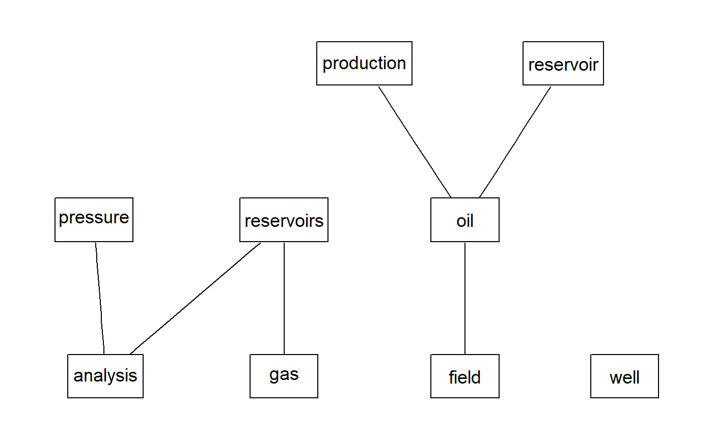
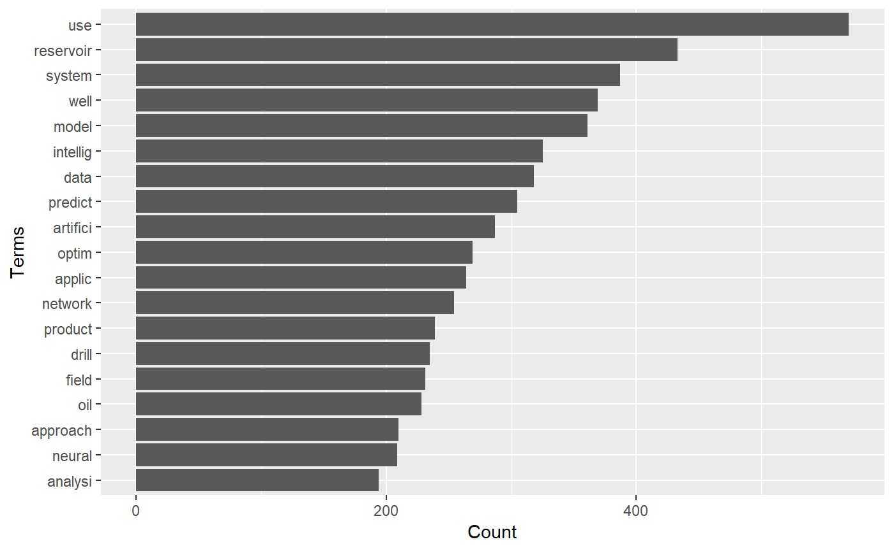
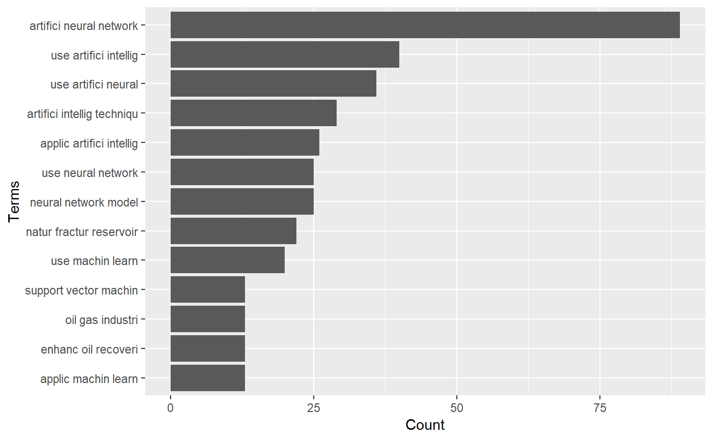

<!-- README.md is generated from README.Rmd. Please edit that file -->

# petro.One

[](https://travis-ci.org/f0nzie/petro.One)
[](https://codecov.io/gh/f0nzie/petro.One)

The goal of **petro.One** is providing a reproducible platform for
acquiring and analyzing metadata by searching papers on oil and gas from
the OnePetro website.

## Motivation

The standard way of searching for papers in
[OnePetro](https://www.onepetro.org/) is using a web browser entering
the search terms for a particular paper we are looking for. The result
will come as web pages containing dozens, hundreds or thousand of paper
titles. We need to browse all the resulting pages to find the papers
that have a good match with the subject we are researching. Although it
has the capability to export to *csv* and *xls* files, they will need to
be imported into another application to perform some analysis.

By using some statistical tools available through `R`, the search could
turn in highly profitable in terms of time, matching quality and
selection of the papers. The search keywords are entered thorugh the R
console and the papers will return in a shape of a dataframe, which is
identical to a spreadsheet: rows of paper titles and columns with
details from the metadata extracted from the web page. With the
dataframe already in our computers we could perform a thorough search
and narrow down to the ideal papers for our research.

## Installation

You can install `petro.One` from Github with:

``` r
# install.packages("devtools")       # install *devtools* first

# install from the *master* release branch
devtools::install_github("f0nzie/petro.One")
```

Or, the latest dvelopment version:

``` r
# install from the *develop* branch
devtools::install_github("f0nzie/petro.One", ref = "develop")
```

Or from [CRAN](https://cran.r-project.org/) with:

``` r
install.packages("petro.One")
```

The package dependencies can be installed with:

``` r
# install required packages
# from CRAN
install.packages(c("tm",
                   "wordcloud",
                   "urltools",
                   "RWeka",
                   "tidyverse",
                   "data.table"
                   ))

# from BioConductor
source("https://bioconductor.org/biocLite.R")
biocLite("graph")
biocLite("Rgraphviz")
```

## What is behind the paper search

A typical OnePetro search URL would look like
this:

``` 
    https://www.onepetro.org/search?q=neural+network&peer_reviewed=&published_between=&from_year=&to_year=
    
```

You can see the search string for yourself after you hit enter on a
paper search, which could be explained like
this:

| Parameter           | Description                                                                                                                             |
| ------------------- | --------------------------------------------------------------------------------------------------------------------------------------- |
| domain              | <https://www.onepetro.org/>                                                                                                             |
| command             | search?                                                                                                                                 |
| q=                  | parameter that holds the query words. In the example above, it would be `q=neural+network`. As it is shown, it means search `any` word. |
| peer\_reviewed=     | parameter switch to get papers than have been only peer reviewed. When it has the value `on` means that is activated.                   |
| published\_between= | *parameter* switch that activates when `from_year` and `to_year` have numeric entries.                                                  |
| from\_year=         | *parameter* to enter the starting year of the search                                                                                    |
| to\_year=           | *parameter* to enter the end year of the search.                                                                                        |

There are additional parameters such
as:

| Parameter | Description                                                                                                                                                |
| --------- | ---------------------------------------------------------------------------------------------------------------------------------------------------------- |
| start=    | indicate the starting page if the resulting search has several                                                                                             |
| rows=     | indicate the number of rows (papers) to display per page. In the web browser, the options are 10, 50 and 100. Off-browser it could be a number up to 1000. |
| sort=     | related to the selector `Sort By` with options `Relevance`, `Most recent` and `Highest rated`.                                                             |
| dc\_type= | indicates what type of document the paper is.                                                                                                              |

These are the type of documents:

    chapter
    conference-paper
    general
    journal-paper
    presentation
    media
    other
    standard

There are other parameters but they will not be used as often as the
ones already described.  
They key is build a search URL that is recognizable by OnePetro. To do
that I wrote a function `make_search_url` that does just that. Instead
of entering the search keywords, how will they be searched, year and
type of paper, we enter them from the R console.

# Examples

## Get the number of papers for the keyword *neural network*.

Let’s say we want to search the word **neural network**. How do we want
to perform that search? Paper that contain the word **neural** or the
word **network**, or papers that contain exactly the words **neural
network**? In the former, we would use the option `any`, in the latter,
`all`.

The option `how = "any"` means to search for papers that contain the
word `neural` or the word `network`. Let’s take a look at the difference
in returning results with `any` and `how = all` for the same keywords
`neural network`. Here we make of use of two functions in *petro.One*:
`make_search_url()` and `get_papers_count()`.

``` r
library(petro.One)
library(tidyverse)
#> -- Attaching packages ------------------------------------------ tidyverse 1.2.1 --
#> v ggplot2 3.1.0     v purrr   0.2.5
#> v tibble  2.0.0     v dplyr   0.7.8
#> v tidyr   0.8.2     v stringr 1.3.1
#> v readr   1.3.1     v forcats 0.3.0
#> Warning: package 'readr' was built under R version 3.5.2
#> -- Conflicts --------------------------------------------- tidyverse_conflicts() --
#> x dplyr::filter() masks stats::filter()
#> x dplyr::lag()    masks stats::lag()

# search any word like "neural" or "network"
url_any <- make_search_url(query = "neural network", how = "any")
url_any
#> [1] "https://www.onepetro.org/search?q=neural+network&peer_reviewed=&published_between=&from_year=&to_year="
get_papers_count(url_any)
#> [1] 3930

# search for papers that have "neural" and "network" at the same time
url_all <- make_search_url(query = "neural network", how = "all")
url_all
#> [1] "https://www.onepetro.org/search?q=\"neural+network\"&peer_reviewed=&published_between=&from_year=&to_year="
get_papers_count(url_all)
#> [1] 3614
```

## Read papers from *from\_year* to *to\_year*

We can send a query where we specify the *starting year* and the *ending
year*. In this example the option `how = "all"` means to search papers
that contain **exactly** the words `neural network` as a difference to
`any` which means search for `any` occurrence of the words. Of course,
using `any` rather than `all` will yield many more results. We use two
petro.One functions: `make_search_url()` to build the OnePetro search
URL and `onepetro_page_to_dataframe()` to put the papers in a table.

``` r
library(petro.One)

# neural network papers from 1990 to 1999. Exact phrase
my_url <- make_search_url(query = "neural network", 
                          from_year = 1990, 
                          to_year   = 1999, 
                          how = "all")

df <- onepetro_page_to_dataframe(my_url)
df
#> # A tibble: 10 x 6
#>    book_title           paper_id  dc_type  authors              year source
#>    <fct>                <fct>     <fct>    <chr>               <int> <fct> 
#>  1 Deconvolution Using~ SEG-1996~ confere~ Essenreiter, Rober~  1996 SEG   
#>  2 Neural Network Stac~ SEG-1992~ confere~ Schmidt, Jumndyr, ~  1992 SEG   
#>  3 Neural Networks And~ SEG-1995~ confere~ Leggett, Miles, Br~  1995 SEG   
#>  4 Drill-Bit Diagnosis~ SPE-1955~ journal~ Arehart, R.A., Exx~  1990 SPE   
#>  5 Inversion of Seismi~ SEG-1992~ confere~ Ro&uml;th, Gunter,~  1992 SEG   
#>  6 Seismic Principal C~ SEG-1996~ confere~ Huang, Kou-Yuan, N~  1996 SEG   
#>  7 First Break Picking~ SEG-1990~ confere~ Wagner, D.E., Amoc~  1990 SEG   
#>  8 Artificial Intellig~ SEG-1992~ confere~ Guo, Yi, Center fo~  1992 SEG   
#>  9 Neural Networks In ~ SEG-1991~ confere~ McCormack, Michael~  1991 SEG   
#> 10 Reservoir Character~ SEG-1993~ confere~ An, P., University~  1993 SEG
```

And these are the terms that repeat more freqently:

``` r
term_frequency(df)
#> # A tibble: 27 x 2
#>    word       freq
#>    <chr>     <dbl>
#>  1 network      10
#>  2 neural       10
#>  3 use           5
#>  4 seismic       3
#>  5 pick          2
#>  6 analysi       1
#>  7 artifici      1
#>  8 break         1
#>  9 character     1
#> 10 compon        1
#> # ... with 17 more rows
```

## Get papers by document type (*dc\_type*)

We can also get paper by the type of document. In OnePetro it is called
`dc_type`.

In this example we will be requesting only `conference-paper` type. Here
we add to `make_search_url()` the parameter `dc_type`. Note also that we
are adding another parameter `rows` to get 1000 rows instead of 10, 50
or 100 as the browser allows.

``` r
# specify document type = "conference-paper", rows = 1000

my_url <- make_search_url(query = "artificial intelligence", 
                          how = "all",
                          from_year = 1950, 
                          to_year   = 1980, 
                          dc_type = "conference-paper",
                          rows = 1000)

(pcount <- get_papers_count(my_url))
#> [1] 4
df <- onepetro_page_to_dataframe(my_url)
df
#> # A tibble: 3 x 6
#>   book_title              paper_id  dc_type   authors           year source
#>   <fct>                   <fct>     <fct>     <chr>            <int> <fct> 
#> 1 The Realities Of Radio~ OTC-1788~ conferen~ Moyer, James P.~  1973 OTC   
#> 2 Application of Digital~ SPE-2659~ conferen~ Hall, O.P. Jr.,~  1969 SPE   
#> 3 Computer Recognition O~ SPWLA-19~ conferen~ Schoonover, L.G~  1974 SPWLA
```

Only 4 on *artificial intelligence* from 1950 until 1980\!

## Finding the most frequent terms in *well test*

For this example we want to know about *conference papers* where the
words *well* and *test* are found together in the papers.

``` r
library(petro.One)

my_url <- make_search_url(query = "well test", 
                          dc_type = "conference-paper",
                          from_year = 2017, 
                          to_year   = 2018, 
                          how = "all")

get_papers_count(my_url)      # get the paper count
#> [1] 949
df <- read_multidoc(my_url)   # create a dataframe of papers
print(dim(df))                # dimension of the dataframe
#> [1] 949   6

(tf <- term_frequency(df))    # create a term frequency table
#> # A tibble: 1,960 x 2
#>    word       freq
#>    <chr>     <dbl>
#>  1 reservoir   319
#>  2 well        267
#>  3 field       221
#>  4 fractur     160
#>  5 model       159
#>  6 gas         149
#>  7 case        136
#>  8 product     133
#>  9 use         133
#> 10 studi       122
#> # ... with 1,950 more rows

# calculate the minimum frequency for, let's say, the first 20th term
min_freq <- min(head(tf, 20)$freq)
```

### Most frequent terms in *well test*

``` r
print(min_freq)
#> [1] 75
# plot most frequent terms
plot_bars(df, min.freq = min_freq)
```

<!-- -->

### How do the most frequent terms relate each other

Now, it is not enough for us to know what terms are the more repeating
but how those freqent terms relate to each other. In the following plot
you will see that the strength of the relationship between terms is
reflected by the thickness of the connection lines.

``` r
plot_relationships(df, min.freq = min_freq, threshold = 0.075)
```

<!-- -->

We can see that *wells* and *well* are connected strongly to
*horizontal*, *transient*, *pressure*, *flow*, *testing*, *reservoirs*,
*fracture*, and *analysis*. The rest of the words are frequent but not
very much connected.

## Summaries

The summary functions allow us to group the papers by a preferred group:

  - by type of document
  - by publisher
  - by publication
  - by year

This will give you a summary of the count not the papers themselves.

``` r
library(petro.One)

my_url <- make_search_url(query = "artificial intelligence", 
                          how = "all")
```

### By year of publication

| name       | value |
| :--------- | ----: |
| Since 2018 |   413 |
| Since 2017 |   626 |
| Since 2016 |   804 |
| Since 2015 |   950 |
| Since 2014 |  1053 |
| Since 2013 |  1191 |
| Since 2012 |  1321 |
| Since 2011 |  1430 |
| Since 2010 |  1546 |
| Since 2009 |  1613 |

# Text Mining

## Providing multiple keywords

``` r
library(petro.One)
library(tidyverse)

# provide two different set of keywords to combine as vectors
major   <- c("artificial intelligence")

paper_results <- run_papers_search(major, 
                                   get_papers = TRUE,       # return with papers
                                   verbose = FALSE,         # show progress
                                   len_keywords = 4,        # naming the data file
                                   allow_duplicates = FALSE) # by paper title and id
#> NULL

(papers <- paper_results$papers)
#> # A tibble: 2,783 x 7
#>    book_title       paper_id   dc_type  authors        year source keyword 
#>    <fct>            <fct>      <fct>    <chr>         <int> <fct>  <chr>   
#>  1 Artificial Inte~ SPE-19282~ confere~ Hojageldiyev~  2018 SPE    'artifi~
#>  2 Production Moni~ SPE-14959~ confere~ Olivares Vel~  2012 SPE    'artifi~
#>  3 Artificial Inte~ SPE-19155~ confere~ Gupta, Supri~  2018 SPE    'artifi~
#>  4 Multilateral We~ SPE-18350~ confere~ Al-Mashhad, ~  2016 SPE    'artifi~
#>  5 Multilateral We~ SPE-18368~ confere~ Buhulaigah, ~  2017 SPE    'artifi~
#>  6 Profiling Downh~ SPE-17342~ confere~ AlAjmi, Moha~  2015 SPE    'artifi~
#>  7 Artificial Inte~ SPE-16950~ confere~ Shahkarami, ~  2014 SPE    'artifi~
#>  8 Forecasting Inc~ ASSE-07-1~ confere~ Al-Mutairi, ~  2007 ASSE   'artifi~
#>  9 Formation Dip D~ SPWLA-198~ journal~ Kerzner, Mar~  1983 SPWLA  'artifi~
#> 10 Estimating Dewp~ SPE-16091~ confere~ Alarfaj, Mal~  2012 SPE    'artifi~
#> # ... with 2,773 more rows
```

``` r
# plot on AI by year of publication
papers %>% 
    group_by(year) %>% 
    na.omit() %>% 
    summarize(n = n()) %>% 
    
    ggplot(., aes(x = year, y = n)) +
    geom_point() +
    geom_smooth(method = "loess") +
    labs(title = "Artificial Intelligence papers by Year")
```

<!-- -->

``` r
tf <- term_frequency(papers)
tf
#> # A tibble: 3,171 x 2
#>    word       freq
#>    <chr>     <dbl>
#>  1 use         568
#>  2 reservoir   433
#>  3 system      387
#>  4 well        368
#>  5 model       361
#>  6 intellig    323
#>  7 data        318
#>  8 predict     305
#>  9 artifici    287
#> 10 optim       268
#> # ... with 3,161 more rows
```

``` r
# one word or gram
term_frequency_n_grams(df = papers, gram.min = 1, gram.max = 1)
#> # A tibble: 3,171 x 2
#>    word       freq
#>    <chr>     <dbl>
#>  1 use         568
#>  2 reservoir   433
#>  3 system      387
#>  4 well        368
#>  5 model       361
#>  6 intellig    323
#>  7 data        318
#>  8 predict     305
#>  9 artifici    287
#> 10 optim       268
#> # ... with 3,161 more rows
```

``` r
# calculate the minimum frequency for, let's say, the first 20th term
(min_freq <- min(head(tf, 20)$freq))
#> [1] 188
```

``` r
# plot the most frequent terms
plot_bars(papers, min.freq = min_freq)
```

<!-- -->

``` r
# by default the number of grams is two (2)
tf2 <- term_frequency_n_grams(papers)
tf2
#> # A tibble: 13,613 x 2
#>    word               freq
#>    <chr>             <dbl>
#>  1 neural network      206
#>  2 artifici intellig   169
#>  3 expert system       115
#>  4 machin learn        108
#>  5 artifici neural      91
#>  6 use artifici         83
#>  7 case studi           76
#>  8 oil gas              59
#>  9 well log             47
#> 10 histori match        43
#> # ... with 13,603 more rows
```

``` r
plot_bars(papers, min.freq = 100)
```

<!-- -->

``` r
# plot for two-grams
plot_bars(papers, gram.min = 2, gram.max = 2, min.freq = 35)
```

<!-- -->

``` r
# plot for three-grams
plot_bars(papers, gram.min = 3, gram.max = 3, min.freq = 12)
```

<!-- -->
