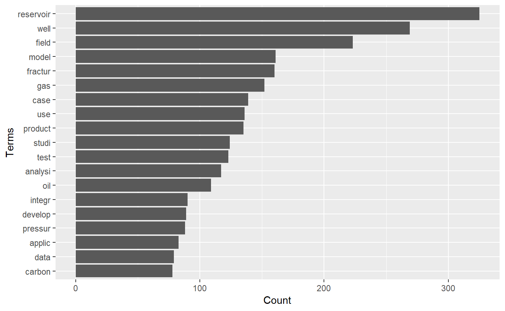

<!-- README.md is generated from README.Rmd. Please edit that file -->
petro.One
=========

[](https://travis-ci.org/f0nzie/petro.One) [](https://codecov.io/gh/f0nzie/petro.One)

The goal of **petro.One** is providing a reproducible platform for acquiring and analyzing metadata by searching papers on oil and gas from the OnePetro website.

Motivation
----------

The standard way of searching for papers in [OnePetro](https://www.onepetro.org/) is using a web browser entering the search terms for a particular paper we are looking for. The result will come as web pages containing dozens, hundreds or thousand of paper titles. We need to browse all the resulting pages to find the papers that have a good match with the subject we are researching. Although it has the capability to export to *csv* and *xls* files, they will need to be imported into another application to perform some analysis.

By using some statistical tools available through `R`, the search could turn in highly profitable in terms of time, matching quality and selection of the papers. The search keywords are entered thorugh the R console and the papers will return in a shape of a dataframe, which is identical to a spreadsheet: rows of paper titles and columns with details from the metadata extracted from the web page. With the dataframe already in our computers we could perform a thorough search and narrow down to the ideal papers for our research.

Installation
------------

You can install `petro.One` from Github with:

``` r
# install.packages("devtools")       # install *devtools* first

# install from the *master* release branch
devtools::install_github("f0nzie/petro.One")
```

Or, the latest dvelopment version:

``` r
# install from the *develop* branch
devtools::install_github("f0nzie/petro.One", ref = "develop")
```

Or from [CRAN](https://cran.r-project.org/) with:

``` r
install.packages("petro.One")
```

The package dependencies can be installed with:

``` r
# install required packages
# from CRAN
install.packages(c("tm",
                   "wordcloud",
                   "urltools",
                   "RWeka",
                   "tidyverse",
                   "data.table"
                   ))

# from BioConductor
source("https://bioconductor.org/biocLite.R")
biocLite("graph")
biocLite("Rgraphviz")
```

What is behind the paper search
-------------------------------

A typical OnePetro search URL would look like this:

        https://www.onepetro.org/search?q=neural+network&peer_reviewed=&published_between=&from_year=&to_year=
        

You can see the search string for yourself after you hit enter on a paper search, which could be explained like this:

<table>
<colgroup>
<col width="12%" />
<col width="87%" />
</colgroup>
<thead>
<tr class="header">
<th>Parameter</th>
<th>Description</th>
</tr>
</thead>
<tbody>
<tr class="odd">
<td>domain</td>
<td><a href="https://www.onepetro.org/" class="uri">https://www.onepetro.org/</a></td>
</tr>
<tr class="even">
<td>command</td>
<td>search?</td>
</tr>
<tr class="odd">
<td>q=</td>
<td>parameter that holds the query words. In the example above, it would be <code>q=neural+network</code>. As it is shown, it means search <code>any</code> word.</td>
</tr>
<tr class="even">
<td>peer_reviewed=</td>
<td>parameter switch to get papers than have been only peer reviewed. When it has the value <code>on</code> means that is activated.</td>
</tr>
<tr class="odd">
<td>published_between=</td>
<td><em>parameter</em> switch that activates when <code>from_year</code> and <code>to_year</code> have numeric entries.</td>
</tr>
<tr class="even">
<td>from_year=</td>
<td><em>parameter</em> to enter the starting year of the search</td>
</tr>
<tr class="odd">
<td>to_year=</td>
<td><em>parameter</em> to enter the end year of the search.</td>
</tr>
</tbody>
</table>

There are additional parameters such as:

<table>
<colgroup>
<col width="7%" />
<col width="92%" />
</colgroup>
<thead>
<tr class="header">
<th>Parameter</th>
<th>Description</th>
</tr>
</thead>
<tbody>
<tr class="odd">
<td>start=</td>
<td>indicate the starting page if the resulting search has several</td>
</tr>
<tr class="even">
<td>rows=</td>
<td>indicate the number of rows (papers) to display per page. In the web browser, the options are 10, 50 and 100. Off-browser it could be a number up to 1000.</td>
</tr>
<tr class="odd">
<td>sort=</td>
<td>related to the selector <code>Sort By</code> with options <code>Relevance</code>, <code>Most recent</code> and <code>Highest rated</code>.</td>
</tr>
<tr class="even">
<td>dc_type=</td>
<td>indicates what type of document the paper is.</td>
</tr>
</tbody>
</table>

These are the type of documents:

    chapter
    conference-paper
    general
    journal-paper
    presentation
    media
    other
    standard

There are other parameters but they will not be used as often as the ones already described.
They key is build a search URL that is recognizable by OnePetro. To do that I wrote a function `make_search_url` that does just that. Instead of entering the search keywords, how will they be searched, year and type of paper, we enter them from the R console.

Examples
========

Get the number of papers for the keyword *neural network*.
----------------------------------------------------------

Let's say we want to search the word **neural network**. How do we want to perform that search? Paper that contain the word **neural** or the word **network**, or papers that contain exactly the words **neural network**? In the former, we would use the option `any`, in the latter, `all`.

The option `how = "any"` means to search for papers that contain the word `neural` or the word `network`. Let's take a look at the difference in returning results with `any` and `how = all` for the same keywords `neural network`. Here we make of use of two functions in *petro.One*: `make_search_url()` and `get_papers_count()`.

``` r
library(petro.One)
library(tidyverse)
#> -- Attaching packages ----------------------------------------- tidyverse 1.2.1 --
#> v ggplot2 3.0.0     v purrr   0.2.5
#> v tibble  1.4.2     v dplyr   0.7.6
#> v tidyr   0.8.1     v stringr 1.3.1
#> v readr   1.1.1     v forcats 0.3.0
#> -- Conflicts -------------------------------------------- tidyverse_conflicts() --
#> x dplyr::filter() masks stats::filter()
#> x dplyr::lag()    masks stats::lag()

# search any word like "neural" or "network"
url_any <- make_search_url(query = "neural network", how = "any")
url_any
#> [1] "https://www.onepetro.org/search?q=neural+network&peer_reviewed=&published_between=&from_year=&to_year="
get_papers_count(url_any)
#> [1] 3695

# search for papers that have "neural" and "network" at the same time
url_all <- make_search_url(query = "neural network", how = "all")
url_all
#> [1] "https://www.onepetro.org/search?q=\"neural+network\"&peer_reviewed=&published_between=&from_year=&to_year="
get_papers_count(url_all)
#> [1] 3392
```

Read papers from *from\_year* to *to\_year*
-------------------------------------------

We can send a query where we specify the *starting year* and the *ending year*. In this example the option `how = "all"` means to search papers that contain **exactly** the words `neural network` as a difference to `any` which means search for `any` occurrence of the words. Of course, using `any` rather than `all` will yield many more results. We use two petro.One functions: `make_search_url()` to build the OnePetro search URL and `onepetro_page_to_dataframe()` to put the papers in a table.

``` r
library(petro.One)

# neural network papers from 1990 to 1999. Exact phrase
my_url <- make_search_url(query = "neural network", 
                          from_year = 1990, 
                          to_year   = 1999, 
                          how = "all")

df <- onepetro_page_to_dataframe(my_url)
df
#> # A tibble: 10 x 6
#>    book_title          paper_id  dc_type   authors             year source
#>    <fct>               <fct>     <fct>     <chr>              <int> <fct> 
#>  1 Deconvolution Usin~ SEG-1996~ conferen~ Essenreiter, Robe~  1996 SEG   
#>  2 Neural Network Sta~ SEG-1992~ conferen~ Schmidt, Jumndyr,~  1992 SEG   
#>  3 Higher-Order Neura~ SPE-2790~ conferen~ Kumoluyi, A.O., I~  1994 SPE   
#>  4 Conductive fractur~ ARMA-95-~ conferen~ Thomas, Andrew L.~  1995 ARMA  
#>  5 Reservoir Characte~ SEG-1993~ conferen~ An, P., Universit~  1993 SEG   
#>  6 Seismic Attribute ~ SEG-1993~ conferen~ Johnston, David H~  1993 SEG   
#>  7 Neural Networks Fo~ SEG-1993~ conferen~ Hansen, Kim Vejlb~  1993 SEG   
#>  8 Inversion of Seism~ SEG-1992~ conferen~ Ro&uml;th, Gunter~  1992 SEG   
#>  9 Neural Networks In~ SEG-1991~ conferen~ McCormack, Michae~  1991 SEG   
#> 10 Artificial Intelli~ SEG-1992~ conferen~ Guo, Yi, Center f~  1992 SEG
```

And these are the terms that repeat more freqently:

``` r
term_frequency(df)
#> # A tibble: 27 x 2
#>    word              freq
#>    <chr>            <int>
#>  1 neural              10
#>  2 networks             9
#>  3 identification       2
#>  4 petroleum            2
#>  5 seismic              2
#>  6 -order               1
#>  7 artificial           1
#>  8 attribute            1
#>  9 calibration          1
#> 10 characterization     1
#> # ... with 17 more rows
```

Get papers by document type (*dc\_type*)
----------------------------------------

We can also get paper by the type of document. In OnePetro it is called `dc_type`.

In this example we will be requesting only `conference-paper` type. Here we add to `make_search_url()` the parameter `dc_type`. Note also that we are adding another parameter `rows` to get 1000 rows instead of 10, 50 or 100 as the browser allows.

``` r
# specify document type = "conference-paper", rows = 1000

my_url <- make_search_url(query = "artificial intelligence", 
                          how = "all",
                          from_year = 1950, 
                          to_year   = 1980, 
                          dc_type = "conference-paper",
                          rows = 1000)

(pcount <- get_papers_count(my_url))
#> [1] 4
df <- onepetro_page_to_dataframe(my_url)
df
#> # A tibble: 3 x 6
#>   book_title             paper_id  dc_type   authors           year source
#>   <fct>                  <fct>     <fct>     <chr>            <int> <fct> 
#> 1 The Realities Of Radi~ OTC-1788~ conferen~ Moyer, James P.~  1973 OTC   
#> 2 Application of Digita~ SPE-2659~ conferen~ Hall, O.P. Jr.,~  1969 SPE   
#> 3 Computer Recognition ~ SPWLA-19~ conferen~ Schoonover, L.G~  1974 SPWLA
```

Only 4 on *artificial intelligence* from 1950 until 1980!

Finding the most frequent terms in *well test*
----------------------------------------------

For this example we want to know about *conference papers* where the words *well* and *test* are found together in the papers.

``` r
library(petro.One)

my_url <- make_search_url(query = "well test", 
                          dc_type = "conference-paper",
                          from_year = 2017, 
                          to_year   = 2018, 
                          how = "all")

get_papers_count(my_url)
#> [1] 783
df <- read_multidoc(my_url)

(tf <- term_frequency(df))
#> # A tibble: 2,309 x 2
#>    word        freq
#>    <chr>      <int>
#>  1 reservoir    156
#>  2 well         147
#>  3 field        119
#>  4 gas          115
#>  5 production    98
#>  6 analysis      85
#>  7 oil           85
#>  8 reservoirs    79
#>  9 pressure      75
#> 10 data          67
#> # ... with 2,299 more rows

# calculate the minimum frequency for, let's say, the first 20th term
min_freq <- min(head(tf, 20)$freq)
```

### Most frequent terms in *well test*

``` r
# plot the 500 most freqent terms
plot_bars(df, min.freq = min_freq)
```



### How do the most frequent terms relate each other

Now, it is not enough for us to know what terms are the more repeating but how those freqent terms relate to each other. In the following plot you will see that the strength of the relationship between terms is reflected by the thickness of the connection lines.

``` r
plot_relationships(df, min.freq = min_freq, threshold = 0.075)
```


We can see that *wells* and *well* are connected strongly to *horizontal*, *transient*, *pressure*, *flow*, *testing*, *reservoirs*, *fracture*, and *analysis*. The rest of the words are frequent but not very much connected.

Summaries
---------

The summary functions allow us to group the papers by a preferred group:

-   by type of document
-   by publisher
-   by publication
-   by year

This will give you a summary of the count not the papers themselves.

``` r
library(petro.One)

my_url <- make_search_url(query = "artificial intelligence", 
                          how = "all")
```

### By year of publication

| name       |  value|
|:-----------|------:|
| Since 2018 |    223|
| Since 2017 |    436|
| Since 2016 |    614|
| Since 2015 |    760|
| Since 2014 |    863|
| Since 2013 |   1001|
| Since 2012 |   1131|
| Since 2011 |   1240|
| Since 2010 |   1356|
| Since 2009 |   1423|

Text Mining
===========

Providing multiple keywords
---------------------------

``` r
library(petro.One)
library(tidyverse)

# provide two different set of keywords to combine as vectors
major   <- c("artificial intelligence")

paper_results <- run_papers_search(major, 
                                   get_papers = TRUE,       # return with papers
                                   verbose = FALSE,         # show progress
                                   len_keywords = 4,        # naming the data file
                                   allow_duplicates = FALSE) # by paper title and id

(papers <- paper_results$papers)
#> # A tibble: 2,592 x 7
#>    book_title       paper_id   dc_type authors        year source keyword 
#>    <fct>            <fct>      <fct>   <chr>         <int> <fct>  <chr>   
#>  1 Production Moni~ SPE-14959~ confer~ Olivares Vel~  2012 SPE    'artifi~
#>  2 Estimating Dewp~ SPE-16091~ confer~ Alarfaj, Mal~  2012 SPE    'artifi~
#>  3 Cross-Industry ~ SPE-14387~ confer~ Piovesan, Ca~  2011 SPE    'artifi~
#>  4 Artificial Inte~ SPE-19155~ confer~ Gupta, Supri~  2018 SPE    'artifi~
#>  5 Industrial Appl~ PETSOC-95~ confer~ Cercone, N.,~  1995 PETSOC 'artifi~
#>  6 Application of ~ SPE-15908~ general Gangopadhyay~  1986 SPE    'artifi~
#>  7 Well Log Data I~ SPWLA-198~ confer~ Wu, X., Inst~  1986 SPWLA  'artifi~
#>  8 Multilateral We~ SPE-18350~ confer~ Al-Mashhad, ~  2016 SPE    'artifi~
#>  9 Formation Dip D~ SPWLA-198~ journa~ Kerzner, Mar~  1983 SPWLA  'artifi~
#> 10 Profiling Downh~ SPE-17342~ confer~ AlAjmi, Moha~  2015 SPE    'artifi~
#> # ... with 2,582 more rows
```

``` r
papers %>% 
    group_by(year) %>% 
    na.omit() %>% 
    summarize(n = n()) %>% 
    
    ggplot(., aes(x = year, y = n)) +
    geom_point() +
    geom_smooth(method = "loess") +
    labs(title = "Artificial Intelligence papers by Year")
```


``` r
tf <- term_frequency(papers)
tf
#> # A tibble: 4,328 x 2
#>    word         freq
#>    <chr>       <int>
#>  1 data          271
#>  2 reservoir     269
#>  3 artificial    266
#>  4 system        253
#>  5 well          228
#>  6 production    206
#>  7 oil           205
#>  8 drilling      203
#>  9 neural        192
#> 10 application   186
#> # ... with 4,318 more rows
```

``` r
# calculate the minimum frequency for, let's say, the first 20th term
min_freq <- min(head(tf, 20)$freq)
```

``` r
# plot the 20 most freqent terms
plot_bars(papers, min.freq = min_freq)
```


